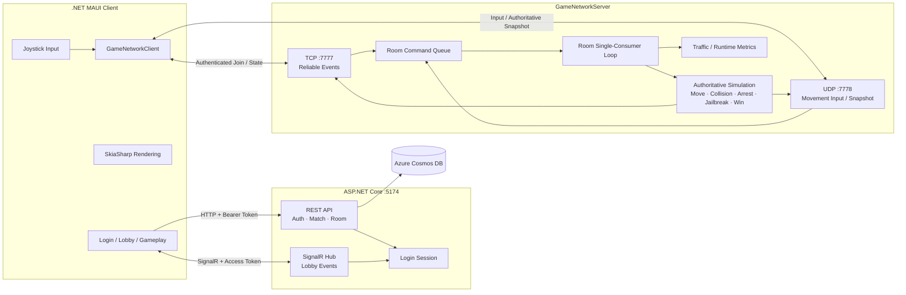
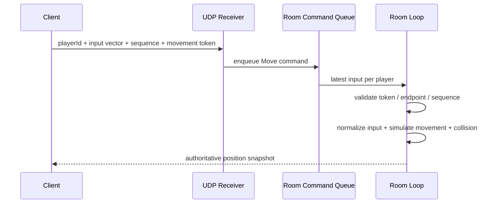

<div align="center">


# PolRob

### 2명의 경찰과 4명의 도둑이 벌이는 6인 실시간 비대칭 추격전

클라이언트는 **조이스틱 입력만 전송**하고, 서버가 이동·충돌·시야·체포·탈옥·승패를 판정합니다.<br/>
모바일 클라이언트부터 매치메이킹, 소켓 통신, 방 단위 게임 루프와 부하 테스트까지 직접 구현한 개인 프로젝트입니다.

<p>
  
  
  
  
  
</p>

<p>
  <a href="#-프로젝트-개요">프로젝트 개요</a> ·
  <a href="#-시스템-아키텍처">아키텍처</a> ·
  <a href="#-핵심-구현">핵심 구현</a> ·
  <a href="#-성능-측정과-최적화">성능 측정</a> ·
  <a href="#-실행-방법">실행 방법</a>
</p>

</div>

---

## 🎮 프로젝트 개요

| 항목 | 내용 |
|---|---|
| 프로젝트 | PolRob |
| 장르 | 6인 실시간 비대칭 멀티플레이 추격 게임 |
| 게임 구성 | Police 2명 vs Robber 4명 |
| 개발 형태 | 개인 프로젝트 — 기획, 서버, 네트워크, 모바일 클라이언트 구현 |
| 지원 플랫폼 | Android, iOS |
| 서버 | ASP.NET Core Web API + SignalR + Custom TCP/UDP Server |
| 데이터베이스 | Azure Cosmos DB |

| 👮 Police | 🥷 Robber |
|---|---|
| 제한 시간 안에 모든 도둑을 체포하고 감옥에 수감합니다. | 건물과 부쉬를 이용해 시야를 피하고 제한 시간까지 생존합니다. |
| 시야와 장애물 판정을 통과한 도둑과 일정 시간 접촉하면 체포합니다. | 감옥 근처에서 구조 게이지를 채워 수감된 동료를 탈옥시킵니다. |

```text
로그인 → 랜덤 매칭 / 커스텀 방 → 역할 구성 → 카운트다운
   → 실시간 추격·체포·탈옥 → 서버 승패 판정 → 결과 / 재대결
```

### 프로젝트에서 검증하고자 한 것

- 신뢰성과 실시간성이 다른 데이터를 어떤 프로토콜로 나눌 것인가
- 여러 네트워크 실행 흐름이 한 방의 상태를 동시에 변경하지 않게 하는 방법은 무엇인가
- 신뢰할 수 없는 클라이언트 입력으로부터 게임 상태를 어떻게 보호할 것인가
- 성능 개선을 감이 아니라 동일 조건의 수치로 어떻게 증명할 것인가

---

## 🏗️ 시스템 아키텍처



### 통신 채널 분리

| 채널 | 사용 데이터 | 설계 이유 |
|---|---|---|
| HTTP `:5174` | 회원가입, 로그인, 방 생성·참가·재대결 | 요청/응답 기반 도메인 작업 |
| SignalR `/hubs/game-room` | 인원·역할 변경, 매칭 완료, 게임 시작 | 로비 그룹 이벤트와 재연결 처리 |
| TCP `:7777` | 인증된 게임 입장, 초기 상태, 체포·탈옥, Phase 전환 | 순서와 전달 보장이 필요한 이벤트 |
| UDP `:7778` | 조이스틱 입력, 서버가 계산한 위치 snapshot | 과거 패킷보다 최신 상태가 중요한 고빈도 데이터 |

---

## ⚙️ 핵심 구현

### 1. Server-Authoritative Movement

클라이언트가 계산한 좌표를 신뢰하지 않습니다. 클라이언트는 정규화 전 조이스틱 입력과 순서 번호만 보내며, 서버가 고정된 속도와 반지름을 기준으로 위치를 계산합니다.



서버 검증 항목:

- 인증된 TCP 연결에서 발급한 movement session token
- 최초 등록된 UDP endpoint와 패킷 송신 endpoint 일치 여부
- 이전 입력보다 큰 sequence인지 확인해 중복·역순 패킷 제거
- `NaN`, `Infinity` 입력 거부 및 입력 벡터 정규화
- 맵 경계, 사각형·원형 장애물, 경찰서·감옥 충돌 판정
- 입력이 일정 시간 도착하지 않으면 자동 정지

클라이언트는 즉각적인 조작감을 위해 로컬 예측을 수행하고, 서버 snapshot으로 최종 위치를 보정합니다.

### 2. End-to-End Authentication Boundary

로그인 응답으로 발급된 session token에서 서버가 사용자 ID를 확정합니다. 이후 요청 body나 Hub 인자로 전달된 사용자 ID를 신뢰하지 않습니다.

```text
Login Session
 ├─ HTTP   : Authorization: Bearer <session>
 ├─ SignalR: AccessTokenProvider → 연결 및 Hub 호출 시 검증
 └─ TCP    : GameJoinRequest(session, roomId)
               └─ 로비 멤버십·역할·이름을 서버에서 조회
                    └─ UDP movement token 발급
```

- 방 생성·참가·재대결은 인증된 사용자 본인에게만 적용
- SignalR 그룹 참가 전 실제 방 멤버십 확인
- 커스텀 방 시작은 서버가 확인한 방장만 가능
- 역할 변경과 매칭 취소에서 클라이언트 제공 `userId` 제거
- TCP 입장 시 로그인 세션과 방 멤버십을 함께 검증

### 3. Room-Scoped Single-Consumer Loop

네트워크 수신부는 게임 상태를 직접 변경하지 않고 방별 `Channel<RoomCommand>`에 명령을 기록합니다. 각 방의 single-consumer 비동기 루프가 입력과 규칙을 순서대로 처리해 방 사이 상태를 격리합니다.

| 주기 | 처리 내용 |
|---:|---|
| `50 ms` | 명령 큐 drain, 최신 이동 입력 병합, 서버 이동 simulation |
| `100 ms` | 이동 snapshot broadcast, 시야·체포·탈옥 규칙 처리 |
| `1 s` | 카운트다운, 남은 시간, 승패와 전체 게임 상태 동기화 |

> `ConcurrentDictionary`는 개별 컬렉션 연산의 안전성을 담당하고, 복합 게임 규칙의 처리 순서는 방별 single-consumer loop가 담당합니다.

### 4. Server-Authoritative Game Rules

- 시야 거리와 90도 시야각을 이용한 상대 탐지
- 건물·벽·연못·부쉬에 의한 line-of-sight 차단
- 일정 시간 접촉을 유지해야 완료되는 체포 상태
- 서버가 결정하는 감옥 배치와 이동 잠금
- 구조자의 위치와 시간을 기준으로 계산하는 탈옥 진행률
- 제한 시간과 전체 도둑 수감 여부에 따른 승패 판정
- 역할과 시야 상태에 따른 상대 위치 패킷 필터링

### 5. Matchmaking & Room Lifecycle

- Police 2명, Robber 4명 구성을 맞추는 랜덤 매칭
- 6자리 room code 기반 커스텀 방 생성·참가
- 방장 시작 권한과 로비 역할 변경
- SignalR 연결 종료 유예와 재접속 추적
- 랜덤 방 종료 정리, 커스텀 방 재대결, 빈 방 만료 처리

---

## 📊 성능 측정과 최적화

UI 시뮬레이터를 여러 개 띄우는 대신 실제 프로토콜과 매칭·게임 흐름을 사용하는 headless bot을 구현했습니다. `60 / 300 / 600 / 900`봇 구간에서 동일한 스크립트로 CPU, 네트워크와 .NET runtime 지표를 수집했습니다.

### 측정 지표

```text
UDP/TCP packets · UDP bytes · JSON serialization · connections · players · rooms
CPU · Working Set · GC allocation/pause · lock contention · ThreadPool queue/threads
bot failures · room phase · eligible Playing samples
```

### 네트워크 처리 경로 최적화 결과

아래 결과는 `32620197` baseline과 네트워크 최적화를 결합한 `a7441c4`를 동일한 로컬 환경에서 비교한 값입니다.

| 부하 | CPU | Total PPS | UDP bytes/s | GC allocation | Working Set |
|---:|---:|---:|---:|---:|---:|
| 600 bots / 100 rooms | `13.85 → 1.90` **-86.3%** | `33,654 → 22,951` **-31.8%** | `6.14 → 2.08 MB` **-66.1%** | `22.29 → 11.83 MB/s` **-46.9%** | `908 → 397 MB` **-56.3%** |
| 900 bots / 150 rooms | `13.89 → 2.93` **-78.9%** | `33,762 → 34,367` **+1.8%** | `6.22 → 3.13 MB` **-49.6%** | `23.38 → 17.61 MB/s` **-24.7%** | `1,197 → 523 MB` **-56.4%** |

적용한 변경:

1. 전체 `Player` 대신 이동 전용 경량 payload 사용
2. 입력마다 즉시 broadcast하지 않고 방의 100ms send tick에서 최신 상태 전송
3. 한 tick에 쌓인 동일 플레이어 입력을 최신값 하나로 coalescing
4. 정지 플레이어의 불필요한 입력 송신 빈도 감소

> [!IMPORTANT]
> 이 수치는 동일 로컬 환경에서 **최적화 전후의 상대적 변화**를 비교한 결과이며 실제 서비스 동시접속 수용량을 의미하지 않습니다. 이후 추가된 server-authoritative simulation과 인증 payload의 비용은 현재 구조에서 별도로 재측정해야 합니다.

실행 스크립트와 개별 실험은 [`run_load_metrics.sh`](run_load_metrics.sh), [`서버 최적화 리포트`](docs/server_optimization_report.md)에서 확인할 수 있습니다.

---

## 🧰 기술 스택

| 영역 | 기술 |
|---|---|
| Language / Runtime | C#, .NET 10 |
| Mobile Client | .NET MAUI, XAML, SkiaSharp |
| Web / Lobby | ASP.NET Core Web API, SignalR |
| Game Transport | `TcpListener`, `TcpClient`, `UdpClient`, custom packet types |
| Concurrency | `BackgroundService`, `Channel<T>`, `ConcurrentDictionary`, room-scoped loop |
| Persistence / Auth | Azure Cosmos DB, PBKDF2-SHA256 password hashing, server session token |
| Observability | `System.Diagnostics.Metrics`, custom traffic·room metrics |
| Load Test | .NET headless gameplay bots, Bash benchmark runner |

---

## 📁 프로젝트 구조

```text
polrob/
├── polrob.Client/             # .NET MAUI UI, input, rendering, network client
│   ├── Network/               # TCP/UDP client
│   └── Resources/             # sprites, buildings, map assets
├── polrob.Server/             # ASP.NET Core + realtime game server
│   ├── Controllers/           # auth and room REST APIs
│   ├── Hubs/                  # SignalR lobby lifecycle
│   ├── Network/               # room loops, socket transport, game rules
│   └── Services/              # matchmaking, users, bot identities
├── polrob.Shared/Models/      # shared packets and game-domain models
├── polrob.Test/               # headless gameplay bot load generator
├── docs/                      # performance experiment report
└── run_load_metrics.sh        # repeatable benchmark runner
```

---

## 🚀 실행 방법

### 사전 요구사항

- .NET 10 SDK
- Android 또는 iOS용 .NET MAUI workload
- Azure Cosmos DB 계정과 connection string
- iOS 빌드 시 macOS와 Xcode

### 1. 서버 실행

민감한 값은 저장소에 기록하지 말고 환경 변수로 주입합니다.

```bash
export COSMOSDB_CONNECTIONSTRING='AccountEndpoint=...;AccountKey=...;'

ASPNETCORE_URLS=http://0.0.0.0:5174 \
dotnet run --project polrob.Server/polrob.Server.csproj
```

| Endpoint | 주소 |
|---|---|
| REST / SignalR | `http://localhost:5174` |
| TCP game server | `localhost:7777` |
| UDP movement | `localhost:7778` |

### 2. 모바일 클라이언트 실행

```bash
# Android emulator
dotnet build polrob.Client/polrob.Client.csproj -f net10.0-android -t:Run

# iOS simulator
dotnet build polrob.Client/polrob.Client.csproj -f net10.0-ios -t:Run
```

Android emulator는 `10.0.2.2`, iOS simulator는 `127.0.0.1`을 통해 개발 머신의 서버에 연결합니다. 실제 기기는 개발 머신과 같은 네트워크에서 LAN 주소로 접속해야 합니다.

### 3. 부하 테스트

```bash
chmod +x run_load_metrics.sh
./run_load_metrics.sh
```

기본 sweep은 `60 300 600 900`봇으로 실행됩니다. 결과는 다음 위치에 저장됩니다.

```text
/tmp/polrob-load-latest/results.md
/tmp/polrob-load-latest/results.csv
```

봇 인증을 별도로 설정할 경우 서버의 `BotAuth__ApiKey`와 봇의 `POLROB_BOT_KEY`에 동일한 값을 사용해야 합니다.

---

## 🧭 현재 범위와 다음 단계

현재 구현은 단일 서버 프로세스에서 방 단위 실시간 게임을 안전하게 처리하고, 동일 환경의 최적화 전후를 비교하는 데 초점을 맞췄습니다.

- [x] 서버 권위 기반 이동·충돌·게임 규칙
- [x] HTTP·SignalR·TCP·UDP로 이어지는 인증 경계
- [x] 방별 명령 큐와 single-consumer game loop
- [x] 랜덤·커스텀 매칭과 재대결 lifecycle
- [x] headless bot과 반복 가능한 부하 테스트
- [ ] 비동기 TCP framing과 bounded send/command queue
- [ ] 자동화된 규칙·인증·네트워크 통합 테스트
- [ ] input acknowledgement 기반 client reconciliation
- [ ] 공개 배포를 위한 TLS transport와 session lifecycle 강화
- [ ] 외부 부하 발생기와 고정 cloud VM에서 latency·loss·soak test
- [ ] 다중 서버 환경의 공유 session·room routing

---

## 💬 설계 판단

<details>
<summary><b>왜 인게임까지 SignalR 하나로 통합하지 않았나요?</b></summary>

로비 이벤트는 연결 관리와 그룹 broadcast가 중요한 반면, 이동 데이터는 전송 빈도가 높고 일부 유실보다 최신성이 중요합니다. 따라서 HTTP·SignalR은 웹과 로비에, TCP·UDP는 인게임 transport에 사용해 패킷 형태와 전송 대상을 직접 제어했습니다.

</details>

<details>
<summary><b>Channel과 ConcurrentDictionary의 역할은 어떻게 다른가요?</b></summary>

`ConcurrentDictionary`는 연결·방 조회 같은 개별 컬렉션 연산의 thread safety를 담당합니다. 체포 판정처럼 여러 상태를 함께 읽고 변경하는 규칙은 방별 command queue를 통과시킨 뒤 single-consumer loop에서 순차 처리합니다.

</details>

<details>
<summary><b>900봇 테스트를 서버 수용량으로 볼 수 있나요?</b></summary>

아닙니다. 현재 결과는 동일한 로컬 환경에서 코드 변경의 상대적 효과를 비교하기 위한 실험입니다. 실제 수용량을 주장하려면 고정된 서버 사양, 외부 부하 발생기, RTT·packet loss·tick p95/p99와 장시간 안정성 조건을 포함해 다시 검증해야 합니다.

</details>

---

<div align="center">

### 서신우 · Junior Game Server Developer

**신뢰할 수 없는 입력을 서버 상태로 바꾸는 과정과, 그 비용을 측정하고 개선하는 과정에 관심이 있습니다.**

</div>
