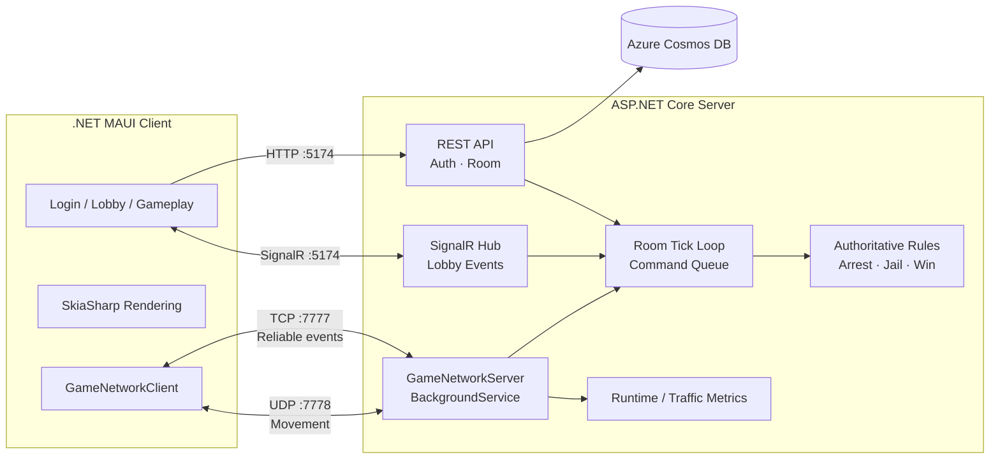

<p align="center">
  <b>🚨 6명이 한 방에서 펼치는 실시간 체포와 탈옥의 숨막히는 추격전!</b><br/>
  모바일 클라이언트부터 매치메이킹, 방 단위 게임 루프, TCP/UDP 혼합 프로토콜 동기화와 고부하 최적화까지<br/>
  기획부터 백엔드 코어 아키텍처까지 100% 직접 설계하고 구현한 실시간 게임 서버 프로젝트입니다.
</p>

<p align="center">
  <code>.NET 10</code> · <code>C#</code> · <code>.NET MAUI</code> · <code>ASP.NET Core Web API</code> · <code>SignalR</code> · <code>Azure Cosmos DB</code> · <code>Redis</code>
</p>

---

## 🎮 게임 소개 (Game Overview)

**PolRob**은 **경찰 2명 vs 도둑 4명**이 참여하는 6인 구성의 실시간 멀티플레이 랜드마크 추격 게임입니다. 서버 권위 기반의 엄격한 규칙 판정 하에, 양 진영은 시야와 지형지물을 활용한 고도의 심리전을 펼치게 됩니다.

| 👮 Police (경찰) | 🥷 Robber (도둑) |
| :--- | :--- |
| • **목표**: 제한 시간 내에 모든 도둑 수감<br/>• **메커니즘**: 시야 내 도둑 추적 후 일정 시간 접촉하여 체포 시도 | • **목표**: 시야와 건물을 이용해 제한 시간까지 생존<br/>• **메커니즘**: 감옥 근처에서 구출 게이지를 채워 수감된 동료를 탈옥시킴 |

### 🔄 핵심 플레이 흐름 (Core Gameplay Loop)

```
[유저 로그인] ──> [랜덤 매칭 / 커스텀 방 생성] ──> [2 Police + 4 Robbers 매칭 완료]
                                                               │
[게임 결과 판정 및 재대결] <── [5분간의 실시간 추격전] <── [3초 카운트다운]
```

---

> [!NOTE]
> ### 🧭 프로젝트 핵심 아키텍처 및 지향점
> 이 프로젝트의 진가는 단순한 화면 구현을 넘어 **실시간 게임 서버의 명확한 책임 분리와 대용량 데이터 흐름의 최적화**에 있습니다.
> 
> * **혼합 프로토콜 설계 (Hybrid Protocol)**: 신뢰성이 필수적인 이벤트는 **TCP**로, 빈번한 데이터(위치 동기화)는 **UDP**로 분리하여 효율을 극대화했습니다.
> * **방 단위 게임 루프 (Room-Scoped Tick Loop)**: 게임 룸을 `roomId` 기반으로 완벽히 격리하고, 독립적인 명령 큐(Command Queue)를 도입해 상태 오염을 방지했습니다.
> * **서버 권위 체제 (Server-Authoritative)**: 클라이언트 변조를 차단하기 위해 체포, 수감, 탈옥 판정 등 모든 게임 룰은 서버가 판정합니다.

---

## 🏗️ 시스템 아키텍처 (System Architecture)



### 🔀 효율적인 프로토콜 분할 전략

| 채널 (Channel) | 담당 데이터 (Data Team) | 선택 이유 (Rationals) |
| :--- | :--- | :--- |
| **HTTP (:5174)** | 회원가입, 로그인, 방 생성 및 참가 | 일회성 및 요청/응답 기반의 도메인 작업에 가장 적합 |
| **SignalR** | 로비 인원 변화, 매칭 완료, 게임 시작 | 그룹 단위 실시간 이벤트 전파 및 연결 상태 관리 용이 |
| **TCP (`7777`)** | 세션 접속/퇴장, 초기화 상태, Phase 전환, 체포/탈옥 이벤트 | 패킷 유실이 없어야 하며 순서 보장이 절대적으로 필요한 데이터 |
| **UDP (`7778`)** | 플레이어 실시간 이동 입력 및 위치 좌표 전파 | 초당 수십 번 발생하는 데이터로, 패킷 유실보다 최신성이 중요 |

---

## ⚙️ 서버 코어 메커니즘 구현

### 1. Room-Scoped Game Loop & Tick Scheduling
각 `GameSession`은 멀티스레드 환경에서 안전하도록 자체 Command Queue를 바라보며 독립적으로 동작합니다. 복잡한 동기화 비용을 최소화하기 위해 작업 성격에 따라 세분화된 하이퍼 티킹 주기를 적용했습니다.

* **50 ms**: 내부 Command Queue 처리 및 기본 틱 루프 갱신
* **100 ms**: 최신 이동 상태 UDP Broadcast 전파 및 체포/감옥 충돌 판정 루틴 실행
* **1000 ms (1s)**: 타이머 동기화 및 전반적인 Game State의 전체 동기화 패킷 전송

### 2. Server-Authoritative Validation
클라이언트는 오직 조이스틱 입력 전달과 SkiaSharp을 통한 부드러운 렌더링에만 집중합니다. 
```text
Client Input ──> UDP Receive ──> Room Command Queue ──> Validation / Rule Tick
                                                               │
Client Render <── Visible Clients Only <── Authoritative State ┘
```

---

> [!TIP]
> ### 📈 고부하 부하 테스트 및 단계별 최적화 성과 (Baseline 대비)
> 최대 **900대의 가상 Headless Bot**을 동시 구동하며 CPU 사용량, 패킷 처리량(PPS), GC 할당량을 정밀 추적하여 도출한 독립 실험 성과 지표입니다.

```diff
+ [실험 1] Lightweight UDP Payload
  ■ UDP Traffic   ███████████████ 53% 감소
  ■ GC Allocation ███████████ 39% 감소
  (이동 관련 패킷에서 정적/불변 필드를 완전히 도려내어 페이로드 최소화)

+ [실험 2] Room Send Tick Batching
  ■ CPU Usage     ██████████████████████ 76% 감소
  ■ Total PPS     ████████ 14% 감소
  (입력 발생 즉시 BroadCast 하지 않고, 서버의 100ms 틱 주기에 맞춰 일괄 배치 전송)

+ [실험 3] Movement Input Coalescing
  ■ CPU Usage     ██████████████ 50% 감소
  (큐에 쌓인 동일 플레이어의 누적 입력 중 불필요한 과거 값을 버리고 최신 입력값만 병합 처리)
```

Detailed Report ──> 자세한 분석 데이터는 [`docs/server_optimization_report.md`](docs/server_optimization_report.md)에서 확인하실 수 있습니다.

---

## 🛠️ 기술 스택 (Tech Stack)

* **Client**: .NET 10, .NET MAUI, XAML, SkiaSharp (고속 2D 렌더링을 위한 그래픽 엔진)
* **Web / Lobby**: ASP.NET Core Web API, SignalR Hub
* **Game Transport**: Low-level `TcpListener`, `TcpClient`, `UdpClient` 커스텀 래핑
* **Concurrency**: `BackgroundService`, `Channel<T>`, `ConcurrentDictionary`, Room-scoped Tick Loop
* **Persistence**: Azure Cosmos DB
* **Platforms**: Android, iOS 지원

---

## 🚀 실행 방법 (Getting Started)

### 1. 서버 인프라 환경 설정 및 실행
```bash
# 보안 민감 데이터는 환경 변수로 안전하게 주입합니다.
export COSMOSDB_CONNECTIONSTRING='AccountEndpoint=...;AccountKey=...;'

# 서버 구동 (HTTP/SignalR :5174, TCP :7777, UDP :7778 개방)
ASPNETCORE_URLS=[http://0.0.0.0:5174](http://0.0.0.0:5174) dotnet run --project polrob.Server/polrob.Server.csproj
```

### 2. 모바일 클라이언트 빌드 및 실행
```bash
# Android 에뮬레이터 환경 실행 (Host IP: 10.0.2.2 자동 바인딩)
dotnet build polrob.Client/polrob.Client.csproj -f net10.0-android -t:Run

# iOS 시뮬레이터 환경 실행 (Host IP: 127.0.0.1 자동 바인딩)
dotnet build polrob.Client/polrob.Client.csproj -f net10.0-ios -t:Run
```

---

> [!IMPORTANT]
> ### 🧩 주요 기술적 고민 (Deep Dive)
> 
> **Q. 왜 모든 실시간 통신을 편리한 SignalR로 통합하지 않았나요?**
> 로비나 매칭 관리처럼 연결성이 중요하고 빈도가 낮은 이벤트에는 SignalR이 훌륭한 선택입니다. 하지만 게임 인게임 플레이의 초고속 이동 동기화 영역에서는 매 순간 발생하는 패킷의 헤더 크기마저 아깝고, 전송 대상과 유실 허용 여부를 완전하게 통제해야 했습니다. 따라서 소켓 레벨의 TCP/UDP 커스텀 전송 레이어를 구축하여 책임을 엄격하게 분리했습니다.
> 
> **Q. ConcurrentDictionary만으로 멀티스레드 동시성 이슈가 완벽히 해결되나요?**
> 아닙니다. 스레드 안전한 컬렉션은 단일 '추가/수정/삭제' 연산 자체의 원자성만 보장할 뿐, "A 조건이 만족할 때 B 상태를 바꾼다" 같은 다중 복합 게임 규칙의 트랜잭션을 보호해주지 못합니다. PolRob 서버는 모든 네트워크 이벤트를 스레드 안전한 단일 통로인 Room Command Queue에 집어넣고, 룸별 전담 단일 스레드 루프가 이를 순차 처리하도록 강제하여 완벽한 상태 일관성을 확보했습니다.
> 
> **Q. 900 가상 봇 결과를 실제 동시접속 수용량으로 주장할 수 있나요?**
> 아닙니다. 현재 결과는 동일한 로컬 환경에서 최적화 전후를 비교하기 위한 실험입니다. 실제 수용량을 주장하려면 고정 사양의 cloud VM, 외부 부하 발생기, latency·packet loss·장시간 안정성 조건을 포함해 다시 검증해야 합니다.

---

<p align="center">
  <b>Designed and engineered with passion by a junior game server developer.</b><br/>
  기본 원리를 깊이 이해하고 성능을 수치로 증명하는 개발자, 서신우입니다.
</p>
