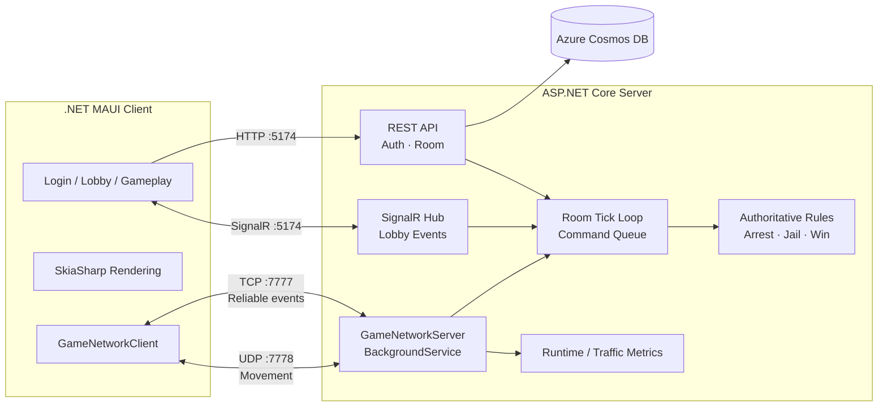

<h1 align="center">PolRob</h1>

<p align="center">
  <b>6명이 한 방에서 추격하고, 체포하고, 탈옥하는 실시간 경찰과 도둑 게임</b><br/>
  모바일 클라이언트부터 매치메이킹, 방 단위 게임 루프, TCP/UDP 동기화와 부하 테스트까지 직접 구현했습니다.
</p>

<p align="center">
  <code>.NET</code> · <code>C#</code> · <code>.NET MAUI</code> · <code>ASP.NET Core</code> · <code>SkiaSharp</code><br/>
  <code>REST API</code> · <code>SignalR</code> · <code>TCP</code> · <code>UDP</code> · <code>Azure Cosmos DB</code>
</p>

---

## 🎮 게임 소개

**PolRob**은 경찰 2명과 도둑 4명이 참여하는 6인 실시간 멀티플레이 게임입니다. 경찰은 제한 시간 안에 모든 도둑을 체포해야 하고, 도둑은 시야와 지형을 이용해 도망치거나 감옥에 접근해 동료를 구출할 수 있습니다.

| 👮 Police | 🥷 Robber |
|---|---|
| 시야 안의 도둑을 추적하고 일정 시간 접촉해 체포 | 경찰의 시야와 건물을 이용해 제한 시간까지 생존 |
| 모든 도둑을 감옥에 수감하면 승리 | 감옥 근처에서 구출 게이지를 채워 동료를 탈옥시킴 |

### 핵심 플레이 흐름

`로그인` → `랜덤 매칭 / 커스텀 방` → `2 Police + 4 Robbers` → `3초 카운트다운` → `5분 추격전` → `승패 판정 / 재대결`

---

## 🧭 프로젝트에서 보여주고자 한 것

이 프로젝트의 중심은 화면 구현보다 **실시간 게임 서버의 책임과 데이터 흐름**입니다.

- **혼합 프로토콜 설계** — 유실되면 안 되는 이벤트는 TCP, 빈번한 이동 동기화는 UDP로 분리
- **방 단위 게임 루프** — 각 방의 명령 큐를 순서대로 처리하고 규칙·이동·상태 동기화를 서로 다른 주기로 실행
- **서버 권위 게임 규칙** — 체포, 수감, 탈옥 진행률, 승패와 게임 phase를 서버가 판정
- **역할 단위 상태 분리** — 방 안에서도 같은 역할의 클라이언트에 필요한 상태만 선택적으로 전송
- **수치로 확인하는 최적화** — headless bot과 서버 런타임 메트릭으로 변경 전후를 같은 부하에서 비교

---

## 🏗️ 시스템 아키텍처



### 프로토콜을 나눈 이유

| 채널 | 담당 데이터 | 선택 이유 |
|---|---|---|
| **HTTP** | 회원가입·로그인, 방 생성·참가 | 요청/응답 기반 도메인 작업에 적합 |
| **SignalR** | 방 인원 변화, 매칭 완료, 게임 시작 | 로비의 이벤트 기반 상태를 그룹 단위로 전달 |
| **TCP `7777`** | 접속/퇴장, 초기 상태, 게임 phase, 체포·탈옥 | 순서와 전달 보장이 필요한 게임 이벤트 |
| **UDP `7778`** | 플레이어 이동 입력과 위치 전파 | 높은 빈도의 최신 상태가 오래된 상태보다 중요 |

---

## ⚙️ 서버 핵심 구현

### 1. Room-scoped game loop

게임 상태는 `roomId`로 격리됩니다. 각 `GameSession`은 자신의 command queue를 가지고, 한 방의 변경을 하나의 tick loop에서 처리합니다. 이 구조로 서로 다른 방의 상태가 섞이지 않게 하면서 같은 방 안의 규칙 처리 순서를 명확히 했습니다.

| 주기 | 처리 작업 |
|---:|---|
| **50 ms** | 방 command queue와 tick loop 처리 |
| **100 ms** | 최신 이동 상태 UDP broadcast, 체포·감옥·탈옥 규칙 판정 |
| **1 s** | 남은 시간과 승패를 포함한 game state 동기화 |

### 2. Server-authoritative rules

클라이언트는 조이스틱 입력과 렌더링을 담당합니다. 서버는 플레이어 위치와 현재 phase를 기준으로 체포 가능 여부를 검사하고, 2초 체포 진행, 감옥 배치, 3초 탈옥 진행, 전원 수감 여부와 제한 시간 종료를 판정합니다.

```text
Client input → UDP receive → room command queue → validation / rule tick
             → authoritative state → visible clients only → render
```

### 3. Matchmaking & room lifecycle

- 랜덤 매칭: 한 방을 **경찰 2명 + 도둑 4명**으로 구성하고 충족 시 자동 시작
- 커스텀 방: 사람이 공유하기 쉬운 room code로 생성·입장
- 로비 동기화: SignalR group으로 인원과 역할 변경을 실시간 전파
- 종료 처리: 연결 해제, 빈 방 정리, 커스텀 방 재대결 흐름 관리

---

## 📈 부하 테스트와 최적화

UI 없이 실제 로그인 → 랜덤 매칭 → TCP/UDP 게임 접속 → 이동을 수행하는 headless bot harness를 만들었습니다. 기본 sweep은 `60 / 300 / 600 / 900` bots이며, 모든 예상 방이 `Playing`인 구간에서 CPU, PPS, UDP bytes, GC, 방 상태와 실패 수를 함께 기록합니다.

| 독립 최적화 실험 | 확인된 변화 | 해석 |
|---|---:|---|
| Lightweight UDP payload | **UDP bytes 약 53%↓**, **GC allocation 약 39%↓** | 자주 변하지 않는 필드를 이동 packet에서 제거 |
| Room send tick batching | **CPU 약 76%↓**, **total PPS 약 14%↓** | 입력마다 즉시 전파하지 않고 tick마다 최신 상태를 배포 |
| Movement input coalescing | **CPU 약 50%↓** | 같은 플레이어의 오래된 queued input 대신 최신값을 처리 |

> 위 수치는 동일 baseline에 대해 각 최적화를 **독립적으로** 측정한 결과입니다. 효과가 겹치므로 단순 합산하지 않았으며, 최종 결합 수치는 별도 재측정 대상으로 남겼습니다. 로컬 환경의 before/after 결과이며 실제 서비스 수용 인원을 의미하지 않습니다.

```bash
./run_load_metrics.sh
```

결과는 timestamp 폴더의 `results.csv`, `results.md`와 stable link인 아래 경로에 저장됩니다.

```text
/tmp/polrob-load-latest/results.csv
/tmp/polrob-load-latest/results.md
```

자세한 측정 조건과 최적화별 분석은 [`docs/server_optimization_report.md`](docs/server_optimization_report.md)에서 확인할 수 있습니다.

---

## 🧰 Tech Stack

| Area | Technology |
|---|---|
| Client | .NET 10, .NET MAUI, XAML, SkiaSharp |
| Web / Lobby Server | ASP.NET Core Web API, SignalR |
| Game Transport | `TcpListener`, `TcpClient`, `UdpClient` |
| Concurrency | `BackgroundService`, `Channel<T>`, `ConcurrentDictionary`, room tick loop |
| Persistence | Azure Cosmos DB |
| Load Test | .NET headless bots, shell automation, runtime/traffic metrics |
| Platforms | Android, iOS |

---

## 📁 Repository Structure

```text
polrob/
├── polrob.Client/        # MAUI UI, SkiaSharp rendering, network client
├── polrob.Server/        # REST, SignalR, TCP/UDP game server, room service
├── polrob.Shared/        # Shared player, game state and protocol models
├── polrob.Test/          # Headless multiplayer bot / load harness
├── docs/                 # Server optimization report
└── run_load_metrics.sh   # Repeatable load benchmark and report generation
```

---

## 🚀 실행 방법

### Prerequisites

- .NET 10 SDK
- Android emulator 또는 iOS simulator
- Azure Cosmos DB account와 connection string

### 1. 서버 실행

비밀값은 저장소에 커밋하지 않고 환경 변수로 주입합니다.

```bash
export COSMOSDB_CONNECTIONSTRING='AccountEndpoint=...;AccountKey=...;'
ASPNETCORE_URLS=http://0.0.0.0:5174 \
  dotnet run --project polrob.Server/polrob.Server.csproj
```

서버는 HTTP/SignalR `5174`, TCP `7777`, UDP `7778` 포트를 사용합니다.

### 2. 클라이언트 실행

```bash
# Android
dotnet build polrob.Client/polrob.Client.csproj -f net10.0-android -t:Run

# iOS simulator (macOS)
dotnet build polrob.Client/polrob.Client.csproj -f net10.0-ios -t:Run
```

Android emulator는 `10.0.2.2`, iOS simulator는 `127.0.0.1`로 개발 머신의 서버에 접속합니다. 실제 iPhone에서는 `AuthSession.cs`의 로컬 네트워크 서버 주소를 현재 개발 머신 IP에 맞춰야 합니다.

---

## 🧩 주요 기술적 고민

<details>
<summary><b>왜 모든 통신을 SignalR로 처리하지 않았나요?</b></summary>
<br/>
로비 이벤트에는 SignalR의 group과 reconnect 모델이 편리하지만, 게임 이동 경로에서는 packet 빈도와 payload, 전송 대상을 직접 제어하고 측정할 필요가 있었습니다. 그래서 로비와 실제 gameplay transport의 책임을 분리했습니다.
</details>

<details>
<summary><b>ConcurrentDictionary만으로 동시성 문제가 해결되나요?</b></summary>
<br/>
아닙니다. thread-safe collection은 개별 연산을 보호하지만 여러 상태를 함께 바꾸는 게임 규칙의 순서까지 보장하지 않습니다. PolRob은 네트워크 입력을 방 command queue에 넣고 room tick에서 순서대로 적용해 복합 상태 변경의 경계를 만들었습니다.
</details>

<details>
<summary><b>900 bots를 실제 동시접속 수용량으로 주장할 수 있나요?</b></summary>
<br/>
아닙니다. 현재 결과는 동일한 로컬 환경에서 최적화 전후를 비교하기 위한 실험입니다. 실제 수용량을 주장하려면 고정 사양의 cloud VM, 외부 부하 발생기, latency·packet loss·장시간 안정성 조건을 포함해 다시 검증해야 합니다.
</details>

---

<p align="center">
  <b><span>Pol</span><span>Rob</span></b><br/>
  <sub>Designed and engineered as a junior game server developer portfolio.</sub>
</p>
