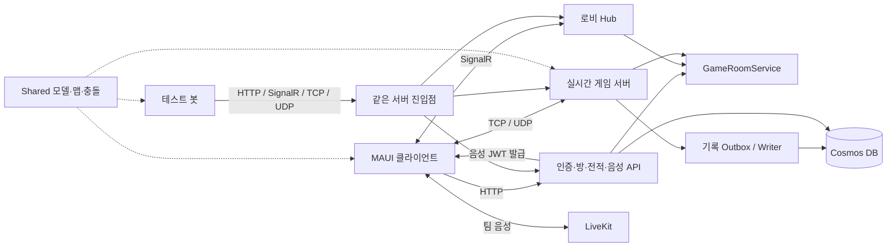

# PolRob 코드 이해 가이드

> 작성 기준: 2026-10-02의 로컬 소스, 2026-10-03 최종 대조. 기준 Git HEAD는 `cad8e3d`이며, 작업 디렉터리의 수정된 소스도 읽었다. 이 문서는 실제 구현을 설명한다. 앞으로 구현할 설계나 과거 성능 측정 결과를 현재 코드의 보장으로 취급하지 않는다.

PolRob는 로그인한 사용자가 경찰 또는 도둑으로 방에 참가하고, 서버가 이동·체포·탈옥·승패를 판단하는 실시간 멀티플레이 게임이다. 모바일 앱은 사용자 입력을 보내고 게임을 보여 준다. 서버는 방과 경기 상태를 관리하며, 완료 결과는 로컬 대기 파일을 거쳐 Cosmos DB에 저장한다. 팀 음성은 게임 서버가 발급한 권한으로 별도 LiveKit 서버에 연결한다.

**각 `.cs` 파일과 주요 메서드의 역할을 찾으려면 [파일별·메서드별 참고서](code-guide/file-reference.md)부터 열면 된다.** 서버·Shared·클라이언트·봇·테스트 파일을 각각 찾아볼 수 있다. 아래 1~6장은 파일 사이의 실행 흐름을 설명한다.

## 목차와 권장 읽기 순서

| 순서 | 장 | 읽고 나면 설명할 수 있는 내용 |
|---|---|---|
| 파일 찾기 | [`.cs` 파일별·메서드별 참고서](code-guide/file-reference.md) | 원하는 파일의 책임, 주요 메서드와 호출·반환·부작용을 바로 찾기 |
| 0 | 이 페이지 | 전체 구조, 통신 방식, 상태의 소유자, 한 경기의 흐름 |
| 1 | [서버 시작·인증·방·음성 권한](code-guide/01-server-application.md) | Program, HTTP API, 로그인, SignalR 로비, 매칭, 방장, 게임과 음성 입장 권한 |
| 2 | [공용 모델·게임 월드·충돌](code-guide/02-shared-world.md) | DTO와 실제 상태, 맵 선택, 좌표, 장애물, 이동·충돌·차폐 알고리즘 |
| 3 | [실시간 게임 서버·프로토콜·규칙](code-guide/03-server-network.md) | TCP/UDP 수신, 방별 명령 루프, 이동 검증, 체포·탈옥·승패, 연결 종료 |
| 4 | [클라이언트 동작·예측·음성](code-guide/04-client.md) | 로그인부터 재대결, 네트워크 연결, 입력·예측·보정, 음성 브리지와 수명 관리 |
| 5 | [경기 기록·통계·운영](code-guide/05-records-operations.md) | Outbox, DB 저장, 재시도, 색인 복구, 전적, 과부하 제한, drain과 재시작 |
| 6 | [테스트·봇·개발 도구](code-guide/06-tests-and-tools.md) | 테스트가 검증하는 규칙, 실제 프로토콜을 쓰는 봇, 맵·에셋 제작 도구 |
| 부록 | [전체 소스 파일 색인](code-guide/07-source-index.md) | 소스 파일별 설명 장, 상세 설명 대상과 생략 범위 |

처음에는 0→1→2→3→4→5→6 순서를 권한다. 급히 경기 기록 구조를 파악하려면 5장부터, 캐릭터 이동을 파악하려면 2→3→4장 순서로 읽어도 된다. 각 장에는 실제 소스 링크와 클래스·메서드 이름을 함께 넣었다.

## 범위

다음은 상세 설명 대상이다.

- `polrob.Server`: 시작과 의존성 연결, Controller, Hub, 서비스, 실시간 네트워크, 운영 로직.
- `polrob.Shared`: 모든 모델·메시지·맵·물리 코드. 현재 사용되는 코드와 남아 있는 과거 경로를 구분한다.
- `polrob.Client`: 네트워크, 로그인 세션, 로비·매칭·게임·재대결의 동작, 입력·예측·보정, 음성·진동, 렌더링과 연결되는 데이터·자원 관리.
- `polrob.Test`: 자동 플레이 봇과 부하 생성 흐름.
- `polrob.Server.Tests`: 각 테스트 파일이 검증하는 행동과 실제 검증 범위.
- `tools`: 저장소에 있는 코드 도구의 목적·입출력·연결 관계. 에셋의 픽셀을 그리는 세부 코드는 기능 중심으로 요약한다.

XAML 배치, 색·아이콘·폰트·이미지 디자인, 설정 파일의 값별 설명, 플랫폼 기본 시작 템플릿, 배포 YAML은 상세 분석에서 제외한다. 다만 `GamePlay.xaml.cs`처럼 파일 이름에 XAML이 있어도 실제 게임 동작이 들어 있는 C#은 포함한다. `GameSettings`처럼 설정을 읽어 실제 동작을 바꾸는 코드는 흐름상 필요한 범위에서 설명한다.

`bin`, `obj`, 외부 패키지, 이미지·폰트 바이너리, `tmp`·`output`의 일회성 이미지 및 문서 제작 산출물은 애플리케이션 소스 설명에서 제외한다. `docs/NetworkCodeReview.cs`는 현재 빌드 대상과 다른 과거 설명용 사본으로 구분한다. 설정 또는 UI라는 이유로 어떤 파일을 생략했는지는 [소스 색인](code-guide/07-source-index.md)에서 확인할 수 있다.

## 0.1 프로젝트를 구성하는 실행 단위

| 프로젝트 | 실행 형태 | 주된 책임 |
|---|---|---|
| `polrob.Server` | ASP.NET Core 서버 + BackgroundService | 로그인·방 API, 로비 Hub, TCP/UDP 게임, DB 기록, 운영 상태 |
| `polrob.Client` | .NET MAUI 앱 | 사용자 흐름, 조작·표시, 게임 연결, 팀 음성 |
| `polrob.Shared` | 공용 라이브러리 | 서버·클라이언트·봇이 공유하는 모델과 월드 계산 |
| `polrob.Test` | 콘솔 프로그램 | 화면 없이 실제 로그인·매칭·게임 프로토콜을 사용하는 봇 |
| `polrob.Server.Tests` | NUnit 테스트 프로젝트 | 규칙·프로토콜·연결·저장·맵·운영 동작 회귀 검증 |
| `tools/*` | 여러 독립 콘솔·스크립트 도구 | 이미지 경계 계산, 맵 에셋 생성·검사·미리보기 등 |

`polrob.Test`와 `polrob.Server.Tests`는 이름이 비슷하지만 용도가 다르다. 전자는 서버에 실제 접속하는 봇 실행기이고, 후자는 테스트 러너가 테스트 메서드를 실행하는 프로젝트다.

Shared의 코드를 같이 사용한다는 것은 계산식과 자료형을 맞춘다는 뜻이다. 클라이언트의 메모리를 서버와 공유하거나, 클라이언트의 계산 결과를 서버가 그대로 신뢰한다는 뜻은 아니다.

## 0.2 통신이 네 종류인 이유

| 통신 | 이 프로젝트에서 전송하는 것 | 수명과 처리 방식 |
|---|---|---|
| HTTP | 가입·로그인, 방 생성·참가, 상태 조회, 전적, 음성 권한 | 요청 하나에 응답 하나 |
| SignalR | 로비 참가자 변화, 역할 변경, 방장 시작, 매칭 취소 | 방 그룹에 이벤트 전달 |
| TCP | 게임 입장, 초기 상태, 중요한 게임 상태·체포·탈옥·heartbeat | 길이와 타입을 가진 메시지 프레임 |
| UDP | 조이스틱 방향 입력과 반복 위치 갱신 | 최신 상태를 자주 전송; 순서·중복·유실에 대비 |

로그인이나 방 생성은 즉시 성공·실패를 받아야 하므로 HTTP로 표현하기 쉽다. 로비의 다른 사람에게 변화가 생겼다는 알림은 SignalR 그룹으로 보낸다. 경기 중 중요한 이벤트는 TCP를, 빈번한 이동은 UDP를 사용한다.

TCP가 메시지 경계를 자동으로 나눠 주는 것은 아니다. 이 코드는 길이와 타입을 직접 붙인다. 서버는 지정된 길이만큼 프레임을 읽어 검사한다. 앱은 `BinaryReader`로 길이·타입·문자열을 순서대로 읽지만, 읽은 바깥쪽 길이 값은 별도로 검증하지 않는다. UDP는 오래된 패킷이 늦게 도착할 수 있으므로 sequence로 최신 입력을 구분한다. 구체적인 바이트 형식과 메시지별 방향은 3·4장에서 설명한다.

## 0.3 ID와 토큰을 혼동하지 않기

| 이름 | 무엇을 식별하는가 | 바뀌는 때 |
|---|---|---|
| UserId | 사용자 계정 또는 임시 봇 | 계정/봇 생성 때 |
| SessionToken | 서버가 인정한 로그인 세션 | 로그인·회원가입·봇 로그인 때 |
| RoomId | 로비 및 경기 방 | 새 방 생성 때 |
| RoomCode | 사람이 입력하는 커스텀 참가 코드 | 방 생성 때 |
| ConnectionId | 특정 TCP 연결 세대 또는 SignalR 연결 | 각각 재연결할 때; 서로 다른 체계임 |
| MovementSessionToken | 현재 게임 연결의 UDP 이동 권한 | TCP 게임 입장 승인 시 |
| GameRecordId | 방에서 진행한 특정 한 경기 | 새 경기 시작 때 |
| VoiceSessionId | 해당 경기의 팀 음성 방 구분 | 방이 새로 시작될 때 |
| LiveKit participant identity | 특정 게임 연결의 음성 참가자 | room/user/gameConnection 조합으로 계산 |

한 방에서 세 번 재대결하면 RoomId는 유지될 수 있지만 경기 기록 ID와 음성 세션은 각각 달라진다. 로그인 토큰이 남아 있어도 이전 게임의 이동 토큰으로 새 연결을 조작할 수 있도록 설계된 것은 아니다. 실제로 어떤 값들을 비교하는지는 3장의 인증 경로를 따른다.

## 0.4 상태는 어디에 있는가

| 정보 | 주된 소유자 | 저장 수명 |
|---|---|---|
| 이름·비밀번호 해시 | Cosmos 사용자 문서 | DB |
| 로그인 토큰 → 사용자 | `AuthController.Sessions` | 서버 프로세스 |
| 방과 로비 참가 명단·역할 | `GameRoomService` | 서버 프로세스 |
| 경기 위치·입력·체포·탈옥·타이머 | `GameSession`과 방 루프 | 방의 실시간 수명 |
| 현재 활성 게임 연결 | `ActiveGameParticipantRegistry` | 연결 수명 |
| 그리는 좌표·입력·보간 snapshot | 클라이언트 `GamePlay` | 게임 화면 수명 |
| 완료 결과 대기 파일 | `GameRecordOutbox` | 디스크/볼륨 수명 |
| 경기 원본·참가자별 전적 자료 | Cosmos 경기 기록 문서 | DB |
| 음성 연결·track·mute 상태 | 클라이언트 음성 서비스와 JS/LiveKit | 음성 연결 수명 |

서버 메모리의 모든 상태를 DB에 계속 저장하지는 않는다. 따라서 서버 재시작은 진행 중 경기의 resume 기능과 같지 않다. 미완료 경기는 포기하고, 로컬 파일로 보존된 완료 기록만 DB 저장을 이어 가는 정책이다.

## 0.5 한 경기를 끝까지 따라가기

### 1단계: 로그인

클라이언트의 로그인 화면 동작이 `/auth/login` 또는 `/auth/signup`을 호출한다. `UserDbService`가 사용자를 확인하고 `AuthController`가 로그인 토큰을 만든다. `AuthSession`은 이후 요청에서 쓸 세션 상태를 보관한다. 서버는 요청의 사용자 ID를 본문에서 신뢰하는 대신 이 토큰으로 알아낸다.

읽을 경로: [AuthSession](../polrob.Client/AuthSession.cs) → [AuthController](../polrob.Server/Controllers/AuthController.cs) → [UserDbService](../polrob.Server/Services/UserDbService.cs).

### 2단계: 방 등록과 로비 구독

커스텀 생성/참가 또는 랜덤 참가 요청이 `GameController`로 들어온다. `GameRoomService`는 사용자·역할·인원·방 상태를 검사하고 명단을 바꾼다. 이후 클라이언트는 Hub의 `JoinRoom`으로 해당 방 알림을 구독한다.

읽을 경로: [GameJoin](../polrob.Client/GameJoin.xaml.cs) 또는 [GameLobby](../polrob.Client/GameLobby.xaml.cs) → [GameController](../polrob.Server/Controllers/GameController.cs) → [GameRoomService](../polrob.Server/Services/GameRoomService.cs) → [GameRoomHub](../polrob.Server/Hubs/GameRoomHub.cs).

### 3단계: 로비 시작과 TCP 입장

랜덤 방이 채워지거나 커스텀 방장이 시작하면 로비가 `GameStarted`를 알린다. 클라이언트는 게임 화면으로 이동하고 TCP `Join`을 보낸다. 서버는 로그인과 방 참가를 재검증하고, 현재 연결용 PlayerSession과 이동 토큰을 준비한다.

실제 경기는 모든 준비 조건을 충족한 뒤 Waiting → Countdown → Playing으로 넘어간다. 로비의 GameStarted 알림을 받았다는 사실과 서버가 Playing 상태라는 사실은 다르다.

읽을 경로: [GameNetworkClient](../polrob.Client/Network/GameNetworkClient.cs) → [Transport](../polrob.Server/Network/GameNetworkServer.Transport.cs) → [GameNetworkServer의 Join 처리](../polrob.Server/Network/GameNetworkServer.cs) → [RoomLoop](../polrob.Server/Network/GameNetworkServer.RoomLoop.cs).

### 4단계: 조이스틱 한 번 움직이기

클라이언트는 방향을 읽고 로컬 캐릭터를 먼저 움직여 조작감을 만든다. 동시에 사용자 ID·이동 토큰·sequence를 포함한 방향 입력을 UDP로 보낸다.

서버 수신 코드는 크기·파싱·인증·빈도 등을 검사하고 해당 방에 이동 명령을 넣는다. 방 루프가 최신 방향을 적용하고 서버 속도·시간 간격·맵 충돌에 따라 위치를 계산한다. 클라이언트가 보낸 좌표를 그대로 저장하는 경로가 아니다.

서버가 계산한 위치가 돌아오면 로컬 플레이어는 서버 좌표로 보정되고, 다른 플레이어의 움직임은 snapshot 사이를 보간해 표시한다. 이 구현에는 처리되지 않은 입력 목록을 서버 위치 위에서 다시 실행하는 완전한 input replay reconciliation이 없다. 4장에서 예측과 보정의 실제 범위를 구분한다.

### 5단계: 체포와 탈옥

방 루프는 주기적으로 게임 규칙을 검사한다. 체포 가능한 거리·방향·장애물·현재 상태 등의 조건을 만족하면 체포 진행을 관리하고, 완료되면 도둑을 감옥으로 옮긴다. 구출 가능한 도둑이 탈옥 지점에서 필요한 시간을 채우면 수감자를 풀어준다.

서버가 판정한 이벤트와 진행도가 TCP로 전달되고, 클라이언트는 이를 받아 입력 제한과 표시 상태를 갱신한다. 이벤트를 받은 화면이 승패나 수감 여부를 최종 결정하는 구조는 아니다.

중요한 구현 차이: 현재 상대 노출 여부 계산과 체포 판정의 차폐 조건은 완전히 같지 않다. 거리·시야각을 검사하는 가시성 경로에 벽 차폐까지 항상 포함된다고 단정하면 안 된다. 자세한 조건과 호출 관계는 3장을 기준으로 읽는다.

### 6단계: 승패와 보존

서버가 승패를 확정하면 시작 당시 참가자 명단으로 `CompletedGameRecord`를 만든다. Outbox 파일에 맡기는 데 성공해야 정상 종료 처리를 이어 간다. Writer는 나중에 DB 원본과 참가자별 문서를 저장한다. 일부만 저장되었으면 Writer 또는 Reconciler가 보정한다.

읽을 경로: [RoomLoop](../polrob.Server/Network/GameNetworkServer.RoomLoop.cs) → [Writer](../polrob.Server/Services/GameRecordWriter.cs) → [Outbox](../polrob.Server/Services/GameRecordOutbox.cs) → [DbService](../polrob.Server/Services/GameRecordDbService.cs).

### 7단계: 결과 화면과 재대결

클라이언트가 종료 상태를 처리하고 연결·음성·화면 자원을 정리한다. 커스텀 방은 남은 참가자가 있으면 같은 방의 로비로 돌아갈 수 있다. 랜덤 방은 완료 후 정리되므로 새 매칭 흐름을 거친다. 전적 API는 DB의 참가자별 기록을 집계하므로 종료 직후에는 반영이 늦을 수 있다.

읽을 경로: [GameOver](../polrob.Client/GameOver.xaml.cs), [GameRecordsController](../polrob.Server/Controllers/GameRecordsController.cs), [GameRoomService.CompleteGame](../polrob.Server/Services/GameRoomService.cs#L554).

## 0.6 이 코드의 동시성을 읽는 방법

`async` 메서드가 있다고 매 호출마다 전용 스레드가 하나씩 생긴다고 생각하지 않는다. I/O를 기다리는 동안 작업을 중단했다가 계속할 수 있게 만든 것이다. 이 프로젝트에서 중요한 것은 어떤 객체를 어느 작업이 변경할 수 있는가다.

| 수단 | 사용 이유 | 대표 위치 |
|---|---|---|
| `lock` | 관련 값 여러 개의 읽기·변경을 한 묶음으로 보호 | GameRoomService, Outbox |
| `ConcurrentDictionary` | 여러 작업의 조회·추가·삭제를 지원 | 로그인, 연결 인덱스, 운영 지표 |
| 방별 bounded Channel | 여러 수신 경로의 명령을 한 방 루프가 처리 | GameSession.Commands |
| `ConnectionId` 확인 | 이전 연결의 늦은 정리가 새 연결을 지우지 않도록 구분 | Hub, TCP 정리, 음성 registry |
| `CancellationToken` | 서버 종료·페이지 이탈 시 비동기 작업 중단 신호 | 네트워크, 기록 writer, 음성 |
| `SemaphoreSlim`·세대 번호 | 겹친 연결/정리 작업을 순서화하거나 오래된 결과를 무시 | 클라이언트 연결·음성 |

ConcurrentDictionary를 쓴다고 그 안의 객체 속성까지 자동으로 안전해지는 것은 아니다. 예를 들어 PlayerState의 여러 필드를 일관되게 바꾸려면 방 루프라는 소유권 규칙이 필요하다. 큐와 lock을 읽을 때는 자료구조의 이름보다 그 안에서 어떤 상태를 변경하는지 확인한다.

## 0.7 자주 나오는 용어

| 용어 | 이 프로젝트에서의 뜻 |
|---|---|
| DTO | 네트워크나 계층 사이에 전달할 데이터 모양. `GameStateSync` 등이 해당한다. |
| authoritative server | 최종 위치·체포·탈옥·승패를 서버가 결정한다는 뜻 |
| tick | 일정한 간격으로 게임 상태를 한 단계 갱신하는 실행 |
| snapshot | 특정 시점의 상태를 복사해 전달하거나 보관한 값 |
| prediction | 서버 응답 전에 내 입력으로 움직임을 먼저 계산하는 것 |
| interpolation | 과거에 받은 두 상태 사이의 표시 위치를 보간하는 것 |
| sequence | 입력의 선후 관계·중복 여부를 구분하는 증가 번호 |
| coalescing | 같은 사람의 여러 이동 입력 중 처리에 필요한 최신값으로 합치는 것 |
| backpressure | 생산 속도가 처리 속도를 넘을 때 큐·연결·입장을 제한하는 것 |
| idempotent / 멱등 | 같은 요청을 다시 수행해도 동일한 최종 결과를 얻는 성질 |
| Outbox | 아직 DB에 반영하지 못한 완료 결과를 보관하는 로컬 파일 대기함 |
| reconciliation | 일부만 반영된 데이터를 찾아 목표 상태로 맞추는 복구 작업 |
| drain | 새 경기를 받지 않으면서 기존 작업의 정리를 준비하는 상태 |
| connection generation | 같은 사용자의 이전 접속과 이번 접속을 다른 ID로 구별하는 방식 |
| partition key | Cosmos 문서를 저장·찾을 때 사용하는 분할 기준 값 |

## 0.8 변경하려는 기능에서 시작 파일 찾기

| 바꾸려는 내용 | 먼저 읽을 코드 | 함께 확인할 곳 |
|---|---|---|
| 방 정원·역할 인원 | GameRoomService | Hub 시작, RoomLoop 준비 조건, 클라이언트 로비, 봇 |
| 이동 속도·캐릭터 반경 | GameNetworkServer | 클라이언트 예측, Shared Player·GameMap, 이동 테스트 |
| 체포·탈옥 시간 | GameNetworkServer 규칙 | progress sync, 클라이언트 상태 처리, 규칙 테스트 |
| 맵 추가·충돌 변경 | MapRegistry, GameMap, layout | 서버 map 전달, 클라이언트 renderer, 봇 맵, 물리 테스트 |
| 새 게임 이벤트 | Shared DTO/TcpMessageType | 서버 송신, Client 수신, Bot 수신, 프로토콜 테스트 |
| 재접속 문제 | Transport, Join/Leave 처리 | registry, 클라이언트 lifecycle, 음성 identity |
| 경기 결과 필드 | CompletedGameRecord, DbService | Outbox 직렬화, 참가자 문서, 통계 API·화면, 재시도 테스트 |
| 팀 음성 문제 | VoiceController, registry | VoiceChatService, HybridWebView bridge, JS, platform 권한 |
| 서버 과부하 | RoomLoop·TcpPeer·Operations | 지표, queue 상한, rate limiter, 봇 실험 |

## 0.9 문서를 읽을 때의 기준

각 장의 설명은 현재 소스의 조건과 호출 관계를 기준으로 한다. 이름이 그럴듯해도 실제 참조가 없으면 활성 기능으로 단정하지 않는다. 예를 들어 현재 경로에서 호출되지 않는 맵 생성 코드나 helper는 해당 장에서 구분한다.

테스트 장은 테스트가 무엇을 검증하도록 작성되어 있는지 설명한다. 테스트 이름만으로 전체 기능이 완전히 검증됐다고 확대하지 않는다. 이 문서 작성 작업에서는 실행 코드 수정 없이 소스·문서 참조와 설명 범위를 확인하며, 실제 모바일 앱·DB·LiveKit의 end-to-end 검증 결과를 새로 만든 것으로 주장하지 않는다.

문서가 충분히 이해되었는지 확인하려면 다음 세 가지 흐름을 코드에서 직접 따라가 보자.

1. 로그인 토큰 하나가 HTTP → SignalR → TCP → 음성 토큰 발급까지 어떻게 쓰이는지.
2. 조이스틱 입력 하나가 UDP → 방 명령 → 서버 이동 → 위치 송신 → 클라이언트 보정으로 돌아오는지.
3. 완료 결과 하나가 메모리 → 로컬 파일 → 경기 원본 → 참가자 문서 → 승률로 바뀌는지.

이 흐름의 중간마다 어떤 클래스가 상태를 소유하고, 실패하면 누가 다시 시도하며, 어떤 조건에서 정리되는지를 설명할 수 있으면 프로젝트의 핵심 구조를 이해한 것이다.
