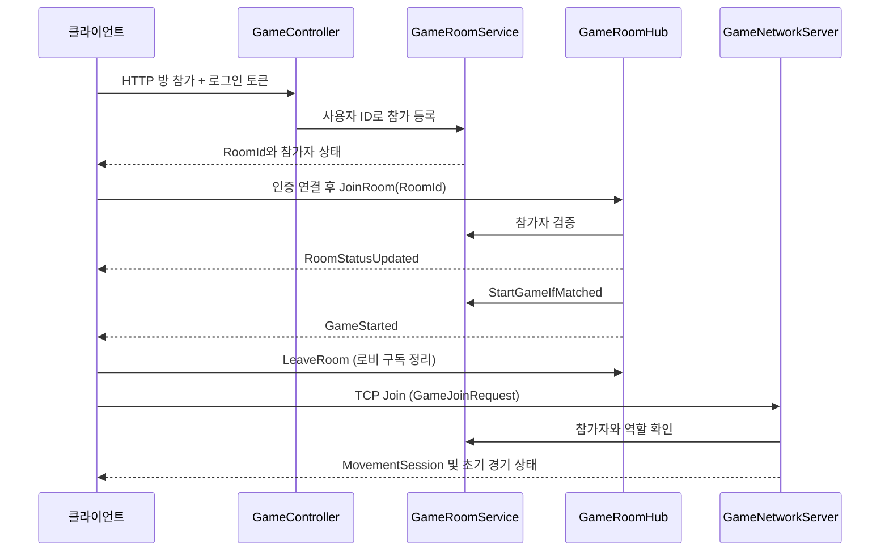

# 1. 서버의 시작, 로그인, 방, 음성 권한

[전체 안내로 돌아가기](../code-guide.md) · [다음: 공용 모델과 맵](02-shared-world.md)

이 장은 HTTP 요청이 들어와 사용자를 확인하고, 방을 만들고, 참가자를 모아 실제 게임 연결로 넘기는 과정을 설명한다. 서버의 실시간 이동·체포 판정은 [3장](03-server-network.md), 경기 결과 저장과 운영 정책은 [5장](05-records-operations.md)에서 이어진다.

## 1.1 먼저 구분할 세 가지 서버 객체

| 객체 | 답하는 질문 | 상태를 보관하는 곳 |
|---|---|---|
| `AuthController`의 로그인 세션 | 이 요청은 누구의 요청인가? | 정적 `Sessions` 딕셔너리 |
| `GameRoomService`의 `Game` | 어느 방에 누가 어떤 역할로 참가했는가? | 서비스의 `Games` 목록 |
| `GameNetworkServer`의 `GameSession` | 그 방의 경기가 현재 어떤 상태인가? | 게임 서버의 방별 세션 |

로그인했다고 곧바로 특정 방에 들어갈 수 있는 것은 아니다. 로그인 토큰으로 사용자 ID를 확인한 뒤 해당 방의 참가자 목록도 확인한다. 또한 로비 참가자라는 사실과 TCP 게임 연결이 현재 살아 있다는 사실도 구분한다. 음성 토큰 발급에서는 두 조건을 모두 확인한다.

`GameRoomService`의 `Player`와 실제 경기의 `PlayerSession.PlayerState`를 같은 객체라고 생각하면 코드를 잘못 읽게 된다. 서비스가 인증된 플레이어를 돌려줄 때는 `CopyPlayer`로 복사본을 만든다. 방의 명단과 실시간 위치·수감 상태는 용도가 다르다.

## 1.2 Program.cs: 모든 객체를 연결하는 시작점

소스: [Program.cs](../../polrob.Server/Program.cs).

`Program.cs`는 top-level statements로 작성되어 있어 명시적인 `Main` 메서드가 없어도 프로그램 진입점이 된다. 순서는 다음과 같다.

1. `WebApplication.CreateBuilder(args)`로 HTTP 서버와 의존성 주입 컨테이너를 준비한다.
2. Controller, SignalR, 운영 상태, 요청 제한, DB 서비스, 기록 저장 워커, 게임 서버를 등록한다.
3. `builder.Build()`로 애플리케이션을 만든다.
4. 사용자 DB와 경기 기록 DB의 `InitializeAsync`를 기다린다.
5. HTTP 미들웨어와 endpoint를 연결한다.
6. `app.Run()`으로 서버를 실행한다.

여기서 **의존성 주입(DI)**은 생성자에 필요한 객체를 서버 프레임워크가 전달하는 방식이다. 예를 들어 `GameController(GameRoomService, IHubContext<GameRoomHub>)`를 만들 때 이미 등록된 방 서비스와 Hub 전송 통로를 받는다. Controller가 자기만의 방 목록을 새로 만들지 않기 때문에 서로 다른 HTTP 요청이 같은 방 상태를 볼 수 있다.

### Singleton과 HostedService

`AddSingleton`으로 등록한 서비스는 이 서버 프로세스에서 공유되는 한 인스턴스다. `GameRoomService`, `UserDbService`, `GameRecordOutbox`, `OperationalMetrics` 등이 이에 해당한다. 여러 요청에서 동시에 접근할 수 있으므로 내부의 lock이나 동시성 자료구조가 필요하다.

`IHostedService` 또는 `BackgroundService`는 서버의 시작·종료 수명에 묶여 실행된다. 요청이 들어와야만 실행되는 Controller와 달리 `GameRecordWriter`는 계속 대기 파일을 확인하고, `GameRecordReconciler`는 주기적으로 DB를 보정한다.

다음 등록은 특히 중요하다.

```csharp
AddSingleton<GameRecordWriter>();
AddSingleton<IGameRecordQueue>(sp => sp.GetRequiredService<GameRecordWriter>());
AddSingleton<IHostedService>(sp => sp.GetRequiredService<GameRecordWriter>());
```

세 가지 이름으로 **같은 Writer 인스턴스**를 사용한다. 게임 서버가 결과를 맡기는 객체와 백그라운드에서 결과를 처리하는 객체가 같도록 하기 위함이다. `IGameRecordStore`도 실제로는 이미 등록된 `GameRecordDbService`를 가리킨다.

HostedService 등록 순서는 `RestartPolicyService` → `GameRecordWriter` → `GameRecordReconciler` → 활성화된 경우 `GameNetworkServer`다. 종료는 역순으로 진행되므로 게임 서버가 마지막 결과를 정리할 때 Writer와 재시작 상태 기록 서비스가 아직 남아 있도록 구성되어 있다. 이것이 모든 종료 작업의 성공을 보장한다는 뜻은 아니며, 실제 종료 시간 제한과 실패 처리는 5장에서 설명한다.

### DB 초기화와 직렬화

`CosmosClient`는 두 DB 서비스가 공유한다. Cosmos에 저장하는 C# 속성명은 camelCase로 직렬화된다. 따라서 코드의 `PlayerRecordsIndexed`는 문서에서 `playerRecordsIndexed`가 되고, SQL 질의도 이 이름을 사용한다.

`InitializeAsync`를 `app.Run()` 앞에서 기다리므로 이 단계의 DB 접근 실패는 정상적인 서버 시작을 막는다. 이미 시작한 서버에서 발생한 일시적 경기 기록 저장 장애를 Outbox로 견디는 것과, DB 없이 처음부터 정상 시작하는 것은 별개의 상황이다.

[CosmosDbOptions.cs](../../polrob.Server/Services/CosmosDbOptions.cs), [LiveKitOptions.cs](../../polrob.Server/Services/LiveKitOptions.cs)는 설정 값을 담는 작은 클래스다. 설정 배포 방법은 이 가이드의 범위 밖이지만, 전자는 DB·컨테이너 이름, 후자는 음성 서버 주소·서버 자격 증명·토큰 수명을 각 서비스에 전달한다는 점은 알아두면 된다.

### 요청 처리 순서

`UseRouting` → `UseRateLimiter` → 게임 신규 요청 제한 미들웨어 → 매핑된 Controller/Hub/운영 endpoint 순서다. 제한 조건에 걸리면 실제 게임 Controller에 도달하기 전에 응답이 반환된다.

등록된 주요 통로는 다음과 같다.

| 통로 | 용도 |
|---|---|
| `/auth/*` | 회원가입·로그인·로그아웃·봇 로그인 |
| `/game/*` | 방 생성·참가·상태 조회·재경기 참가 |
| `/hubs/game-room` | SignalR 로비 알림 및 로비 동작 |
| `/game-records/me/stats` | 현재 로그인 사용자의 전적 조회 |
| `/voice/token` | 현재 게임 연결에 맞는 팀 음성 토큰 |
| `/health/*`, `/ops/*` | 운영 상태 확인과 drain |
| 별도 TCP/UDP listener | 실제 경기 입장·이동·게임 이벤트 |

현재 서버는 ASP.NET의 일반적인 인증 middleware와 `[Authorize]` 조합 대신 각 진입점에서 세션 토큰을 수동 검증한다. `Bearer`라는 접두사가 붙어 있어도 로그인 토큰 자체가 JWT인 것은 아니다.

## 1.3 AuthController: 계정과 로그인 세션

소스: [AuthController.cs](../../polrob.Server/Controllers/AuthController.cs).

### 회원가입

`SignUp`은 이름과 비밀번호를 받아 다음을 확인한다.

- 이름은 앞뒤 공백을 제거한 기준으로 4~20자여야 한다.
- 이름에 사용할 수 있는 문자는 영문 대소문자, 숫자, `_`, `-`다.
- 비밀번호는 공백만으로 구성되면 안 되고 최소 8자다.

검증이 끝나면 `UserDbService.CreateUserAsync`를 호출한다. 이미 사용 중이라고 판단되면 HTTP 409를 반환한다. 생성 성공 시 곧바로 로그인 세션까지 발급해서 `SessionToken`, `UserId`, `Name`을 반환한다. 별도의 로그인 요청을 한 번 더 할 필요가 없는 흐름이다.

### 로그인

`Login`은 빈 입력을 거부하고 DB 서비스의 `ValidateUserAsync`로 비밀번호를 검증한다. 실패하면 HTTP 401, 성공하면 새 로그인 세션을 만든다.

`CreateSession`은 `Guid.NewGuid().ToString("N")` 문자열을 생성하고 다음 정보를 메모리에 넣는다.

```text
Sessions[sessionToken] = (UserId, 만료 시각 = 현재 UTC + 12시간)
```

`ValidateSession`은 토큰을 딕셔너리에서 찾고 만료 시간을 비교한다. 만료된 항목은 그 검증 시점에 제거된다. 사용자 ID는 토큰에서 문자열을 해독해서 얻는 것이 아니라 서버의 딕셔너리에서 조회한다.

이 구조에서 자연스럽게 따라오는 동작은 다음과 같다.

- 서버 프로세스를 다시 시작하면 로그인 세션은 사라진다.
- 같은 계정이 여러 번 로그인하면 여러 세션이 생길 수 있다. 새 로그인 때 기존 토큰을 모두 폐기하는 코드는 없다.
- 만료 항목 전체를 주기적으로 청소하는 작업은 이 파일에 없다. `ValidateSession`에 들어온 만료 토큰을 그때 제거한다.
- 여러 서버 인스턴스가 이 정적 딕셔너리를 공유하지 않는다.

### 로그아웃

`Logout`은 요청 본문으로 받은 토큰을 `Sessions`에서 제거하고 204를 반환한다. 이미 없는 토큰을 다시 로그아웃해도 최종 결과는 같다. 이 메서드 자체가 모든 SignalR·TCP 연결을 즉시 찾아 강제로 끊는 것은 아니다. 이후 각 경로에서 토큰을 재검증하거나 연결 수명 정리가 일어나는 흐름을 따로 읽어야 한다.

### 봇 로그인

`BotLogin`은 기능 활성 여부와 `X-Polrob-Bot-Key`를 확인한 뒤 `BotIdentityService`에서 임시 사용자를 만든다. 키 비교는 UTF-8 바이트 길이를 확인하고 `CryptographicOperations.FixedTimeEquals`를 사용한다.

테스트 봇도 이후에는 일반 로그인 세션 토큰을 받아 HTTP·Hub·게임 입장에서 사용한다. 매번 DB 계정을 생성하지 않고 많은 봇을 실행할 수 있도록 계정 생성 단계만 별도로 마련한 것이다.

## 1.4 UserDbService: 사용자 저장과 비밀번호

소스: [UserDbService.cs](../../polrob.Server/Services/UserDbService.cs).

파일 안에는 DB 서비스뿐 아니라 내부 저장 모델 `UserDocument`, 다른 서비스에 전달하는 `User`도 들어 있다. `UserDocument`에는 비밀번호 해시가 있지만 `User`에는 ID와 이름만 있다. DB 문서를 인증 처리 뒤 그대로 다른 계층에 내보내지 않는 구조다.

### 저장·조회 경로

| 메서드 | 실제 처리 |
|---|---|
| `InitializeAsync` | DB와 사용자 컨테이너가 없으면 생성한다. partition key 경로는 `/id`다. |
| `CreateUserAsync` | 이름 정규화 → 같은 이름 조회 → GUID ID·해시 생성 → `CreateItemAsync` → 메모리 캐시 추가 |
| `ValidateUserAsync` | 정규화한 이름으로 DB 조회 → 해시 검증 → `User` 변환·캐시 추가 |
| `GetUserAsync` | ID 캐시 조회 → 없으면 ID와 partition key로 point read → 404면 `null` |
| `GetDocumentByNameAsync` | 이름 parameter를 바인딩한 Cosmos SQL을 페이지 단위로 읽는다. |

이름 정규화는 `Trim().ToLowerInvariant()`다. 따라서 `Police_1`로 가입하더라도 저장되는 이름은 `police_1`이다. 로그인할 때도 같은 변환을 적용한다.

`_usersById`는 `ConcurrentDictionary<string, User>`다. 방 입장 등에서 사용자 ID를 반복 조회할 때 DB round trip을 줄인다. 현재 코드에는 캐시 만료나 크기 제한, 계정 변경 시 무효화 로직이 없다. 캐시가 비밀번호 검증을 대신하는 것도 아니다. 로그인은 이름으로 DB 문서를 조회하고 해시를 검사한다.

컨테이너 생성 코드에는 `/name` unique key도 선언되어 있다. 하지만 코드가 사용하는 partition key는 사용자별 `/id`이고, 회원가입은 사전 이름 조회 후 별도 생성 요청으로 구성되어 있다. 이 두 요청을 묶는 트랜잭션이나 같은 이름의 동시 가입을 전역으로 직렬화하는 코드는 없다. 따라서 코드를 읽을 때 `GetDocumentByNameAsync`만으로 동시 요청까지 원자적으로 처리된다고 해석하지 않아야 한다.

### 비밀번호를 저장하는 방식

`HashPassword`는 16바이트의 무작위 salt를 만들고 PBKDF2-SHA256을 100,000회 반복하여 32바이트 해시를 얻는다. 저장 형식은 다음과 같다.

```text
PBKDF2-SHA256:반복횟수:Base64(salt):Base64(hash)
```

salt를 저장해도 원래 비밀번호를 저장하는 것은 아니다. 로그인 때 같은 비밀번호 후보와 저장된 salt·반복횟수로 다시 계산한 결과가 같은지를 확인한다. `VerifyPassword`는 형식과 반복횟수를 읽은 뒤 결과를 고정 시간 비교한다. 이 설명은 현재 구현 방식에 대한 것으로, 별도의 보안 검증을 완료했다는 뜻은 아니다.

## 1.5 BotIdentityService: DB 없는 임시 사용자

소스: [BotIdentityService.cs](../../polrob.Server/Services/BotIdentityService.cs).

`Create`는 `bot-<GUID>` ID와 요청 이름 또는 기본 이름을 만들고 12시간 유효한 `BotIdentity`를 딕셔너리에 저장한다. `Get`은 만료 여부를 확인하고 사용자를 돌려준다. 생성 시에는 전체 만료 항목도 정리한다.

`BotIdentity`에 있는 Role은 생성된 봇의 역할별 개수를 로그로 집계하는 데 사용한다. 실제 방의 역할은 `GameRoomService`에서 참가·역할 변경 규칙에 따라 결정된다. 임시 사용자 사전과 방 참가자 목록은 서로 다른 데이터다.

방 서비스의 `GetUserAsync`는 먼저 봇 사전을 찾고, 없으면 `UserDbService`로 일반 사용자를 찾는다. 이후 `CreatePlayer` 단계부터는 두 종류 모두 동일한 `Player`로 취급된다.

## 1.6 GameController: HTTP를 방 서비스 호출로 바꾸기

소스: [GameController.cs](../../polrob.Server/Controllers/GameController.cs).

각 동작의 첫 단계는 `TryGetAuthenticatedUserId`다. `Authorization: Bearer <token>`을 읽고 `AuthController.ValidateSession`으로 사용자 ID를 얻는다. 클라이언트가 요청 본문에 다른 사람의 ID를 넣어서 참가시키는 방식이 아니다.

| HTTP 요청 | 요청 데이터 | 서비스 호출과 후속 동작 |
|---|---|---|
| `POST /game/create` | Type, Role, IsPrivate, MapId | `CreateRoom`; 실패는 400, 성공은 생성된 방 상태 |
| `GET /game/{roomId}/status` | 경로의 방 ID | 방 조회 후 요청자가 참가자 목록에 있는지 확인; 방 없음 404, 비참가자 403 |
| `POST /game/join-custom` | RoomCode, Role | `JoinCustomGame`; 성공 시 기존 Hub 그룹에 `RoomStatusUpdated` |
| `POST /game/join-random` | Role | `JoinRandomGame`; 상태 알림 후 매칭 완료면 `StartGameIfMatched`와 `GameStarted` |
| `POST /game/reset-room` | RoomId, Role | `RejoinCustomRoomForReplay`; 성공하면 갱신된 방 상태 알림 |

`IHubContext<GameRoomHub>`는 HTTP Controller가 SignalR 연결 그룹으로 알림을 보낼 수 있게 해 준다. 방 상태를 바꾸는 요청은 HTTP로 받고 그 결과를 기존 참가자에게 실시간으로 알리는 구조다.

랜덤 방에서 늦게 Hub에 접속한 마지막 참가자가 앞선 `GameStarted` 알림을 놓칠 수 있으므로, Hub의 `JoinRoom`도 현재 방 상태를 다시 조회해 이미 매칭이 완료되었으면 해당 클라이언트에게 시작 알림을 보낸다. 이 재알림 분기에는 `!status.IsPrivate` 조건이 있으므로 커스텀 방에 그대로 적용되는 동작은 아니다.

## 1.7 GameRoomService: 방 목록의 유일한 관리 지점

소스: [GameRoomService.cs](../../polrob.Server/Services/GameRoomService.cs).

이 서비스는 `List<Game> Games`와 `_roomLock`을 갖는다. List와 그 안의 참가자 목록을 읽고 바꾸는 주요 작업을 같은 lock으로 묶어, 동시에 두 사람이 마지막 자리를 차지하는 상황 등을 제어한다.

DB 사용자 조회는 `await GetUserAsync`로 먼저 끝내고 lock에 진입한다. DB 응답을 기다리는 동안 모든 방의 작업을 막지 않으려는 배치다. LiveKit 방 삭제도 필요한 식별자를 lock 안에서 확보하고 lock 밖에서 시작한다.

### 방 생성

`CreateRoom`은 등록된 MapId와 유효한 역할을 확인한다. 사용자를 찾고 신규 경기 수용 가능 여부·최대 방 수를 검사한 뒤 `Game`을 만든다. 생성자는 첫 참가자가 되고 `HostUserId`도 그 사용자다.

방 코드는 `ABCDEFGHJKLMNPQRSTUVWXYZ23456789`에서 고른 6글자다. `CreateUniqueRoomCode`는 현재 메모리의 방 목록과 중복되는 동안 다시 생성한다. 이 코드는 사람이 입력하는 참가용 코드이고 `Game.Id`와는 다르다.

### 커스텀 참가

`JoinCustomGame`은 앞뒤 공백과 코드 안의 일반 공백을 제거하고 대문자로 바꾼 코드를 사용한다. private 방에서 방 코드 또는 전달된 원래 값과 같은 방 ID를 찾아 다음을 확인한다.

1. 방이 존재하는가?
2. 이미 시작한 방인가?
3. 같은 사용자가 이미 참가했는가? 이 경우 기존 역할로 성공 응답한다.
4. 전체 6명, 경찰 2명, 도둑 4명의 한도를 넘는가?

허용되면 참가자 목록에 추가하고 상태를 반환한다. 역할 한도는 최대치다. 커스텀 방 시작 조건 자체는 각 역할이 한 명 이상이면 만족할 수 있다.

### 랜덤 참가

`JoinRandomGame`은 `IsPrivate == false`이면서 `Type == "random"`인 방을 목록 순서로 탐색한다. 순위, 대기 시간 점수, 실력 기반 매칭은 구현되어 있지 않다. 참가하려는 역할에 자리가 있는 방을 찾으면 추가하고, 없으면 새 랜덤 방을 만든다. 메서드에 있는 `roomId` 인자는 현재 매칭 선택에 쓰이지 않는다.

읽을 때 주의할 실제 조건도 있다. 이 반복문에는 진행 중 방을 `IsOnGame`으로 명시적으로 제외하는 조건이 없고, 전체 방을 훑어 사용자의 기존 참가를 먼저 확정하는 사전 단계도 없다. 일반적인 정상 흐름에서는 6명이 채워져 시작하지만, 부분 이탈이나 요청 경쟁 등 경계 상황을 추적할 때는 실제 조건문 순서대로 판단해야 한다.

### 조회와 권한 보조 메서드

| 메서드 | 반환값의 의미 |
|---|---|
| `GetRoomStatus` | UI와 Hub에 전달할 `ServerResponse` |
| `GetAuthenticatedGamePlayer` | 방 참가자 확인 후 `Player` 복사본; TCP 입장과 Hub 구독에서 사용 |
| `TryGetAuthenticatedTeamVoiceAccess` | 시작 상태인 방의 참가자, 유효한 VoiceSessionId, 복사한 Player |
| `IsRoomHost` | 해당 방의 HostUserId가 사용자와 일치하는지 |
| `GetLoadSnapshot` | 방·참가자·랜덤 매칭 수 집계 |
| `IsRoomMatched` | 이미 시작했거나 참가자 수가 6명 이상인지 |
| `IsGameInProgress` | `Game.IsOnGame`인지 |

`GetRoomStatus` 내부의 `Players.ToList()`는 목록을 새로 만들지만 각 `Player`까지 깊은 복사하는 것은 아니다. 반면 인증용 `GetAuthenticatedGamePlayer`는 `CopyPlayer`를 쓴다. 이 차이는 객체를 외부에서 변경하는 코드를 추가할 때 중요하다.

### 역할 변경과 방장 승계

`ChangePlayerRole`은 지원되는 역할인지, 방이 아직 시작 전인지, 사용자가 참가자인지 확인한다. 같은 역할로 바꾸는 요청은 그대로 성공한다. 다른 역할로 바꿀 때만 목적 팀 인원 한도를 확인한다.

`ReassignHostIfNeeded`는 기존 방장이 참가자 목록에 없으면 남아 있는 첫 참가자를 방장으로 정한다. List의 입장 순서를 사용한다. 아무도 없으면 HostUserId를 비운다.

### 게임 시작

`StartGameIfMatched`는 신규 수용 상태를 확인한 뒤 경찰과 도둑이 각각 한 명 이상 존재하는지 검사한다. 랜덤 방은 6명이 되기 전에는 로비 상태를 그대로 돌려준다. 커스텀 방에는 그 6명 조건이 적용되지 않는다.

새로 시작하는 순간 `VoiceSessionId`를 만들고 `IsOnGame = true`로 설정한다. **여기서 IsOnGame이 true라는 것은 로비를 떠나 게임 연결 단계로 넘어갔다는 뜻도 포함한다.** 실시간 서버의 `Waiting`·`Countdown`·`Playing` 단계와 일대일로 같은 변수가 아니다.

### 나가기·시작 취소·정상 종료·포기

이름이 비슷한 메서드들이지만 사용하는 상황이 다르다.

| 메서드 | 호출 의도 | 방과 참가자에 미치는 영향 |
|---|---|---|
| `RemovePlayer` | 로비 참가 취소·참가자 제거 | 사용자 제거, 방장 승계; 비어 있고 진행 중이 아니면 방 삭제; 이미 방이 없어도 성공 |
| `AbortGameStart` | 시작 직전 참가자 이탈 | 이탈자 제거, IsOnGame 해제, 음성 세션 초기화, 남은 참가자 로비 유지 |
| `CompleteGame` | 승패가 정해진 정상 경기 종료 | 커스텀은 참가자가 있으면 재경기 로비 유지, 랜덤은 방 삭제; 음성 방 삭제 요청 |
| `AbandonGameAfterDisconnect` | 진행 중 전원 연결 소실 후 유예 만료 | 방 삭제·음성 방 정리; 승패 없는 결과를 만들지 않음 |
| `RejoinCustomRoomForReplay` | 종료 후 커스텀 재경기 참가 | 아직 존재하는 비진행 private 방에 다시 참가; 이미 참가 중이면 성공 |

`RemoveExpiredEmptyRoomsCore`는 `EmptyRoomExpiresAtUtc`가 설정된 빈 커스텀 방만 만료 삭제한다. 현재 주요 생성·종료 경로는 해당 값을 `null`로 초기화하고, 마지막 참가자 이탈 시 즉시 삭제하는 경로도 있다. 만료 정리 메서드가 존재한다는 이유만으로 모든 빈 방이 일정 시간 반드시 보존된다고 생각하면 안 된다.

응답을 만드는 보조 함수들은 동일한 방 상태를 일정한 형태로 내보낸다. `CreateRoomFailureResponse`는 현재 상태를 담되 `Success = false`로 설정한다. 이 때문에 클라이언트는 실패 메시지와 함께 현재 참가자 상태도 갱신할 수 있다.

## 1.8 GameRoomHub: 실시간 로비와 연결 추적

소스: [GameRoomHub.cs](../../polrob.Server/Hubs/GameRoomHub.cs).

### 접속 인증과 각 호출의 재검증

`OnConnectedAsync`는 HTTP query의 `access_token` 또는 Authorization Bearer 헤더를 읽는다. 유효하면 사용자 ID와 원래 토큰을 연결 전용 `Context.Items`에 넣는다. 이후 `GetAuthenticatedUserId`는 이 두 값을 읽고 토큰을 다시 검증한다. 따라서 Hub에 한번 연결했다는 이유로 만료 이후 모든 메서드가 계속 허용되는 구조는 아니다.

### JoinRoom은 참가 등록을 대신하지 않는다

Hub의 `JoinRoom`은 `GameRoomService.GetAuthenticatedGamePlayer`로 이미 방에 등록된 사람인지 확인한다. 통과하면 SignalR 그룹에 연결을 추가하고 방 상태를 보낸다. HTTP로 방에 참가하는 작업과 Hub 그룹을 구독하는 작업이 분리되어 있다.

`StartGame`은 방장인지 확인한 뒤 방 서비스의 시작 검사를 거친다. 성공하고 Matched이면 그룹 전체에 `GameStarted`를 보낸다. `ChangeRole`은 자신의 역할 변경 결과를 그룹에 공유한다.

### LeaveRoom과 CancelMatching의 차이

`LeaveRoom`은 SignalR 그룹과 presence 추적에서 연결을 제거한다. 정상적으로 게임 화면으로 이동할 때 로비 연결을 정리하기 위한 동작이다. 이 메서드는 `GameRoomService.RemovePlayer`를 호출하지 않는다.

`CancelMatchingWithAcknowledgement`는 실제 참가자 제거부터 수행하고, 그룹 정리와 다른 사람에게 알림을 보낸 뒤 `ServerResponse`를 돌려준다. 참가자 제거가 이미 성공했다면 알림 전송 실패 때문에 다시 실패라고 답하지 않는다. `CancelMatching`은 이 메서드를 호출하는 호환용 래퍼다.

예를 들어 사용자가 취소 버튼을 눌렀는데 응답을 받기 전에 연결이 끊겼다고 하자. 다시 취소 요청을 보내도 `RemovePlayer`는 이미 없는 사용자를 없애는 최종 상태를 성공으로 취급한다. 이런 성질을 **멱등성**이라고 부른다.

### 끊어진 이전 연결이 새 연결을 지우지 않도록 하기

Hub에는 두 사전이 있다.

```text
Connections[connectionId] = (roomId, userId)
ActiveUserConnections[roomId:userId] = 가장 최근 connectionId
```

첫 번째는 끊어진 연결이 누구인지 알아내고, 두 번째는 그 사용자가 새 연결로 돌아왔는지 알아낸다. `OnDisconnectedAsync`는 10초를 기다린 뒤 최신 connectionId가 여전히 끊어진 ID와 같은지 확인한다. 새 연결로 바뀌었으면 과거 연결의 종료로 사용자를 퇴장시키지 않는다.

여전히 돌아오지 않았더라도 실제 게임이 진행 중이면 로비 참가자를 이 경로에서 제거하지 않는다. 게임 연결 수명은 TCP 쪽이 처리한다. 정상 화면 전환에서는 앞서 `LeaveRoom`으로 추적을 제거했기 때문에 이 이탈 처리 자체를 건너뛴다.



마지막 참가자의 랜덤 매칭에서는 GameController가 시작 알림을 보낼 수도 있다. 이 도식은 공통 흐름을 보여 주며, 실제 호출 주체의 두 경로는 앞선 설명과 함께 읽는다.

## 1.9 VoiceController와 LiveKit: 팀 음성의 권한 경계

소스: [VoiceController.cs](../../polrob.Server/Controllers/VoiceController.cs), [LiveKitTokenService.cs](../../polrob.Server/Services/LiveKitTokenService.cs), [LiveKitRoomAdminService.cs](../../polrob.Server/Services/LiveKitRoomAdminService.cs).

음성 데이터는 게임의 TCP/UDP 패킷 안에 섞여 전송되지 않는다. 게임 서버가 권한 토큰을 발급하고, 클라이언트가 LiveKit 음성 서버에 연결한다. 이 때문에 게임 서버에는 음성 샘플을 믹싱하는 코드가 없고, 권한 발급·참가자 제거·팀 방 정리 코드가 있다.

### 토큰을 받을 수 있는 조건

`POST /voice/token` 요청은 방 ID만 받는다. 팀이나 사용자 ID를 클라이언트 주장대로 사용하지 않는다.

1. 로그인 Bearer 토큰에서 사용자 ID를 얻는다.
2. `TryGetAuthenticatedTeamVoiceAccess`로 시작 상태의 방과 실제 참가자 역할·VoiceSessionId를 얻는다.
3. `ActiveGameParticipantRegistry.TryGetConnectionId`로 현재 활성 TCP 게임 연결 ID를 얻는다.
4. 이 서버 확인 값으로 LiveKit JWT를 만든다.

방 코드만 알고 있는 사람, 로비에만 있는 사람, 게임 연결 등록이 제거됐거나 heartbeat lease가 만료된 사람은 정상 발급 경로를 통과하지 못한다. 이 조회가 그 순간 소켓에 직접 생존 확인을 보내는 것은 아니므로 실제 단절과 감지·등록 정리 사이에는 시간이 걸릴 수 있다. Registry 자체의 연결 교체와 기본 45초 lease 처리는 [3장](03-server-network.md)에서 설명한다.

### 팀 방 이름과 연결 세대

팀 음성 방 이름은 다음 형식이다.

```text
polrob-{roomId}-{voiceSessionId}-{police 또는 robber}
```

같은 커스텀 방에서 재대결하더라도 VoiceSessionId가 달라져 이전 경기의 음성 방과 구별된다. 경찰·도둑도 서로 다른 방으로 나뉜다.

참가자 identity는 `roomId`, `userId`, `gameConnectionId`를 줄바꿈으로 이어 SHA-256 해시한 값에 `player-`를 붙인다. 같은 사용자가 재접속하면 새 게임 연결 ID를 사용한다. 그래서 과거 연결을 제거하는 늦은 작업이 새 연결의 음성 identity까지 제거하지 않도록 구별할 수 있다.

JWT에는 특정 방 참가, 구독, 마이크 게시 권한을 주고 데이터 게시 권한은 주지 않는다. 게시 source도 `microphone`으로 제한한다. metadata의 `gameUserId`는 클라이언트가 해시 identity를 실제 게임 참가자에 대응시키는 데 쓰인다. 토큰 수명은 설정값을 1~5분 범위로 제한한다. 코드 주석에서 의도한 것은 오래된 입장 토큰 재사용 시간을 제한하는 것으로, 연결 중인 음성이 그 분마다 반드시 끊긴다는 의미는 아니다.

### 정리 동작

`DeleteTeamRoomsAsync`는 경기 종료·시작 취소·전원 이탈 시 두 역할의 음성 방을 삭제한다. 각 방 삭제 실패는 경고 로그를 남기고 계속 처리한다.

`RemoveParticipantAsync`는 끊어진 게임 연결의 특정 identity를 제거한다. 모든 접속 세대를 같은 user ID로 제거하는 방식이 아니다. LiveKit 관리 API는 설정된 `wss` 주소를 `https` 주소로 변환해 호출한다.

방 서비스에서는 일부 음성 정리를 `_ = ...` 형태로 시작한다. 즉 게임 방 상태 변경 응답은 원격 음성 정리가 완료될 때까지 기다리지 않는다. 문서를 읽을 때 방 종료와 외부 음성 서버 정리가 완전히 한 트랜잭션이라고 이해하지 않아야 한다.

## 1.10 이 장을 이해했는지 확인하기

다음 질문에 답할 수 있으면 관련 코드를 스스로 따라갈 준비가 된 것이다.

1. HTTP 참가를 마쳤어도 Hub의 `JoinRoom`이 별도로 필요한 이유는 무엇인가?
2. 로비에서 게임 화면으로 이동할 때 `CancelMatching` 대신 `LeaveRoom`을 사용하는 이유는 무엇인가?
3. 방에 한 번 들어갔던 사용자라도 음성 토큰 발급에 현재 TCP 연결 ID가 필요한 이유는 무엇인가?
4. 커스텀 방의 `IsOnGame = true`와 실제 경기 `GamePhase.Playing`은 왜 다른 시점일 수 있는가?
5. 서버 재시작 뒤 사용자 DB는 남는데 다시 로그인해야 하는 이유는 무엇인가?

답의 핵심은 각각 **참가와 구독의 구분**, **참가자 제거와 로비 연결 정리의 구분**, **활성 게임 연결의 권한 검증**, **로비와 실시간 게임의 별도 상태**, **DB와 프로세스 메모리의 수명 차이**다.
