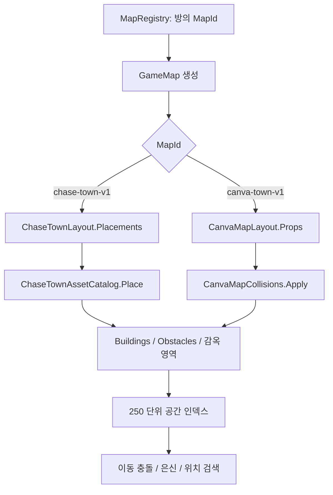
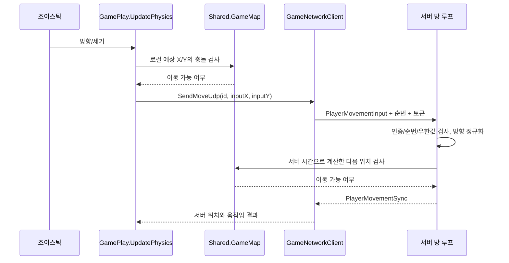

# 02. 공유 모델, 맵 데이터와 충돌 계산

[전체 가이드](../code-guide.md)로 돌아가기 · [실시간 서버](03-server-network.md) · [테스트와 도구](06-tests-and-tools.md)

이 장은 `polrob.Shared`의 C# 소스 전체를 설명한다. Shared는 서버와 클라이언트가 **같은 메시지 형식과 같은 세계 좌표를 사용하게 만드는 프로젝트**다. 단순한 DTO뿐 아니라 실제 이동 가능 여부를 판단하는 맵 물리도 들어 있다. 따라서 이 코드를 바꾸면 서버 판정과 클라이언트의 움직임 예측에 동시에 영향을 준다.

소스 기준은 이 문서를 작성한 작업 디렉터리다. 파일의 오래된 주석보다 현재 생성자와 호출 경로를 우선해 설명한다. 특히 `Map.cs`에는 현재 사용되지 않는 이전 맵 생성 코드가 상당량 남아 있으므로, 파일에 존재하는 기능과 실제 게임에 활성화된 기능을 구분해야 한다.

## 목차

1. [Shared 전체 파일 지도](#1-shared-전체-파일-지도)
2. [방·플레이어·경기 상태 모델](#2-방플레이어경기-상태-모델)
3. [네트워크 DTO와 메시지 종류](#3-네트워크-dto와-메시지-종류)
4. [맵 선택과 데이터 구성](#4-맵-선택과-데이터-구성)
5. [현재 추격 마을의 좌표·에셋·영역](#5-현재-추격-마을의-좌표에셋영역)
6. [기존 마을과 이전 맵 데이터](#6-기존-마을과-이전-맵-데이터)
7. [GameMap 생성 과정과 공간 인덱스](#7-gamemap-생성-과정과-공간-인덱스)
8. [충돌 계산을 수학적으로 읽기](#8-충돌-계산을-수학적으로-읽기)
9. [생성 위치·감옥 위치·은신 판정](#9-생성-위치감옥-위치은신-판정)
10. [실제 이동과 체포 경로에 연결하기](#10-실제-이동과-체포-경로에-연결하기)
11. [맵을 수정할 때 함께 읽을 지점](#11-맵을-수정할-때-함께-읽을-지점)

## 1. Shared 전체 파일 지도

모든 파일의 네임스페이스는 `polrob.Shared`다. `Models` 폴더는 폴더명일 뿐, 별도의 `polrob.Shared.Models` 네임스페이스를 만들지는 않는다.

| 소스 | 들어 있는 형식과 책임 |
|---|---|
| [Game.cs](../../polrob.Shared/Models/Game.cs#L3) | 로비 방 모델 `Game`. 현재 참가자·방장·맵·경기 진행 여부 |
| [Player.cs](../../polrob.Shared/Models/Player.cs#L3) | `PlayerRole`, `Player`. 참가자 식별과 현재 물리 상태 |
| [GamePhase.cs](../../polrob.Shared/Models/GamePhase.cs#L3) | 경기 단계 `Waiting`부터 `Rematching`까지 |
| [GameJoinRequest.cs](../../polrob.Shared/Models/GameJoinRequest.cs#L5) | 인증 세션·방·클라이언트가 로드한 맵을 담은 TCP 입장 요청 |
| [GameStateSync.cs](../../polrob.Shared/Models/GameStateSync.cs#L3) | 경기 단계, 시간, 승자, 전체 도둑·수감 인원 |
| [PlayerMovementInput.cs](../../polrob.Shared/Models/PlayerMovementInput.cs#L6) | 클라이언트→서버 이동 방향·순번·연결별 토큰 |
| [PlayerMovementSync.cs](../../polrob.Shared/Models/PlayerMovementSync.cs#L5) | 서버→클라이언트 이동 결과와 `Player` 변환 함수 |
| [JailBreakSync.cs](../../polrob.Shared/Models/JailBreakSync.cs#L3) | 탈옥 완료 이벤트, 구조자·석방자·석방 좌표 |
| [JailBreakProgressSync.cs](../../polrob.Shared/Models/JailBreakProgressSync.cs#L3) | 구조자별 탈옥 진행률 |
| [OpponentProximitySync.cs](../../polrob.Shared/Models/OpponentProximitySync.cs#L8) | 상대 좌표를 공개하지 않는 근접 진동 단계 |
| [ServerResponse.cs](../../polrob.Shared/Models/ServerResponse.cs#L3) | 방 HTTP/SignalR 응답 공통 형식 |
| [TcpMessageType.cs](../../polrob.Shared/Models/TcpMessageType.cs#L3) | TCP 메시지 종류를 나타내는 1바이트 enum |
| [PlayerGameStats.cs](../../polrob.Shared/Models/PlayerGameStats.cs#L3) | 전체·역할별 전적 응답 형식 |
| [VoiceChat.cs](../../polrob.Shared/Models/VoiceChat.cs#L4) | 음성 토큰 요청과 접속 응답 |
| [MapRegistry.cs](../../polrob.Shared/Models/MapRegistry.cs#L4) | 맵 ID, 기본 맵, 맵 목록과 조회 |
| [ChaseTownLayout.cs](../../polrob.Shared/Models/ChaseTownLayout.cs#L6) | 현재 추격 마을의 지면·오브젝트 배치 |
| [ChaseTownAssetCatalog.cs](../../polrob.Shared/Models/ChaseTownAssetCatalog.cs#L11) | 현재 맵 에셋의 논리 크기·충돌·은신·상호작용 영역 |
| [CanvaMapLayout.cs](../../polrob.Shared/Models/CanvaMapLayout.cs#L6) | 선택 가능한 기존 마을의 도로·횡단보도·이미지 배치 |
| [CanvaMapCollisions.cs](../../polrob.Shared/Models/CanvaMapCollisions.cs#L5) | 기존 마을의 원본 PNG 좌표로 정의한 충돌 프로필 |
| [TownMapLayout.cs](../../polrob.Shared/Models/TownMapLayout.cs#L6) | 이전 TownMapV2 배치와 공용 `MapRoad`, `MapGrove` |
| [LabelMeCollisionData.cs](../../polrob.Shared/Models/LabelMeCollisionData.cs#L11) | 현재 비활성인 과거 주석 다각형 데이터와 2배 좌표 변환 |
| [Map.cs](../../polrob.Shared/Models/Map.cs#L5) | `GameMap`, `MapPropLayout`, `MapBuilding`, `Obstacle`; 맵 구성과 기하 계산 |

Shared에는 로그인 DB, 소켓, 저장 큐, 승리 조건을 처리하는 서버 루프가 없다. 예를 들어 `Player.IsJailed`는 상태를 표현하고, **언제 `true`로 바꿀지는 서버가 결정**한다. `GameMap`은 특정 위치가 장애물에 닿는지 알려 주고, 그 결과를 가지고 이번 틱에서 실제로 이동시킬지는 호출자가 결정한다.

## 2. 방·플레이어·경기 상태 모델

### 2.1 `Game`: 한 번의 결과가 아니라 재사용 가능한 방

[Game](../../polrob.Shared/Models/Game.cs#L3)의 `Id`는 기본적으로 GUID 문자열이며 방을 식별한다. `RoomCode`는 사람이 입력하는 입장 코드다. `Type`의 기본값은 `custom`이고 서버는 `random` 방도 만든다. `IsPrivate`, `HostUserId`, `Players`는 로비에서 보여 줄 방 속성이다.

`MapId`는 `init` 속성이다. 객체 생성 시 지정하고 그 방의 생애 동안 같은 맵을 사용하도록 설계되어 있다. 기본값은 `MapRegistry.DefaultId`다. `IsOnGame`은 로비 서비스 관점에서 게임 진행 중인지를 나타내는 bool이고, 세밀한 카운트다운이나 체포 상태는 담지 않는다. `EmptyRoomExpiresAtUtc`는 빈 로비 방의 만료를 관리하는 값이다.

`VoiceSessionId`는 같은 방에서 재경기를 시작해도 이전 음성방과 분리하기 위한 경기별 구분자다. `[JsonIgnore]`가 있으므로 Game을 JSON으로 직렬화할 때 외부에 나오지 않는다. 사용자에게 전달되는 음성 채널 정보는 별도 응답 `VoiceConnectionInfo`를 사용한다.

이 구분은 기록 코드를 읽을 때 중요하다. 커스텀 방은 재경기에 같은 `Game.Id`를 사용할 수 있다. 영구 기록은 경기마다 다른 기록 ID를 사용해야 하며, **방 ID 하나를 곧 경기 기록 하나라고 생각하면 안 된다.** 이 책임은 서버의 `CompletedGameRecord`와 `GameSession` 쪽에서 처리한다.

### 2.2 `Player`: 입력·렌더링·판정이 함께 참조하는 현재 상태

[Player](../../polrob.Shared/Models/Player.cs#L9)는 다음 정보를 갖는다.

| 필드 | 의미 | 읽을 때 주의할 점 |
|---|---|---|
| `Id` | 사용자 식별자 | UDP의 Id만 믿고 이동을 허용하지 않음 |
| `RoomId` | 소속 방 | 방 인증을 서버에서 다시 확인 |
| `Name` | 표시 이름 | 게임 입장 요청자가 임의로 보낸 이름으로 결정하지 않음 |
| `X`, `Y` | 월드 좌표의 중심 | 화면 좌표나 이미지의 왼쪽 위 좌표가 아님 |
| `Speed` | 기존 게임 단위의 속도 | 서버 이동은 `Speed × 60 × 초`로 환산 |
| `Radius` | 원형 플레이어 충돌 반지름 | DTO 기본값은 50이지만 실제 서버 생성 코드가 설정한 값이 적용됨 |
| `Angle` | 스프라이트 회전각 | 이동 방향 각도에서 90도를 뺀 값 |
| `IsMoving` | 움직임 표현 상태 | 방향 입력이 있다고 항상 실제 좌표가 바뀌는 것은 아님 |
| `IsJailed` | 수감 상태 | 단순히 감옥 그림 안에 들어갔다는 의미가 아님 |
| `Role` | 경찰 또는 도둑 | `Police=0`, `Robber=1` |

현재 서버 상수나 클라이언트 예측 속도는 각 실행 모듈 설명을 함께 봐야 한다. Shared의 기본 생성값을 경기 규칙으로 단정하면 안 된다. 같은 모델이 로비 참가자 정보와 실시간 플레이어 상태에 함께 사용되기 때문에, 로비에서 받은 객체에는 아직 실제 게임용 좌표·속도가 채워지지 않았을 수 있다.

### 2.3 `GamePhase`: 단계 enum과 상태 저장의 분리

[GamePhase](../../polrob.Shared/Models/GamePhase.cs#L3)는 `Waiting=0`, `Countdown=1`, `Playing=2`, `Ended=3`, `Rematching=4`다. enum 자체가 단계 전환을 실행하지는 않는다. 서버의 방 루프가 해당 값을 바꾸고 `GameStateSync`로 알린다.

일반적인 정상 경로는 `Waiting → Countdown → Playing → Ended`다. `Rematching`은 서버가 재매칭 전환을 알리는 상태다. 모든 경기가 이 다섯 단계를 순서대로 거친다는 뜻은 아니다. 연결 중단이나 종료 처리에서는 방이 제거될 수도 있다.

### 2.4 전적 응답

[PlayerGameStats](../../polrob.Shared/Models/PlayerGameStats.cs#L3)는 `Overall`, `Police`, `Robber` 세 `GameStatsBreakdown`을 갖는다. 각 breakdown은 `TotalGames`, `Wins`, `Losses`, `WinRate`로 구성된다. 모두 `init`이므로 응답 생성 시 값을 채운다. `WinRate`는 서버 계산 기준 **0~100 단위의 백분율**이다. 5전 3승이면 `60`이며 `0.6`이 아니다.

이 파일은 합산 로직을 포함하지 않는다. 실제 합산은 [GameRecordStatsCalculator](../../polrob.Server/Services/GameRecordStatsCalculator.cs#L1)가 담당하고, DB 조회 결과를 이 응답 형태로 만드는 역할은 기록 DB 서비스에 있다.

## 3. 네트워크 DTO와 메시지 종류

### 3.1 TCP 입장과 방 응답

[GameJoinRequest](../../polrob.Shared/Models/GameJoinRequest.cs#L5)에는 `SessionToken`, `RoomId`, `MapId`만 있다. 사용자 ID, 이름, 역할은 없다. 서버가 토큰으로 사용자를 확인한 뒤 이미 승인된 로비 참가자 정보로 플레이어를 구성하기 때문이다. 여기서 `MapId`는 클라이언트가 방의 맵을 바꾸라고 지시하는 값이 아니다. **클라이언트가 로드한 맵과 방의 권위 있는 맵이 같은지 검사하는 값**이다. 기본값도 빈 문자열이라 맵 정보를 보내지 않는 오래된 클라이언트가 자동으로 기본 맵에 들어가도록 하지 않는다.

[ServerResponse](../../polrob.Shared/Models/ServerResponse.cs#L3)는 방 생성·입장·매칭·상태 변경에서 공유하는 응답이다. `Success`, `Message`로 결과를 표현하고, `RoomId`, `RoomCode`, `MapId`, `HostUserId`, `Role`, 현재/최대 인원, `CreatedRoom`, `Matched`, `IsPrivate`, `Players`를 담는다. 모든 응답에서 모든 필드가 의미 있는 것은 아니다. 예를 들어 방 생성 응답의 `CreatedRoom`과 이미 있던 방의 상태 응답을 읽는 맥락이 다르다. 호출자는 먼저 성공 여부를 확인해야 한다.

### 3.2 이동 입력과 이동 결과를 분리한 이유

[PlayerMovementInput](../../polrob.Shared/Models/PlayerMovementInput.cs#L6)은 다음처럼 짧은 JSON 키를 사용한다.

```json
{"i":"user-id","x":1,"y":0,"s":42,"t":"movement-session-token"}
```

`x`, `y`는 목적지 좌표가 아니라 이동 방향/세기다. `s`는 증가하는 `ulong` 입력 순번이며 지연 도착하거나 재전송된 입력을 걸러 내는 데 쓰인다. `t`는 로그인 토큰과 별도로 해당 게임 TCP 연결에서 발급받은 이동 세션 토큰이다. 재접속하면 연결과 이동 토큰을 교체하므로 이전 UDP 입력이 새 연결에 영향을 주지 못한다. Shared DTO는 이 검증을 수행하지 않고 데이터를 담기만 한다.

[PlayerMovementSync](../../polrob.Shared/Models/PlayerMovementSync.cs#L5)는 결과다.

```json
{"i":"user-id","x":1300,"y":1910,"a":-90,"m":true}
```

여기의 `x`, `y`는 실제 위치다. `a`는 각도, `m`은 이동 여부다. `FromPlayer`는 서버 플레이어에서 이 다섯 필드만 복사한다. `ApplyTo`는 대상 Player의 좌표·각도·이동 여부만 갱신하며 ID, 이름, 역할, 수감 여부, 속도는 바꾸지 않는다. 수감이나 역할 같은 전체 상태 변경은 별도 `PlayerState` 메시지로 받는다.

두 메시지의 같은 JSON 키가 서로 다른 의미를 가진다는 점이 핵심이다. UDP 입력을 그대로 다른 클라이언트에 보내면 안 된다. 서버가 입력을 검사하고 충돌까지 계산한 뒤 결과 메시지를 만들어야 한다.

### 3.3 경기와 탈옥 동기화

[GameStateSync](../../polrob.Shared/Models/GameStateSync.cs#L3)는 방·맵·방장, 단계, 카운트다운, 남은 게임 시간, 승리 역할, 경과 시간을 전달한다. `WinnerRole`은 nullable이다. 승자가 정해지지 않은 상태를 경찰의 enum 기본값과 구분하기 위해서다.

`TotalRobbers`, `JailedRobbers`는 서버 전체 상태에서 센 숫자다. 클라이언트가 가진 플레이어 목록은 가시성 정책에 따라 일부만 포함할 수 있으므로 `Players.Count(...)`로 전체 도둑 수를 추론하면 틀릴 수 있다. 화면의 남은 도둑 수 등에는 이 권위 있는 집계가 필요하다.

[JailBreakProgressSync](../../polrob.Shared/Models/JailBreakProgressSync.cs#L3)는 방 ID와 `Dictionary<string,float> ProgressByRescuer`다. 키는 구조자의 사용자 ID다. 같은 감옥에 여러 도둑이 있어도 진행률은 구조자별로 관리된다. 진행률을 계산하거나 영역을 떠났을 때 초기화하는 규칙은 서버가 맡는다.

[JailBreakSync](../../polrob.Shared/Models/JailBreakSync.cs#L3)는 탈옥이 실제 완료됐다는 이벤트다. `RescuerId`와 `RobberId`를 따로 보내므로 누가 누구를 풀어 주었는지 구분할 수 있다. `X`, `Y`는 구조자 위치가 아니라 석방된 도둑이 이동할 좌표다.

### 3.4 위치를 숨긴 근접 알림

[OpponentProximitySync](../../polrob.Shared/Models/OpponentProximitySync.cs#L8)의 네트워크 필드는 `p` 하나다. `FromSurfaceDistance`는 상대와의 표면 간 거리에서 100ms 간격의 정수 단계를 만든다.

| 표면 간 거리 | 반환값 |
|---|---:|
| NaN/무한대 또는 500 초과 | 0 |
| 음수, 0, 0~100 | 100 |
| 100 초과~200 | 200 |
| 200 초과~300 | 300 |
| 300 초과~400 | 400 |
| 400 초과~500 | 500 |

구현은 `Ceiling(max(0,distance)/100)*100`을 100~500으로 clamp한다. 클래스의 `StepMilliseconds`라는 이름이 거리 계산의 나눗셈에도 쓰인다는 점은 수식을 읽을 때 참고할 부분이다. 입력 거리와 반환값은 서로 다른 개념이다.

`NormalizePulseMilliseconds`는 100, 200, 300, 400, 500만 허용하고 나머지는 0으로 바꾼다. 이 방식은 상대의 정확한 좌표나 방향을 보내지 않으면서 가까워졌다는 감각을 제공한다. 상대를 실제로 렌더링할 수 있는지와 근접 알림을 받을 수 있는지는 별도 정책이다.

### 3.5 TCP 메시지 전체 목록

[TcpMessageType](../../polrob.Shared/Models/TcpMessageType.cs#L3)는 `byte`를 기반으로 한다. 숫자를 변경하면 서버와 클라이언트의 프로토콜 호환성에 직접 영향을 준다.

| 번호 | 이름 | 일반적인 payload/용도 |
|---:|---|---|
| 1 | `Join` | `GameJoinRequest` JSON |
| 2 | `Joined` | 가시 목록에 추가할 `Player` JSON |
| 3 | `Left` | 목록에서 제거할 플레이어 ID 문자열 |
| 4 | `InitialState` | 최초에 수신할 플레이어 목록 JSON |
| 5 | `Arrested` | 경찰 ID와 도둑 ID를 쉼표로 연결한 문자열 |
| 6 | `GameState` | `GameStateSync` JSON |
| 7 | `JailBreak` | `JailBreakSync` JSON |
| 8 | `PlayerState` | `Player` 전체 상태 JSON |
| 9 | `JailBreakProgress` | `JailBreakProgressSync` JSON |
| 10 | `MovementSession` | 연결별 UDP 이동 토큰 문자열 |
| 11 | `OpponentProximity` | `OpponentProximitySync` JSON |
| 12 | `Heartbeat` | 연결 생존 확인용 payload |
| 13 | `HeartbeatAcknowledged` | 서버가 확인한 heartbeat payload |

TCP 프레임은 메시지 번호 외에도 길이 필드와 문자열 인코딩 규칙이 있다. Shared enum만 보면 payload가 모두 JSON일 것처럼 생각하기 쉽지만, 표처럼 단순 문자열인 메시지도 있다. 프레임 파서와 크기 제한은 서버 네트워크 장, 실제 봇 구현은 [06장](06-tests-and-tools.md)에 설명한다.

### 3.6 음성 채팅 DTO

[VoiceChat.cs](../../polrob.Shared/Models/VoiceChat.cs#L4)의 `VoiceTokenRequest`는 `RoomId` 하나만 받는 record다. 클라이언트가 역할을 바꿔 타 팀 음성방에 들어가는 것을 막기 위해 요청에 역할을 넣지 않는다. 서버가 방 참가자와 현재 게임 연결을 확인하고 역할을 조회한다.

`VoiceConnectionInfo`는 `ServerUrl`, `ParticipantToken`, `RoomName`, `Role`, `ExpiresAtUtc`를 담는다. 응답에는 LiveKit API secret이 들어 있지 않다. 클라이언트는 이 응답으로 짧게 유효한 참가자 토큰을 사용해 팀 음성 채널에 접속한다.

## 4. 맵 선택과 데이터 구성

### 4.1 맵 이름 세 종류를 구분하기

[MapRegistry](../../polrob.Shared/Models/MapRegistry.cs#L4)에 등록된 맵은 현재 둘이다.

| ID | 코드 상수 | 화면 이름 | 데이터 |
|---|---|---|---|
| `chase-town-v1` | `ChaseTown`, `DefaultId` | 추격 마을 (새 맵) | `ChaseTownLayout.Props`, `ChaseTownV7` 에셋 |
| `canva-town-v1` | `ClassicTown` | 기존 마을 | `CanvaMapLayout.Props`, `MapAssets` 소품과 `TownMap/tiles` |

`MapRegistry.All`은 읽기 전용 목록이고 각 항목은 `MapDefinition(Id, DisplayName, Props, TileAssets)`다. `Contains`는 정확한 ID 일치 여부를 확인한다. `Get`은 없으면 `ArgumentException`을 발생시킨다. 별칭이나 대소문자 무시 비교는 없다.

`TownMapLayout`이라는 이름의 파일이 있다고 해서 세 번째 선택 가능한 맵이 있는 것은 아니다. 해당 TownMapV2 데이터는 현재 Registry에 등록되어 있지 않다. `GameMap(bool useLegacyCanvaMap)`의 `true`는 **지금도 선택 가능한 기존 마을**이고, 파일 안의 더 오래된 LabelMe/canonical 생성 코드와는 다르다.

### 4.2 맵 구성 흐름



정적 배치 데이터는 여러 방이 공통 참조한다. 그러나 `new GameMap(mapId)`는 각 인스턴스에 `MapBuilding`과 `Obstacle` 객체를 새로 만든다. 방별 맵 물리 객체가 같은 인스턴스가 아니기 때문에 한 방의 상태를 다른 방과 혼동하지 않는다. 단, 공개된 배열과 List까지 깊은 불변 컬렉션인 것은 아니므로 임의 수정을 안전한 API로 간주하면 안 된다.

## 5. 현재 추격 마을의 좌표·에셋·영역

### 5.1 세 좌표계를 나누어 읽기

[ChaseTownAssetCatalog](../../polrob.Shared/Models/ChaseTownAssetCatalog.cs#L11)에서 `Width`, `Height`는 이미지 파일의 실제 픽셀 수가 아니라 **설계 기준 논리 픽셀**이다. 모든 로컬 좌표는 왼쪽 위가 원점이며 오른쪽이 +X, 아래쪽이 +Y다.

| 종류 | 크기 예시/배율 | 쓰임 |
|---|---|---|
| 설계 좌표 | 원본 기준 1024×1536, 에셋별 Width/Height | 배치·충돌점 정의 |
| 월드 좌표 | 설계 좌표 × 2.5 → 2560×3840 | 서버 이동·거리·충돌 |
| 텍스처 픽셀 | 소품 논리 크기 × 6, 타일 × 1 | 선명한 화면 렌더링 |

예를 들어 `tree`는 논리 크기 82×86이고 기본 월드 크기는 205×215다. PNG는 492×516이다. PNG를 더 선명하게 만들었다고 나무가 게임 안에서 6배 커지면 안 된다. `TextureScale`은 화질, `DefaultWorldScale`은 물리·배치 크기를 조절한다.

`ChaseTownAsset`에는 `SourceX/SourceY`도 있다. 이는 원본 지도에서 참고 이미지를 잘라낼 때의 위치다. 게임 내 위치는 `ChaseTownPlacement.Center`가 결정하므로 `SourceX/SourceY`를 플레이어 월드 위치처럼 해석하지 않는다. `Pivot`은 논리 이미지의 중심 `(Width/2, Height/2)`다.

### 5.2 `Place`: 에셋의 영역을 월드에 놓기

[Place](../../polrob.Shared/Models/ChaseTownAssetCatalog.cs#L24)는 `id`, 월드 중심, 균일 scale, 회전각, gateOpen을 받는다. scale은 양의 유한수여야 하며 중심과 회전각도 유한수인지 검사한다. 에셋 로컬 점 `p`를 다음 순서로 변환한다.

```text
localX = (p.X - asset.Width / 2) × scale
localY = (p.Y - asset.Height / 2) × scale
worldX = center.X + localX × cos(angle) - localY × sin(angle)
worldY = center.Y + localX × sin(angle) + localY × cos(angle)
```

중심을 원점으로 옮기고 크기를 바꾼 뒤 회전하고 최종 위치로 평행 이동하는 표준 변환이다. 원은 균일 scale만 받으므로 반지름에 scale을 곱하면 된다. 다각형은 모든 꼭짓점을 위 식으로 변환한다. 결과의 최소/최대 X·Y로 AABB(축에 평행한 외접 사각형)를 만든다.

반환형은 `ChaseTownRegion(Name, Kind, Obstacle)` 목록이다. 같은 에셋에 여러 영역이 있을 수 있고, 각 영역마다 이동·시야 차단 정책이 다르다. `gateOpen=true`면 `Kind=="gate"`인 영역을 제외한다. 이 함수가 문을 여는 능력을 제공한다고 해서 실제 경기에서 문이 자동으로 열린다는 뜻은 아니다. 현재 `ChaseTownLayout`은 `jail`을 기본 상태로 배치하며, 탈옥 완료는 서버가 석방 위치를 계산해 플레이어를 이동시킨다.

### 5.3 영역의 종류와 실제 기능

| Kind | 대표 에셋 | 이동 차단 | 시야 차단 | GameMap에서의 처리 |
|---|---|---|---|---|
| `solid` | 건물 body, 벽, 상자, 나무 줄기 | 영역별 true | 건물/벽/상자/줄기는 true | Buildings 또는 Obstacles에 등록 |
| `solid` | 감옥 철창 | true | false | 개별 Obstacles로 등록 |
| `gate` | 잠긴 감옥 문 | true | false | 닫힌 기본 맵의 Obstacles에 등록 |
| `holding` | 감옥 내부 수감 영역 | false | false | `JailHoldingArea`로 보관 |
| `interaction` | 감옥 앞 구조 접촉 영역 | false | false | `JailRescueArea`로 보관 |
| `hiding` | 수풀 | false | false | `IsHidingArea=true`인 Obstacle로 등록 |
| `occlusion` | 나무의 큰 수관 영역 | false | false | 현재 GameMap 장애물 목록에서 제외 |

`IsVisible=false`는 해당 물리 객체를 직접 그리지 않는다는 뜻이다. 건물 이미지가 화면에서 사라진다는 뜻은 아니다. 렌더러가 별도 `Props` 배치를 이용해 이미지를 그린다. `BlocksMovement`, `BlocksVision`, `IsHidingArea`는 서로 독립적이다. 철창은 통과할 수 없지만 너머를 볼 수 있고, 수풀은 들어갈 수 있지만 별도 은신 규칙이 적용된다.

카탈로그에는 건물 7종, 감옥/열린 감옥 2종, 나무·수풀·상자 3종, 벽 4종, 바닥 타일 3종이 있다. 여러 집은 같은 `house` 에셋을 다른 위치에 배치한다. 에셋 종류 수와 맵에 놓인 소품 수는 다르다.

### 5.4 건물 뒤쪽 경계와 모양

경찰서·카페·도넛 가게·버거 가게·집·큰 창고·작은 창고는 `body` 다각형이 이동과 시야를 모두 막는다. 다각형은 건물 앞 돌출부까지 따라 그려져 있어서 이미지 외접 사각형의 빈 모서리를 장애물로 만들지 않는다.

[ClipRear](../../polrob.Shared/Models/ChaseTownAssetCatalog.cs#L121)는 건물의 가장 위쪽 Y에 8 논리 픽셀을 더한 수평선을 만든다. 다각형을 그 선 아래쪽 반평면으로 잘라 뒤쪽 충돌 경계를 조금 아래로 내린다. 각 변이 경계를 가로지르면 보간한 교점을 추가하고, 안쪽의 점만 남긴다. 이미지 자체의 위치나 크기는 바뀌지 않는다. 기본 2.5배 배치에서 뒤쪽 여유는 20 월드 단위다.

이 덕분에 캐릭터가 지붕 끝에 약간 가려져 보이면서도 실제 벽에는 들어가지 않는 배치가 가능하다. 좌우와 앞쪽 경계를 통째로 축소하지 않고 뒤쪽만 잘라야 통로 폭과 출입구 모양이 유지된다. 감옥·나무·수풀·상자에는 이 보정을 적용하지 않는다.

### 5.5 감옥을 큰 사각형 하나로 만들지 않은 이유

감옥 카탈로그는 뒤·양옆 철창, 앞 양옆, 잠긴 문을 따로 정의한다. 내부 `holding-area`는 `(25,46)~(112,123)`의 자유 공간이다. `rescue-area`는 `(37,145)~(100,180)`이며 이미지의 높이 150 바깥까지 내려온다.

구조 영역이 이미지 바깥까지 나오는 이유는 플레이어의 반지름이다. 닫힌 문에 플레이어 중심이 겹칠 수는 없으므로 중심이 문에서 떨어져 있어도 구조 조건을 만족하는 영역이 필요하다. 감옥 건물 전체의 `BlocksMovement`는 false이고 철창만 true다. 따라서 감옥 내부의 수감 슬롯이 물리적으로 빈 공간이 될 수 있다.

### 5.6 `ChaseTownLayout`: 지면과 배치

[ChaseTownLayout](../../polrob.Shared/Models/ChaseTownLayout.cs#L6)은 `32열 × 48행 × 타일 80`으로 2560×3840 월드를 만든다. `GroundTile`은 `Grass`, `Paving`, `Road`다. 기본 enum 값이 Grass이므로 새 배열은 풀밭으로 시작하고 `Fill`로 포장 지역, 마지막으로 도로를 덮어 쓴다. 도로를 마지막에 칠하므로 도로 사각형이 서로 붙는 곳에 내부 이음새를 별도 물리 벽으로 만들지 않는다.

지면 타입은 렌더링 데이터다. 현재 `GameMap.IsMovementPositionBlocked`는 지면이 Road인지 Grass인지에 따라 통행을 제한하지 않는다. 풀밭도 건물/장애물/월드 경계에 막히지 않으면 걸을 수 있다.

`CreatePlacements`의 `Add`는 설계 중심 `(x,y)`에 2.5를 곱해 월드 중심을 만든다. 각 소품은 `id-현재목록길이` 형식의 placement ID를 갖는다. 건물에는 `PoliceStation`, `Jail`, `Cafe` 등 BuildingType을 지정한다. 여러 집은 `House-번호`로 구분한다. 따라서 목록 중간에 소품을 추가하면 뒤 항목의 ID나 House 번호가 달라질 수 있다. 이 값은 고정된 사용자 데이터 식별자로 생각하지 않는 편이 맞다.

현재 배치는 89개 소품이며, 중요한 통로를 남겨 두도록 벽을 짧게 분리하고 상자·나무·수풀을 배치했다. `ChaseWaypoints`는 통행 가능성 검사와 미리보기에서 사용하는 기준점이다. 이 배열 자체가 모든 플레이어의 이동 경로를 강제하거나 봇의 길찾기를 실행하지는 않는다.

`Props`는 Placements를 일반 `MapPropLayout`으로 바꾼 배열이다. 에셋 경로·크기·중심·건물 종류와 차단 여부의 요약을 담아 렌더러와 맵 목록에 제공한다. **Chase의 정밀 충돌은 Props의 기본 사각형 필드가 아니라 카탈로그 Regions에서 만든다.**

## 6. 기존 마을과 이전 맵 데이터

### 6.1 `CanvaMapLayout`: 선택 가능한 기존 마을

[CanvaMapLayout](../../polrob.Shared/Models/CanvaMapLayout.cs#L6)은 2560×3840 월드 기준의 도로 SVG path, 횡단보도, 소품 위치를 직접 나열한다. `MapCrosswalk`는 중심과 도로 방향, `MapRoad`는 SVG path와 폭 및 차선 표시 여부를 표현한다. `Sprite`는 `MapAssets/<name>.png`를 배치한 뒤 반드시 `CanvaMapCollisions.Apply`로 충돌 프로필을 붙인다.

기존 맵에서는 이미지의 눈에 보이는 alpha 실루엣을 원하는 Width/Height에 맞춰 렌더링한다. 반면 충돌 프로필은 **원본 PNG 전체 좌표**로 정의되어 있다. 두 기준을 일치시키는 것이 `CanvaMapCollisions`의 핵심이다.

### 6.2 `SourceImageGeometry`와 좌표 반전

[SourceImageGeometry](../../polrob.Shared/Models/CanvaMapCollisions.cs#L102)는 원본 이미지 Width/Height와 alpha가 보이는 crop 경계 `VisibleLeft/Top/Right/Bottom`을 가진다. `ToWorld` 입력은 원본 이미지의 **왼쪽 아래 원점, +Y 위쪽** 좌표다. 월드는 왼쪽 위 원점, +Y 아래쪽이므로 Y를 뒤집어야 한다.

```text
scaleX = 배치 Width / (VisibleRight - VisibleLeft)
scaleY = 배치 Height / (VisibleBottom - VisibleTop)

worldX = 배치 Left + (sourceX - VisibleLeft) × scaleX
worldY = 배치 Top + (원본 Height - sourceY - VisibleTop) × scaleY
```

X/Y scale을 따로 계산하는 이유는 PNG의 원본 비율과 배치 사각형의 비율이 완전히 같지 않을 수 있기 때문이다. 이때 원래 원형인 충돌 영역은 월드에서는 타원이 된다. `Radius`, `RadiusY`를 따로 저장하는 이유도 여기에 있다.

[Apply](../../polrob.Shared/Models/CanvaMapCollisions.cs#L53)는 파일명으로 프로필을 찾아 `MapPropLayout`의 `with` 복사본에 차단 여부, 모양, 크기, 중심 오프셋, 반지름, 다각형을 채운다. 프로필이 없는 새 파일은 사전 조회에서 실패한다. 새 그림만 추가하고 충돌 프로필을 빼먹으면 정상적인 완성 맵이 되지 않는다.

### 6.3 기존 맵의 프로필 종류

| 형태 | 대상 | 의도 |
|---|---|---|
| 원본 하단 기준 사각형 | 경찰서·도넛·카페·주택·버거·감옥·창고·단일 상자 | 이미지 바닥 부분에 맞춘 실제 몸체 높이 |
| 원/타원 | 나무·가로등·바위·수풀 | 나무 꼭대기 전체가 아니라 밑동 등 지정 중심·반지름 |
| 다각형 | 상자 묶음 `boxes` | 외접 사각형의 비어 있는 홈을 통행 가능하게 유지 |
| 다각형 | 연못 `pond` | 물과 돌 테두리를 막고 이미지 사각형 모서리는 열어 둠 |

기존 맵의 `AddMapPropColliders`는 건물과 일반 장애물 모두 `BlocksVision=false`로 생성한다. 수풀도 `CanvaMapCollisions.Apply`에서 이동을 막도록 처리되며, `MapAssets/bush.png`는 `IsBushObstacle`의 오래된 정확한 이름 `"bush.png"`과 다르다. 따라서 **현재 Chase의 통행 가능한 hiding 수풀 정책을 기존 Canva에 그대로 대입하면 안 된다.** 두 맵이 공유하는 것은 물리 계산 함수이지 모든 게임 플레이 정책이 아니다.

### 6.4 `TownMapLayout`: 등록되지 않은 TownMapV2 데이터

[TownMapLayout](../../polrob.Shared/Models/TownMapLayout.cs#L6)에는 비대칭 곡선 도로, 상점·은행·창고 배치, 나무 군락 `MapGrove`가 있다. `CreateProps`가 고정 소품을 추가한 뒤 각 grove의 seed로 `Random`을 생성해 나무를 뿌린다.

군락 후보는 무작위 각도와 `sqrt(random)` 반지름으로 타원 안에 분포한다. 제곱근을 쓰면 중심에 지나치게 몰리는 것을 줄일 수 있다. 특정 출구 좌표는 제외하고, 기존 후보와 85 이상 떨어진 점만 받아들이며, 최대 500번 시도한다. 나무 네 개마다 근처 수풀도 추가한다. seed를 고정해 동일 런타임에서 배치가 반복 가능하도록 했다.

`Building`, `Tree`, `Bush`, `Crates`, `Lamp`, `Rocks` helper는 이미지 비율과 충돌 반지름/오프셋을 만들어 준다. 현재 Registry와 GameMap 생성자는 이 Props를 사용하지 않는다. 다만 파일 끝의 `MapRoad` 형식은 현재 선택 가능한 Canva 레이아웃에서도 쓰이므로 파일 전체를 죽은 코드라고 단정하면 안 된다.

### 6.5 `LabelMeCollisionData`와 `Map.cs`의 과거 생성 함수

[LabelMeCollisionData](../../polrob.Shared/Models/LabelMeCollisionData.cs#L11)는 LabelMe에서 만든 다각형을 사전에 직접 기록한다. 건물·벤치·상자·차량·작은 장애물 등의 label이 있고 `obastacle1` 같은 철자도 데이터 키 그대로 사용한다. `GetWorldPolygon`은 모르는 label에 `ArgumentOutOfRangeException`을 던지고 각 점에 2를 곱한 새 배열을 반환한다. 1280×1920 미리보기 주석을 2560×3840 좌표로 바꾸려던 데이터다. 실행 중 JSON을 읽는 로더는 아니다.

`Map.cs`에는 이외에도 다음 이전 생성 계열이 남아 있다.

| 계열 | 함수들 | 내용과 현재 상태 |
|---|---|---|
| 이전 해안/육지 외곽 | `ScaleLegacyBoundary`, `IsCircleInsidePlayableBoundary`, `IsPointInsidePlayableBoundary` | 큰 외곽 점 배열을 0.5배하고 원이 육지 안에 있는지 판정. 현재 이동 판정은 이 외곽을 사용하지 않음 |
| LabelMe 맵 | `AddLabelMeCentralColliders`, `AddLabelMeBuilding`, `AddLabelMeObstacle` | 저장된 다각형으로 보이지 않는 물리 객체 구성. 현재 생성자에서 호출하지 않음 |
| canonical 이미지 맵 | `AddCanonicalBuildingColliders`, `AddCanonicalObstacleColliders`, `CreateMapReference`, `AddBuilding`, `AddOuterLandmarkColliders` | 이전 원본 기준 배치를 `2560/5000` 배율로 변환. 현재 비활성 |
| 세부 canonical 소품 | `AddTrafficCone`, `AddStreetLamp`, `AddMailbox`, `AddJunkyardObstacles`, `AddWoodenBox` | 이전 큰 배경 그림 속 소품에 대응하는 충돌 발판 |
| 초창기 격자 맵 | `AddWalls`, `AddStructures`, `AddBushes`, `AddTrees`, `AddPonds`, `AddWallRow`, `AddWallColumn`, `AddRectObstacle`, `AddCircleObstacle` | layout 단위에 5배를 곱하던 예전 배치 |
| 공통 과거 builder | `AddRectObstacleWorld`, `AddCircleObstacleWorld` | canonical 배율을 다시 적용해 객체를 만드는 helper. 현재 활성 레이아웃 생성에 쓰이지 않음 |

이 함수들을 전부 따라가며 현재 맵의 장애물 수를 계산하면 틀린다. 시작점은 항상 [현재 GameMap 생성자](../../polrob.Shared/Models/Map.cs#L191)다.

## 7. GameMap 생성 과정과 공간 인덱스

### 7.1 맵 인스턴스의 구성 요소

[GameMap](../../polrob.Shared/Models/Map.cs#L175)의 월드 기본 크기는 2560×3840이다. `Definition`은 선택한 맵 정의이고 `MapId`, `PropLayouts`는 그 정의에서 가져온다. `Buildings`, `Obstacles`는 실제 충돌 객체 목록이다. 경찰서와 감옥은 추가로 `PoliceStation`, `Jail` 속성으로 보관한다.

생성자는 Registry 조회 후 기존 맵이면 `AddMapPropColliders`, 현재 맵이면 `AddChaseTownColliders`를 호출한다. 경찰서와 감옥이 없으면 예외를 던진다. 마지막으로 `BuildSpatialIndex`를 호출한다.

### 7.2 `AddChaseTownColliders`

[이 함수](../../polrob.Shared/Models/Map.cs#L204)는 모든 placement의 Asset과 Regions를 읽는다. BuildingType이 있으면 이미지의 월드 사각형을 `MapBuilding.LeftTop/RightBottom`으로 채우고 `body` 영역의 다각형과 차단 속성을 건물에 붙인다. 경찰서·감옥 참조도 이때 설정한다.

그다음 각 영역을 순회한다. 건물 body는 이미 Buildings에 들어 있으므로 Obstacles에 중복 추가하지 않는다. `holding`, `interaction`은 별도 속성으로 저장하고, `occlusion`은 건너뛴다. 나머지는 장애물에 넣되 `hiding`이면 은신 플래그를 켠다.

감옥에는 body 영역이 없으므로 건물 자체는 이동·시야를 차단하지 않는다. 철창과 문이 별도 장애물로 들어온다. 나무는 큰 그림 사각형이 아니라 작은 줄기 Circle 하나만 실제 장애물이다.

### 7.3 `AddMapPropColliders`

[기존 맵 생성](../../polrob.Shared/Models/Map.cs#L242)은 `CollisionWidth/Height`가 양수이면 그 값을 쓰고 아니면 이미지 Width/Height를 사용한다. 중심에 collision offset을 더해 충돌 사각형을 만든다.

건물은 그림 크기와 충돌 크기를 따로 보존한다. 일반 소품은 `BlocksMovement=false`면 목록에 넣지 않는다. 남은 소품은 Rect, Circle, Polygon에 맞는 필드를 채운다. 렌더 오프셋을 충돌 오프셋의 음수로 두어 물리 중심이 이미지 중심에서 이동했어도 그림 배치를 복구할 수 있게 한다. `IsTriangular`이면 상단 중앙과 하단 양끝을 잇는 삼각 다각형을 만든다.

### 7.4 공간 인덱스로 근처 장애물만 검사

[BuildSpatialIndex](../../polrob.Shared/Models/Map.cs#L1465)는 월드를 250 단위 정사각형 셀로 나눈다. 각 장애물의 bounds가 걸치는 모든 셀에 그 장애물을 등록한다. 예를 들어 폭이 400인 건물 아닌 소품은 두 개 이상의 셀에 들어갈 수 있다. 건물은 이 인덱스에 넣지 않고 Buildings 목록에서 직접 검사한다.

[GetNearbyObstacles](../../polrob.Shared/Models/Map.cs#L451)는 플레이어 중심 주변 `x±radius`, `y±radius` 범위의 셀만 방문한다. 결과 List를 매번 `Clear`한 뒤 채우므로 호출자는 재사용 가능한 List를 전달한다. 하나의 장애물이 여러 셀에서 발견되면 `Contains`로 중복을 제거한다. 공유된 임시 HashSet을 쓰지 않으므로 별도 호출끼리 같은 임시 상태를 덮어쓰지 않는다.

이 인덱스는 정확한 충돌 판정이 아니다. **검사할 후보를 줄이는 첫 단계**다. 후보의 외접 사각형에 닿는다고 즉시 충돌로 결정하지 않고, 각 원·사각형·다각형의 정확한 계산을 다시 한다.

인덱스는 생성 시 한 번 만든다. 공개 `Obstacles` List에 게임 도중 새 항목을 추가하거나 기존 위치를 바꾸더라도 인덱스가 자동 갱신되지 않는다. 현재 정적 맵 사용을 전제로 읽어야 한다.

### 7.5 데이터 형식 세 가지

[MapPropLayout](../../polrob.Shared/Models/Map.cs#L1652)은 `readonly record struct`다. 에셋 경로, 이미지 중심/크기, 삼각형 여부, 충돌 모양/크기/오프셋/반지름/다각형, BuildingType과 차단 여부를 담는다. 렌더링과 물리가 배치를 공유하도록 만든 형식이다.

[MapBuilding](../../polrob.Shared/Models/Map.cs#L1670)은 회전 가능한 건물이다. 이미지 Width/Height는 두 모서리에서 계산하고, EffectiveCollisionWidth/Height는 명시된 값이 양수가 아니면 이미지 크기를 사용한다. `CollisionPolygon`이 있으면 그것이 우선한다. `CollisionCenter`는 다각형이면 꼭짓점들의 산술평균이고, 사각형이면 회전시킨 충돌 오프셋을 이미지 중심에 더한다. 다각형의 산술평균은 면적 중심과 항상 같지는 않다.

[Obstacle](../../polrob.Shared/Models/Map.cs#L1717)은 문자열 Type으로 Rect/Circle/Polygon을 구분한다. Circle의 중심은 이름이 다소 특이한 `CenterX` **PointF 속성**에 저장한다. `CenterY` 속성도 있으나 현재 주요 원형 계산은 `CenterX`를 사용한다. 원의 `Center`는 이 점을 반환하고, 다른 형태는 LeftTop/RightBottom의 중점을 반환한다. `EffectiveRadiusY`는 RadiusY가 0보다 크면 그 값을, 아니면 Radius를 사용한다. `RenderCenter`는 물리 중심에 렌더 오프셋을 더한 값이다.

## 8. 충돌 계산을 수학적으로 읽기

### 8.1 공개 진입점

[IsMovementPositionBlocked](../../polrob.Shared/Models/Map.cs#L480)의 순서는 단순하다.

1. 플레이어 원이 월드 사각형을 벗어나면 true.
2. 모든 `BlocksMovement` 건물과 원 충돌 검사. 하나라도 겹치면 true.
3. 공간 인덱스에서 주변 장애물을 가져온다.
4. `BlocksMovement` 장애물과 정확한 원 충돌 검사. 하나라도 겹치면 true.
5. 모두 통과하면 false.

플레이어끼리의 충돌은 이 함수에 없다. 다른 플레이어 목록도 받지 않는다. 따라서 이 함수가 반환하는 자유 공간은 지도상 장애물이 없다는 의미다. 같은 자리에 다른 사용자가 있는지까지 보장하지 않는다.

입력값의 유한성 검증은 이 메서드 전반에 들어 있지 않다. 네트워크에서 받은 X/Y를 검사하는 책임은 서버 입력 처리에 있다. 재사용할 때도 유효한 좌표와 반지름을 넘긴다는 전제가 중요하다.

### 8.2 원과 사각형

사각형에서 플레이어 중심에 가장 가까운 점을 찾는다.

```text
closestX = clamp(playerX, left, right)
closestY = clamp(playerY, top, bottom)
dx = playerX - closestX
dy = playerY - closestY
collision = dx² + dy² < playerRadius²
```

중심이 사각형 안에 있으면 가장 가까운 점이 자기 자신이므로 거리 0이다. 모서리 바깥이라면 모서리까지의 원형 거리를 비교하므로, 외접 사각형을 반지름만큼 키운 것보다 정확하다. 모서리 대각선에 보이지 않는 네모 벽이 생기지 않는다.

예를 들어 사각형 우측 아래 모서리가 `(100,100)`이고 플레이어 반지름이 10이면 `(108,108)`은 모서리까지 거리가 약 11.31이라 충돌하지 않는다. 단순 확장 사각형으로만 검사하면 이 위치를 잘못 막을 수 있다.

### 8.3 원과 원

[IsCircleCollidingWithObstacle](../../polrob.Shared/Models/Map.cs#L581)의 Circle 경로에서 X/Y 반지름이 같으면 두 중심 거리 제곱을 반지름 합의 제곱과 비교한다.

```text
collision = (px-cx)² + (py-cy)² < (playerRadius + obstacleRadius)²
```

제곱근을 구하지 않는 이유는 대소 비교 결과가 동일하면서 계산량을 줄일 수 있기 때문이다. 플레이어 반지름 25, 장애물 반지름 70이면 중심 거리가 95보다 작을 때 충돌한다.

### 8.4 원과 타원

기존 PNG를 X/Y 비율이 조금 다르게 확대하면 원이 타원이 된다. [GetDistanceSquaredToEllipse](../../polrob.Shared/Models/Map.cs#L612)는 이 경우를 실제 타원 경계로 계산한다.

먼저 타원 내부식 `px²/a² + py²/b² <= 1`이면 거리 0을 반환한다. 외부 점이면 라그랑주 승수 λ를 이용한 가장 가까운 경계점을 찾는다. λ가 커질수록 식이 단조롭게 변하므로 40번 이분 탐색하고, 최종 경계점과 원 중심 간 거리 제곱을 구한다. 반지름이 0 이하인 잘못된 타원은 양의 무한대를 반환한다.

결과적으로 얇고 넓은 타원도 원래 윤곽대로 피해 갈 수 있다. 타원의 AABB만으로 막거나 X 반지름을 Y에도 적용하는 근사와 달리 세로 여유를 보존한다.

### 8.5 점·원과 다각형

[IsPointInPolygon](../../polrob.Shared/Models/Map.cs#L1158)은 두 검사를 결합한다. 점이 어떤 변 위에 아주 가깝게 있으면 내부로 처리한다. 기준은 선분 거리 제곱 `<=0.0001`이다. 나머지는 수평 반직선이 다각형 변을 지나는 횟수의 홀짝을 이용한다. 한 번 지나면 바깥→안, 한 번 더 지나면 안→밖으로 토글한다. 점이 3개 미만이면 다각형이 아니므로 false다.

[GetDistanceSquaredToPolygon](../../polrob.Shared/Models/Map.cs#L1193)은 내부이면 0, 외부이면 모든 변까지 거리 제곱의 최솟값을 반환한다. 이 거리가 플레이어 반지름 제곱 이하이면 원이 다각형과 닿는다. 오목한 다각형도 외접 사각형으로 뭉개지지 않아 벽 모서리의 홈과 상자 묶음의 빈 공간을 보존한다.

[GetDistanceSquaredToSegment](../../polrob.Shared/Models/Map.cs#L558)는 점을 변의 직선에 투영한 비율 `t`를 0~1로 clamp한다. 0이면 시작점, 1이면 끝점, 그 사이는 선분 위 수직 발이다. 길이가 거의 0인 선분은 그냥 시작점까지 거리로 처리한다.

미세한 경계 차이도 있다. 일반 Polygon obstacle은 `<= radius²`이고 Rect/Circle 및 `IsCircleCollidingWithBuilding`은 `< radius²`다. 정확히 접하는 수학적 경계의 판정이 모두 같은 것은 아니다. 대부분의 플레이에서는 작은 차이지만 정밀한 테스트를 만들 때는 실제 연산자를 확인해야 한다.

### 8.6 회전한 건물

건물에 CollisionPolygon이 있으면 바로 다각형 계산을 사용한다. 없으면 [ToBuildingLocalPoint](../../polrob.Shared/Models/Map.cs#L1218)가 월드 점에서 건물 중심을 뺀 뒤 건물 회전의 반대 각도로 회전한다. 이렇게 하면 회전된 건물이 로컬에서는 수평·수직 사각형이 된다. `ToBuildingCollisionLocalPoint`는 여기서 충돌 오프셋까지 빼 준다.

`GetDistanceSquaredToBuilding`은 이 로컬 점과 `±EffectiveCollisionWidth/2`, `±EffectiveCollisionHeight/2` 사각형 사이 거리를 계산한다. `IsPointInBuilding`은 로컬 좌표가 그 범위 안에 있는지 확인한다.

`GetBuildingCorners`는 이미지 네 모서리를 월드로 회전시킨다. `GetBuildingCollisionCorners`는 충돌 다각형이 있으면 복제본을 반환하고 아니면 오프셋을 반영한 충돌 사각형 네 모서리를 회전시킨다. `GetBuildingBounds`와 `GetBuildingCollisionBounds`는 각각 이 점들의 최소/최대 X/Y를 구한다. 렌더링 경계와 충돌 경계의 용도를 섞으면 지붕에 막히거나 그림을 잘라 그리는 문제가 생긴다.

## 9. 생성 위치·감옥 위치·은신 판정

### 9.1 안정적인 역할별 spawn

[GetSpawnPosition](../../polrob.Shared/Models/Map.cs#L323)은 `(role, slot, radius)`에서 항상 같은 충돌 없는 후보를 찾는다. 역할 enum, 음수 slot, 유한하지 않거나 너무 큰 반지름을 먼저 거부한다.

경찰의 기준점은 경찰서 충돌 중심 X와 충돌 경계 아래쪽 `Bottom + max(100,radius+20)`이다. 도둑의 기준점은 월드 중심이다. 후보 간 간격은 `max(150, 2×radius+20)`이다. 먼저 중앙을 보고, 막혀 있으면 사각형 고리 모양으로 바깥을 탐색한다.

`EnumerateSpawnRing`은 같은 거리에서 좌우를 먼저 보고, 양옆의 위아래, 마지막으로 고리의 위·아래 변을 본다. 후보가 실제로 걸을 수 있는지 검사하고, 자유 후보만 세어서 지정한 slot번째를 반환한다. slot 번호는 어떤 임의 좌표의 직접 인덱스가 아니라 **통과한 후보 순서의 인덱스**다. 끝까지 빈 곳이 없으면 예외가 난다.

같은 역할의 각 slot이 구분되고 안정적이지만, 다른 역할과의 동적 플레이어 충돌을 이 함수가 검사하는 것은 아니다. 현재 역할별 기준점이 멀리 떨어져 있고 지도 정적 장애물 검사에 사용된다.

### 9.2 수감자는 감옥 artwork 내부의 슬롯에 배치

[GetJailHoldingPosition](../../polrob.Shared/Models/Map.cs#L359)은 slot과 총 수감 인원, 반지름을 받는다. 현재 맵에는 명시적인 holding area가 있으므로 그 bounds 안에서 격자로 배치한다.

```text
step = 2×radius + 10
columns = floor((영역 너비 - 2×radius) / step) + 1
rows = ceil(playerCount / columns)
```

필요한 행이 높이에 들어가지 않으면 예외가 난다. 각 행의 실제 인원 수에 맞춰 가로 가운데 정렬하고, 전체 행도 세로 가운데 정렬한다. 예를 들어 마지막 행에 한 명만 남아도 왼쪽에 붙지 않고 중앙에 놓인다.

기존 맵에는 holding area가 없다. 이 경우 감옥 이미지 너비의 좌우 20%를 제외한 가운데 60% 안에 한 줄로 배치한다. 필요한 너비가 넘치면 예외를 던진다. 이 위치는 감옥의 외부 충돌 영역을 자유롭게 걷는 일반 spawn과 다른 용도다. 서버가 수감자 이동 자체를 막아 두고 감옥 내부에 표시하기 위한 좌표다.

### 9.3 수풀과 은신

[FindBushContainingPoint](../../polrob.Shared/Models/Map.cs#L632)는 생성 시 수집한 `_bushes`를 순회해 플레이어 **중심점**을 포함하는 첫 영역을 반환한다. 몸의 일부만 수풀에 걸쳤는지까지 검사하지 않는다. `ContainsPoint`는 Polygon 내부, Rect 범위, Circle/ellipse 내부식을 각각 사용한다.

`IsBushObstacle`는 `IsHidingArea`이거나 예전 정확한 파일명 `bush.png`인지를 본다. 현재 카탈로그 수풀은 IsHidingArea를 명시하므로 경로명이 달라도 은신 대상으로 동작한다.

서버는 도둑 중심이 수풀 안에 있고 경찰 중심이 **그 동일한 수풀**에 없으면 체포 후보에서 제외한다. 수풀은 일반 벽처럼 모든 시선을 차단하는 영역이 아니라, 누가 그 안에 있는지를 기반으로 별도 판정하는 공간이다.

## 10. 실제 이동과 체포 경로에 연결하기

### 10.1 조이스틱 입력이 서버 좌표가 되기까지

현재 코드의 이동 함수 이름은 `MovePlayer`가 아니라 클라이언트의 [UpdatePhysics](../../polrob.Client/GamePlay.xaml.cs#L952), 서버의 [SimulateAuthoritativeMovement](../../polrob.Server/Network/GameNetworkServer.cs#L495)다.



클라이언트는 조이스틱의 손잡이와 중심 차이로 방향을 계산하고 우선 자기 캐릭터를 움직여 즉각 반응을 보여 준다. 이 과정에서도 Shared 맵을 쓰므로 기본적인 벽 위치는 서버와 같다. 서버에는 좌표 대신 방향을 보낸다.

서버는 마지막으로 승인한 입력을 저장하고 자신의 틱 시간으로 이동량을 계산한다. 한 번의 `deltaSeconds`는 0~0.1초로 제한하고, 입력이 만료됐거나 Playing이 아니거나 체포/수감으로 잠겼으면 입력을 0으로 만든다. 방향 벡터 길이가 1보다 크면 정규화해 대각선이나 과도한 입력으로 속도를 올릴 수 없게 한다.

### 10.2 벽을 따라 미끄러지는 이유

서버와 클라이언트는 대각선 목표 `(nextX,nextY)`를 한 번에 검사하지 않고 축을 나누어 검사한다.

```text
1. (nextX, 현재Y)가 자유로우면 X 갱신
2. (갱신된X, nextY)가 자유로우면 Y 갱신
```

오른쪽 벽에 막혀 X를 갱신하지 못해도 아래쪽이 열려 있으면 Y는 움직일 수 있다. 플레이어가 벽을 따라 미끄러지는 느낌은 이 구조에서 나온다. 서버는 실제로 좌표가 변했는지도 확인해 IsMoving을 결정한다.

이것은 연속 충돌 검출 엔진이 아니라 매 틱의 후보 지점을 검사하는 방식이다. 큰 속도·큰 틱으로 장애물을 건너뛰지 않도록 서버가 이동 시간과 속도를 제한한다. 이미지의 충돌 모양만 정교하게 만들어도 틱 계산을 무제한으로 바꾸면 동일한 움직임이 보장되지 않는다.

### 10.3 시야 차단은 Shared 함수만으로 끝나지 않는다

Shared는 점·원과 물체의 기하 정보를 제공한다. 실제 경찰 시야 원뿔과 선분 차단 검사는 [서버의 IsVisionBlockedByObstacle](../../polrob.Server/Network/GameNetworkServer.cs#L970)에 있다.

서버는 먼저 `BlocksVision` 건물에 대해 경찰→도둑 선분이 건물을 가로지르는지 본다. 다각형 건물은 선분과 각 변 교차 또는 양끝의 내부 여부를 사용하고, 회전 사각형 건물은 양끝을 Shared의 건물 로컬 좌표로 변환한 뒤 사각형 선분 교차를 검사한다. 일반 장애물도 Type에 따라 Polygon/Rect/Circle로 처리한다.

사각형 선분 교차는 선분의 매개변수 `t`가 0~1인 구간을 네 경계로 잘라 좁힌다. 범위가 사라지면 교차하지 않는다. 다각형은 시작/끝점이 내부인지 확인하고 각 변과의 선분 교차를 검사한다. 경찰 자신이 들어가 있는 수풀은 일반 시야 장애물 검사에서 건너뛰는 예외도 있다.

시야에서 사용하는 Circle 선분 판정은 `Radius`를 사용한다. Shared의 이동 충돌용 타원 거리 함수와 동일한 함수가 아니다. 현재 Chase 원형 물체는 균일 배율이라 원으로 유지되며, 기존 Canva 물체는 BlocksVision=false라 이 차이가 현재 두 맵의 일반 경로에서 그대로 타원 시야 벽을 만드는 구조는 아니다.

체포 흐름은 [DetectRobbersForArrest](../../polrob.Server/Network/GameNetworkServer.cs#L649)에서 수감/진행 중 체포를 제외하고, 수풀 은신을 확인하고, 시야 원뿔과 선분 차단을 통과한 대상에 `StartArrest`를 호출한다. `BlocksMovement`만 true인 물체가 자동으로 시야를 막는 것은 아니다.

## 11. 맵을 수정할 때 함께 읽을 지점

| 바꾸려는 것 | 우선 확인할 소스 | 함께 확인할 조건 |
|---|---|---|
| 기본 맵/선택 가능한 맵 | `MapRegistry` | 방 생성·응답·TCP Join MapId·클라이언트 renderer 선택 |
| 현재 맵의 소품 위치 | `ChaseTownLayout.CreatePlacements` | 경찰서/감옥 참조, 역할 spawn, 주요 통로, placement 번호 변화 |
| 현재 맵의 충돌 모양 | `ChaseTownAssetCatalog.Create` | 이동·시야 정책, 로컬 좌표 변환, rear inset |
| 고해상도 이미지 | `ChaseTownAsset.TextureScale`, 에셋 도구 | 논리 Width/Height와 Regions 유지, 전체 이미지 사각형에 렌더링 |
| 기존 Canva 이미지 | `CanvaMapCollisions.Profiles` | 원본 크기, alpha crop, 왼쪽 아래 원점, X/Y 배율 |
| 감옥 구조 범위 | holding/interaction Regions | 플레이어 반지름, 닫힌 철창 바깥에서 도달 가능 여부, 석방 위치 |
| 수풀 은신 | `IsHidingArea`, `FindBushContainingPoint` | 중심점 포함 정책, 경찰도 같은 영역에 있는 경우 |
| 월드 크기 | `GameMap.WorldWidth/Height`, 지면 격자 | 배치, spawn, renderer, 통행 테스트가 모두 같은 범위를 사용하는지 |

읽어 볼 테스트는 `TownMapPhysicsTests`, `ChaseTownAssetCatalogTests`, `CanvaMapCollisionProfileTests`, `MapManagementTests`, `GameRuleTransitionTests`다. 각 파일이 보호하는 구체적인 동작은 [06장 테스트 설명](06-tests-and-tools.md#3-서버-테스트-전체-21개-파일)에 정리되어 있다.
