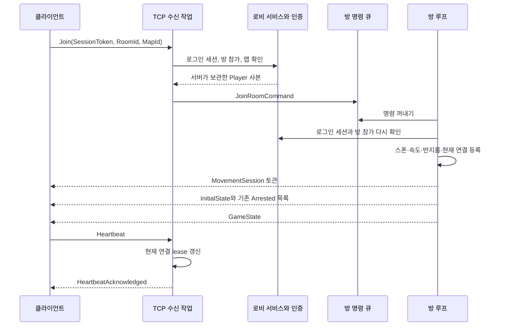
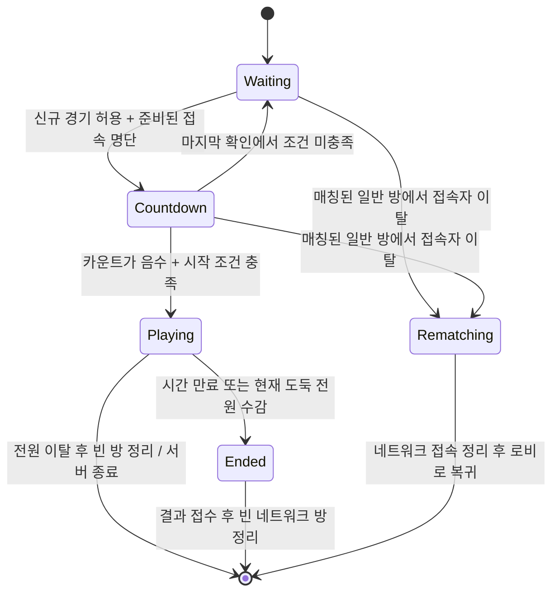

# 3. 실시간 게임 서버: 접속부터 이동·체포·경기 종료까지

[전체 안내로 돌아가기](../code-guide.md) · [이전: 공용 모델과 맵](02-shared-world.md) · [다음: 클라이언트](04-client.md)

이 장은 `polrob.Server/Network`의 모든 소스 파일을 설명한다. 이 폴더의 중심은 `GameNetworkServer`다. 이 객체가 클라이언트의 게임 접속을 받아들이고, 입력을 방별로 정리하고, 실제 좌표와 게임 규칙을 계산한 뒤 결과를 전송한다. 클라이언트가 보내는 것은 주로 **움직이고 싶은 방향**이며, 서버가 그 입력으로 실제 게임 상태를 결정한다.

먼저 세 가지 서로 다른 상태를 구별해야 한다. `GameRoomService`의 로비 상태는 “누가 어느 방에 참가했는가, 역할은 무엇인가, 시작을 승인했는가”를 다룬다. 이 장의 `GameSession`은 “지금 TCP로 접속한 플레이어가 어디에서 움직이며, 누가 체포 중인가”를 다룬다. 경기 종료 때 만드는 `CompletedGameRecord`는 “어떤 경기에서 누가 어느 팀으로 참가했고 어느 팀이 이겼는가”를 남긴다. 이 세 상태는 연결되어 있지만 같은 객체도, 같은 수명도 아니다.

## 목차

1. [파일 지도와 읽는 순서](#1-파일-지도와-읽는-순서)
2. [상태의 소유권과 동시성](#2-상태의-소유권과-동시성)
3. [서버 시작과 TCP 게임 입장](#3-서버-시작과-tcp-게임-입장)
4. [TCP 프레임과 메시지 종류](#4-tcp-프레임과-메시지-종류)
5. [UDP 입력의 인증과 속도 제한](#5-udp-입력의-인증과-속도-제한)
6. [방 루프와 입력 병합](#6-방-루프와-입력-병합)
7. [이동·충돌·스폰 계산](#7-이동충돌스폰-계산)
8. [상대 가시성과 근접 알림](#8-상대-가시성과-근접-알림)
9. [체포와 감옥](#9-체포와-감옥)
10. [탈옥 구조](#10-탈옥-구조)
11. [게임 시작·승패·기록 연결](#11-게임-시작승패기록-연결)
12. [퇴장·재접속·종료](#12-퇴장재접속종료)
13. [부하 제한과 관측](#13-부하-제한과-관측)
14. [한 경기를 코드로 따라가기](#14-한-경기를-코드로-따라가기)
15. [읽을 때 놓치기 쉬운 실제 동작](#15-읽을-때-놓치기-쉬운-실제-동작)

## 1. 파일 지도와 읽는 순서

`partial class`는 하나의 클래스를 여러 파일에 나누어 작성하는 C# 기능이다. 아래의 `GameNetworkServer.*.cs` 다섯 파일은 각각 독립 서비스가 아니다. 컴파일하면 **하나의 `GameNetworkServer` 클래스**이며 모든 private 필드를 함께 사용한다.

| 파일 | 이 파일이 맡는 일 | 먼저 볼 메서드 |
|---|---|---|
| [GameNetworkServer.cs](../../polrob.Server/Network/GameNetworkServer.cs) | 전체 필드·상수·의존성, 입퇴장 처리, 이동, 체포, 탈옥, 기하 계산 | `ExecuteAsync`, `HandleRoomJoin`, `SimulateAuthoritativeMovement`, `DetectRobbersForArrest` |
| [GameNetworkServer.Transport.cs](../../polrob.Server/Network/GameNetworkServer.Transport.cs) | TCP/UDP 수신·인증·프레임 처리, 대상별 전송, 상대 표시 여부와 근접 알림 | `HandleTcpClientAsync`, `ReceiveUdpAsync`, `TrySendTcp`, `RefreshOpponentVisibility` |
| [GameNetworkServer.RoomLoop.cs](../../polrob.Server/Network/GameNetworkServer.RoomLoop.cs) | 방 생성, 명령 큐, 주기 실행, 상태 전이, 결과 기록 인계, 빈 방 정리 | `RunRoomTickLoopAsync`, `DrainRoomCommands`, `ProcessRoomStateSync` |
| [GameNetworkServer.Lifecycle.cs](../../polrob.Server/Network/GameNetworkServer.Lifecycle.cs) | 서버 종료 전 기다림, TCP 작업 완료 관찰 | `StopAsync`, `ObserveTcpClientAsync` |
| [GameNetworkServer.Observability.cs](../../polrob.Server/Network/GameNetworkServer.Observability.cs) | 패킷·방·플레이어·큐·런타임 수치를 매초 샘플링 | `SampleLoadMetrics`, `SerializeForMetrics` |
| [GameSession.cs](../../polrob.Server/Network/GameSession.cs) | 방/접속/명령/체포 상태의 자료형 | `GameSession`, `PlayerSession`, `RoomCommand`, `ArrestState` |
| [TcpPeer.cs](../../polrob.Server/Network/TcpPeer.cs) | 접속 하나의 제한된 TCP 송신 큐와 실제 비동기 쓰기 | `TrySend`, `RunAsync`, `Fail` |
| [UdpRateLimitState.cs](../../polrob.Server/Network/UdpRateLimitState.cs) | 일정 시간마다 허용량을 채우는 token bucket | `TryConsume` |
| [ActiveGameParticipantRegistry.cs](../../polrob.Server/Network/ActiveGameParticipantRegistry.cs) | 현재 연결 세대와 최근 heartbeat를 확인하는 참가자 등록부 | `Register`, `Refresh`, `TryGetConnectionId`, `Unregister` |
| [RuntimeMetricSampler.cs](../../polrob.Server/Network/RuntimeMetricSampler.cs) | .NET 런타임 계측값을 수집해 로그 문자열로 변환 | `RecordMeasurement`, `Sample` |

처음 읽을 때는 `GameSession`으로 자료구조를 본 다음, `HandleTcpClientAsync → HandleRoomJoin → RunRoomTickLoopAsync → SimulateAuthoritativeMovement → ProcessRoomRuleTick → ProcessRoomStateSync` 순서로 따라가면 전체 흐름이 연결된다. 프레임 파싱이나 기하 계산 같은 세부 함수는 이 흐름을 이해한 뒤 살펴보아도 된다.

## 2. 상태의 소유권과 동시성

### 2.1 전체 서버가 보관하는 목록

`GameNetworkServer`는 다음 사전을 공유한다.

| 필드 | 키 → 값 | 필요한 이유 |
|---|---|---|
| `_gameSessions` | 방 ID → `GameSession` | UDP 입력과 TCP 입장을 실행 중인 방으로 보낸다. |
| `_playerRooms` | 플레이어 ID → 방 ID + 연결 ID | UDP 패킷에는 방 ID가 없으므로 서버가 현재 방을 찾는다. 이전 TCP 연결과 새 연결도 구분한다. |
| `_tcpPeers` | `BinaryWriter` 객체 → `TcpPeer` | 기존 전송 함수의 writer 인자를 실제 비동기 송신 큐에 연결한다. |
| `_tcpClientTasks` | 작업 ID → TCP 처리 `Task` | 종료 시 살아 있는 접속 작업을 기다린다. |
| `_roomLoopTasks` | 작업 ID → 방 루프 `Task` | 방에서 마지막 결과 기록을 만들기 전에 서비스가 먼저 끝나는 일을 막는다. |
| `_udpRateLimits` | 플레이어 ID → token bucket | 인증된 플레이어별 입력량을 제한한다. |

이 목록들은 여러 TCP 수신 작업, UDP 수신 작업, 방 루프, 계측 타이머에서 접근하므로 `ConcurrentDictionary`를 사용한다. 다만 사전 자체가 동시 접근에 안전하다는 사실이 그 안의 `Player` 필드 변경까지 자동으로 직렬화해 주지는 않는다. 게임 상태 변경은 방 루프로 모으는 별도 규칙이 담당한다.

### 2.2 `GameSession`: 방 하나의 실행 상태

[GameSession.cs](../../polrob.Server/Network/GameSession.cs#L9)의 생성자는 방의 `GameMap`과 제한된 `Channel<RoomCommand>`를 만든다. Channel은 여러 생산자가 넣고 한 소비자가 꺼내는 큐다. `SingleReader = true`, `SingleWriter = false`가 바로 이 사용 방식을 나타낸다.

주요 필드를 묶어 보면 다음과 같다.

| 묶음 | 필드 | 의미 |
|---|---|---|
| 입력과 수명 | `Commands`, `CommandGate`, `QueuedCommandCount`, `IsStopping`, `PendingLeaves` | 명령 대기, 종료와 새 입력의 충돌 방지, 큐가 찼을 때도 퇴장을 복구 |
| 접속자 | `Sessions` | 현재 TCP 게임 참가자 목록. 로비 전체 명단과 다를 수 있다. |
| 체포 | `ActiveArrestsByRobberId` | 도둑 ID별 경찰 ID와 체포 완료 시각 |
| 감옥·구조 | `JailEntryTimes`, `JailBreakStartedAtByRescuer`, `JailBreakProgressByRescuer` | 수감 순서와 구조자별 연속 구조 시간 |
| 전송 대기 | `PendingUdpMovementPlayerIds` | 다음 UDP 전송 때 최신 위치를 보낼 플레이어 ID 집합 |
| 경기 진행 | `GamePhase`, `CountdownTime`, `GameTime`, `WinnerRole`, `ElapsedGameTime` | 대기/카운트다운/진행/종료와 남은 시간 |
| 기록 스냅샷 | `GameStartedAtUtc`, `GameRecordId`, `StartingPolicePlayerIds`, `StartingRobberPlayerIds`, `PendingGameRecord`, `GameRecordEnqueueAttempted` | 시작 시 참가자와 종료 시 결과를 재시도해도 바뀌지 않게 보관 |
| 빈 방 판정 | `HasHadPlayers`, `EmptySinceUtc` | 접속 이력과 비어 있기 시작한 시각. 현재 종료 판정은 `HasHadPlayers`를 조건으로 사용하지 않는다. |

`ActiveArrestsByRobberId`처럼 일반 `Dictionary`인 상태도 있다. 이 컬렉션들은 방 루프가 순차적으로 다루므로 모든 접근에 별도의 lock을 거는 구조가 아니다. 이 상태를 수정하는 기능을 추가할 때 TCP 수신 함수나 HTTP 컨트롤러에서 바로 변경하면 현재의 전제가 깨진다. `RoomCommand`를 추가하여 방 루프에서 처리하는 위치가 자연스럽다.

### 2.3 `PlayerSession`: 사람의 계정과 현재 접속은 다르다

[PlayerSession](../../polrob.Server/Network/GameSession.cs#L76)은 `Player`와 네트워크 연결을 묶는다.

- `PlayerState`: 서버가 확정하는 좌표, 각도, 역할, 수감 여부.
- `ConnectionId`: TCP 연결마다 새로 생성하는 GUID 문자열. 같은 사람이 다시 연결해도 값이 달라진다.
- `SessionToken`: 로그인 인증 세션. heartbeat와 이동 인증 때 다시 검사한다.
- `MovementSessionToken`: 현재 게임 연결의 UDP 입력에만 사용하는 별도 GUID 문자열.
- `Client`, `Writer`: TCP 연결과 송신 큐를 찾는 식별 객체.
- `UdpEndPoint`: 첫 인증된 이동 입력에서 등록하는 원격 IP/포트.
- `InputX`, `InputY`, `LastMovementInputSequence`, `LastMovementInputAtUtc`: 최근에 승인한 이동 방향, 순번, 수신 시각.
- `NearbyCollisionObstacles`: 충돌 검사 시 재사용하는 임시 목록.
- `VisibleOpponentPlayerIds`: 이 클라이언트에 현재 알려 준 상대 ID 집합.
- `LastOpponentProximityPulseMilliseconds`: 같은 근접 단계 알림을 반복 전송하지 않기 위한 직전 값.

계정 ID만으로 퇴장을 처리하면 예전 연결 A의 종료 알림이 새 연결 B를 지울 수 있다. 이 코드가 `ConnectionId`를 명령과 사전에 함께 들고 다니는 이유가 여기에 있다.

### 2.4 명령 자료형

`RoomCommand`는 추상 record이고 실제 명령은 세 종류다.

| 명령 | 담기는 값 | 처리 함수 |
|---|---|---|
| `JoinRoomCommand` | 로비에서 조회한 `Player`, TCP client/writer, 연결 ID, 로그인 토큰 | `HandleRoomJoin` |
| `LeaveRoomCommand` | 플레이어 ID, 연결 ID, 역할 | `HandleRoomLeave` |
| `MoveRoomCommand` | `PlayerMovementInput`, UDP 원격 endpoint | `HandleRoomMove` |

`PlayerRoomRegistration`은 방 ID와 연결 ID를 묶는 작은 값 형식이다. `ArrestState`는 경찰/도둑 ID와 완료 예정 시각을 보관한다. 체포 애니메이션 프레임 같은 UI 데이터는 서버가 보관하지 않는다.

## 3. 서버 시작과 TCP 게임 입장

### 3.1 `BackgroundService`로 동작하는 서버

[ExecuteAsync](../../polrob.Server/Network/GameNetworkServer.cs#L129)는 TCP listener를 시작하고 네트워크 준비 상태를 표시한다. 매초 실행할 계측 타이머를 켠 뒤 TCP accept 루프와 UDP receive 루프를 동시에 실행한다. 방 루프는 서버 시작 시 모든 방에 미리 만드는 것이 아니라 실제 게임 접속이 생길 때 생성한다.

일반 기본 포트는 TCP 7777, UDP 7778이며 테스트에서는 0번 포트로 OS가 빈 포트를 선택하게 할 수 있다. TCP listen backlog는 2048이다. backlog는 대기 중인 연결 요청의 수에 대한 인자이며 실제 허용 접속 수 제한과 별도다.

`AcceptTcpClientsAsync`는 소켓을 받은 직후 `_acceptedTcpConnections`를 증가시킨다. 서버가 종료 준비 중이거나 허용 접속 수를 넘었으면 즉시 닫고 거절 수치를 올린다. 통과하면 연결마다 `HandleTcpClientAsync`를 시작하고 작업 목록에 넣는다.

### 3.2 입장 순서



[HandleTcpClientAsync](../../polrob.Server/Network/GameNetworkServer.Transport.cs#L51)는 연결마다 `TcpPeer`와 독립 송신 작업을 만든다. 수신 작업은 프레임을 읽고 명령으로 바꾸는 일을 담당하며, 실제 송신은 `TcpPeer.RunAsync`가 담당한다.

첫 프레임은 반드시 `Join`이어야 한다. 서버가 이 경로에서 받는 TCP 메시지는 `Join`과 `Heartbeat`뿐이고, 하나의 연결에서 `Join`은 한 번만 허용된다. `Join`의 JSON에는 로그인 토큰, 방 ID, 클라이언트가 로드한 맵 ID가 들어간다. 클라이언트가 주장하는 역할·속도·이름을 그대로 적용하는 방식이 아니다.

검사 순서는 다음과 같다.

1. `AuthController.ValidateSession`으로 로그인 토큰의 사용자 ID를 확인한다.
2. 빈 방 ID를 `default`로 보정한다.
3. `GetAuthenticatedGamePlayer`로 그 사용자가 실제 로비 방 명단에 있는지 확인한다.
4. 방의 서버 맵 ID와 요청의 `MapId`가 같은지 확인한다.
5. 연결 ID를 생성하고 종료/신규 참가 제한 상태를 확인한다.
6. 방을 찾거나 생성하고 `JoinRoomCommand`를 큐에 넣는다.

`default`라는 이름으로 보정한다고 인증 검사가 생략되는 것은 아니다. 앞의 로비 참가·맵 검사는 여전히 수행한다. 이 이름에 대한 예외 처리는 주로 방의 시작 조건과 빈 방 정리에서 나타난다.

### 3.3 왜 방 루프에서 다시 확인하는가

[HandleRoomJoin](../../polrob.Server/Network/GameNetworkServer.cs#L183)은 소켓이 이미 끊기지 않았는지 확인하고, 로그인 토큰과 로비 참가 정보를 다시 확인한다. 처음 TCP 패킷을 읽은 시점과 방 큐에서 꺼낸 시점 사이에 로그아웃하거나 방을 나갈 수 있기 때문이다. 큐 안에 남은 오래된 입장 요청으로 존재하지 않는 접속자를 만들지 않기 위한 처리다.

통과하면 `Speed = 4`, `Radius = 25`, `Angle = 0`, `IsMoving = false`, `IsJailed = false`로 설정하고 스폰 위치를 찾는다. 그 후 새 `PlayerSession`을 방에 넣고 `_playerRooms`와 `ActiveGameParticipantRegistry`에 현재 연결을 등록한다. 이전 UDP rate limit 상태도 제거한다.

입장한 사람에게는 이동 토큰, 보이는 플레이어 목록, 현재 체포 목록, 게임 상태를 보낸다. 토큰 전송 등록에 실패하면 즉시 해당 플레이어의 퇴장을 처리한다. 같은 팀에는 새 플레이어를 `Joined`로 알리고, 상대 팀에는 시야 계산 결과에 따라 알려 준다.

### 3.4 heartbeat와 활동 자격

로그인 세션이 유효하고, 현재 연결 ID가 registry의 연결 ID와 일치할 때만 heartbeat를 승인한다. 승인하면 받은 payload를 그대로 `HeartbeatAcknowledged`로 돌려준다. heartbeat payload 자체는 특정 JSON 모델로 해석하지 않는다.

[ActiveGameParticipantRegistry](../../polrob.Server/Network/ActiveGameParticipantRegistry.cs#L5)는 `(roomId, userId)`별로 `ConnectionId`와 최근 시각을 저장한다. 기본 유효 기간은 45초다. `Register`는 현재 연결로 교체하고, `Refresh`는 같은 연결일 때 compare-and-update로 시각을 갱신한다. `Unregister`도 확인한 항목과 현재 항목이 같은 경우에만 지운다. `TryGetConnectionId`는 기간이 지난 lease를 활성 접속으로 인정하지 않지만 조회 시 사전에서 즉시 삭제하지는 않는다.

이 registry는 특히 음성 토큰 발급 시 “로비에 이름이 있는 사람”과 “지금 실제 게임 TCP 연결이 살아 있는 사람”을 구별하는 데 쓰인다. 테스트용 생성자에는 `TimeProvider`와 lease 길이를 주입할 수 있어 실제로 45초를 기다리지 않고 만료를 검사할 수 있다.

## 4. TCP 프레임과 메시지 종류

### 4.1 전송 형식

[ReadTcpFrame / ReadTcpFrameAsync](../../polrob.Server/Network/GameNetworkServer.Transport.cs#L220)가 읽는 구조는 다음과 같다.

```text
[4바이트 little-endian Int32 길이]
[1바이트 메시지 타입]
[UTF-8 payload 바이트 수를 담은 7-bit 길이 접두사]
[UTF-8 payload]
```

첫 길이 필드는 **자신의 4바이트를 제외한 나머지 바이트 수**다. 문자열의 바이트 길이를 7비트씩 나누어 적는 접두사는 `.NET BinaryWriter.Write(string)` 형식이다. 따라서 `payload.Length`를 그대로 전체 프레임 길이에 쓰면 한글과 접두사 때문에 잘못된 값이 된다.

예를 들어 payload가 `{}`이면 타입 1바이트, 문자열 길이 접두사 1바이트, 문자 2바이트이므로 첫 길이는 4다. 전체 프레임은 길이 필드까지 8바이트다. 현재 송신 코드는 이 실제 바이트 수를 계산한다.

수신은 이전 클라이언트와의 호환 때문에 `1 + payload.Length`라는 예전 계산값도 허용한다. 단, 이를 무제한 신뢰하지 않는다. 실제 문자열 길이는 별도 접두사로 읽고 상한과 UTF-8 유효성을 확인한 다음 실제 길이 또는 예전 길이와 일치하는지 검증한다.

수신 제한은 payload 4096바이트다. 첫 선언 길이도 `1 + 5 + 4096` 이하인지 먼저 확인한다. 7-bit 접두사는 최대 5바이트이며 Int32 범위 초과, 너무 긴 표현, 불필요하게 긴 표현을 거절한다. 잘못된 UTF-8, 중간에 끊긴 payload, 선언 길이 불일치도 실패한다.

비동기 리더는 프레임 조각마다 새 시간을 주지 않고 **전체 프레임 하나에 같은 취소 토큰과 기한**을 쓴다. 아주 조금씩 바이트를 보내며 연결을 끝없이 유지하는 경우에도 기한이 늘어나지 않는다. 첫 Join까지 기본 10초, 이후 프레임까지 기본 45초다. 연결별 TCP 프레임 제한은 초당 5개, 순간 허용량 10개이며 이를 넘으면 연결을 종료한다.

### 4.2 메시지 목록

타입 숫자는 [TcpMessageType.cs](../../polrob.Shared/Models/TcpMessageType.cs)에 정의되어 있다. 여기서 payload라는 말은 프레임 속 문자열이며 모든 payload가 JSON인 것은 아니다.

| 번호/타입 | 방향 | payload와 실제 의미 |
|---|---|---|
| 1 `Join` | 클라이언트 → 서버 | `GameJoinRequest` JSON. 로그인 토큰·방·맵으로 입장 요청 |
| 2 `Joined` | 서버 → 클라이언트 | `Player` JSON. 동료 입장 또는 상대가 시야에 새로 들어옴 |
| 3 `Left` | 서버 → 클라이언트 | 플레이어 ID 문자열. 실제 퇴장 또는 상대가 팀 시야에서 사라짐 |
| 4 `InitialState` | 서버 → 클라이언트 | 같은 팀과 보이는 상대의 `List<Player>` JSON |
| 5 `Arrested` | 서버 → 클라이언트 | `경찰ID,도둑ID` 문자열. 체포 시작과 연출 연결 |
| 6 `GameState` | 서버 → 클라이언트 | 방·맵·phase·시간·승리팀·전체/수감 도둑 수. 재매칭 때 방장 ID도 포함 |
| 7 `JailBreak` | 서버 → 도둑 팀 | `JailBreakSync` JSON. 구조자, 석방 대상, 석방 좌표 |
| 8 `PlayerState` | 서버 → 허용된 대상 | `Player` JSON. 수감/석방 등 중요한 상태 교정 |
| 9 `JailBreakProgress` | 서버 → 방 전체 | `JailBreakProgressSync` JSON. 구조자 ID별 0~1 진행률 |
| 10 `MovementSession` | 서버 → 해당 접속자 | UDP 인증용 토큰 문자열 |
| 11 `OpponentProximity` | 서버 → 해당 접속자 | `{"p":100}` 같은 근접 단계 JSON |
| 12 `Heartbeat` | 클라이언트 → 서버 | 왕복 확인용 문자열 |
| 13 `HeartbeatAcknowledged` | 서버 → 해당 접속자 | 받은 heartbeat 문자열 |

`Joined`와 `Left`는 접속 이벤트와 가시성 이벤트를 겸한다. 따라서 클라이언트의 현재 플레이어 목록 개수만으로 방의 전체 인원이나 전체 도둑 수를 판단하면 안 된다. 전체/수감 도둑 수는 `GameStateSync`의 서버 계산 값을 사용한다.

### 4.3 느린 클라이언트가 방 루프를 막지 않게 하는 방법

[TcpPeer.TrySend](../../polrob.Server/Network/TcpPeer.cs#L31)는 메시지를 프레임 바이트 배열로 만든 뒤 제한된 큐에 넣는다. 기본 한도는 접속별 메시지 64개, 대기 바이트 262144바이트다. payload 하나가 65536바이트를 넘거나, 큐의 개수 또는 바이트 제한을 넘으면 `Fail`이 연결을 닫는다.

`RunAsync`는 이 큐의 단일 소비자로, 프레임을 순서대로 `NetworkStream.WriteAsync`에 쓴다. 기본 전송 기한은 5초다. 전송 완료 후 대기 바이트 수를 줄이고 전송 카운터를 올린다. 기한 초과나 소켓 오류도 `Fail`로 이어진다. 그래서 다른 사람에게 데이터를 너무 느리게 읽는 접속자 하나가 해당 방의 매번 전송을 기다리게 만들지는 않는다.

`TrySendTcp`가 true를 반환했다는 것은 일반 실행 경로에서는 **송신 큐에 들어갔다**는 뜻이다. 클라이언트가 실제로 수신하고 적용했다는 확인은 아니다. `_tcpPeers`에 등록된 writer가 없는 경로는 `SendTcp`가 writer에 lock을 걸고 직접 쓴다. 테스트 등에서는 이 경로를 활용하지만 실제 `HandleTcpClientAsync`가 만든 연결은 `TcpPeer`를 등록한다.

## 5. UDP 입력의 인증과 속도 제한

### 5.1 좌표가 아니라 조이스틱 방향을 보낸다

입력은 [PlayerMovementInput.cs](../../polrob.Shared/Models/PlayerMovementInput.cs)의 짧은 JSON 필드로 전송한다.

```json
{"i":"player-1","x":1,"y":0,"s":42,"t":"현재 접속의 이동 토큰"}
```

`i`는 플레이어 ID, `x/y`는 이동 방향, `s`는 `ulong` 순번, `t`는 이동 토큰이다. 위 예시는 “오른쪽으로 이동하려는 42번째 입력”이지 “좌표를 (1, 0)으로 바꾸라”는 뜻이 아니다. 출력인 `PlayerMovementSync`는 `i/x/y/a/m`, 즉 ID·실제 좌표·각도·이동 여부를 담는다.

### 5.2 수신 검사를 순서대로 이해하기

[ReceiveUdpAsync](../../polrob.Server/Network/GameNetworkServer.Transport.cs#L505)는 다음 순서로 처리한다.

1. 수신 패킷/바이트 수를 올린다.
2. 서버 전체 UDP token bucket을 확인한다. 기본 초당 20000개이며 JSON 해석 전에 적용한다.
3. datagram이 1~2048바이트인지 확인하고 JSON을 역직렬화한다.
4. `_playerRooms`에서 현재 방과 연결 ID를 찾는다.
5. 해당 방의 `PlayerSession`을 찾아 이동 인증을 검사한다.
6. 인증된 플레이어의 token bucket을 차감한다. 기본 초당 30개, 순간 허용 20개다.
7. `MoveRoomCommand`를 방 큐에 넣는다.

[IsAuthorizedMovement](../../polrob.Server/Network/GameNetworkServer.Transport.cs#L580)는 현재 방 등록의 연결 ID, 현재 PlayerSession의 연결 ID, 이동 토큰, 원격 endpoint, 로그인 세션의 사용자 ID를 모두 확인한다. endpoint가 아직 없으면 첫 입력이 등록할 수 있지만, 한 번 등록되면 그 IP/포트에서만 받는다. UDP 포트가 중간에 바뀌어도 자동으로 덮어쓰지 않는다.

개인별 제한량을 인증 뒤에 차감하는 순서에도 의미가 있다. 남의 ID만 아는 발신자가 그 ID로 가짜 입력을 계속 보내도 정상 사용자의 개인 허용량을 소진시키지 못하게 한다. 서버 전체 허용량은 인증 전 처리량을 제한하므로 그런 트래픽에도 차감된다.

방 루프의 `HandleRoomMove`는 토큰과 로그인 세션을 다시 확인한다. 큐에 들어간 뒤 재접속으로 토큰이 바뀌거나 로그아웃할 수 있기 때문이다. 이후 첫 endpoint 등록, 유한한 숫자인지 검사, 순번 검사를 거친다. **endpoint 등록은 숫자·순번 검사보다 먼저 수행된다.** 마지막 승인 순번 이하인 입력은 무시하며 초기 순번 상태가 0이므로 첫 유효 입력은 0보다 커야 한다.

방향 벡터 길이가 1보다 크면 길이가 1이 되도록 나눈다. `(1, 1)` 입력을 그대로 쓰면 대각선 속도가 약 1.414배가 되므로 이를 정규화하는 것이다. 길이가 1 이하라면 크기를 유지하여 작은 조이스틱 입력은 느리게 이동한다. 패킷을 승인한 시각은 클라이언트가 보낸 시간이 아니라 서버의 `DateTime.UtcNow`다.

### 5.3 `UdpRateLimitState`의 계산

[TryConsume](../../polrob.Server/Network/UdpRateLimitState.cs#L14)의 token bucket은 다음 식으로 동작한다.

```text
경과초 = max(0, 현재시각 - 마지막충전시각)
남은토큰 = min(순간최대한도, 남은토큰 + 경과초 × 초당충전량)
남은토큰 < 1 이면 거절
그 외에는 토큰 1개를 빼고 승인
```

예를 들어 초당 30개, 순간 한도 20개라면 잠깐 쉬는 동안 최대 20개까지 쌓아 둘 수 있다. 장시간 쉬어도 무한정 누적되지 않는다. 내부 lock으로 시간·토큰 갱신을 하나의 작업으로 처리한다. 클래스 이름에는 UDP가 있지만 TCP 프레임 제한에도 같은 자료형을 재사용한다.

## 6. 방 루프와 입력 병합

### 6.1 방은 하나의 순서 있는 처리 흐름을 가진다

[GetOrCreateGameSession](../../polrob.Server/Network/GameNetworkServer.RoomLoop.cs#L7)은 기존 방을 찾거나 새 방을 사전에 등록한 뒤 `Task.Run`으로 루프를 시작한다. 이미 종료 중인 방을 발견하면 즉시 새 방으로 덮어쓰지 않고 현재 항목 정리가 끝날 때까지 다시 시도한다. 사전에 추가하는 경쟁에서 진 작업도 재조회한다.

[TryWriteRoomCommand](../../polrob.Server/Network/GameNetworkServer.RoomLoop.cs#L63)는 `CommandGate` 안에서 종료 여부를 확인하고 `TryWrite`한다. Channel 자체의 `FullMode`는 `Wait`지만 이 코드가 쓰는 API는 대기하는 `WriteAsync`가 아니다. 따라서 큐가 차면 호출자를 기다리게 하지 않고 false를 반환한다. 기본 큐 용량은 4096이며 최소값은 256이다.

[RunRoomTickLoopAsync](../../polrob.Server/Network/GameNetworkServer.RoomLoop.cs#L84)의 한 반복은 다음 순서다.

```text
현재 시각과 지난 반복 이후 경과 시간 계산
  → 방 명령 처리
  → 서버 이동 시뮬레이션
  → 누적 100ms마다 UDP 위치 전송
  → 누적 100ms마다 체포/탈옥 규칙 처리
  → 누적 1초마다 phase·남은 시간·승패·GameState 처리
  → 빈 방 종료 조건 확인
  → 처리 시간 계측
  → 50ms 대기
```

게임 상태가 한 방 루프에서 변경되므로 “이동과 체포 완료가 정확히 동시에 들어오면 무엇을 먼저 적용할지”를 각 네트워크 작업이 따로 결정하지 않는다. 위의 순서가 우선순위를 만든다. 다른 방은 별도 Task에서 진행한다.

50ms는 반복 끝의 대기 시간이다. 처리 시간이 포함된 정확한 20Hz 보장은 아니다. 처리 자체가 8ms 걸리면 다음 반복까지 대략 58ms 이상이 된다. UDP/규칙/상태 타이머는 경과 시간을 누적하고 `while`로 밀린 주기를 처리하지만, 이동은 한 번만 수행하고 최대 시간 간격을 제한한다. `room_tick_overruns_total`은 50ms보다 처리 시간이 길었던 반복을 센다.

### 6.2 이동 입력을 전부 실행하지 않는 이유

[DrainRoomCommands](../../polrob.Server/Network/GameNetworkServer.RoomLoop.cs#L255)는 한 번에 최대 512개의 명령을 읽는다. 무한히 들어오는 입력 때문에 이동 계산과 게임 시간 갱신, 종료 확인이 영원히 실행되지 않는 상황을 피하려는 처리량 상한이다.

같은 플레이어의 연속 이동 명령은 임시 사전에 모아 **가장 큰 순번 하나만 남긴다**. 순번 40, 43, 42가 이 순서로 도착해도 42가 아니라 43을 사용한다. 이를 입력 병합, 즉 coalescing이라고 부른다.

입력은 버튼 클릭 사건이 아니라 “현재 조이스틱 방향”이므로 오래된 방향들을 모두 각각 이동에 적용할 필요가 없다. 많은 패킷을 보낸 사람이 더 멀리 이동해서도 안 된다. 최종 방향을 선택한 뒤 서버가 경과 시간만큼 한 번 이동시키는 구조다.

다만 입장과 퇴장은 순서가 중요하다. `JoinRoomCommand`나 `LeaveRoomCommand`를 만나면 그 앞까지 모은 이동을 먼저 `FlushCoalescedMoves`로 적용하고 사전을 비운 뒤 해당 입퇴장을 처리한다. 처리량 한도에 도달했을 때도 남은 이동을 적용한다. 마지막에는 일반 큐에 들어가지 못했던 `PendingLeaves`를 처리한다.

예를 들어 `Move(A,10) → Move(A,12) → Leave(A) → Join(A 새 연결) → Move(A,1 새 토큰)` 순서라면, 12번 이동은 옛 세션에 적용되고 퇴장/재입장 뒤 1번 이동은 새 세션에 적용된다. 토큰 재검사까지 있으므로 옛 토큰 명령을 새 세션에 적용하지 않는다.

## 7. 이동·충돌·스폰 계산

### 7.1 실제 속도

[SimulateAuthoritativeMovement](../../polrob.Server/Network/GameNetworkServer.cs#L495)는 최근 입력으로 위치를 계산한다.

```text
deltaSeconds = clamp(지난 반복 이후 경과초, 0, 0.1)
이동거리 = Player.Speed × 60 × deltaSeconds
```

서버가 속도를 4로 고정하므로 최대 속도는 맵 좌표 기준 초당 240이다. 50ms가 지난 반복에서는 최대 12, 100ms 이상 지연된 반복에서는 최대 24를 이동한다. 클라이언트가 높은 속도나 큰 방향 값을 보내도 서버가 그대로 따르지 않는다.

마지막 입력 후 250ms를 넘겼거나, Playing 상태가 아니거나, 체포 중 또는 수감 중이면 입력 방향을 0으로 만든다. 입력 중단 후 계속 미끄러져 가는 것을 제한하는 장치다. 현재 방향이 사실상 0인 기준은 각 축의 절댓값 0.001이다. 이전에 움직이다 멈췄다면 정지 상태도 다음 UDP 전송 대상으로 등록한다.

루프가 오래 멈춘 경우 실제 벽시계 시간 전체만큼 한 번에 크게 이동하지 않는다. 예를 들어 1초 지연이 생겨도 그 반복의 이동 계산은 최대 0.1초다. 게임 시간의 밀린 1초 처리와 플레이어 이동은 이렇게 서로 다른 보정 방식을 사용한다.

### 7.2 충돌은 축별로 검사한다

후보 좌표는 반지름을 고려하여 맵 경계 안으로 제한한다. 그 뒤 X축 후보를 현재 Y에서 검사해 이동하고, 갱신된 X에서 Y축 후보를 검사한다. 벽을 비스듬히 밀 때 한 축이 막혀도 다른 축으로는 움직일 수 있는 방식이다.

실제 충돌은 `GameMap.IsMovementPositionBlocked`에 맡긴다. Shared 맵 코드가 경계, `BlocksMovement` 건물, 가까운 장애물의 원/사각형/다각형 충돌을 계산한다. `NearbyCollisionObstacles` 목록은 매 플레이어에게 보관하여 검사 때 재사용한다. Network의 같은 이름 함수는 이 호출을 연결하는 얇은 래퍼다.

이동 중에는 다른 플레이어와의 충돌을 따로 검사하지 않는다. 서로의 자리를 피하는 로직은 아래의 **입장 스폰 위치 선택**에 있다. 따라서 “스폰이 겹치지 않음”과 “게임 중 몸이 서로를 밀어냄”을 같은 기능으로 이해하면 안 된다.

각도는 `atan2(InputY, InputX) × 180/π - 90`으로 계산한다. 벽 때문에 위치가 바뀌지 않아도 입력이 있으면 바라보는 방향은 바뀔 수 있다. `IsMoving`은 입력의 존재가 아니라 좌표가 실제로 바뀌었는지에 따라 정해진다.

### 7.3 스폰 위치

[PositionPlayerForRoom](../../polrob.Server/Network/GameNetworkServer.cs#L578)은 `GameMap.GetSpawnPosition(role, slot, radius)`에 0번부터 슬롯을 요청한다. 맵이 제공한 충돌 없는 후보가 기존 접속자의 원과 겹치면 다음 슬롯을 시도한다. 같은 ID의 기존 세션은 비교 대상에서 제외한다.

역할별 스폰 기준과 장애물 탐색 자체는 Shared의 맵 코드에 있다. Network는 “맵에 걸리지 않는 위치”에 더해 “현재 접속자의 시작 위치와 겹치지 않는 위치”를 선택한다. 맵에 요구한 슬롯이 더 이상 없으면 Shared 쪽에서 예외를 던지므로 모든 상황에서 무한한 인원을 배치하는 기능은 아니다.

### 7.4 위치 전송

[FlushPendingUdpMovementBroadcasts](../../polrob.Server/Network/GameNetworkServer.cs#L552)는 변화가 있던 플레이어 ID를 가져오고 대기 집합을 비운다. 먼저 시야·근접 단계를 갱신한 뒤 각 플레이어의 최신 `PlayerMovementSync`를 JSON으로 만든다. 같은 역할과 그 플레이어를 현재 볼 수 있는 상대에게만 보낸다. 본인도 같은 역할이므로 자신의 권위 좌표를 받는다.

UDP endpoint를 아직 등록하지 않은 수신자는 위치 패킷을 받지 않는다. 송신 중인 UDP 작업 수가 기본 1024개를 넘으면 추가 전송을 드롭하고 계측한다. 실패한 위치 패킷을 저장하여 재전송하는 로직은 없다. 이후의 최신 위치 전송으로 상태를 따라가는 구조이며, 변경된 사람이 없는 경우 주기적으로 모든 위치를 재전송하지도 않는다.

## 8. 상대 가시성과 근접 알림

### 8.1 팀 전체가 공유하는 시야

[RefreshOpponentVisibility](../../polrob.Server/Network/GameNetworkServer.Transport.cs#L419)는 경찰 팀과 도둑 팀을 각각 계산한다. 팀원 중 한 명이라도 상대를 볼 수 있으면 그 상대를 팀 전체에 알린다. 상대가 처음 보이면 각 수신자의 `VisibleOpponentPlayerIds`에 추가하고 `Joined`를 보낸다. 더 이상 보이지 않으면 ID를 제거하고 `Left`를 보낸다.

같은 팀원은 시야와 관계없이 항상 서로 알려 준다. 특별 규칙도 두 가지 있다.

- 경찰 팀은 수감 중인 도둑을 항상 본다.
- 도둑 팀은 체포를 수행 중인 경찰을 항상 본다. 체포 연출을 시작하기 전에 필요한 경찰 객체가 클라이언트 목록에 있도록 하기 위해서다.

기본 시야 조건은 [IsPointInVision](../../polrob.Server/Network/GameNetworkServer.cs#L950)이다. 중심 간 거리가 `반지름 × 2 × 2.5` 이하이고 정면 기준 좌우 45도 안에 있으면 된다. 반지름이 25이므로 범위는 125다. 저장된 각도에 90도를 더한 값이 실제 바라보는 방향이며, 각도는 0~360도로 정규화하고 차이는 최단 각도 -180~180도로 계산한다.

**현재 일반 가시성 판정은 거리와 각도만 사용한다.** 이 함수 경로는 `IsVisionBlockedByObstacle`을 부르지 않는다. 벽과 부쉬 때문에 체포는 막히더라도 가시성 목록에는 들어올 수 있다. 아래 체포 조건과 일반 표시 조건을 같은 것으로 읽지 않도록 주의해야 한다.

### 8.2 `BroadcastPlayerState`의 대상

수감·석방·체포 상태 변화는 UDP 위치 갱신만으로 충분하지 않으므로 전체 `Player` 상태를 TCP로 보낸다. `BroadcastPlayerState`는 먼저 시야·근접 정보를 갱신한 뒤 같은 팀 또는 현재 그 플레이어를 볼 수 있는 상대에게 전송한다.

한편 `Arrested`는 방 전체에, `JailBreakProgress`도 방 전체에 전송한다. 따라서 “시야 밖 상대의 모든 식별 정보가 어떤 메시지에서도 전송되지 않는다”는 보장으로 확대해서 이해하면 안 된다. 위치 전송과 각 이벤트 전송의 수신 대상이 서로 다르다.

### 8.3 근접 알림

[RefreshOpponentProximityAlerts](../../polrob.Server/Network/GameNetworkServer.Transport.cs#L375)는 각 수신자에게 가장 가까운 상대까지의 **원 표면 사이 거리**를 계산한다.

```text
표면 거리 = max(0, 두 중심의 거리 - 나의 반지름 - 상대의 반지름)
```

이 계산에는 시야, 벽 차폐, 체포·수감 여부 필터가 없다. 같은 팀만 제외한다. [OpponentProximitySync](../../polrob.Shared/Models/OpponentProximitySync.cs)는 표면 거리를 100 단위로 올림하여 100/200/300/400/500ms 단계로 바꾸고, 500보다 멀거나 상대가 없으면 0을 만든다. 표면 거리가 0이어도 100이며 100.1이면 200이다.

서버가 보내는 값은 단계 하나뿐이고 상대 ID나 좌표는 담지 않는다. 같은 단계가 계속되면 TCP 메시지를 다시 보내지 않는다. 초기 저장 값은 -1이므로 상대가 없어 0인 첫 상태도 한 번 전송한다.

## 9. 체포와 감옥

### 9.1 100ms 규칙 갱신의 순서

[ProcessRoomRuleTick](../../polrob.Server/Network/GameNetworkServer.RoomLoop.cs#L311)은 Playing이고 접속자가 있을 때 다음 순서로 실행한다.

1. 기한이 된 기존 체포를 완료한다.
2. 새 체포 대상을 찾는다.
3. 탈옥 구조 진행률과 완료를 처리한다.

Playing이 아니거나 아무도 없으면 구조 진행 상태를 지우고 돌아간다. 승패 판정은 여기서 하지 않고 1초 상태 갱신에 있다. 그러므로 마지막 도둑의 수감과 경기 종료 통지는 같은 순간이라고 보장되지 않는다.

### 9.2 경찰이 도둑을 발견하는 조건

[DetectRobbersForArrest](../../polrob.Server/Network/GameNetworkServer.cs#L649)는 이미 체포 중인 경찰을 제외하고 경찰·도둑을 각각 ID 순서로 정렬한다. 경찰마다 도둑 목록을 순회하며 다음 조건을 만족한 첫 도둑을 잡는다.

- 도둑이 수감 중도, 다른 체포의 대상도 아니다.
- 도둑이 부쉬 안에 있으면 경찰도 그 부쉬 안에 있어야 한다.
- 도둑의 중심이 경찰 시야의 거리·각도 안에 있다.
- 경찰과 도둑 사이를 시야 차단 건물이나 장애물이 가로막지 않는다.

성공하면 해당 경찰은 그 순회에서 더 이상의 도둑을 잡지 않는다. 가장 가까운 도둑을 정렬해서 잡는 방식이 아니라 **ID 순서에서 조건을 만족하는 첫 대상**이다. 접촉 충돌이나 별도의 체포 버튼은 필요하지 않다.

### 9.3 체포 진행과 완료

[StartArrest](../../polrob.Server/Network/GameNetworkServer.cs#L689)는 도둑 ID를 키로 체포 상태를 만들고 완료 시각을 현재부터 2초 뒤로 기록한다. 경찰과 도둑의 `IsMoving`을 false로 만든다. 이동 시뮬레이션도 `IsPlayerInActiveArrest`로 두 사람을 잠그므로 다음 입력이 와도 그 시간 동안 움직이지 않는다.

도둑 팀에게 체포 경찰이 보이도록 목록을 먼저 갱신한 뒤 `Arrested("경찰ID,도둑ID")`와 두 사람의 상태를 보낸다. 시작 뒤 매 tick마다 시야나 거리를 다시 검사하여 취소하는 로직은 없다. 일반적인 취소 경로는 해당 경찰이나 도둑이 퇴장하여 체포 상태가 삭제되는 경우다.

[CompletePendingArrests](../../polrob.Server/Network/GameNetworkServer.cs#L602)는 완료 시각이 된 항목을 완료 시각·도둑 ID 순으로 처리한다. 도둑이 아직 연결 중이면 `IsJailed = true`, 정지, 각도 0으로 설정한다. 감옥 입장 시간은 실제 처리 시각이 아니라 체포의 완료 예정 시각을 저장한다. 체포 상태를 제거하고 전체 수감자의 배치를 다시 계산해 TCP 상태를 보낸다. 경찰도 상태를 갱신한다.

### 9.4 수감 여부는 좌표로 추측하지 않는다

[IsInJail](../../polrob.Server/Network/GameNetworkServer.cs#L944)은 `Role == Robber && IsJailed`만 본다. 감옥 그림의 사각형 안에 좌표가 있다는 이유로 수감자로 취급하지 않는다. `RefreshJailEntry`는 이 서버 상태를 기준으로 수감 시각 사전을 보충하거나 정리한다.

[ArrangeJailedRobbers](../../polrob.Server/Network/GameNetworkServer.cs#L711)는 수감 시각이 빠른 도둑부터, 동률이면 ID 순으로 정렬한다. 가장 큰 플레이어 반지름을 배치 기준으로 사용하여 `GameMap.GetJailHoldingPosition`에 감옥 내부 슬롯을 요청한다. 누군가 수감·석방·퇴장하면 남은 수감자도 다시 배치될 수 있다.

### 9.5 시야 차폐의 기하 함수들

[IsVisionBlockedByObstacle](../../polrob.Server/Network/GameNetworkServer.cs#L970)은 경찰 중심에서 도둑 중심까지의 선분이 `BlocksVision`인 물체와 닿는지 검사한다. 경찰 자신이 들어가 있는 부쉬는 차폐물에서 제외한다. 이는 “같은 부쉬 안에서 서로 찾을 수 있다”는 규칙을 구현한다.

| 함수 | 계산 방법 |
|---|---|
| `DoesSegmentIntersectBuilding` | 다각형 collider가 있으면 다각형 검사. 없으면 회전·이동을 고려한 건물 로컬 좌표로 바꿔 사각형 검사 |
| `DoesSegmentIntersectRectangle` | 선분의 매개변수 구간 `[0, 1]`을 사각형의 네 경계로 잘라 남는 부분이 있는지 검사 |
| `ClipSegmentToAxis` | 한 경계에 대해 허용 구간의 최소/최대를 갱신. 평행하면 경계 안쪽인지 검사 |
| `DoesSegmentIntersectPolygon` | 끝점이 다각형 안에 있거나 선분이 어느 변과 교차하면 true |
| `IsPointInsidePolygon` | 경계 위 점을 먼저 인정하고, 수평 방향 교차 횟수의 홀짝으로 내부 판정 |
| `DoSegmentsIntersect` | 외적 부호로 서로의 선분 양쪽에 놓이는지 검사하고, 끝점/일직선 접촉도 보충 검사 |
| `CrossProduct`, `IsPointOnSegment` | 방향과 공선·범위 검사. 접촉 오차는 0.001 사용 |
| `DoesSegmentIntersectCircle` | 원 중심을 선분에 투영하여 가장 가까운 점을 구하고 반지름 이내인지 검사 |
| `GetVisionRange`, `GetFacingAngle`, `NormalizeDegrees`, `ShortestAngleDifference` | 반지름을 시야 거리로, 저장 각도를 실제 방향으로 변환하는 보조 계산 |

벽과 이동 충돌을 계산하는 Shared의 함수들과 목적이 다르다. 여기서는 **두 사람을 잇는 선분**이 막히는지 계산하고, 이동 충돌은 **플레이어 원**이 맵 물체에 겹치는지 계산한다.

## 10. 탈옥 구조

### 10.1 구조를 시작할 수 있는 사람

[UpdateJailBreakProgress](../../polrob.Server/Network/GameNetworkServer.cs#L742)는 수감자가 있는 경우 다음 조건의 도둑을 구조자 후보로 고른다.

- 본인이 수감 중이 아니다.
- 체포 진행 중이 아니다.
- 감옥 구조 범위 안에 있다.

맵에 `JailRescueArea`가 있으면 플레이어 중심점이 그 영역 안에 있어야 한다. 없으면 감옥 건물까지의 최단 거리로 판정한다. 이 기존 방식의 허용 거리는 플레이어 반지름 + 90이므로 기본 반지름에서는 115다. [IsTouchingOrNearJail](../../polrob.Server/Network/GameNetworkServer.cs#L1351)에 이 분기가 있다.

별도 구조 요청 패킷은 없다. 조건을 만족하며 머무르면 자동으로 시작한다. 후보가 많아도 수감자 수만큼만 활성 구조자로 선택한다. 이미 구조 중인 사람을 시작 시각 순으로 우선하고, 그 뒤 ID 순으로 정렬하여 새 사람이 기존 구조자를 밀어내지 않도록 한다.

### 10.2 진행률과 초기화

처음 조건을 만족한 시각을 `JailBreakStartedAtByRescuer`에 넣고 `(현재 - 시작) / 3초`를 0~1로 제한해 진행률로 만든다. 한 번 구조 범위를 벗어나거나 체포되어 활성 후보에서 빠지면 해당 시작 시각과 진행률을 삭제한다. 다시 돌아오면 3초를 처음부터 채워야 한다.

수감자가 없거나 구조자가 없으면 전체 진행 상태를 지우고 변경 사실을 전송한다. 정상 구조 중에는 100ms 규칙 갱신마다 `JailBreakProgress`를 보낸다. 완료 직전까지의 시간은 경과한 벽시계 시간으로 계산하므로 단순히 tick을 30번 세는 방식은 아니다.

### 10.3 한 구조 완료가 한 명을 석방한다

[ReleaseJailedRobbers](../../polrob.Server/Network/GameNetworkServer.cs#L824)는 완료한 구조자 수만큼 오래 수감된 도둑을 고른다. 수감 시각과 ID 순으로 정렬하여 순서를 정한다. 구조자 한 명이 완료하면 수감자 한 명이 풀린다. 여러 명이 동시에 완료하면 그 수만큼 석방한다.

석방 대상은 감옥 밖 좌표로 이동하고 `IsJailed = false`, 정지, 각도 0이 된다. 감옥 입장 시각을 지우고 도둑 팀에 `JailBreak`를 보낸 다음 보이는 대상에게 전체 `PlayerState`를 보낸다. 남은 수감자도 감옥 슬롯을 다시 정렬한다.

완료한 구조자의 시작 시각과 진행률은 삭제한다. 수감자가 남아 있고 구조자가 계속 구조 영역에 있다면 이후 갱신에서 새 3초 구조를 시작할 수 있다. 중간 진행 중인 다른 구조자는 가능한 범위에서 기존 시작 시각을 유지한다.

### 10.4 석방 위치를 찾는 방법과 한계

[GetJailReleasePosition](../../polrob.Server/Network/GameNetworkServer.cs#L1364)은 감옥 collider의 아래 경계에 반지름과 여유 20을 더한 Y를 기준으로 후보를 만든다. 가로 오프셋 다섯 개씩, 세로 다섯 줄을 검사한다. 줄 간격은 반지름의 1.5배이며 후보를 맵 경계 안으로 제한하고 `IsMovementPositionBlocked`로 장애물 충돌을 검사한다.

가능한 후보 목록에서 석방 순번에 해당하는 위치를 사용한다. 후보보다 사람이 많으면 마지막 후보를 재사용한다. 모든 후보가 막히면 중앙의 기본 석방 위치로 돌아가는 fallback이 있으며, 이 fallback은 다시 충돌 검사를 통과했다는 보장이 없다. 일반 맵에서 가능한 후보를 확보하는 것이 맵 설계와 테스트의 책임이다. 이 함수는 다른 플레이어와의 겹침까지 검사하지 않는다.

## 11. 게임 시작·승패·기록 연결

### 11.1 상태 전이

[ProcessRoomStateSync](../../polrob.Server/Network/GameNetworkServer.RoomLoop.cs#L325)는 1초마다 로비의 만료된 빈 방을 정리하고, 대기 중 결과 기록 재시도를 먼저 처리한다. 이후 접속자가 없으면 게임 시간/상태 갱신을 멈춘다.



이 도표의 종료 노드는 네트워크 `GameSession`의 종료다. 일반 방에서 경기 종료 후 다시 플레이할 로비를 보관할지는 `GameRoomService`의 별도 수명 규칙에 따른다. `Ended`에서 같은 `GameSession`을 직접 `Waiting`으로 되돌리는 코드는 없다.

### 11.2 시작 조건과 실제 카운트다운

`default` 방은 한 명 이상 접속하면 준비된 것으로 본다. 일반 방은 로비 상태가 성공이고 `Matched`이며 TCP 접속 수가 로비의 기대 인원 이상이어야 한다. 기대 인원은 `max(1, CurrentCount)`다.

Waiting에서 조건이 맞으면 Countdown으로 전환하여 값 3을 전송한다. 다음 1초 갱신에서 2, 그 다음 1, 그 다음 0이 되고 **그다음 값이 -1이 될 때** Playing으로 전환한다. 실제 조건이 `< 0`이므로 “3을 보여 준 뒤 정확히 3초에 시작한다”라고 설명하면 코드와 다르다.

마지막 시작 시점에 일반 방은 준비된 인원 조건과 경찰·도둑 양쪽 역할이 실제 접속 중인지 다시 검사한다. 조건이 깨지면 Waiting으로 되돌리고 카운트다운 3과 시작 시각을 초기화한다. 시작 전 퇴장을 방 루프가 정상 처리한 경우에는 `TryAbortGameStart` 경로로 Rematching이 될 수 있다.

Playing으로 들어가는 순간 게임 ID를 만들고 서버 시각을 저장한다. 현재 경찰/도둑 ID를 각각 중복 제거하고 정렬하여 `StartingPolicePlayerIds`, `StartingRobberPlayerIds`에 고정한다. 이후 접속 변동이 생겨도 경기 결과의 참가자는 이 시작 스냅샷을 사용한다.

### 11.3 승패 판정

Playing 상태에서는 매초 남은 `GameTime`을 1 줄인다. 현재 TCP 접속자 중 도둑을 모아 한 명 이상이고 모두 `IsJailed`이면 전원 체포로 판정한다.

- 시간이 0 이하이면 도둑 승리.
- 시간이 남아 있고 현재 도둑이 모두 수감되어 있으면 경찰 승리.
- 같은 갱신에 시간 만료와 전원 수감이 겹치면 시간 만료 분기를 먼저 선택하므로 도둑 승리.

여기서 전원 수감의 대상은 시작 시 명단이 아니라 **현재 `Sessions`에 있는 도둑**이다. 도둑이 한 명도 없을 때 `All()`이 자동으로 true가 되는 결과를 피하도록 개수가 0보다 클 때만 전원 수감을 계산한다. 따라서 마지막 도둑이 접속 종료했다는 사실만으로 즉시 경찰 승리를 선언하지 않는다. 경찰 전원이 나갔다는 이유만으로 즉시 도둑 승리를 선언하는 별도 분기도 없다.

끝난 경기의 `ElapsedGameTime`은 시작/종료 실제 시각 차이를 반올림하고 0~300으로 제한한다. 화면의 남은 시간은 1초 갱신 횟수로 감소시키므로 둘을 하나의 값에서 단순 역산하는 구조가 아니다.

### 11.4 결과를 받아 두기 전까지 완료 알림을 미룬다

[TryEnqueueCompletedGameRecord](../../polrob.Server/Network/GameNetworkServer.RoomLoop.cs#L451)는 경기 ID, 시작/종료 시각, 승리팀, 시작 시 참가자 목록으로 변경하지 않을 결과 스냅샷을 만든다. `IGameRecordQueue.TryEnqueue`가 이 결과를 받아 두면 성공 플래그를 세우고 대기 스냅샷을 지운다. 이 플래그의 이름은 `GameRecordEnqueueAttempted`지만 실제로는 **성공했을 때만** true로 설정한다.

실패하면 같은 `PendingGameRecord`를 유지하고 다음 1초 갱신에서 다시 시도한다. 매번 새 경기 ID나 새 종료 시각을 만들지 않는다. 재시도는 접속자가 0명이어도 우선 실행되며, 미접수 결과가 있으면 빈 방 정리도 하지 않는다.

실제 `GameRecordWriter` 구현은 로컬 outbox에 안전하게 받아 두는 일을 수행한다. 그러므로 여기서 성공은 “Cosmos DB 저장까지 끝났다”는 뜻은 아니다. 네트워크 서비스는 이 인계 성공 뒤 `GameRoomService.CompleteGame`을 호출하고 정기 `Ended` 상태를 방송한다. 자세한 DB/파일 재시도 구조는 [5장: 경기 기록·통계·운영](05-records-operations.md)에서 다룬다.

실패 시 이미 내부 `GamePhase`는 Ended이므로 움직임과 규칙은 정지하지만 이 경로의 완료 브로드캐스트는 지연된다. `HandleRoomJoin`은 별도로 현재 phase를 보내므로 “어떤 메시지 경로에서도 Ended가 절대로 보이지 않는다”는 전역 보장까지 있는 것은 아니다. 코드의 보장 범위는 정상적인 1초 완료 처리 흐름으로 읽어야 한다.

## 12. 퇴장·재접속·종료

### 12.1 TCP 읽기 작업이 끝나면 퇴장 명령을 남긴다

TCP 연결 종료, 프레임 기한 초과, 잘못된 요청, 서버 취소 등으로 수신 작업이 끝나면 `finally`에서 `LeaveRoomCommand`를 넣는다. 큐가 꽉 차면 현재 연결인지 확인하여 `PendingLeaves[connectionId]`에 보관한다. 이 경우 음성 참가자 제거와 현재 방 등록 정리도 수행한다. 퇴장을 일반 이동처럼 단순히 잃어버리지 않게 하려는 별도 경로다.

그 뒤 `TcpPeer`를 완료 처리하고 연결별 취소를 전달하며 소켓을 닫는다. 송신 작업이 끝난 뒤 writer 등록을 제거하고 현재/수락 접속 수를 줄인다.

[HandleRoomLeave](../../polrob.Server/Network/GameNetworkServer.cs#L284)는 음성 참가자 제거 요청을 먼저 한다. 음성 identity에도 연결 ID가 포함되므로 이전 연결의 정리가 새 연결의 음성 참가자를 제거하지 않도록 구분할 수 있다. 이후 현재 `PlayerSession.ConnectionId`가 퇴장 명령과 같은지 확인한다. 다르면 오래된 퇴장 명령으로 보고 현재 게임 상태는 건드리지 않는다.

현재 연결의 퇴장이면 접속자, 수감 시각, 구조 진행, UDP 전송 대기, 개인 rate limit, 관련 체포를 정리한다. 동료와 그 상대를 보고 있던 사람에게 `Left`를 알린다. 수감자가 나갔다면 남은 수감자 위치를 다시 배치한다. `RemovePlayerRoomRegistration`도 확인한 연결 ID와 사전 항목이 일치할 때만 등록을 제거하고 registry를 해제한다.

### 12.2 시작 도중 이탈과 Rematching

[TryAbortGameStart](../../polrob.Server/Network/GameNetworkServer.cs#L403)는 일반 방의 Waiting/Countdown에서, 이미 로비상 매칭된 상태인 접속자가 이탈할 때 `GameRoomService.AbortGameStart`를 호출한다. 성공하면 네트워크 phase를 Rematching으로 바꾸고 카운트다운과 시작 시각·구조 진행을 초기화한다. 새 방장 ID를 포함한 GameState를 방송하여 남은 클라이언트가 로비 흐름으로 돌아가게 한다.

Playing 중인 사람의 이탈은 이 분기에 들어오지 않는다. 이때는 앞의 현재 접속 명단 기준 게임 규칙으로 진행하며, 모두 나가면 빈 방 수명 규칙이 동작한다.

### 12.3 현재 구현에서 재접속의 의미

새 TCP 연결은 새 `ConnectionId`, 새 이동 토큰, 새 `PlayerSession`을 만든다. 이전 접속의 늦은 heartbeat는 registry 연결 ID가 다르므로 거절되고, 이전 UDP 토큰도 현재 토큰과 맞지 않아 거절된다. 이전 Leave가 새 세션을 지우지 않게 하는 연결 세대 검사가 있다.

하지만 이것은 기존 위치·체포/수감 상태를 완전히 복원하는 재접속 저장 시스템은 아니다. 입장 시 로비 Player 사본을 다시 가져오고 새 스폰 위치로 배치하며 `IsJailed = false`로 설정한다. 현재 방의 모든 상태를 사용자 ID만으로 복원하는 코드로 이해하면 실제 동작과 다르다. 기존 TCP 소켓을 새 Join 순간 직접 닫는 코드도 `HandleRoomJoin` 안에는 없다. 기존 연결은 뒤이은 heartbeat 거절, 상대의 연결 종료 등으로 정리된다.

### 12.4 빈 방은 2초 뒤 정리한다

[TryStopRoomLoop](../../polrob.Server/Network/GameNetworkServer.RoomLoop.cs#L189)는 접속자, 미접수 경기 결과, 보류 퇴장이 모두 없을 때 빈 시각을 기록한다. 비어 있는 시간이 2초를 넘긴 뒤 `CommandGate` 안에서 접속자와 큐를 재확인하고 종료한다. 새 Join이 큐에 있으면 종료하지 않는다.

Playing인 일반 방이 2초 동안 비어 있으면 `AbandonGameAfterDisconnect`로 로비의 진행 중 상태도 정리한다. 승리팀이나 경기 결과를 새로 만들지는 않는다. 일단 시작한 연결이 없어도 실패한 Join 뒤 만들어진 빈 GameSession 역시 이 규칙으로 정리된다.

방 사전에서 지울 때는 `(roomId, 이 GameSession 객체)`가 여전히 현재 항목인지 함께 검사한다. 오래된 루프의 정리가 같은 ID로 만들어진 새 방 객체를 지우지 않게 하기 위해서다. 종료에 실패하여 로비를 정리하지 못하면 `IsStopping`을 해제하고 다음 반복에서 다시 시도할 수 있게 한다.

### 12.5 서버 전체 종료

[StopAsync](../../polrob.Server/Network/GameNetworkServer.Lifecycle.cs#L7)는 먼저 drain 상태를 표시하여 신규 TCP 접속·게임 참가·경기 시작을 막는다. 진행 중인 경기 또는 미접수 결과가 있으면 기본 최대 20초 동안 100ms 간격으로 기다린다. 현재 Playing이 끝날 때까지 무기한 기다리는 정책은 아니다. 이 대기는 Stopwatch를 사용한다.

이후 `base.StopAsync`로 background service 취소를 진행한다. 방 루프의 `finally`는 종료 상태를 표시하고, 미접수 결과가 있으면 한 번 더 받아 두기를 시도한다. 실패하면 critical 로그를 남긴다. 아직 Playing/Countdown인 게임은 중단으로 계측하고 승패 기록을 만들지 않는다.

마지막 정리는 남은 접속 등록 제거, 소켓 닫기, 큐 속 미처리 Join 소켓 닫기, 방 접속자/퇴장 보류 목록 비우기, 자기 GameSession 사전 항목 제거, Channel 완료다. `ExecuteAsync`는 TCP 작업과 방 루프 작업을 모두 기다린 후 네트워크 중지 상태를 표시한다. 이는 방 루프가 마지막 결과를 인계하는 생산자라는 점을 고려한 순서다.

방 루프 안에서 처리하지 않은 예외가 발생하면 `room_loop_failures_total`과 오류 로그를 남긴 뒤 같은 `finally` 정리를 수행한다. 예를 들어 맵에서 스폰 슬롯을 찾지 못해 예외가 전파되면 해당 Join만 거절하고 무조건 계속하는 구조가 아니라 그 방 루프 전체가 종료될 수 있다. 방마다 Task가 별개이므로 이 예외를 곧바로 모든 방의 실패로 해석해서도 안 된다.

`Dispose`는 계측 Timer, TCP listener, UDP socket, 런타임 계측 listener를 해제한다. UDP 개별 송신 작업은 pending 개수로 제한·계측하지만 별도 Task 사전에 보관하여 종료 시 전부 `WhenAll`하는 구조는 아니다. 기록의 보존과 위치 패킷의 전달 보장은 서로 다르게 취급한다.

## 13. 부하 제한과 관측

### 13.1 제한마다 거절 방식이 다르다

아래는 설정 파일 설명이 아니라 런타임 코드가 과부하를 처리하는 기본 동작이다. 기본값은 배포 설정에 따라 달라질 수 있다.

| 제한 대상 | 기본값 | 넘었을 때 동작 |
|---|---:|---|
| 받아 둔 TCP 접속 | 2048개 | 새 소켓 닫기 |
| 최초 Join 전체 프레임 기한 | 10초 | 접속 종료 |
| Join 이후 프레임 기한 | 45초 | 접속 종료 |
| 연결별 TCP 수신 빈도 | 초당 5개, 순간 10개 | 접속 종료 |
| TCP 입력 payload | 4096바이트 | 파싱 실패 후 접속 종료 |
| TCP 송신 payload | 65536바이트 | 해당 peer 실패 처리 |
| TCP 송신 대기 | 64개 / 262144바이트 | 해당 peer 종료 |
| TCP 한 프레임 송신 기한 | 5초 | 해당 peer 종료 |
| UDP datagram | 2048바이트 | 패킷 무시 |
| UDP 서버 전체 입력 | 초당 20000개 | 추가 패킷 무시 |
| 인증된 플레이어 UDP 입력 | 초당 30개, 순간 20개 | 추가 패킷 무시 |
| 방 명령 큐 | 4096개 | Join은 실패, Move는 드롭, Leave는 별도 보관 경로 |
| 한 반복에서 큐 처리 | 최대 512개 | 나머지는 다음 반복까지 대기 |
| 미완료 UDP 송신 | 1024개 | 추가 송신 드롭 |

이렇게 입력량·대기 메모리·작업량을 제한하는 것을 backpressure라고 부른다. 이 코드에서는 모든 호출자를 대기시키는 한 가지 방식이 아니라 메시지 성격에 따라 연결 종료, 입력 드롭, 퇴장 복구, 결과 재시도를 선택한다.

### 13.2 게임 네트워크 계측

[GameNetworkServer.Observability.cs](../../polrob.Server/Network/GameNetworkServer.Observability.cs#L11)의 Timer callback은 `Interlocked.Exchange`로 중복 샘플 실행을 막는다. 이전 샘플이 아직 실행 중이면 다음 callback은 건너뛴다. 샘플 오류는 로깅하고 guard를 반드시 되돌린다.

`SampleLoadMetrics`는 `Interlocked.Exchange(..., 0)`으로 지난 구간의 패킷/바이트/거절/오류/직렬화 수를 가져온다. 현재 연결 수, 실제 게임 방/접속자 수, 큐 대기 수, phase별 방 수와 로비 서비스의 방/참가자 수를 함께 읽는다. 로그에 로비 참가자와 게임 TCP 참가자가 따로 나오는 이유는 두 상태가 별도이기 때문이다.

`OperationalMetrics`에는 누적 카운터와 현재 gauge를 반영하고 콘솔에는 `[LoadMetrics]` 한 줄을 출력한다. `SerializeForMetrics`는 JSON을 직렬화하면서 횟수를 올리는 래퍼다. 이 횟수는 모든 네트워크 비용을 재는 수치가 아니라 이 래퍼를 거친 직렬화 호출 수다.

읽을 만한 조합은 다음과 같다.

- `room_command_queue`와 `room_commands_dropped_total`이 함께 증가하면 방이 입력을 충분히 비우지 못하고 있다.
- `tcp_slow_or_failed_total`이나 TCP send failure가 늘면 개별 연결의 읽기 속도·송신 기한·소켓 종료를 살펴볼 근거가 된다.
- `udp_invalid_total`은 단순 JSON 오류뿐 아니라 인증/방/세션 불일치도 포함한다.
- `udp_duplicate_or_late_total`은 방 루프에서 이미 승인한 순번 이하로 걸러진 입력 수다. 병합 단계에서 제외된 모든 입력을 뜻하지는 않는다.
- `room_tick_overruns_total`과 `room_tick_duration_seconds_total`은 규칙·가시성·전송 준비 등의 방 반복 비용을 파악하는 단서다.

패킷 로그의 `/s` 값은 기본 1초 Timer 사이의 카운터 차이다. callback이 늦어진 구간을 실제 경과초로 다시 나누지는 않는다. 따라서 정밀한 초당 비율로 해석할 때는 타이머 지연을 고려해야 한다.

### 13.3 `.NET` 런타임 계측

[RuntimeMetricSampler](../../polrob.Server/Network/RuntimeMetricSampler.cs#L6)는 `MeterListener`를 사용한다. `System.Runtime` meter 중 예외, GC 횟수, 누적 할당, GC 정지 시간, lock 경합, CPU 시간, working set, thread pool 큐 길이와 스레드 수의 9개 instrument만 구독한다.

`RecordMeasurement`는 이름과 태그를 합쳐 시리즈 키를 만들고, 각 시리즈에서 관찰한 값을 저장한다. `Sample`은 observable instrument의 측정을 요청한 다음 이름이 같은 태그별 시리즈를 합친다. 예외/GC/할당/CPU 등은 이전 샘플과의 차이를 실제 경과초로 나누고, working set과 thread pool 수치는 현재 값을 사용한다. 음수 변화량은 0으로 제한한다.

출력의 `cpu_s/s`는 “벽시계 1초 동안 사용한 CPU 초”이지 바로 0~100% 비율은 아니다. 여러 코어를 쓰면 1을 넘을 수 있다. `gc_alloc_mb/s`는 메모리 사용 잔량이 아니라 새 할당 속도이며 `working_set_mb`와 의미가 다르다. MB 표기는 내부 계산상 1024×1024로 나눈 값이다.

처음 샘플은 이전 값이 기본 0이므로 그때까지 들어온 누적값이 계산에 반영될 수 있다. 런타임이 제공하지 않은 instrument는 0으로 읽힌다. 이 코드는 계측 로그를 만드는 도구이며 해당 수치만으로 서버의 최대 동접이나 무손실 동작을 보장하지 않는다.

## 14. 한 경기를 코드로 따라가기

아래 예시는 경찰 A와 도둑 B·C가 일반 방에서 플레이할 때의 흐름이다.

1. **로비에서 시작을 승인한다.** HTTP/SignalR 쪽에서 참가자와 역할을 정하고 매칭 상태를 만든다. 세 클라이언트가 같은 맵을 로드하고 TCP Join을 보낸다.
2. **각 접속을 방으로 인계한다.** `HandleTcpClientAsync`가 인증과 맵을 검사하고 Join을 큐에 넣는다. 방 루프가 새 세션·스폰·이동 토큰을 만들고 초기 상태를 보낸다.
3. **세 명이 다 연결되면 Countdown에 들어간다.** 1초 상태 갱신에서 준비 조건을 확인하며 3, 2, 1, 0을 보낸 뒤 Playing으로 전환한다. 이 순간 A/B/C의 역할별 ID를 결과용으로 고정한다.
4. **B가 오른쪽 조이스틱을 유지한다.** UDP 입력은 토큰과 연결을 확인한 후 큐에 쌓인다. 한 반복에서 여러 입력이 오면 가장 큰 순번을 남기고 경과 시간에 맞추어 서버가 위치를 계산한다.
5. **A의 시야에 B가 들어온다.** 팀 표시 목록을 갱신하고 위치를 보낸다. 체포 규칙은 별도로 부쉬와 장애물까지 확인하여 조건이 맞으면 A/B를 2초 동안 잠근다.
6. **B가 감옥으로 간다.** 체포 완료 때 `IsJailed`를 true로 만들고 감옥 슬롯에 배치한다. C가 아직 자유로우므로 그 시점의 전원 수감 조건은 false다.
7. **C가 구조 영역에 3초 머문다.** 진행률을 갱신하고 끝나면 오래 수감된 B를 감옥 밖 후보 위치로 이동시킨다. C가 중간에 영역을 떠났다면 진행률은 처음부터다.
8. **결과가 정해진다.** B와 C 모두 수감되어 다음 1초 판정에서 시간이 남아 있으면 경찰 승리다. 300초가 먼저 끝나면 도둑 승리다.
9. **결과를 인계한다.** `CompletedGameRecord`에는 종료 시 접속자 목록 대신 시작 시 A/B/C 명단이 들어간다. outbox 접수 실패 시 같은 결과를 보관하여 재시도한다.
10. **클라이언트가 결과를 보고 나간다.** TCP 퇴장 정리를 거쳐 네트워크 방은 비어 있는 2초 뒤 사라진다. 로비의 재경기 가능 상태는 로비 서비스가 따로 관리한다.

## 15. 읽을 때 놓치기 쉬운 실제 동작

다음 항목은 이상적인 설계 가정이 아니라 현재 구현을 읽을 때 구분해야 할 점이다.

| 흔히 할 수 있는 예상 | 현재 코드에서 확인할 동작 |
|---|---|
| `GameNetworkServer.*`마다 서비스 인스턴스가 있다. | 하나의 partial 클래스다. 파일 분리는 역할별 편집을 위한 것이다. |
| UDP의 x/y는 클라이언트 좌표다. | 입력은 방향이고 결과 좌표는 서버가 계산한다. |
| UDP를 더 많이 보내면 더 빨리 움직인다. | 입력을 병합하고 서버 경과 시간으로 한 번 이동한다. |
| 50ms tick이면 언제나 정확히 초당 20번이다. | 처리 뒤 50ms를 쉬므로 실제 간격에는 처리 시간이 더해진다. |
| 상대가 보이는 조건과 체포 조건은 같다. | 일반 팀 시야는 각도·거리, 체포는 부쉬·차폐 조건까지 검사한다. |
| `Left`면 실제로 방을 나갔다. | 상대가 시야에서 사라질 때도 같은 메시지를 사용한다. |
| `IsJailed`는 감옥 좌표 안에 있는지로 정한다. | 체포 완료와 석방이 바꾸는 명시적 서버 상태다. |
| 구조 한 번이면 전원 석방이다. | 완료한 구조자 한 명당 오래 수감된 도둑 한 명을 석방한다. |
| 현재 접속자와 결과 참가자는 항상 같다. | 승패 판정의 도둑 목록은 현재 접속자, 기록 명단은 시작 스냅샷이다. |
| 재접속하면 위치·수감 상태가 복구된다. | 새 세션·토큰·스폰을 만들며 입장 초기화를 수행한다. |
| `TrySendTcp` 성공은 상대 수신 확인이다. | 일반 경로에서는 제한된 송신 큐 접수 성공이다. |
| 결과 큐 접수 성공은 DB 저장 완료다. | Writer의 로컬 outbox 접수까지이며 DB 전송은 이후 단계다. |
| 빈 방은 즉시 지워진다. | 2초 유예를 두며 대기 명령·퇴장·결과가 있으면 유지한다. |
| 서버 종료가 진행 중 경기에 승패를 만든다. | 미완료 경기는 중단으로 정리하고 승패 기록을 만들지 않는다. |

관련 동작을 검증하는 기존 테스트로 `GameNetworkProtocolTests`, `MovementAuthenticationTests`, `GameMovementValidationTests`, `GameRuleTransitionTests`, `GameNetworkLifecycleTests`, `GameNetworkSocketTests`, `NetworkBackpressureTests`, `ActiveGameParticipantRegistryTests`가 있다. 프레임 경계, 토큰·endpoint, 재전송 순번, 늦은 퇴장, 입력 병합, 체포·탈옥, 기록 접수 실패 등을 구체적인 예제로 읽을 수 있다. 테스트의 존재가 모든 조합을 보장하는 것은 아니므로, 위 설명에서 분리한 상태와 경로를 기준으로 테스트의 적용 범위를 읽는 것이 좋다.
