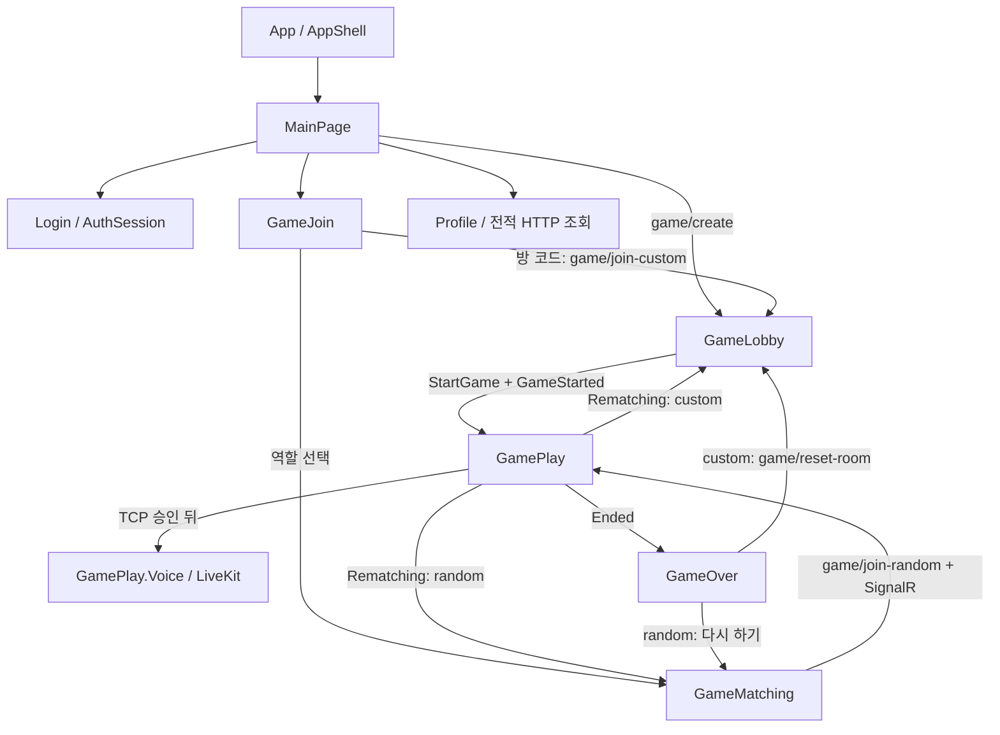
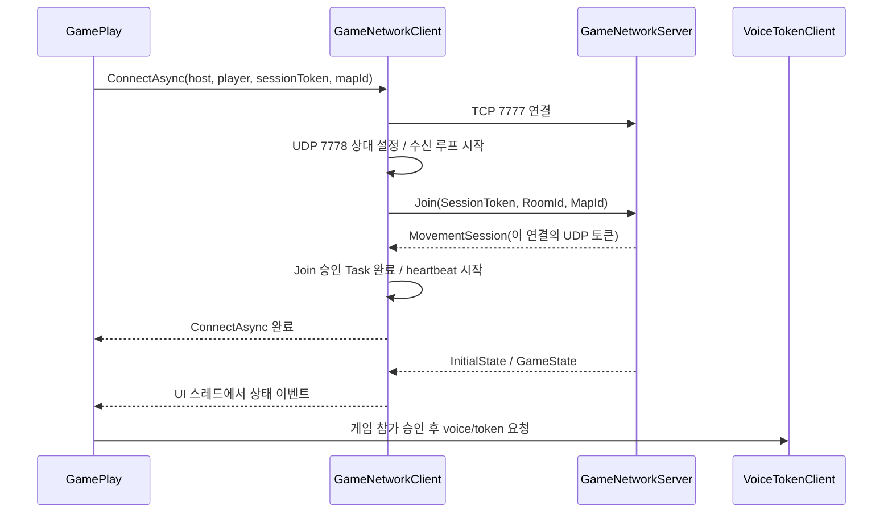
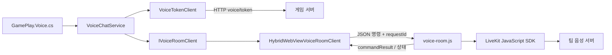

# 4. 클라이언트: 로그인부터 한 경기, 결과 화면, 팀 음성까지

[전체 코드 해설 문서로 돌아가기](../code-guide.md)

> 기준: 이 문서를 작성할 때의 작업 디렉터리 소스. `polrob.Client`의 작성된 C# 파일 39개와 음성 JavaScript를 확인했다. XAML의 배치·색상·그림 자체는 생략하되 화면 코드비하인드의 통신, 상태 관리, 화면 수명, 게임 동작은 설명한다. 링크의 `#L숫자`는 이 시점의 소스 위치다. 생성된 `obj`·`bin` 소스는 별도 작성 코드로 세지 않는다.

## 이 장의 목차

- [4.1 클라이언트의 책임과 실행 흐름](#41-클라이언트의-책임과-실행-흐름)
- [4.2 로그인과 세션](#42-로그인과-세션)
- [4.3 방 생성·입장·매칭·로비](#43-방-생성입장매칭로비)
- [4.4 게임 전용 TCP·UDP 통신](#44-게임-전용-tcpudp-통신)
- [4.5 GamePlay의 상태·입력·이동·판정 반영](#45-gameplay의-상태입력이동판정-반영)
- [4.6 종료·재대결·프로필 전적](#46-종료재대결프로필-전적)
- [4.7 팀 음성의 전체 구조](#47-팀-음성의-전체-구조)
- [4.8 맵 렌더링과 자원 수명](#48-맵-렌더링과-자원-수명)
- [4.9 설정·진동·시작 측정·앱 진입점](#49-설정진동시작-측정앱-진입점)
- [4.10 코드를 읽을 때 놓치기 쉬운 현재 구현의 한계](#410-코드를-읽을-때-놓치기-쉬운-현재-구현의-한계)
- [4.11 모든 클라이언트 C# 파일의 설명 범위](#411-모든-클라이언트-c-파일의-설명-범위)

## 4.1 클라이언트의 책임과 실행 흐름

이 프로젝트의 클라이언트는 .NET MAUI 앱이다. 버튼 클릭은 C# 코드비하인드로 들어오고, 게임 장면은 SkiaSharp의 `SKCanvasView`가 그린다. 로그인·방 요청·전적 조회는 HTTP, 방 대기 상태는 SignalR, 실제 경기 상태는 별도의 TCP·UDP 소켓으로 받는다. 음성은 화면 안의 작은 `HybridWebView`에서 LiveKit JavaScript SDK를 실행한다.

따라서 “클라이언트가 서버에 연결됐다”는 말은 하나의 연결을 뜻하지 않는다. 아래 연결은 서로 다른 수명과 목적을 갖는다.

| 통로 | 시작하는 코드 | 주고받는 내용 | 끝나는 시점 |
|---|---|---|---|
| HTTP | `Login`, `MainPage`, `GameJoin`, `GameMatching`, `GameOver`, `Profile`, `VoiceTokenClient` | 로그인, 방 작업, 전적, 음성 참가 토큰 | 요청별 응답 완료; 일부 `HttpClient`는 재사용 |
| SignalR `hubs/game-room` | `GameMatching`, `GameLobby`, `GameOver` | 대기실 인원·팀·방장·시작 알림, 방 퇴장 | 경기 진입 또는 해당 화면의 명시적 퇴장 |
| TCP 7777 | `GameNetworkClient.ConnectAsync` | 경기 입장, 전체/개별 상태, 체포·구출, 게임 단계, heartbeat | 게임 종료·화면 이탈·연결 실패 |
| UDP 7778 | 같은 메서드 | 클라이언트의 이동 입력, 서버의 이동 결과 | TCP와 같은 게임 클라이언트 수명 |
| LiveKit 연결 | `GamePlay.Voice` → `VoiceChatService` → WebView | 팀 음성, 발화자·마이크 상태 | 게임 화면 이탈·앱 백그라운드·음성 연결 종료 |



화면 클래스가 단순한 그림 묶음만은 아니다. 예를 들어 `GamePlay.xaml.cs`에는 게임 상태 사전·입력 처리·예측 이동·서버 동기화·종료 전환이 함께 들어 있고, `GamePlay.Voice.cs`는 같은 `partial class GamePlay`의 음성 부분이다. 두 파일은 인스턴스를 따로 만드는 관계가 아니라 **한 객체의 코드를 둘로 나눠 둔 것**이다.

클라이언트의 이동·체포 표시와 서버의 권위도 구분해야 한다. 사용자가 조이스틱을 움직이면 클라이언트는 곧바로 자기 캐릭터를 움직여 반응을 보여 주지만, 최종 위치·수감·경기 종료는 서버가 내려준 상태를 반영한다. 클라이언트에는 승패를 확정하거나 게임 기록을 DB에 저장하는 기능이 없다.

## 4.2 로그인과 세션

### 4.2.1 AuthSession은 앱 전체가 공유하는 로그인 상태다

[AuthSession.cs](../../polrob.Client/AuthSession.cs#L8)는 정적 클래스다. 화면마다 로그인 정보를 따로 가지고 서버 응답과 어긋나는 상황을 줄이기 위해 `SessionToken`, `UserId`, `Name`을 중앙에서 제공한다.

`IsLoggedIn`은 토큰과 사용자 ID가 모두 비어 있지 않은지 확인한다. **서버에 유효성을 물어보는 함수는 아니다.** 앱 재실행 뒤 저장된 값이 있어도 서버가 그 토큰을 만료시켰다면 다음 인증 요청에서 401이 나올 수 있다.

저장 위치는 다음과 같다.

| 값 | 메모리 | 기기 저장소 |
|---|---|---|
| 세션 토큰 | `AuthSession.SessionToken` | `SecureStorage`의 `sessionToken` |
| 사용자 ID | `AuthSession.UserId` | `Preferences`의 `userId` |
| 표시 이름 | `AuthSession.Name` | `Preferences`의 `name` |

[LoadAsync](../../polrob.Client/AuthSession.cs#L27)는 `_isLoaded`를 먼저 검사하고, 아직 읽지 않았으면 `SemaphoreSlim`을 기다린다. 잠금 안에서 `_isLoaded`를 다시 검사하는 이유는 첫 번째 검사 직후 다른 화면이 먼저 읽기를 끝낼 수 있기 때문이다. 첫 화면과 프로필이 거의 동시에 호출해도 실제 기기 저장소 읽기는 한 작업만 수행한다. 성공하면 `Changed` 이벤트를 보낸다.

[SetLoggedInAsync](../../polrob.Client/AuthSession.cs#L55)는 서버에서 받은 세 값을 메모리에 넣고 기기 저장소에 보관한 다음 `Changed`를 발생시킨다. 현재 순서는 메모리 갱신이 저장소 쓰기보다 먼저다. 저장소 쓰기가 예외를 던졌을 때 메모리를 이전 상태로 되돌리는 트랜잭션은 없다.

[LogoutAsync](../../polrob.Client/AuthSession.cs#L69)는 가능한 경우 `auth/logout`에 토큰을 보낸 뒤 `ClearLocalSession`을 호출한다. 서버에 연결하지 못해도 로컬 로그아웃은 완료한다. `ClearLocalSession`은 현재 키뿐 아니라 예전 키 이름인 `playerId`, `loginId`, `displayName`도 제거하고 상태 변경 이벤트를 보낸다.

[ApplyAuthorization](../../polrob.Client/AuthSession.cs#L107)은 `Authorization: Bearer <세션 토큰>`을 `HttpClient.DefaultRequestHeaders`에 설정한다. 토큰이 없으면 헤더도 비운다. `ApiBaseUrl`과 `GameServerHost`는 각각 HTTP용 주소와 게임 소켓용 호스트를 제공한다. HTTP 주소 설정을 바꿨다고 게임 소켓 주소까지 자동으로 같은 URL을 해석해 사용하는 구조는 아니다.

### 4.2.2 Login은 회원가입과 로그인 요청을 한 화면에서 처리한다

[Login.xaml.cs](../../polrob.Client/Login.xaml.cs#L6)의 `_isSignUpMode`가 현재 입력 동작을 결정한다.

1. `OnContinueClicked`가 모드를 확인한다.
2. 가입 모드면 `SignUpAsync`가 이름의 앞뒤 공백을 제거하고 이름이 있는지, 비밀번호 확인이 일치하는지 검사한다.
3. 로그인 모드면 `LoginAsync`가 이름·비밀번호를 요청 객체로 만든다.
4. 두 경로 모두 `SendAuthRequestAsync`를 이용한다.

[SendAuthRequestAsync](../../polrob.Client/Login.xaml.cs#L92)는 `auth/signup` 또는 `auth/login`에 JSON을 POST한다. 정상 응답을 `LoginResponse(SessionToken, UserId, Name)`로 읽고 `AuthSession.SetLoggedInAsync`에 넘긴 후 `//MainPage`로 이동한다. 가입 성공 응답도 동일한 로그인 응답 형식을 사용하므로 가입 직후 로그인 상태가 된다.

요청 중에는 계속 버튼과 모드 전환 버튼을 비활성화한다. HTTP 클라이언트의 10초 제한에 걸리면 시간 초과, `HttpRequestException`이면 연결 오류, 그 밖의 예외면 로그인 처리 오류를 표시한다. 성공하지 않은 HTTP 응답은 본문 문자열을 읽어 표시하고, 비어 있으면 상태 코드를 넣는다. 클라이언트의 가입 검증은 사용자 편의용이며 비밀번호 정책의 최종 검증은 서버 책임이다.

### 4.2.3 MainPage는 로그인 상태를 관찰한다

[MainPage.OnAppearing](../../polrob.Client/MainPage.xaml.cs#L22)은 `AuthSession.Changed` 구독을 정리한 뒤 다시 등록하고, 저장된 로그인 정보를 읽고, 로그인/프로필 표시를 갱신한다. 화면이 사라질 때 이벤트를 해제한다. 메인 화면이 최초 마이크 권한 요청의 진입점인 점도 중요하다. 게임에 들어갈 때마다 시스템 권한 창을 띄우지 않도록 `GameSettings.RequestMicrophonePermissionOnFirstLaunchAsync`를 여기에서 호출한다.

## 4.3 방 생성·입장·매칭·로비

### 4.3.1 실제 커스텀 방 생성은 MainPage가 담당한다

[MainPage.OnCreateClicked](../../polrob.Client/MainPage.xaml.cs#L53)는 로그인을 확인한 다음 다음 내용으로 `game/create`를 호출한다.

```text
Type = "custom"
Role = Police
IsPrivate = true
MapId = 선택한 MapRegistry 항목, 없으면 기본 맵
```

즉 현재 메인 화면에서 만든 방은 비공개 커스텀 방이고 생성자는 경찰로 요청한다. 성공 응답에 `Success=true`와 `RoomId`가 있어야 로비로 이동한다. `roomId`, `roomCode`는 URI 인코딩하고 역할과 `isHost=true`를 쿼리 값으로 넘긴다. 401이면 로컬 세션을 지우고 로그인 화면으로 보낸다.

이름이 비슷한 [GameCreate.xaml.cs](../../polrob.Client/GameCreate.xaml.cs#L3)는 현재 실제 생성 요청을 구현하지 않는다. `OnRandomClicked`는 빈 자리이며 `OnCustomClicked`는 방 ID 없이 `GameLobby`로 이동한다. **현재 정상 방 생성 경로를 추적하려면 `MainPage.OnCreateClicked`를 읽어야 한다.** `GameCreate`만 읽고 생성 기능이 완성되었다고 해석하면 안 된다.

### 4.3.2 GameJoin은 참가 방법과 역할을 결정한다

[GameJoin.xaml.cs](../../polrob.Client/GameJoin.xaml.cs#L8)은 랜덤 참가와 방 코드 참가를 나눈다.

랜덤 참가에서는 `_selectedRole`이 처음에 `null`이다. 경찰 또는 도둑을 선택해야 매칭 버튼이 동작하고, `GameMatching?role=...`로 이동한다. 이 화면에서 랜덤 방 HTTP 요청까지 수행하지는 않는다.

커스텀 참가의 [OnJoinCustomClicked](../../polrob.Client/GameJoin.xaml.cs#L65)는 다음 순서다.

1. 로그인 확인.
2. 방 코드의 앞뒤 공백·일반 공백을 제거하고 대문자로 정규화.
3. 코드가 비었으면 중단.
4. `game/join-custom`에 `RoomCode`, 기본 요청 역할 `Robber`를 POST.
5. 성공 응답의 `RoomId`, `RoomCode`, `Role`을 사용해 `GameLobby`로 이동.

서버가 반환한 역할이 있으면 그것을 따른다. 요청 시 도둑으로 보냈다고 이후 로비의 역할까지 고정된 것은 아니다. 텍스트 변경 이벤트에서도 같은 정규화를 수행하므로 화면 표시 코드와 요청 코드가 일치한다.

역할 그림 로딩은 최초 한 번 수행한다. 패키지 스트림을 메모리의 `byte[]`로 복사하고 `ImageSource.FromStream`에는 매번 새 `MemoryStream`을 반환하는 함수를 준다. 이미 닫힌 최초 패키지 스트림을 이미지 컨트롤이 나중에 다시 읽는 문제를 피하는 방식이다.

### 4.3.3 GameMatching: HTTP로 자리 확보, SignalR로 대기 상태 수신

[GameMatching.OnAppearing](../../polrob.Client/GameMatching.xaml.cs#L46)는 `_hasRequestedMatching`으로 같은 페이지에서 중복 참가 요청을 막는다. 로그인 상태를 확인한 뒤 [JoinRandomGameAsync](../../polrob.Client/GameMatching.xaml.cs#L170)가 `game/join-random`에 선택 역할을 POST한다.

성공하면 방 ID와 `Matched`, 인원 수를 기억하고 [StartRoomUpdatesAsync](../../polrob.Client/GameMatching.xaml.cs#L240)에서 SignalR에 연결한다. `AccessTokenProvider`는 `AuthSession.SessionToken`을 제공한다. 시작 후 `JoinRoom(roomId)`를 호출해야 이 방의 알림을 받는다.

| 받은 SignalR 이벤트 | 클라이언트 반응 |
|---|---|
| `RoomStatusUpdated` 성공 | 인원 수와 `_isMatched` 갱신; 매칭 완료면 게임 이동 |
| `RoomStatusUpdated` 실패 | 오류 문구 표시, 진행 표시 중지 |
| `GameStarted` 성공 + `Matched` | 게임 이동 |
| `Reconnected` | 현재 방의 `JoinRoom`을 다시 호출 |

`WithAutomaticReconnect()`는 SignalR 재연결 기능을 활성화하지만, 앱의 방 그룹 참가까지 자동으로 복원하는 것은 아니므로 `Reconnected`에서 `JoinRoom`을 다시 한다. 최초 `StartAsync`가 실패했을 때 앱 코드가 이를 계속 반복 호출하는 루프는 없다. 따라서 자동 재연결 설정을 최초 접속 실패까지 무한 재시도한다는 의미로 읽으면 안 된다.

[NavigateToGameAsync](../../polrob.Client/GameMatching.xaml.cs#L300)는 `_isNavigatingToGame`으로 중복 화면 이동을 막는다. `RoomStatusUpdated`와 `GameStarted`가 가까운 시간에 모두 와도 한 번만 이동하려는 장치다. 플레이어는 방에 남겨 두고 SignalR 구독만 종료한 뒤 `GamePlay?gameType=random`으로 이동한다.

[DisconnectRoomUpdatesAsync](../../polrob.Client/GameMatching.xaml.cs#L321)의 `removePlayer`가 중요한 구분이다.

- 매칭 취소이고 아직 매칭 전이면 `CancelMatching`: 대기 중인 플레이어를 방에서 제거한다.
- 경기 진입 또는 이미 매칭됨이면 `LeaveRoom`: SignalR 방 구독만 떠난다.
- 화면이 사라지면 `_isMatched`에 따라 제거 여부를 정한다.

시각적인 원형 인원 표시는 `MatchingCapacity=6`으로 제한되어 있다. `UpdateMatchingCount`는 `maxCount` 매개변수를 받아도 실제 상한은 이 상수 6을 사용한다. 서버 정원이 바뀌어도 이 화면의 원형 슬롯 수가 저절로 바뀌지는 않는다.

### 4.3.4 GameLobby는 방의 최신 상태를 기준으로 동작한다

[GameLobby](../../polrob.Client/GameLobby.xaml.cs#L8)는 쿼리에서 방 ID·코드·역할·방장 여부를 받는다. 이 값은 최초 표시를 위한 출발점이고, [ApplyRoomStatus](../../polrob.Client/GameLobby.xaml.cs#L273)가 서버 상태를 받으면 다음 값을 다시 계산한다.

- `HostUserId == AuthSession.UserId`이면 현재 사용자가 방장.
- `Players`에서 자기 ID를 찾아 현재 역할 갱신.
- 경찰과 도둑이 각각 한 명 이상이면 `_canStartGame=true`.
- 맵 ID가 클라이언트 `MapRegistry`에 없으면 지원하지 않는 맵으로 표시.
- 경찰·도둑 목록을 다시 구성.

시작 버튼은 `방장 && 양쪽 역할 존재`일 때 보인다. 이것은 클라이언트 표시 조건이고 실제 시작 허용 여부는 서버가 다시 판단한다.

[StartRoomUpdatesAsync](../../polrob.Client/GameLobby.xaml.cs#L221)는 WebSocket만 허용하고 negotiation을 생략한 SignalR 연결을 만든다. `GameMatching`의 기본 전송 설정과 다르다. `RoomStatusUpdated`는 상태 표시, `GameStarted`는 게임 진입을 담당한다. 역할 변경은 [ChangeRoleAsync](../../polrob.Client/GameLobby.xaml.cs#L316)의 `ChangeRole(roomId, role)`, 시작은 [OnGameStartClicked](../../polrob.Client/GameLobby.xaml.cs#L204)의 `StartGame(roomId)` 호출이다. 버튼을 눌렀다고 클라이언트가 먼저 서버 역할을 확정하지 않고, 다음 방 상태 응답이 실제 역할을 정한다.

로비의 홈 버튼에는 별도 확인 절차가 있다. [LeaveRoomForHomeAsync](../../polrob.Client/GameLobby.xaml.cs#L111)는 `CancelMatchingWithAcknowledgement(roomId)`를 호출하고 `ServerResponse.Success=true`를 받아야 홈으로 이동한다. 연결이 끊겼거나 응답이 없거나 서버가 실패했다고 하면 로비에 남는다. 사용자는 나갔다고 생각하는데 서버에는 계속 참가자로 남는 상황을 줄이려는 처리다.

경기 시작에 따른 [NavigateToGameAsync](../../polrob.Client/GameLobby.xaml.cs#L435)는 `removePlayer:false`로 SignalR 구독을 정리하고 방 정보를 `GamePlay`에 넘긴다. `GameLobby`에는 일반 `OnDisappearing` 정리 메서드가 없다. 프로필을 열었을 때도 연결을 유지할 수 있으며, 정상적인 경기/홈 전환은 명시적 정리 경로를 사용한다.

## 4.4 게임 전용 TCP·UDP 통신

### 4.4.1 ConnectAsync가 끝났다는 의미

[GameNetworkClient.ConnectAsync](../../polrob.Client/Network/GameNetworkClient.cs#L40)는 다음 과정을 수행한다.



소켓 연결만 완료된 것으로는 서버가 게임 참가자 등록을 끝냈다고 할 수 없다. 그래서 `_joinAcknowledged`라는 `TaskCompletionSource`를 두고 서버의 `MovementSession` 메시지를 최대 10초 기다린다. 이것을 받은 뒤에야 `ConnectAsync`가 정상 완료된다. 음성 토큰 요청이 게임 참가자 등록보다 먼저 도착해 403이 발생하는 순서 문제를 막는다.

`MovementSession`은 로그인 세션 토큰과 별개다. 로그인 토큰은 TCP 입장 인증에 보내고, 입장 승인으로 받은 이동 토큰은 이후 UDP 입력마다 보낸다. 새 연결을 시작할 때 입력 시퀀스를 0으로, 이동 토큰을 빈 문자열로 초기화한다.

### 4.4.2 TCP 프레임의 실제 형태

[SendTcp](../../polrob.Client/Network/GameNetworkClient.cs#L91)는 `BinaryWriter`로 다음 순서를 쓴다.

```text
[Int32: 뒤따르는 바이트 수]
[Byte: TcpMessageType]
[BinaryWriter 문자열: 7-bit 길이 prefix + UTF-8 payload]
```

문자열 길이를 `payload.Length`로 계산하면 한글 같은 멀티바이트 문자가 틀어질 수 있으므로 실제 UTF-8 바이트 수를 센다. 문자열 길이 prefix 자체도 128바이트 이상부터 여러 바이트가 되므로 그 크기를 계산해 전체 길이에 포함한다. 여러 발신 경로가 동시에 같은 스트림에 써도 메시지 바이트가 섞이지 않도록 `_writer`를 잠근다.

[ReceiveTcpLoop](../../polrob.Client/Network/GameNetworkClient.cs#L178)는 `ReadInt32 → ReadByte → ReadString` 순서로 읽는다. 현재 클라이언트는 읽은 `length` 값을 따로 검증하거나 payload 읽기 제한에 사용하지 않는다. 서버와 프레임 형식이 맞는 연결을 전제로 읽는 구현이다.

`MovementSession`과 `HeartbeatAcknowledged`는 수신 루프에서 바로 처리한다. 나머지는 `MainThread.BeginInvokeOnMainThread`로 전달한다. 페이지가 보유한 `_players`나 MAUI 컨트롤을 UI 스레드에서 갱신하기 위한 경계다.

| TCP 종류 | GameNetworkClient 이벤트/처리 | 게임 화면에서 쓰는 의미 |
|---|---|---|
| `MovementSession` | 이동 토큰 저장, 입장 대기 완료 | 게임 서버 등록 완료 |
| `HeartbeatAcknowledged` | 요청 ID의 대기 완료 | 연결/활성 등록 확인 |
| `InitialState` | `OnInitialStateReceived(List<Player>)` | 이 클라이언트가 알아야 할 플레이어 상태 교체 |
| `Joined` | `OnPlayerJoined(Player)` | 새로 보이는 플레이어 추가 |
| `Left` | `OnPlayerLeft(id)` | 제거 또는 체포 연출 종료까지 제거 지연 |
| `PlayerState` | `OnPlayerMoved(Player)` | 위치 외 역할·속도·수감 등 전체 상태 갱신 |
| `Arrested` | `OnPlayerArrested(policeId, robberId)` | 2초 체포 연출 |
| `JailBreak` | `OnPlayerJailBroken(JailBreakSync)` | 구출된 도둑 위치·수감 상태 갱신 |
| `JailBreakProgress` | `OnJailBreakProgressReceived` | 구조자별 구출 진행률 |
| `GameState` | `OnGameStateReceived` | 대기·카운트다운·진행·종료·재매칭 |
| `OpponentProximity` | `OnOpponentProximityReceived` | 상대 좌표 대신 근접 진동 단계 |

`Arrested`의 payload는 JSON 객체가 아니라 `policeId,robberId` 문자열이며, 쉼표로 나눴을 때 정확히 두 항목이어야 이벤트를 발생시킨다. `OnPlayerMoved`라는 이름은 이동 전용처럼 보이지만 실제로는 전체 `PlayerState` 반영 경로라는 점에 주의한다.

### 4.4.3 UDP로 보내는 것은 위치가 아니라 입력이다

[SendMoveUdp](../../polrob.Client/Network/GameNetworkClient.cs#L109)는 다음 형태의 `PlayerMovementInput`을 보낸다.

```json
{"i":"내 사용자 ID","x":0.6,"y":0.0,"s":42,"t":"입장 후 받은 이동 토큰"}
```

`x`, `y`는 이동 방향/세기이고 현재 세계 좌표가 아니다. `s`는 입력을 보낼 때 증가하는 `ulong` 시퀀스다. 동일 패킷의 재전송이나 순서 역전을 서버가 판단할 수 있도록 보낸다. `t`는 현재 TCP 입장에 대응하는 이동 토큰이다. 압축된 필드 이름은 [PlayerMovementInput](../../polrob.Shared/Models/PlayerMovementInput.cs#L6)에 정의되어 있다.

서버에서 오는 [PlayerMovementSync](../../polrob.Shared/Models/PlayerMovementSync.cs#L5)는 같은 `x`, `y` 이름을 **결과 좌표**로 사용하며, `a`는 각도, `m`은 이동 중 여부다. 송신 입력과 수신 결과는 필드 이름 일부가 같아도 의미가 다르다.

[ReceiveUdpLoop](../../polrob.Client/Network/GameNetworkClient.cs#L303)는 먼저 압축된 이동 DTO로 해석하고 유효한 ID가 있으면 `OnPlayerMovementReceived`를 호출한다. 아니면 예전 전체 `Player` 형식으로 해석해 `OnPlayerMoved`로 전달한다. 전체 `Player`의 JSON은 `Id` 등 원래 프로퍼티 이름을 쓰므로 압축 DTO의 `i`와 구분된다. DTO에 서버 tick/시간이나 결과 패킷 시퀀스는 없다. 클라이언트 보간은 수신 시각을 사용한다.

UDP 오류는 로그를 남기고 수신을 계속 시도한다. UDP 한 번 실패했다고 TCP 연결까지 끊지는 않는다. 반면 TCP 수신 실패나 heartbeat 실패는 연결 실패로 처리한다.

### 4.4.4 heartbeat와 연결 종료

[RefreshServerRegistrationAsync](../../polrob.Client/Network/GameNetworkClient.cs#L149)는 새 요청 ID를 만들고 `_heartbeatAcknowledgements`에 대기 객체를 등록한 뒤 TCP `Heartbeat`를 보낸다. 같은 ID의 확인 응답을 최대 5초 기다리고, 성공·실패와 관계없이 사전에서 제거한다.

[RunHeartbeatLoopAsync](../../polrob.Client/Network/GameNetworkClient.cs#L283)는 10초 기다린 뒤 이 메서드를 호출한다. 앱이 백그라운드에서 돌아왔을 때는 페이지도 직접 호출하여 서버의 활성 참가 등록을 갱신한 뒤 음성 토큰을 요청한다.

서버의 [ActiveGameParticipantRegistry](../../polrob.Server/Network/ActiveGameParticipantRegistry.cs#L5)는 최근 입장/heartbeat 시각이 기본 45초 이내인 연결을 음성 토큰 발급 시 활성 연결로 인정한다. 기간이 지났다는 조회만으로 항목을 삭제하지 않으며, 같은 `ConnectionId`의 유효한 heartbeat가 뒤늦게 오면 `Refresh`로 다시 활성화할 수 있다. 새 연결로 교체된 이후의 예전 `ConnectionId`는 갱신할 수 없다. 이 등록부는 최근 활동의 기록이고, 토큰 요청 순간 실제 소켓에 생존 확인을 보내는 기능은 아니다.

[ReportConnectionLost](../../polrob.Client/Network/GameNetworkClient.cs#L269)는 `Interlocked.Exchange`로 동일 실패를 한 번만 보고한다. 입장이 완료되기 전의 실패는 `ConnectAsync`가 예외로 받으며, 이미 참가한 뒤 끊겼다면 UI 스레드에서 `OnConnectionLost` 이벤트를 보낸다.

[Disconnect](../../polrob.Client/Network/GameNetworkClient.cs#L125)는 입장 대기·heartbeat 대기를 취소하고, heartbeat 취소 토큰·UDP·TCP·reader·writer를 정리한다. 정상 종료도 동일 정리 메서드를 사용한다. 여기에는 서버 방을 삭제하는 HTTP 요청이 없다. 게임 연결 종료와 로비 참가자 제거는 서로 다른 계층의 일이다.

## 4.5 GamePlay의 상태·입력·이동·판정 반영

### 4.5.1 주요 필드가 뜻하는 것

[GamePlay.xaml.cs](../../polrob.Client/GamePlay.xaml.cs#L17)의 필드는 게임의 서로 다른 시간축을 담고 있다.

| 필드 | 의미 |
|---|---|
| `_player` | 자기 캐릭터; 예측 이동과 서버 보정의 대상 |
| `_players` | 현재 클라이언트가 알고 있는 플레이어 사전; 항상 방 전체 인원이 있다고 가정하면 안 됨 |
| `_gameMap` | 선택된 맵의 공통 정의와 충돌 조회 |
| `_gamePhase`, `_remainingTime`, `_winnerRole` | 서버가 알려 준 경기 진행 상태 |
| `_totalRobberCount`, `_jailedRobberCount` | 서버가 집계한 전체/수감 도둑 수 |
| `_activeTouchId`, `_joystickCenter`, `_joystickThumb` | 현재 조이스틱으로 인정한 한 손가락과 입력 기준점 |
| `_remotePlayerInterpolations` | 타인의 최근 수신 위치를 잠시 보관하는 버퍼 |
| `_arrestVisualTimers` | 체포/체포당함 연출이 끝날 클라이언트 시각 |
| `_deferredPlayerRemovals` | 서버가 제거하라고 했지만 체포 연출 때문에 잠시 남긴 ID |
| `_jailBreakProgressByRescuer` | 서버가 보낸 구조자별 구출 진행률 |
| `_isInitialized` | 최초 플레이어 상태를 받았는지 |
| `_isGameOverTransitioning` | 종료/재매칭 화면 이동 중복 방지 |

`_players`는 화면에 보여 줄 수 있는 상태의 집합이고, 전체 경기 통계는 별도의 서버 값이다. 따라서 `_players`에 있는 도둑 수를 세어 감옥 인원 표시나 승패를 결정하지 않는다.

### 4.5.2 생성자와 OnAppearing의 순서

[생성자](../../polrob.Client/GamePlay.xaml.cs#L151)는 기본 맵과 임시 로컬 `Player`, 캔버스, 16ms 간격 dispatcher timer를 만든다. 기본 맵 크기가 `10×256`, `15×256`과 일치하는지 검사하는 방어 코드도 있다. `Player.Speed` 같은 실제 경기 속성은 이후 서버 초기 상태가 덮어쓴다.

타이머의 한 틱은 다음 순서다.

```text
지연 제거 대상 정리
→ 다른 플레이어의 위치 보간
→ 내 입력·예측 이동·UDP 송신
→ 근접 진동
→ 캔버스 다시 그리기 요청
→ 감옥 인원 UI 갱신
```

[OnAppearing](../../polrob.Client/GamePlay.xaml.cs#L203)은 다음 작업을 순서대로 기다린다.

1. 페이지의 음성/연결 취소 수명을 시작하고 창의 background/resume 이벤트를 연결한다.
2. 로그인 정보를 읽고 로컬 ID·이름·방·역할을 보정한다.
3. HTTP로 방의 맵을 확인한다.
4. 맵과 캐릭터 자산을 읽는다.
5. TCP 게임 입장 승인을 기다린다.
6. 승인 후 팀 음성에 참가한다.

이 순서는 기능상 필요하다. 서버 방의 맵을 모른 채 기본 맵 충돌로 플레이하면 이동 충돌이 어긋나고, TCP 입장 전에 음성 토큰을 요청하면 서버가 아직 활성 플레이어로 인정하지 않을 수 있다.

[LoadRoomMapAsync](../../polrob.Client/GamePlay.xaml.cs#L659)는 15초 제한의 HTTP 요청으로 `game/{roomId}/status`를 가져온다. 응답 성공과 `MapRegistry.Contains(MapId)`를 모두 요구한다. 페이지가 이미 사라졌다면 결과를 사용하지 않으며, 이미 자산을 읽은 페이지에서 맵 ID가 바뀌면 다시 입장하라는 오류를 낸다. 같은 페이지의 자산 사전과 충돌 맵이 서로 다른 맵으로 혼합되는 것을 막는다.

### 4.5.3 InitialState와 전체 PlayerState

[InitializeNetworkAsync](../../polrob.Client/GamePlay.xaml.cs#L236)는 새 `GameNetworkClient`에 콜백을 등록한다.

`InitialState`를 받으면 기존 플레이어·보간·지연 제거·체포 타이머·구출 진행 상태를 모두 비우고 서버 목록으로 교체한다. 그 목록에서 로컬 ID를 찾아 `_player` 참조도 교체하고 다른 플레이어의 보간 버퍼를 초기화한다. 이후 `_isInitialized=true`가 되어 실제 조작이 가능해진다.

`Joined`는 타인을 사전에 추가하고 보간을 초기화한다. 전체 `PlayerState`는 위치뿐 아니라 `Speed`, `Radius`, `IsJailed`, `Role`, 이름을 갱신한다. 자기 플레이어가 수감되었으면 조이스틱을 해제하고, 타인이면 기존 위치 버퍼를 초기화한다. 텔레포트·상태 전환을 이전 위치와 부드럽게 섞어서 그리지 않기 위한 처리다. 이름이나 역할이 바뀌면 음성 팀원 목록도 갱신한다.

`Left`를 받았다고 항상 즉시 제거하지는 않는다. 체포 연출이 아직 남았으면 `_deferredPlayerRemovals`에 넣고, [RemoveExpiredDeferredPlayers](../../polrob.Client/GamePlay.xaml.cs#L1042)가 이후 타이머 틱에서 실제로 지운다. 체포 메시지 직후 서버의 가시성 변화로 플레이어가 사라져 연출을 볼 수 없는 문제를 줄인다.

### 4.5.4 조이스틱 입력은 한 손가락만 추적한다

[Canvas_Touch](../../polrob.Client/GamePlay.xaml.cs#L777)는 `Playing` 단계에서만 입력을 받는다. 눌린 손가락이 없고 화면 왼쪽 아래를 누르면 그 위치가 조이스틱 중심이 된다. 따라서 고정 위치만 눌러야 하는 조이스틱이 아니라 터치 위치를 기준으로 생성되는 조이스틱이다.

움직일 때는 중심과 손가락 사이 벡터를 구한다. 반경 안이면 그대로 thumb 위치로 쓰고, 반경 밖이면 방향은 유지하면서 반경 길이로 제한한다. 누른 손가락의 ID와 다른 터치는 조작에 사용하지 않는다. 같은 ID가 해제되거나 취소되면 `_activeTouchId=-1`로 멈춘다.

일례로 반경이 150이고 중심에서 오른쪽으로 75 움직였다면 `inputX=0.5`, `inputY=0`이다. 대각선으로 반경 밖까지 밀어도 thumb를 원 안으로 제한하므로 정상 조이스틱 입력의 벡터 길이는 최대 1이다.

### 4.5.5 내 캐릭터: 즉시 예측하고 서버 좌표로 보정한다

[UpdatePhysics](../../polrob.Client/GamePlay.xaml.cs#L952)는 초기 상태를 받았고 단계가 `Playing`일 때만 이동을 처리한다. 다음 경우에는 입력을 이용한 이동이 없다.

- 손가락이 없음.
- 자신에게 2초 체포/체포 중 연출 타이머가 남아 있음.
- `IsJailed=true`.

유효한 입력이면 다음처럼 계산한다.

```text
inputX = clamp((thumb.X - center.X) / joystickRadius, -1, 1)
inputY = clamp((thumb.Y - center.Y) / joystickRadius, -1, 1)
moveX  = (thumb.X - center.X) / joystickRadius × Player.Speed
moveY  = (thumb.Y - center.Y) / joystickRadius × Player.Speed
```

여기에서 `Speed`는 이 클라이언트의 한 업데이트당 이동량에 곱해진다. 실제 경과 시간을 측정해 `deltaTime`을 곱하는 형태가 아니며, 현재 코드는 타이머가 약 16ms마다 돈다고 가정한다. 각도는 `atan2(dy,dx)`를 degree로 바꾸고 원본 스프라이트가 아래쪽을 보는 것을 맞추기 위해 90도를 뺀다.

먼저 반지름을 고려해 세계 바깥으로 나가지 않게 제한한다. 그 다음 X축 후보와 Y축 후보를 따로 충돌 검사한다. X가 막혀도 Y가 가능하면 Y로 이동할 수 있으므로 벽을 따라 미끄러진다. 충돌 검사는 [IsColliding](../../polrob.Client/GamePlay.xaml.cs#L1037)에서 `GameMap.IsMovementPositionBlocked`를 호출하며, 가까운 장애물 수집용 목록을 재사용한다.

입력은 매 프레임 보내지 않는다.

| 상태 | UDP 입력 송신 주기 |
|---|---|
| 이동 중 | 50ms |
| 멈춤 | 500ms |
| 이동 시작 또는 멈춤으로 변경 | 주기를 기다리지 않고 즉시 |

멈춤 패킷을 주기적으로도 보내므로 정지 순간의 UDP가 유실되어도 서버가 영원히 이전 입력을 유지하도록 방치하지 않는다. 다만 서버 자체의 입력 유효시간 정책도 별도로 작동한다.

서버에서 자기 ID의 이동 결과가 오면 `movement.ApplyTo(player)`로 현재 좌표·각도·이동 상태를 즉시 덮어쓴다. **미확인 입력을 저장했다가 서버가 처리한 입력 이후분을 재실행하는 방식은 구현되어 있지 않다.** 현재 방식은 “먼저 움직여 보이고, 서버 좌표가 오면 바로 맞춘다”이다. 따라서 지연이 높거나 프레임이 불규칙하면 보정 이동이 눈에 띌 수 있다.

### 4.5.6 다른 플레이어: 120ms 이전 모습을 보간한다

타인에게는 자기 캐릭터와 같은 입력 예측을 하지 않는다. [AddRemoteMovementSnapshot](../../polrob.Client/GamePlay.xaml.cs#L848)은 수신 결과의 위치·각도·이동 여부와 `DateTime.UtcNow`를 저장한다. 최대 4개를 유지한다.

[UpdateRemotePlayerInterpolation](../../polrob.Client/GamePlay.xaml.cs#L879)의 목표 렌더 시각은 `현재 UTC - 120ms`다. 이 시각 앞뒤의 두 결과를 찾고 선형 보간한다.

```text
t = (그릴 시각 - 이전 snapshot 시각) / (다음 시각 - 이전 시각)
x = 이전 x + (다음 x - 이전 x) × t
y = 이전 y + (다음 y - 이전 y) × t
```

예를 들어 10:00:00.000에 X=100, 10:00:00.050에 X=110이 도착했고 현재 시각이 10:00:00.145라면 목표 시각은 .025다. `t=0.5`이므로 X=105로 그린다. 120ms를 늦추는 것은 이미 받은 두 점 사이를 그릴 가능성을 높여 UDP 도착 간격의 흔들림을 가리기 위한 선택이다.

각도는 단순 숫자 평균을 쓰지 않는다. 350도에서 10도로 바뀌면 340도를 되돌아가는 대신 짧은 20도 방향으로 회전하도록 `ShortestAngleDifference`를 사용한다.

경계 상황은 다음과 같다.

- snapshot 하나뿐이면 그 위치를 쓴다.
- 목표 시각이 가장 최근 결과보다 뒤면 마지막 결과를 쓴다. 미래 위치를 계속 추측하는 외삽은 없다.
- 결과 간격이 250ms를 넘으면 이전 버퍼를 버리고 현재 화면 위치를 `수신시각-120ms`의 시작점으로 만들어 새 결과에 이어 붙인다.
- 전체 `PlayerState`, 구출 위치 같은 명확한 상태 전환은 보간 버퍼를 재설정한다.

snapshot의 시간은 서버 시각이 아니라 **클라이언트가 받은 시각**이다. 그러므로 이 보간은 네트워크 지연을 정확히 역산하거나 서로 다른 플레이어의 서버 tick을 맞추는 기능까지 제공하지 않는다.

### 4.5.7 체포·구출·게임 단계는 서버 이벤트를 반영한다

[TriggerArrestVisuals](../../polrob.Client/GamePlay.xaml.cs#L1930)는 경찰과 도둑 모두에게 2초 만료 시각을 기록한다. 로컬 사용자가 둘 중 하나면 중앙 체포 표시를 켜고 조이스틱을 해제한다. 이 메서드 자체에서 `IsJailed`를 확정하거나 감옥 좌표를 계산하지 않는다. 실제 수감 상태는 서버의 전체 상태를 따른다.

[ApplyJailBreak](../../polrob.Client/GamePlay.xaml.cs#L1869)는 서버가 준 도둑 ID와 위치를 찾아 적용하고 `IsJailed=false`, `IsMoving=false`, 각도 0으로 만든다. 해당 도둑의 체포 타이머와 구조자의 진행률을 지우고, 로컬 도둑이면 터치도 해제한다. 사용자가 구출 직후 이전에 누르고 있던 입력으로 갑자기 움직이는 일을 줄인다.

`JailBreakProgress`는 방 ID가 비어 있지 않으면서 현재 방과 다르면 버린다. 유효한 값은 구조자 ID별 진행률 사전으로 교체한다. 진행률은 도둑 화면에서만 표시하며, 수감되지 않은 도둑이 그 사전에 있으면 구출 자세 스프라이트를 선택한다. 클라이언트가 진행률을 시간에 따라 스스로 증가시켜 구출 성공을 선언하지 않는다.

`GameState`는 다음 동작을 한다.

| 단계 | 동작 |
|---|---|
| `Countdown` | 서버의 `CountdownTime`을 중앙에 표시; 0 이하면 Start |
| `Playing` | 카운트다운 문구 제거, 서버의 `GameTime` 표시 |
| `Ended` | 중복 방지 플래그를 세우고 GameOver 표시, 3초 후 게임/음성 정리 및 결과 화면 이동 |
| `Rematching` | 중복 방지 플래그를 세우고 1초 후 게임/음성 정리 및 로비/매칭 화면 이동 |

남은 시간을 화면 타이머가 독자적으로 줄이지 않고 서버의 `GameTime`을 사용한다. 도둑 수는 음수가 되지 않게 하고 수감 수는 `0..전체 수`로 제한한다. 이 값들을 [BuildGameOverRoute](../../polrob.Client/GamePlay.xaml.cs#L619)가 결과 화면 쿼리로 전달한다.

### 4.5.8 화면에 보이는 정보와 서버 가시성

[DrawPlayers](../../polrob.Client/GamePlay.xaml.cs#L1532)는 부쉬 안의 타인을 추가로 숨긴다. 자신이 같은 부쉬 안에 있으면 다시 보인다. 도둑이 보는 체포 중 경찰은 예외적으로 노출될 수 있다. 부쉬에서 보이는 플레이어는 반투명으로 그린다.

시야 부채꼴은 [DrawVisionOverlay](../../polrob.Client/GamePlay.xaml.cs#L1792)가 바닥 위에 어두운 레이어를 그린 뒤 앞쪽 90도를 지우는 표현이다. 범위는 `플레이어 지름 × 2.5`다. 이 레이어는 캐릭터와 오브젝트 아래에 그려진다. 따라서 이 어두운 그림만으로 상대 정보 전달을 보안상 차단한다고 이해하면 안 된다. 서버의 가시성 필터, `_players`에 실제로 들어온 데이터, 클라이언트의 부쉬 표시 조건을 함께 읽어야 한다.

서버의 [IsPlayerVisibleToTeam](../../polrob.Server/Network/GameNetworkServer.Transport.cs#L458)은 팀원 중 한 명이라도 상대를 시야 부채꼴에 넣으면 보이는 것으로 처리하며, 수감 도둑·체포 중 경찰에 대한 예외도 있다. 현재 이 상대 정보 전송 판정에는 벽 차폐 검사를 호출하지 않는다. 장애물의 선분 차폐 검사는 체포 판정에 사용된다. “화면이 어두움”, “팀 시야에 들어와 데이터가 전달됨”, “벽이 체포를 막음”은 서로 다른 처리다.

### 4.5.9 화면 이탈과 연결 실패

[OnDisappearing](../../polrob.Client/GamePlay.xaml.cs#L553)은 먼저 페이지의 음성 수명이 끝났음을 표시한다. 그 다음 게임 타이머·진동·소켓을 멈추고 자산 잠금을 획득해 활성 맵 renderer를 해제한다. 음성 종료 작업도 기다린다. 다른 정리 `await`를 먼저 하면 빠르게 다시 나타난 페이지의 새 음성 수명을 이전 종료 작업이 취소할 수 있으므로 순서가 중요하다.

[StopGameClient](../../polrob.Client/GamePlay.xaml.cs#L575)는 타이머를 정지하고 근접 진동을 끄고 소켓을 끊으며 타인 보간을 비운다. 맵 renderer 해제나 음성 종료는 호출한 쪽에서 별도로 수행한다.

게임 연결이 끊겼다는 이벤트는 처음 연결한 `connectedClient`와 현재 `_networkClient`가 같은지 확인한다. 이미 교체된 오래된 연결의 오류로 새 연결까지 종료하지 않기 위한 비교다. 진행 중 연결 실패면 게임·음성을 정리하고 `AuthSession.ClearLocalSession()`을 호출한 뒤 홈과 로그인 화면으로 이동한다. 이 경로는 서버 재시작 뒤 진행 중 경기를 그대로 복구하는 동작이 아니다.

## 4.6 종료·재대결·프로필 전적

### 4.6.1 GameOver에 표시되는 결과의 출처

[GameOver](../../polrob.Client/GameOver.xaml.cs#L18)는 `GamePlay`가 넘긴 승리 역할·남은 시간·수감 수·전체 도둑 수를 쿼리 속성으로 받는다. 정수 파싱 실패나 음수는 0으로 보정하고 표시할 수감 수는 전체 수를 넘지 않게 한다. 결과 화면이 DB에서 해당 경기 기록을 다시 조회하는 것은 아니다.

즉 결과 화면이 나타나는 경로와 프로필 전적이 갱신되는 경로는 다르다. 결과 화면은 게임 서버의 실시간 종료 메시지에서 온 값이고, 프로필은 별도 전적 API에서 읽는다.

### 4.6.2 랜덤 다시 하기와 커스텀 다시 하기

[OnPlayAgainClicked](../../polrob.Client/GameOver.xaml.cs#L168)는 로그인 상태를 확인한다. 랜덤 게임이면 같은 역할로 `GameMatching`에 간다. 커스텀 게임이면 [NavigateToCustomLobbyAsync](../../polrob.Client/GameOver.xaml.cs#L286)를 호출한다.

커스텀 경로는 `game/reset-room`에 현재 방 ID와 역할을 POST한다. 성공하면 반환된 방 코드·역할·방장 ID를 기준으로 새 로비 경로를 만든다. 과거의 `_isHost`를 무조건 유지하지 않고 서버의 `HostUserId`와 현재 사용자 ID를 비교해 방장을 다시 판단한다.

커스텀 결과 화면은 [OnAppearing](../../polrob.Client/GameOver.xaml.cs#L122)에서 5초 뒤 자동 복귀 타이머도 시작한다. 사용자가 버튼을 누르면 같은 로비 복귀 메서드를 사용하고 `_isNavigating`이 중복 요청을 막는다. 화면 이탈 또는 홈 이동 시 취소 토큰으로 자동 복귀를 중단한다.

### 4.6.3 결과 화면에서도 방에 남아 있음을 알린다

[StartRoomPresenceAsync](../../polrob.Client/GameOver.xaml.cs#L359)는 커스텀 게임의 결과 화면에서 SignalR `JoinRoom`을 유지한다. TCP 게임 연결을 끊은 이후에도 재대결에 참가할 사용자가 방에 남아 있음을 유지하는 통로다. 방 상태 이벤트로 방장 변경을 반영하고 재연결되면 다시 `JoinRoom`을 호출한다.

홈으로 가려면 [DisconnectRoomPresenceAsync(removePlayer:true)](../../polrob.Client/GameOver.xaml.cs#L437)가 로비와 동일한 `CancelMatchingWithAcknowledgement`를 받는다. 실패하면 이동을 취소하고 자동 복귀 타이머를 다시 시작한다. 정상 로비 전환에서는 `LeaveRoom`만 호출한다.

[OnDisappearing](../../polrob.Client/GameOver.xaml.cs#L488)에서는 자동 복귀를 취소하고 남은 연결을 폐기한다. 정상 홈/로비 이동은 이미 앞에서 명시적으로 처리한다. 다른 화면으로 떠난 경우에는 연결 종료에 따른 서버의 유예 정리에 맡긴다는 의도가 코드 주석에 나타나 있다.

### 4.6.4 Profile의 전적 조회는 오래된 응답을 버린다

[Profile.LoadGameStatsAsync](../../polrob.Client/Profile.xaml.cs#L72)는 단순 GET 이상의 상태 관리를 한다. 사용자가 새로 고침하거나 화면을 나갔다 돌아오거나 로그아웃했을 때 이전 응답이 현재 화면을 덮어쓰면 안 되기 때문이다.

조회 시작 시 다음을 기억한다.

- 요청 버전 `_statsRequestVersion`.
- 이 요청의 `CancellationTokenSource`.
- 요청 당시 세션 토큰과 사용자 ID.
- 프로필이 현재 보이는지 여부.

응답 직후와 JSON 역직렬화 후 [IsCurrentStatsRequest](../../polrob.Client/Profile.xaml.cs#L201)로 이 조건을 모두 확인한다. 예를 들어 사용자 A의 전적 요청이 늦게 도착했는데 이미 로그아웃 후 B로 로그인했다면 ID·토큰 비교에서 탈락하여 표시하지 않는다. `CancelStatsLoad`는 버전을 증가시키고 이전 취소 토큰을 취소한다.

[SendStatsRequestAsync](../../polrob.Client/Profile.xaml.cs#L158)는 `game-records/me/stats`를 최대 3번 시도한다. 매 요청마다 새 `HttpRequestMessage`를 만들고 **요청 당시 토큰을 그 메시지의 헤더에만 설정**한다. 전역 `HttpClient`의 인증 헤더를 경쟁적으로 바꾸지 않는다.

재시도 대상은 408, 429, 500, 502, 503, 504 또는 통신 예외다. 응답에 `Retry-After`의 시간 간격 값이 있으면 사용하고, 없으면 `300ms × 시도 번호`를 쓴다. 간격은 100ms~3초로 제한하며, 전체 조회는 15초 취소 토큰을 공유한다. 401은 재시도하지 않고 로그인 만료 처리한다.

[SetBreakdownLabels](../../polrob.Client/Profile.xaml.cs#L255)는 서버가 준 전체·경찰·도둑 통계를 표시하되 총 경기 수를 0 이상, 승·패를 `0..총 경기 수`, 승률을 유한한 `0..100` 값으로 보정한다. 여기서 승률을 게임 기록으로 다시 계산하지 않는다. 통계 계산 책임은 서버에 있다.

## 4.7 팀 음성의 전체 구조

### 4.7.1 C# 화면과 LiveKit SDK 사이의 층



[IVoiceRoomClient](../../polrob.Client/Voice/IVoiceRoomClient.cs#L7)는 연결·해제·내 마이크 음소거·상대 재생 음소거·전체 재생 볼륨·참가자 상태를 정의한다. 화면이 LiveKit SDK 타입을 직접 쓰지 않게 해 두었으므로 향후 네이티브 어댑터로 바꿀 때 게임 화면의 의존 범위를 줄일 수 있다.

[VoiceChatService](../../polrob.Client/Voice/VoiceChatService.cs#L3)는 참가 토큰 요청과 room 연결을 순서대로 묶는다. `JoinTeamVoiceAsync(roomId)`가 `VoiceTokenClient.GetConnectionInfoAsync`를 기다린 뒤 `IVoiceRoomClient.ConnectAsync`를 호출한다. 나머지 mute·볼륨·leave 함수와 이벤트는 어댑터로 전달한다. `DisposeAsync`는 연결을 해제하고 어댑터를 폐기한다.

[VoiceTokenClient](../../polrob.Client/Voice/VoiceTokenClient.cs#L7)는 로그인 토큰으로 `voice/token`에 방 ID만 보낸다. 응답은 `VoiceConnectionInfo`의 LiveKit 주소와 참가자 토큰이다. API key/secret을 클라이언트에서 만드는 구조가 아니다.

| 토큰 API 결과 | 사용자용 예외 메시지 의미 |
|---|---|
| 401 | 로그인 만료 |
| 403 | 이 게임방의 음성에 참가할 권한 없음 |
| 503 | 음성 서버 설정 미완료 |
| 그 밖의 5xx | 음성 서버 일시 오류 |
| 400 | 잘못된 요청 정보 |
| 성공이지만 본문 없음 | 접속 응답을 읽을 수 없음 |

[VoiceChatException](../../polrob.Client/Voice/VoiceChatException.cs#L3)은 음성 기능의 사용자용 오류를 구분한다. 게임 화면은 이 예외의 메시지는 표시하고, 일반 예외는 상세 내부 메시지 대신 재시도 문구로 바꾼다.

### 4.7.2 GamePlay.Voice의 수명과 잠금

[InitializeTeamVoiceControls](../../polrob.Client/GamePlay.Voice.cs#L35)는 플랫폼 WebView 구성을 연결하고 `HybridWebViewVoiceRoomClient`, `VoiceTokenClient`, `VoiceChatService`를 생성한다. 이 작업은 페이지 생성자에서 한 번 한다.

음성 연결 수명은 [BeginTeamVoiceLifetime](../../polrob.Client/GamePlay.Voice.cs#L47)부터 [StopTeamVoiceAsync](../../polrob.Client/GamePlay.Voice.cs#L113)까지다. 페이지가 다시 나타나면 새 `CancellationTokenSource`를 만들 수 있다. 수명 객체를 비교하는 이유는 예전 연결 시도가 나중에 완료되어 현재 페이지 상태를 잘못 바꾸는 일을 막기 위해서다.

| 동기화 필드 | 보호하는 것 |
|---|---|
| `_voiceLifetimeGate` | 페이지 활성 여부와 현재 취소 토큰의 짧은 동시 접근 |
| `_voiceConnectionLock` | 연결 시작과 연결 종료가 서로 뒤섞이지 않도록 순서 보장 |
| `_voiceToggleLock` | 여러 음소거 변경의 직렬 실행 |
| `_voiceStopTask` | 이미 종료 중이면 같은 종료 작업을 반환 |
| `_voiceReconnectGeneration` | 재연결 요청 중 새 요청이 들어왔는지 기억 |
| `_voiceReconnectWorkerRunning` | 재연결 worker가 동시에 여러 개 생기지 않도록 제한 |
| `_voiceRosterRefreshScheduled` | UI 목록 갱신을 한 UI 턴에 합치기 |

[InitializeTeamVoiceAsync](../../polrob.Client/GamePlay.Voice.cs#L61)는 연결 잠금을 잡고 현재 활성 수명과 서비스·방 ID를 확인한다. 토큰과 연결을 얻은 뒤에도 `IsCurrentTeamVoiceLifetime`으로 **그 연결을 시작할 때의 수명이 아직 현재인지** 확인한 후 연결 표시를 갱신한다.

[StopTeamVoiceAsync](../../polrob.Client/GamePlay.Voice.cs#L113)는 먼저 활성 상태를 false로 하고 취소를 보낸다. 실제 `LeaveAsync`는 연결 잠금을 기다리는 [StopTeamVoiceCoreAsync](../../polrob.Client/GamePlay.Voice.cs#L131)가 한다. 종료할 때 캡처한 취소 토큰만 해제하므로 새 수명이 시작되더라도 그 토큰까지 함께 버리지 않는다.

### 4.7.3 앱이 백그라운드로 가거나 돌아올 때

[AttachTeamVoiceWindowLifecycle](../../polrob.Client/GamePlay.Voice.cs#L175)는 MAUI `Window.Stopped`, `Window.Resumed`를 연결한다.

- `Stopped`: 음성이 활성 상태였는지 기억하고 음성을 종료한다. 이 handler가 게임 TCP를 명시적으로 끊는 것은 아니며, 운영체제의 백그라운드 실행 중단에 따라 heartbeat가 멈출 수 있다.
- `Resumed`: 이전에 활성 상태였다면 새 수명을 만들고, 먼저 게임 TCP의 활성 등록을 heartbeat로 확인한다. 실패하면 게임 네트워크를 다시 연결해 본다. 그 다음 새 음성 토큰으로 참가한다.

[RefreshOrReconnectGameNetworkAsync](../../polrob.Client/GamePlay.xaml.cs#L521)는 백그라운드 중 멈춘 heartbeat 때문에 서버가 활성 등록을 더 이상 인정하지 않는 상황을 고려한 코드다. 음성만 곧바로 재연결하면 `voice/token`이 403이 될 수 있으므로 게임 참가 확인이 앞선다.

heartbeat로 기존 연결의 등록을 새로 확인하는 경로와, TCP를 끊고 `InitializeNetworkAsync`로 새로 입장하는 경로도 구분해야 한다. 서버의 [HandleRoomJoin](../../polrob.Server/Network/GameNetworkServer.cs#L183)은 새 `PlayerSession`·이동 토큰을 만들고 스폰 위치를 배치하며 `IsJailed=false`로 설정한다. 그러므로 이 TCP 재입장을 이전 위치·수감 상태의 정확한 복원이라고 설명할 수 없다.

음성 연결 이벤트가 `Disconnected`이고 페이지가 아직 활성 상태면 [ScheduleTeamVoiceReconnect](../../polrob.Client/GamePlay.Voice.cs#L275)가 1초 뒤 재연결 작업을 예약한다. 연결 중 추가 단절 이벤트가 오면 generation을 증가시키고 worker가 그 요청도 처리한다. 이것은 무한 지수 백오프 반복기가 아니다. 요청된 단절 generation을 처리하고 새 요청이 없으면 끝나므로 최초 토큰 요청 실패 같은 모든 실패를 무조건 계속 재시도한다고 이해하면 안 된다.

### 4.7.4 팀원 목록은 게임 상태와 음성 상태를 합친 결과다

[RefreshTeamVoiceRoster](../../polrob.Client/GamePlay.Voice.cs#L339)는 `_players`에서 자기와 같은 역할만 추린다. 자기 자신이 사전에 없으면 추가한다. 중복 ID를 정리하고 자신을 맨 앞에, 나머지는 이름순으로 둔다.

그 후 `VoiceParticipantState.Identity`와 게임 `Player.Id`를 결합한다. 따라서 게임에는 참가했지만 음성에는 아직 연결하지 못한 팀원도 목록에 남을 수 있다. `VoiceMembers`는 `ObservableCollection<TeamVoiceMemberViewModel>`이고, 매번 전체 교체하기보다 기존 객체를 이동·수정·추가·제거한다.

[VoiceParticipantState](../../polrob.Client/Voice/VoiceParticipantState.cs#L4)는 식별자·이름·자기 여부·발화 여부·마이크 트랙 존재·음소거 여부를 담는다. [TeamVoiceMemberViewModel](../../polrob.Client/Voice/TeamVoiceMemberViewModel.cs#L8)은 이것을 화면 상태로 바꾸고 `INotifyPropertyChanged`를 구현한다. 값이 실제로 달라질 때만 알리며, `IsMuted`가 바뀌면 `StatusText`, `MuteGlyph`처럼 그 값에 의존하는 프로퍼티의 변경도 알린다.

[OnVoiceMemberTapped](../../polrob.Client/GamePlay.Voice.cs#L421)는 자신을 누르면 **내 마이크 송출**을 바꾸고, 타인을 누르면 **이 기기에서 듣는 그 사람의 재생**만 바꾼다. 타인의 마이크를 끄거나 다른 팀원의 듣기를 바꾸는 권한은 아니다. 음성이 연결된 행만 조작하고 완료될 때까지 `IsBusy`를 표시한다.

### 4.7.5 HybridWebViewVoiceRoomClient의 명령·응답 프로토콜

[HybridWebViewVoiceRoomClient](../../polrob.Client/Voice/HybridWebViewVoiceRoomClient.cs#L11)는 JavaScript에 JSON을 보내고, 같은 요청 ID의 완료 메시지를 기다리는 어댑터다.

예를 들어 내 마이크를 끄는 명령은 다음 모양이다.

```json
{"type":"setLocalMuted","requestId":"요청별 GUID","muted":true}
```

JavaScript는 다음처럼 응답한다.

```json
{"type":"commandResult","requestId":"같은 GUID","success":true}
```

[SendCommandAsync](../../polrob.Client/Voice/HybridWebViewVoiceRoomClient.cs#L202)의 순서는 다음과 같다.

1. 현재 bridge generation과 ready 대기 객체를 캡처한다.
2. JavaScript의 `ready`를 최대 20초 기다린다.
3. generation이 바뀌었다면 중단한다.
4. 요청 ID별 `TaskCompletionSource<VoiceCommandResult>`를 concurrent dictionary에 넣는다.
5. UI 스레드에서 `HybridWebView.SendRawMessage(json)`를 호출한다.
6. 명령 결과를 최대 30초 기다린다.
7. 성공이 false면 `VoiceChatException`으로 바꾸고, 마지막에는 사전의 요청을 제거한다.

`TaskCompletionSource`는 이미 존재하는 비동기 API를 호출하는 대신, **나중에 이벤트가 왔을 때 완료시킬 Task를 직접 만드는 도구**다. 그래서 버튼 코드는 이벤트를 수동으로 추적하지 않고 `await SetLocalMicrophoneMutedAsync(...)`처럼 쓸 수 있다.

[OnRawMessageReceived](../../polrob.Client/Voice/HybridWebViewVoiceRoomClient.cs#L297)는 다음 메시지를 처리한다.

| JS → C# 메시지 | 처리 |
|---|---|
| `ready` | WebView 준비 Task 완료 |
| `commandResult` | 요청 ID의 대기 완료 |
| `participants` | DTO를 공개 참가자 상태 배열로 바꾸고 변경 이벤트 |
| `connection` | 연결 상태·`IsConnected` 갱신 |
| `warning` | 경고 상태 이벤트 |
| `error` | 오류 상태 이벤트 |

참가자 배열은 lock 안에서 교체한다. `Participants`를 읽는 쪽은 안정된 배열 참조를 받는다. LiveKit의 `reconnecting`은 이 어댑터에서 `IsConnected=true`로 취급한다. 완전한 종료와 SDK 자체 복구 중을 구분하려는 의미다.

### 4.7.6 WebView 재생성과 마이크 권한

운영체제가 WebView를 다시 만들면 JS의 전역 변수·연결도 사라질 수 있다. [OnWebViewInitializing](../../polrob.Client/Voice/HybridWebViewVoiceRoomClient.cs#L265)은 ready 객체를 새 것으로 바꾸고 generation을 증가시키며, 이전 ready 대기와 진행 중 명령을 실패/취소시킨다. 이후 disconnected 이벤트로 상위 계층의 재연결을 유도한다. 오래된 JS 문맥을 대상으로 계속 명령을 보내는 일을 피한다.

[ConnectAsync](../../polrob.Client/Voice/HybridWebViewVoiceRoomClient.cs#L55)는 주소·참가 토큰을 확인하고, 현재 OS 마이크 권한을 확인한다. 이때 권한을 새로 요청하는 것이 아니라 `CheckStatusAsync`만 호출한다. 권한이 없으면 마이크를 발행하지 않고 수신 전용으로 참가한다.

기본 `_preferredLocalMicrophoneMuted`는 false이므로 권한이 있으면 최초 참가 시 마이크 켜기를 요청한다. 이후 사용자가 마이크를 끄면 선호 값이 저장되어 같은 어댑터의 재연결에 반영된다. 내 마이크를 다시 켜려는데 OS 권한이 없다면 명령을 보내기 전에 오류를 낸다.

[DisconnectAsync](../../polrob.Client/Voice/HybridWebViewVoiceRoomClient.cs#L153)는 WebView가 준비되었으면 disconnect 명령을 보내되 정리 전용 5초 제한을 둔다. WebView가 이미 없어졌어도 로컬 상태는 비운다. [DisposeAsync](../../polrob.Client/Voice/HybridWebViewVoiceRoomClient.cs#L183)는 추가로 WebView 이벤트 구독을 해제하고 진행 중 명령을 실패시킨다.

### 4.7.7 voice-room.js: 실제 음성 SDK를 움직이는 코드

[음성 HTML](../../polrob.Client/Resources/Raw/voice/index.html#L9)은 MAUI bridge script, 버전과 무결성 해시가 고정된 LiveKit UMD SDK, `voice-room.js`를 순서대로 로딩한다. SDK는 CDN에서 읽으므로 앱 패키지 안의 C# 코드가 정상이어도 SDK 로딩이 실패하면 음성 연결은 실패할 수 있다. HTML의 `audio-root`는 구독한 음성 재생 요소를 담는다. 보이는 채팅 UI를 렌더링하기 위한 WebView가 아니다.

[voice-room.js](../../polrob.Client/Resources/Raw/voice/voice-room.js#L1)의 핵심 상태는 다음과 같다.

| 값 | 의미 |
|---|---|
| `room` | 현재 LiveKit Room 인스턴스 |
| `connected` | room 연결 완료 여부 |
| `connectionGeneration` | 늦게 완료된 이전 연결 시도 구분 |
| `commandQueue` | 일반 명령의 Promise 직렬 큐 |
| `remoteMutedIdentities` | 이 기기에서 듣지 않기로 한 게임 사용자 ID |
| `activeSpeakerIdentities` | LiveKit이 보고한 현재 발화자 identity |
| `attachedAudioElements` | 음성 track과 DOM audio 요소의 연결 |
| `playbackVolume` | 음소거하지 않은 상대의 재생 볼륨 |

[gameIdentity](../../polrob.Client/Resources/Raw/voice/voice-room.js#L31)는 참가자 metadata JSON의 `gameUserId`를 우선 사용하고 없으면 LiveKit identity로 돌아간다. 게임 사용자 ID와 음성 서비스의 연결 식별자가 같다고 무조건 가정하지 않기 위한 매핑이다. 발화자 집합은 SDK의 identity로 찾고, 게임 화면과 합칠 참가자 snapshot에는 게임 ID를 보낸다.

[participantSnapshot](../../polrob.Client/Resources/Raw/voice/voice-room.js#L43)의 `isMuted`는 로컬이면 `!isMicrophoneEnabled`, 타인이면 `remoteMutedIdentities` 포함 여부다. 상대가 스스로 마이크를 껐다는 사실과 내가 상대를 듣지 않겠다는 설정은 다른 개념이다. `hasMicrophoneTrack`도 별도 값으로 전달한다.

[attachAudio](../../polrob.Client/Resources/Raw/voice/voice-room.js#L80)는 구독한 audio track을 DOM에 붙이고 autoplay·inline 재생을 설정한 뒤 상대의 현재 mute/volume을 적용한다. track 중복은 sid 기반 키로 방지한다. 구독 해제 시 `detachAudio`, 전체 종료 시 `detachAllAudio`가 track과 DOM 연결을 끊고 요소를 제거한다.

[registerRoomEvents](../../polrob.Client/Resources/Raw/voice/voice-room.js#L121)는 참가·퇴장·이름·metadata·트랙 발행/해제·mute·발화자 변화를 snapshot으로 내보낸다. 이벤트 콜백마다 `isCurrentRoom(targetRoom)`을 검사하여 이전 Room의 지연 이벤트를 현재 연결에 반영하지 않는다. SDK 재연결 완료 시 상대별 mute/volume을 다시 적용한다. 자동 재생이 차단되면 `startAudio()`를 시도하고 실패를 경고로 보낸다.

[connect](../../polrob.Client/Resources/Raw/voice/voice-room.js#L214)는 SDK가 준비되었는지 확인하고 기존 Room이 있으면 먼저 끊는다. 새 Room에는 echo cancellation, noise suppression, auto gain control을 켠다. `autoSubscribe:true`로 참가하고 generation이 여전히 같은지 확인한다. 마이크 켜기나 audio 재생 시작이 실패해도 이를 경고로 보내고 가능한 연결은 유지한다. 네트워크 연결 자체 실패는 명령 실패로 반환한다.

[setLocalMuted](../../polrob.Client/Resources/Raw/voice/voice-room.js#L287)는 SDK의 `setMicrophoneEnabled(!muted)`를 호출한다. [setRemoteMuted](../../polrob.Client/Resources/Raw/voice/voice-room.js#L299)는 게임 ID로 상대를 찾아 `participant.setVolume(0 또는 playbackVolume)`만 실행한다. [setPlaybackVolume](../../polrob.Client/Resources/Raw/voice/voice-room.js#L328)은 0~1로 제한하고 유한하지 않은 값은 1로 보정하여 모든 상대에게 적용한다.

[disconnect](../../polrob.Client/Resources/Raw/voice/voice-room.js#L344)는 generation을 증가시키고 `room=null`, `connected=false`로 먼저 만든 다음 audio 요소를 정리하고 실제 Room을 끊는다. 상대별 mute 집합은 지우지 않는다. 같은 게임 화면에서 background/resume할 때 사용자의 듣기 설정을 유지하기 위해서다.

[명령 수신](../../polrob.Client/Resources/Raw/voice/voice-room.js#L396)은 일반 명령을 `commandQueue.then(...)`으로 직렬 처리한다. 단 **disconnect는 큐를 우회해 즉시 처리**한다. connect가 네트워크에서 오래 기다리고 있어도 화면을 떠난 순간 음성 연결을 닫을 수 있어야 하기 때문이다. connect가 나중에 완료되어도 generation 비교가 이를 취소된 연결로 처리한다.

### 4.7.8 WebView의 권한과 OS의 권한은 따로 있다

[VoiceWebViewPlatformConfiguration](../../polrob.Client/Voice/VoiceWebViewPlatformConfiguration.cs#L5)은 WebView의 native handler가 생성되거나 바뀔 때 플랫폼 설정을 적용한다.

- Android: 사용자 제스처 없이 음성 재생이 가능하게 설정한다. WebView 권한 요청이 오면 신뢰하는 앱 origin인 `https://0.0.0.1`, audio capture만 요청, OS `RecordAudio` 권한 보유라는 세 조건을 확인한다. 카메라 등 다른 요청은 거절한다.
- iOS: `app://0.0.0.1`의 마이크 요청만 허용하는 `WKUIDelegate`를 설정한다. delegate 참조를 필드에 보관한다.

WebView가 마이크를 허용하는 것과 운영체제가 앱에 마이크 접근을 허용하는 것은 별개다. OS 권한 요청은 `GameSettings`와 설정 화면이 담당하고, 음성 어댑터는 현재 상태를 확인한다.

## 4.8 맵 렌더링과 자원 수명

### 4.8.1 GamePlay의 자산 로딩과 그리기 흐름

[LoadAssetsAsync](../../polrob.Client/GamePlay.xaml.cs#L688)는 `_assetLoadLock`으로 중복 로딩·renderer 해제와의 충돌을 막는다. 다음 자산을 패키지에서 읽는다.

- 경찰/도둑 기본 자세와 체포·항복·구출 자세.
- 맵 `PropLayouts`의 서로 다른 자산 경로와 맵의 `TileAssets`.
- 각 역할의 달리기 프레임 8개.

문자 비트맵의 투명 부분 경계는 빌드 때 생성한 `GeneratedAssetBounds`를 이용한다. 게임의 UI 스레드에서 매 프레임 픽셀 전체를 스캔해 경계를 계산하지 않는다. 이 생성 클래스는 `tools/PolRob.AssetBounds`에서 만들어 `obj/.../generated/GeneratedAssetBounds.g.cs`로 포함되므로 작성된 클라이언트 파일 목록에는 없다.

`_assetsLoaded`가 true이면 비트맵을 다시 읽지 않고 사라진 renderer만 다시 만든다. renderer는 [CreateTownMapRenderer](../../polrob.Client/GamePlay.xaml.cs#L730)가 맵 ID에 따라 선택한다. 자산을 못 읽으면 `LoadBitmapAsync`는 로그를 남기고 null을 반환한다. 캐릭터 그림이 없으면 색 원으로 대체하고, 맵 renderer의 빠진 prop은 건너뛴다.

[Draw](../../polrob.Client/GamePlay.xaml.cs#L1080)의 순서는 다음과 같다.

```text
배경 초기화
→ 카메라를 내 위치 근처로 이동하고 2배 확대
→ 보이는 세계 영역 + 여유 범위 계산
→ 맵 배경
→ 시야 어둠 레이어
→ 플레이어
→ 맵 오브젝트
→ 구출 진행률
→ 카메라 변환 복원
→ 체포 문구와 조이스틱
```

`ClampCameraCenter`는 화면이 세계보다 크면 중앙으로 고정하고, 그렇지 않으면 세계 밖을 지나치게 보지 않도록 카메라 중심을 제한한다. 캐릭터 위에 맵 오브젝트를 그리므로 건물 뒤에 들어가면 해당 오브젝트에 가려진다.

### 4.8.2 IMapRenderer가 정의하는 계약

[IMapRenderer](../../polrob.Client/IMapRenderer.cs#L6)는 `DrawBackground`, `DrawProps`, `DrawCollisionOverlay`, `Dispose`를 요구한다. 맵별 그림 방식은 다르더라도 게임 화면은 같은 메서드를 호출한다. `DrawProps`의 선택적 `viewer` 좌표는 덮개 영역 안의 로컬 캐릭터를 볼 수 있게 오브젝트 투명도를 바꾸는 데 쓸 수 있다.

이 인터페이스는 충돌 판정을 수행하지 않는다. 실제 충돌은 공통 `GameMap`에 있고, `DrawCollisionOverlay`는 그 충돌 데이터를 디버깅·미리보기용으로 그린다.

### 4.8.3 TownMapRenderer: ChaseTown의 타일과 오브젝트

[TownMapRenderer](../../polrob.Client/TownMapRenderer.cs#L7)는 `ChaseTownLayout`의 ground 배열·prop 배치·occlusion/hiding 영역을 사용한다. 생성자에서 다음을 준비한다.

- 잔디·도로·포장 타일의 반복 shader와 paint.
- prop 비트맵에서 생성한 `SKImage`와 원본 사각형.
- 화면 아래쪽 순서로 그리기 위한 prop 하단 Y 기준 정렬.
- viewer가 들어갔을 때 반투명하게 할 영역 사전.

[DrawBackground](../../polrob.Client/TownMapRenderer.cs#L55)는 보이는 범위의 타일 인덱스만 순회한다. 도로 타일의 네 이웃을 보고 땅과 맞닿은 쪽만 보도를 그린다. [DrawProps](../../polrob.Client/TownMapRenderer.cs#L140)는 화면과 겹치는 prop만 그리고, viewer가 대응 가림 영역 안에 있으면 alpha를 140으로 낮춘다.

고해상도 그림의 픽셀 폭에서 세계의 폭이나 충돌 크기를 추론하지 않는다. 세계의 위치·크기는 `MapPropLayout`을 따른다. 그림 해상도를 바꿨더니 건물 충돌 크기도 바뀌는 문제를 피하는 구분이다.

`DrawTexturedStroke`, `CreatePavedBlocks`, `MergeAreas` 같은 경로 보조 메서드도 파일에 남아 있지만 현재 `TownMapRenderer.DrawBackground`의 타일 루프에서는 호출하지 않는다. 같은 이름의 기능이 실제 사용되는 `ClassicTownMapRenderer`와 구분해야 한다.

[Dispose](../../polrob.Client/TownMapRenderer.cs#L199)는 생성한 `SKImage`, shader, paint를 명시적으로 해제한다. 입력으로 받은 원본 `SKBitmap` 사전을 이 renderer가 폐기하지는 않는다.

### 4.8.4 ClassicTownMapRenderer: SVG 경로 기반 도로

[ClassicTownMapRenderer](../../polrob.Client/ClassicTownMapRenderer.cs#L7)는 `CanvaMapLayout`의 SVG 도로 경로, 도로 폭, prop, 횡단보도 정의를 사용한다.

[MergeAreas](../../polrob.Client/ClassicTownMapRenderer.cs#L115)는 도로의 선을 폭 있는 면으로 변환하고 union으로 합친다. [CreatePavedBlocks](../../polrob.Client/ClassicTownMapRenderer.cs#L93)는 세계 사각형에서 도로 면을 빼고 닫힌 영역을 찾는다. 세계 가장자리에 닿은 영역은 바깥 땅으로 보고 제외하여 도로 내부 블록만 포장한다. 이 계산은 생성 시에 수행하여 매 프레임 반복하지 않는다.

[DrawBackground](../../polrob.Client/ClassicTownMapRenderer.cs#L54)는 잔디·포장 블록·도로 가장자리·아스팔트·중앙선·횡단보도를 차례대로 그린다. [DrawProps](../../polrob.Client/ClassicTownMapRenderer.cs#L141)는 전달받은 `GeneratedAssetBounds` 기반 source rectangle을 사용하고 화면 밖 prop을 거른다. `viewer` 매개변수는 계약상 받지만 이 구현에서는 투명도 처리에 쓰지 않는다.

[Dispose](../../polrob.Client/ClassicTownMapRenderer.cs#L210)는 SVG에서 만든 도로 경로, 합친 면, 포장 면, 이미지, shader, paint, dash effect까지 해제한다. SkiaSharp 객체는 native 메모리를 가질 수 있으므로 단순히 필드를 null로 만드는 것보다 명시적 해제가 중요하다.

두 renderer는 미리보기 도구에서도 소스 링크로 쓰인다. 맵의 출력 그림과 게임 renderer의 결과를 맞추기 위해 별도의 그림 알고리즘을 복제하지 않는 구성이다.

### 4.8.5 ExactMapTileCache: 현재 실행 경로에 연결되지 않은 타일 캐시

[ExactMapTileCache](../../polrob.Client/ExactMapTileCache.cs#L16)는 코드가 존재하지만 현재 작성된 C#에서 다른 호출자를 찾을 수 없다. `GamePlay.CreateTownMapRenderer`는 위 두 renderer를 사용한다. 따라서 아래는 **남아 있는 캐시 구현의 동작**이며 현재 게임이 이 캐시로 맵을 그린다는 뜻은 아니다.

이 캐시는 512px 타일의 10열×15행 지도를 가정한다. 각 위치마다 base·foreground 비트맵 두 장을 한 쌍으로 소유한다. 한 좌표의 바닥과 앞쪽 그림을 같이 불러오고 같이 버려야 두 레이어의 위치·수명이 일치한다.

[PreloadAroundAsync](../../polrob.Client/ExactMapTileCache.cs#L41)는 중심 주변 최대 5열×7행을 미리 읽는다. [QueueVisible](../../polrob.Client/ExactMapTileCache.cs#L60)는 현재 영역과 겹치는 타일을 요청한다. [EnsureLoadedAsync](../../polrob.Client/ExactMapTileCache.cs#L100)는 아래 경우를 나눈다.

1. 이미 disposed이면 완료 Task.
2. 이미 캐시됨이면 최근 사용 위치로 옮기고 완료 Task.
3. 이전 로딩 실패 타일이면 재시도 없이 완료 Task.
4. 같은 타일이 로딩 중이면 기존 Task 반환.
5. 새 타일이면 pending 사전에 Task를 등록하고 background worker 실행.

[LoadPairAsync](../../polrob.Client/ExactMapTileCache.cs#L132)는 semaphore로 동시 타일 쌍 로딩을 최대 2개로 제한한다. 쌍 안에서는 base와 foreground를 같이 읽는다. 둘 다 있어야 캐시에 넣고, 넣지 못한 임시 비트맵은 finally에서 해제한다.

캐시는 최대 36쌍을 유지한다. `_leastRecentlyUsed` 연결 리스트로 가장 오래 사용하지 않은 쌍을 찾아 [TrimLocked](../../polrob.Client/ExactMapTileCache.cs#L211)에서 두 비트맵을 함께 해제한다. [DrawLayer](../../polrob.Client/ExactMapTileCache.cs#L68)와 폐기도 같은 `_sync` 잠금을 사용한다. native `DrawBitmap`이 실행 중인데 다른 스레드가 같은 비트맵을 Dispose하는 경쟁을 방지한다.

`Dispose`가 진행 중 로딩 자체를 취소하고 모두 기다리는 것은 아니다. `_disposed`를 세워 늦게 끝난 작업이 캐시에 추가하지 못하게 하고, worker가 소유한 임시 자원을 스스로 해제한다. 로딩 성공 콜백은 background worker에서 호출되므로 다시 UI에 연결할 때는 UI 스레드 전달을 고려해야 한다.

## 4.9 설정·진동·시작 측정·앱 진입점

### 4.9.1 GameSettings와 Settings의 동작 부분

[GameSettings](../../polrob.Client/GameSettings.cs#L9)는 기기에 저장할 소리 크기(0~1), 진동 on/off, 최초 마이크 질문 여부를 모은다. 첫 권한 요청은 semaphore로 한 번에 하나만 실행한다. “권한 창을 띄웠음”은 질문하기 전에 저장하므로 질문 중 앱이 종료되어도 매 실행마다 계속 묻지 않는다. API 예외는 기록하고 앱 시작을 계속한다.

[Settings.xaml.cs](../../polrob.Client/Settings.xaml.cs#L5)는 슬라이더/스위치 값을 저장하고 OS 마이크 권한을 다시 요청하는 진입점이다. 저장된 값을 컨트롤에 채울 때 발생하는 이벤트가 다시 저장을 수행하지 않도록 `_isLoadingSettings`를 쓴다. 권한 요청은 `_isRequestingMicrophonePermission`으로 중복을 막는다. 거절되면 사용자의 선택에 따라 OS 앱 설정을 연다.

현재 음성 어댑터는 생성 시 `GameSettings.SoundVolume`을 읽는다. 볼륨 변경 메서드가 서비스/어댑터에는 있지만 `Settings`에서 현재 활성 서비스에 즉시 전달하는 호출 경로는 없다. 반면 진동 설정은 매 프레임 `GamePlay.UpdateProximityVibration`이 읽으므로 이후 실행에 바로 영향을 준다.

### 4.9.2 근접 진동

[GamePlay.UpdateProximityVibration](../../polrob.Client/GamePlay.xaml.cs#L585)은 서버가 보낸 `OpponentProximitySync.PulseMilliseconds`를 사용한다. 클라이언트가 숨겨진 적의 위치를 알아서 거리를 재계산하는 방식이 아니다. 수신 시 [NormalizePulseMilliseconds](../../polrob.Shared/Models/OpponentProximitySync.cs#L30)로 100~500 사이의 100ms 단위인지 확인하고 아니면 0으로 만든다.

진동이 켜져 있고, 초기 상태를 받았고, 현재 Playing이고, pulse가 0이 아닐 때만 재생한다. 다음 재생 시각은 `현재 TickCount64 + pulse × 2`다. 예를 들어 100ms pulse면 약 100ms 울리고 100ms 쉬며, 500ms면 약 500ms 울리고 500ms 쉰다. `Environment.TickCount64`는 시스템 시계 변경에 영향을 덜 받는 경과시간 기준이다.

[ProximityHaptics](../../polrob.Client/ProximityHaptics.cs#L13)는 플랫폼 차이를 감춘다. iOS는 기본 MAUI 진동 대신 Core Haptics의 continuous event로 요청한 길이를 재생한다. 하드웨어 지원 여부 확인, engine 지연 생성·시작, 이전 player 정지, intensity/sharpness 설정을 수행한다. 다른 플랫폼은 MAUI `Vibration`을 사용한다. 재생/정지 오류는 디버그 로그로 남기고 게임을 중단하지 않는다. `Dispose`는 player와 iOS engine까지 해제할 수 있게 구현되어 있다.

### 4.9.3 GameStartTiming은 현재 호출되지 않는 측정 도구다

[GameStartTiming](../../polrob.Client/GameStartTiming.cs#L6)은 앱 프로세스 내 한 개의 시작 추적을 보관한다. `BeginTrace`는 새 Stopwatch와 짧은 trace ID를 만들고, `EnsureTraceStarted`는 아직 없을 때만 시작한다. `StartSegment`와 `CompleteSegment`는 특정 구간 소요 시간을, `Mark`는 중간 지점을 기록한다.

로그에는 전체 경과 시간, 직전 checkpoint 이후 시간, 선택적 segment 시간을 넣어 Debug와 Console에 출력한다. wall clock 대신 `Stopwatch` 타임스탬프를 쓰고 lock으로 여러 스레드의 로그 상태 갱신을 보호한다.

현재 저장소의 작성된 C#에서 이 타입을 호출하는 다른 코드는 없다. 따라서 파일이 존재한다고 현재 게임 시작 때 이 로그가 자동으로 찍히는 것은 아니다.

### 4.9.4 앱 진입점의 최소 의미

[App.CreateWindow](../../polrob.Client/App.xaml.cs#L12)는 `AuthSession.LoadAsync`를 먼저 시작해 첫 화면 구성과 보안 저장소 읽기를 겹친다. Android는 [AndroidStartupSplashPage](../../polrob.Client/AndroidStartupSplashPage.xaml.cs#L3)를 먼저 보여 주고 한 번만 1.5초 뒤 `AppShell`로 교체한다. 다른 플랫폼은 바로 `AppShell`을 만든다.

[AppShell](../../polrob.Client/AppShell.xaml.cs#L3)은 `GamePlay`, `GameCreate`, `GameJoin`, `GameMatching`, `GameLobby`, `GameOver`, `Login`, `Profile`, `Settings`의 라우트를 등록한다. 화면의 `QueryProperty`는 URI 쿼리 값을 C# 속성 setter에 연결한다. 예를 들어 `GamePlay?roomId=abc&role=Police`가 들어오면 각 setter가 `_roomId`, `_selectedRole`을 갱신한다.

[MauiProgram](../../polrob.Client/MauiProgram.cs#L6)은 MAUI App, SkiaSharp, 폰트, debug logging을 등록해 앱을 만든다. `Platforms` 아래 entrypoint들은 운영체제 실행을 여기로 연결한다. 별도의 게임 규칙이나 인증 정책은 들어 있지 않다.

## 4.10 코드를 읽을 때 놓치기 쉬운 현재 구현의 한계

이 절은 새 설계를 제안하는 목록이 아니라, 위 설명을 현재 코드보다 더 강한 보장으로 받아들이지 않기 위한 경계다.

1. **AuthSession의 로그인 여부는 로컬 값 검사다.** 실제 만료 여부는 인증 요청 응답으로 드러난다. 모든 화면이 동일한 401 처리 도우미를 공유하는 구조는 아니다.
2. **게임 TCP 연결과 방 참가 승인은 다르다.** `MovementSession`을 기다리는 이유가 있으며, `ConnectAsync` 완료가 모든 UI 초기 상태 이벤트까지 처리되었다는 뜻은 아니다. 초기 상태 이벤트는 UI 큐를 거친다.
3. **클라이언트 예측에 입력 재실행은 없다.** 자기 좌표는 서버 결과로 즉시 바뀌고, 타인만 별도 120ms 보간을 사용한다.
4. **16ms는 타이머 목표 간격이다.** `UpdatePhysics`와 달리기 애니메이션은 실제 경과 시간을 재지 않는다. 느린 기기에서 정확히 60회/초 실행됨을 보장하지 않는다.
5. **일반 `PlayerState`와 압축 이동 결과는 목적이 다르다.** 수감·역할·속도 같은 정보는 전체 상태에서 오며 압축 UDP에는 없다.
6. **페이지 재등장 때 모든 게임 자원이 자동 복구되지는 않는다.** timer는 생성자에서 시작하고 `StopGameClient`에서 멈춘다. 현재 `OnAppearing`에는 timer를 다시 Start하는 코드가 없다. 같은 페이지 인스턴스를 재사용하는 탐색 흐름은 별도 주의가 필요하다.
7. **초기 상태는 로컬 ID를 포함한다고 가정한다.** `OnInitialStateReceived`의 `_players[_player.Id]`는 인덱서 접근이다. 서버 계약이 깨져 로컬 사용자가 빠지면 안전한 fallback이 없다.
8. **단절은 채널마다 다르게 다룬다.** SignalR 자동 재연결, 게임 TCP 오류 시 로그인 복귀, LiveKit SDK 재연결/페이지 재시도는 서로 다른 정책이다.
9. **음성 종료와 객체 폐기는 다르다.** 페이지 종료 경로는 service의 `LeaveAsync`를 사용한다. `VoiceChatService.DisposeAsync`, 플랫폼 configuration의 `Detach`, `ProximityHaptics.Dispose`가 구현되어 있어도 현재 `GamePlay` 정리 경로에서 모두 호출되는 것은 아니다. 맵 renderer는 명시적으로 Dispose하지만 페이지가 보유한 decoded 비트맵은 재등장을 위해 유지한다.
10. **모든 비동기 UI 동작에 공통 취소가 있는 것은 아니다.** Profile은 버전·토큰 검사를 강하게 적용하지만 GameOver 이동 전 3초 지연, 일부 로비 호출 등은 같은 형태의 수명 검사를 사용하지 않는다.
11. **현재 사용되지 않는 구현이 있다.** `GameCreate`의 빈 랜덤 handler, `GameStartTiming`, `ExactMapTileCache`, `GamePlay`의 과거 terrain/road 보조 경로를 현재 정상 경로와 구분해야 한다. `Draw`는 `IMapRenderer`로 배경/prop을 그린다.
12. **설정 값의 저장과 활성 기능에 적용은 별개다.** 음성 볼륨은 어댑터 생성 때 읽고, 설정 화면에서 실행 중 음성에 전달하는 호출은 현재 없다.

## 4.11 모든 클라이언트 C# 파일의 설명 범위

아래 표는 `polrob.Client`의 작성된 C# 39개를 전부 나열한다. “화면 표현만 생략”은 해당 파일 전체를 안 읽었다는 뜻이 아니라 위에서 동작 부분을 설명하고 색상·좌표·모양 조합을 줄였다는 뜻이다. 플랫폼 bootstrap은 앱 진입 연결 외 세부 구성을 생략한다.

| 파일 | 범위와 찾아볼 내용 |
|---|---|
| [AuthSession.cs](../../polrob.Client/AuthSession.cs#L8) | 상세 대상: 메모리/보안 저장소, 동시 로딩, 세션 변경·삭제, 인증 헤더, 주소 구분 — 4.2 |
| [Login.xaml.cs](../../polrob.Client/Login.xaml.cs#L6) | 상세 대상: 가입·로그인 검증, HTTP, 오류, 세션 반영; 화면 표현만 생략 — 4.2 |
| [MainPage.xaml.cs](../../polrob.Client/MainPage.xaml.cs#L7) | 상세 대상: 인증 구독, 맵 선택·방 생성, 최초 권한; 화면 표현만 생략 — 4.2~4.3 |
| [GameCreate.xaml.cs](../../polrob.Client/GameCreate.xaml.cs#L3) | 상세 대상: 남아 있는 탐색 화면과 빈 랜덤 handler, 실제 생성 경로와의 차이 — 4.3 |
| [GameJoin.xaml.cs](../../polrob.Client/GameJoin.xaml.cs#L8) | 상세 대상: 역할 선택, 방 코드 정규화, custom 입장, 이미지 스트림 수명; 화면 표현만 생략 — 4.3 |
| [GameMatching.xaml.cs](../../polrob.Client/GameMatching.xaml.cs#L11) | 상세 대상: 랜덤 HTTP, SignalR 이벤트·재연결·취소·중복 방지; 원형 그림 표현만 생략 — 4.3 |
| [GameLobby.xaml.cs](../../polrob.Client/GameLobby.xaml.cs#L12) | 상세 대상: 역할/방장/시작, 상태 수신, 확인 응답을 받는 퇴장; 카드 표현만 생략 — 4.3 |
| [Network/GameNetworkClient.cs](../../polrob.Client/Network/GameNetworkClient.cs#L9) | 상세 대상: 입장 handshake, 프레임, TCP/UDP 이벤트, heartbeat, 실패·종료 — 4.4 |
| [GamePlay.xaml.cs](../../polrob.Client/GamePlay.xaml.cs#L17) | 상세 대상: 상태, 로컬 입력·보정, 타인 보간, 판정 반영, 맵 로딩, 연결 수명; 장식용 그리기 세부 생략 — 4.5, 4.8 |
| [GamePlay.Voice.cs](../../polrob.Client/GamePlay.Voice.cs#L7) | 상세 대상: 팀 음성 수명·잠금·재연결·목록 결합·mute — 4.7 |
| [GameOver.xaml.cs](../../polrob.Client/GameOver.xaml.cs#L18) | 상세 대상: 결과 출처, 자동 복귀, reset-room, presence와 확인 퇴장; 화면 크기별 배치 생략 — 4.6 |
| [Profile.xaml.cs](../../polrob.Client/Profile.xaml.cs#L8) | 상세 대상: 전적 GET, 재시도, 취소·버전·사용자 검증, 로그아웃; 표현만 생략 — 4.6 |
| [Voice/IVoiceRoomClient.cs](../../polrob.Client/Voice/IVoiceRoomClient.cs#L7) | 상세 대상: 음성 어댑터 계약 — 4.7 |
| [Voice/VoiceChatService.cs](../../polrob.Client/Voice/VoiceChatService.cs#L3) | 상세 대상: 토큰과 연결 조합, 이벤트/명령 전달, 폐기 — 4.7 |
| [Voice/VoiceTokenClient.cs](../../polrob.Client/Voice/VoiceTokenClient.cs#L7) | 상세 대상: 인증된 음성 토큰 요청과 오류 매핑 — 4.7 |
| [Voice/VoiceChatException.cs](../../polrob.Client/Voice/VoiceChatException.cs#L3) | 상세 대상: 사용자용 음성 오류 구분 — 4.7 |
| [Voice/VoiceParticipantState.cs](../../polrob.Client/Voice/VoiceParticipantState.cs#L4) | 상세 대상: 참가자 record, 상태 enum, 이벤트 args — 4.7 |
| [Voice/TeamVoiceMemberViewModel.cs](../../polrob.Client/Voice/TeamVoiceMemberViewModel.cs#L8) | 상세 대상: 상태 결합, 파생 속성, 변경 알림; 색상·문양 세부 생략 — 4.7 |
| [Voice/HybridWebViewVoiceRoomClient.cs](../../polrob.Client/Voice/HybridWebViewVoiceRoomClient.cs#L11) | 상세 대상: 명령/응답, 타임아웃, 준비 대기, 재생성 generation, 참가자 lock, 권한·종료 — 4.7 |
| [Voice/VoiceWebViewPlatformConfiguration.cs](../../polrob.Client/Voice/VoiceWebViewPlatformConfiguration.cs#L5) | 상세 대상: Android/iOS WebView 신뢰 origin·audio 권한, handler 수명 — 4.7 |
| [IMapRenderer.cs](../../polrob.Client/IMapRenderer.cs#L6) | 상세 대상: 맵 표현 계약과 충돌 데이터의 구분 — 4.8 |
| [TownMapRenderer.cs](../../polrob.Client/TownMapRenderer.cs#L7) | 상세 대상: 공통 배치 입력, 타일/prop culling, fade, native 자원; 미술 세부 생략 — 4.8 |
| [ClassicTownMapRenderer.cs](../../polrob.Client/ClassicTownMapRenderer.cs#L7) | 상세 대상: 경로 union/difference 사전 계산, source bounds, 자원 소유; 미술 세부 생략 — 4.8 |
| [ExactMapTileCache.cs](../../polrob.Client/ExactMapTileCache.cs#L16) | 상세 대상: 현재 미사용 여부, pending dedup, LRU, 작업 제한, 그리기/폐기 lock — 4.8 |
| [GameSettings.cs](../../polrob.Client/GameSettings.cs#L9) | 상세 대상: 동작에 영향 있는 볼륨·진동·권한 저장; 구성 세부 생략 — 4.9 |
| [Settings.xaml.cs](../../polrob.Client/Settings.xaml.cs#L5) | 상세 대상: 설정 이벤트 억제, OS 권한 요청과 설정 열기; 화면 표현만 생략 — 4.9 |
| [ProximityHaptics.cs](../../polrob.Client/ProximityHaptics.cs#L13) | 상세 대상: 플랫폼별 진동 재생/정지/해제 — 4.9 |
| [GameStartTiming.cs](../../polrob.Client/GameStartTiming.cs#L6) | 상세 대상: monotonic 측정 API, 현재 호출자 없음 — 4.9 |
| [App.xaml.cs](../../polrob.Client/App.xaml.cs#L5) | 진입점 개요: 인증 선로딩과 첫 Window — 4.9 |
| [AppShell.xaml.cs](../../polrob.Client/AppShell.xaml.cs#L3) | 진입점 개요: 라우트와 QueryProperty의 연결 — 4.9 |
| [AndroidStartupSplashPage.xaml.cs](../../polrob.Client/AndroidStartupSplashPage.xaml.cs#L3) | 진입점 개요: 1회 1.5초 뒤 Shell 교체; splash 화면 표현 생략 — 4.9 |
| [MauiProgram.cs](../../polrob.Client/MauiProgram.cs#L6) | bootstrap 개요: MAUI·SkiaSharp 등록; 폰트/로그 설정 세부 생략 — 4.9 |
| [Platforms/Android/MainActivity.cs](../../polrob.Client/Platforms/Android/MainActivity.cs#L8) | 플랫폼 bootstrap: Android activity; 게임 비즈니스 로직 없음 |
| [Platforms/Android/MainApplication.cs](../../polrob.Client/Platforms/Android/MainApplication.cs#L7) | 플랫폼 bootstrap: `MauiProgram.CreateMauiApp` 연결; 세부 생략 |
| [Platforms/iOS/AppDelegate.cs](../../polrob.Client/Platforms/iOS/AppDelegate.cs#L6) | 플랫폼 bootstrap: MAUI delegate; 세부 생략 |
| [Platforms/iOS/Program.cs](../../polrob.Client/Platforms/iOS/Program.cs#L6) | 플랫폼 bootstrap: `UIApplication.Main`; 세부 생략 |
| [Platforms/MacCatalyst/AppDelegate.cs](../../polrob.Client/Platforms/MacCatalyst/AppDelegate.cs#L6) | 플랫폼 bootstrap: MAUI delegate; 세부 생략 |
| [Platforms/MacCatalyst/Program.cs](../../polrob.Client/Platforms/MacCatalyst/Program.cs#L6) | 플랫폼 bootstrap: `UIApplication.Main`; 세부 생략 |
| [Platforms/Windows/App.xaml.cs](../../polrob.Client/Platforms/Windows/App.xaml.cs#L11) | 플랫폼 bootstrap: WinUI 초기화와 MAUI 생성; 세부 생략 |

별도로 [Resources/Raw/voice/voice-room.js](../../polrob.Client/Resources/Raw/voice/voice-room.js#L1)는 앱의 실행 로직이므로 4.7에서 상세히 설명했다. `index.html`은 SDK·bridge 로딩과 audio 요소의 호스트 역할까지 포함했다. XAML 스타일·리소스 이미지·플랫폼 manifest의 값 나열은 이 장의 범위에서 생략했다.
