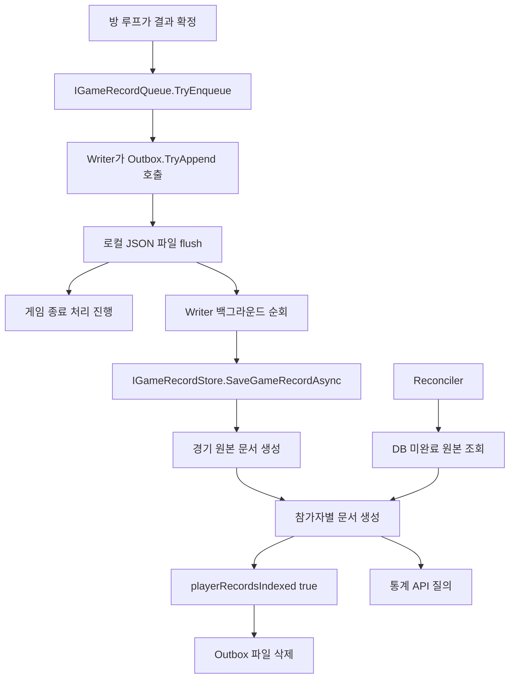

# 5. 경기 기록, 통계, 장애 대응과 운영

[전체 안내로 돌아가기](../code-guide.md) · [이전: 클라이언트](04-client.md) · [다음: 테스트와 개발 도구](06-tests-and-tools.md)

이 장에서는 경기 종료 결과 하나가 로컬 파일과 DB를 거쳐 전적에 나타나는 과정을 설명한다. 이어서 기록을 보존할 수 없는 서버가 새 경기를 받지 않는 이유, 프로세스 종료와 재시작 정책, 요청 제한과 관측 코드를 연결한다.

## 5.1 기록할 내용은 단순하지만 저장 시점은 여러 단계다

소스: [CompletedGameRecord.cs](../../polrob.Server/Models/CompletedGameRecord.cs), [RoomLoop의 결과 인계](../../polrob.Server/Network/GameNetworkServer.RoomLoop.cs#L451).

`CompletedGameRecord`는 다음 데이터만 담는 record다.

| 값 | 의미 |
|---|---|
| `Id` | 이번 경기의 고유 ID; 같은 방에서 재경기하면 별도 경기 ID 사용 |
| `RoomId` | 경기가 열린 방 |
| `WinnerRole` | 경찰 또는 도둑 승리 |
| `PolicePlayerIds`, `RobberPlayerIds` | 경기 시작 때 확정한 역할별 참가자 |
| `StartedAtUtc`, `EndedAtUtc` | 시작·종료 UTC 시각 |
| `DurationSeconds` | 게임 로직이 계산한 경기 진행 시간 |

모든 이동 입력이나 매 순간 좌표를 기록하는 replay 파일이 아니다. 경기 결과와 전적 계산에 필요한 요약 데이터다. 여기서 참가자는 종료 순간 연결되어 있는 사람 목록만 가져오는 것이 아니라 `StartingPolicePlayerIds`와 `StartingRobberPlayerIds`를 사용한다. 도중 이탈한 사람이 시작 명단에 있었다면 결과의 참가자에 남을 수 있다.

저장 완료라는 표현은 아래 세 시점을 구분해야 한다.

1. **결과 계산 완료**: 방의 메모리에 승자와 최종 결과가 있다.
2. **로컬 파일 저장 완료**: Outbox가 디스크에 결과를 flush했다. 게임 서버는 결과를 맡겼다고 판단한다.
3. **DB 저장·참가자별 색인 완료**: Writer가 로컬 파일을 DB로 보내고 통계 조회에 쓸 참가자 기록까지 확인했다.

클라이언트의 정상 종료 알림은 두 번째 조건 이후 가능하다. 세 번째 단계는 비동기로 진행되므로 게임이 끝난 직후 전적 조회가 바로 증가하지 않을 수 있다.

## 5.2 파일별 책임과 실제 객체 연결

| 소스 | 역할 |
|---|---|
| [IGameRecordQueue.cs](../../polrob.Server/Services/IGameRecordQueue.cs) | 게임 서버가 결과를 맡길 때 사용하는 `TryEnqueue` 계약 |
| [GameRecordWriter.cs](../../polrob.Server/Services/GameRecordWriter.cs) | 그 계약의 구현이자 DB 전송 백그라운드 작업 |
| [GameRecordOutbox.cs](../../polrob.Server/Services/GameRecordOutbox.cs) | 로컬 JSON 대기 파일과 용량·격리 상태 관리 |
| [IGameRecordStore.cs](../../polrob.Server/Services/IGameRecordStore.cs) | Writer가 호출하는 비동기 저장 계약 |
| [GameRecordDbService.cs](../../polrob.Server/Services/GameRecordDbService.cs) | Cosmos 저장·색인 복구·통계 질의 |
| [GameRecordReconciler.cs](../../polrob.Server/Services/GameRecordReconciler.cs) | DB에 남아 있는 미완료 색인 주기적 복구 |
| [GameRecordStatsCalculator.cs](../../polrob.Server/Services/GameRecordStatsCalculator.cs) | 경기 결과들을 전체·역할별 승패와 승률로 누적 |
| [PlayerGameOutcome.cs](../../polrob.Server/Models/PlayerGameOutcome.cs) | 통계 계산에 필요한 플레이어 역할과 승리 역할의 쌍 |
| [GameRecordsController.cs](../../polrob.Server/Controllers/GameRecordsController.cs) | 인증된 현재 사용자의 통계 HTTP 조회 |

두 인터페이스는 별도의 저장소나 백그라운드 프로세스가 아니다. DI에서 `IGameRecordQueue`는 Writer를, `IGameRecordStore`는 DbService를 가리킨다. 테스트에서는 이 좁은 계약을 구현하는 가짜 객체를 넣어 DB 장애나 인계 실패를 재현할 수 있다.



Outbox의 `TryAppend`는 디스크 쓰기까지 동기적으로 수행한다. 따라서 게임 루프가 DB 네트워크 지연을 직접 기다리지는 않지만 로컬 파일 쓰기 지연은 겪을 수 있다. `Queue`라는 이름만 보고 메모리 큐에 넣고 즉시 반환하는 구현이라고 생각하면 안 된다.

## 5.3 게임 서버에서 인계 실패를 처리하는 방식

`TryEnqueueCompletedGameRecord`는 먼저 `GameRecordEnqueueAttempted`를 본다. 이름에는 Attempted가 있지만 실제로 true를 설정하는 시점은 `TryEnqueue`가 성공했을 때다. 단순히 한 번 시도했다는 뜻으로 읽으면 실패 재시도 흐름을 오해하게 된다.

처음에는 `PendingGameRecord ??= new CompletedGameRecord(...)`로 결과 스냅샷을 만든다. 실패 후 재시도할 때 종료 시각이나 참가자 목록을 새로 계산하지 않고 같은 결과를 다시 사용한다.

인계 성공 시에는 다음 일이 일어난다.

- `GameRecordEnqueueAttempted = true`로 중복 인계를 막는다.
- 메모리의 `PendingGameRecord`를 비운다.
- `ServerOperations.SetUnpersisted(gameId, false)`로 미저장 표시를 제거한다.

실패하거나 예외가 나면 결과를 유지하고 `SetUnpersisted(gameId, true)`로 표시한다. 다음 방 상태 처리에서 재시도하며, 정상 경기 종료 통지를 진행하지 않는다. 이 표시가 남아 있는 동안 서버는 신규 경기를 받지 않는다. 이미 끝난 결과를 기록하지 못하는 상태에서 계속 새 결과를 늘리지 않으려는 정책이다.

다만 로컬 파일 생성 이전에 프로세스와 메모리가 모두 사라지는 장애까지 이 코드가 복원하는 것은 아니다. 이 장에서 말하는 재시작 후 재전송은 실제 파일로 남은 결과가 전제다.

## 5.4 GameRecordOutbox: 파일 자체가 대기열

### 생성과 소유권

생성자는 디렉터리를 준비하고 `.owner.lock` 파일을 `FileShare.None`으로 연다. 같은 디렉터리를 두 Outbox가 동시에 소비하지 않도록 파일 핸들을 객체 수명 동안 유지한다. `Dispose`가 그 핸들을 닫는다.

시작할 때 남은 `.tmp` 파일을 확인한다. 같은 이름의 `.json`이 있으면 임시 파일을 지우고, 없으면 `.json`으로 옮긴다. 이후 `.json`과 `.failed`의 수·바이트를 세어 상태를 복원한다. 중단된 임시 파일이 항상 정상 JSON이라는 보장은 없으므로 실제 소비 단계의 검증이 필요하다.

### TryAppend의 쓰기 절차

1. 경기 객체와 비어 있지 않은 ID를 확인한다.
2. JSON UTF-8 바이트로 직렬화하고 한 기록 크기 한도를 확인한다.
3. 경기 ID를 SHA-256으로 해시해 파일 이름을 만든다.
4. `_gate` lock 안에서 동일 파일·격리 파일·전체 용량을 확인한다.
5. `.tmp` 파일에 바이트를 쓰고 `Flush(flushToDisk: true)`를 호출한다.
6. 완성된 파일을 `.json`으로 옮긴다.
7. 대기 수·바이트를 늘리고 성공을 반환한다.

ID를 파일 경로에 그대로 붙이지 않고 해시하는 것은 파일 이름을 일정한 형식으로 만드는 효과가 있다. 같은 경기 ID는 같은 파일 이름을 얻으므로 중복 결과도 감지할 수 있다.

이미 `.json`이 있으면 바이트가 완전히 같은 경우에만 성공으로 취급한다. 같은 ID인데 내용이 바뀐 결과를 조용히 덮어쓰지 않는다. `.failed`가 있으면 새로 받아들이지 않는다.

`IOException` 또는 `UnauthorizedAccessException`이면 `_writeFailed = true`와 critical 로그를 남기고 false를 반환한다. 크기·개수 한도 초과도 false지만, 파일 쓰기 예외와는 별개다.

### 용량과 신규 경기 수용 기준

코드 기본값은 전체 10,000개, 256 MiB, 한 기록 64 KiB, 신규 수용 임계값 80%다. 실제 실행값은 설정으로 바뀔 수 있다.

`CanAcceptGames`는 쓰기 실패 상태가 아니며, `대기 + 격리` 수와 바이트가 임계값 미만일 때 true다. `TryAppend`의 절대 상한은 100%다. 신규 경기는 80%에서 미리 제한하고 이미 진행 중인 경기의 마지막 결과를 저장할 여유를 남기는 구성이다. 다만 경기별 슬롯을 시작 시점에 예약하는 구현은 아니므로 남은 여유만으로 모든 동시 종료를 보장한다고 해석하면 안 된다.

### 소비와 격리

| 메서드 | 동작 |
|---|---|
| `PendingFiles` | `.json` 파일을 열거한다. 정렬된 FIFO를 보장하는 코드는 없다. |
| `Read` | 파일 크기, JSON 형식, 필수 ID·팀 목록·승리 역할을 검사한다. |
| `Acknowledge` | 저장이 끝난 파일 삭제, 대기 수와 바이트 감소 |
| `Quarantine` | `.json`을 `.failed`로 바꾸고 대기 수를 격리 수로 이동 |
| `ProbeWritable` | 작은 임시 파일을 실제로 write·flush·delete해 쓰기 가능 상태 재확인 |
| `Snapshot` | 대기·격리 수, 총 바이트, 쓰기 실패, 가장 오래된 대기 파일 나이 |

격리는 실패한 데이터를 버리지 않고 보존하는 것이다. Writer는 `.failed`를 자동 소비하지 않는다. 그래서 격리 파일을 모두 자동 재시도한다고 설명하면 틀리다. 격리 수와 용량도 수용 한도에 포함된다.

`ProbeWritable`은 디스크 문제가 해결되었는지 확인하기 위해 새 게임 결과를 일부러 발생시킬 필요가 없도록 한다. Snapshot의 oldest age는 JSON 파일의 최종 수정 시각을 기준으로 계산한다.

로컬 파일 보존의 실제 수명은 그 디렉터리가 놓인 저장 장치의 수명에 달려 있다. 서버 컨테이너 삭제와 함께 사라지는 임시 디스크라면 재배포까지 보존되는 저장소라고 볼 수 없다. 이 설명은 코드의 파일 기반 설계를 이해하기 위한 경계다.

## 5.5 GameRecordWriter: DB 전송과 재시도

`ExecuteAsync`는 다음 주기를 반복한다.

```text
Outbox 쓰기 가능 검사
→ ProcessPendingAsync
→ 지표 갱신
→ RetrySeconds 대기
```

기본 재시도 주기는 5초다. 한 순회에서 파일을 최대 64개 처리한다. 파일마다 연결된 CancellationTokenSource를 만들고 기본 15초 제한으로 DB 작업을 호출한다.

### 결과별 분기

| 상황 | Writer 처리 |
|---|---|
| JSON 파싱 실패 또는 `Read`의 `InvalidDataException` | 해당 파일 격리 후 다음 파일 |
| DB 저장·색인 완료 | `Acknowledge`로 파일 삭제 |
| 인자 오류 또는 Cosmos 400/413 | 영구 기록 오류로 분류해 격리 |
| 그 밖의 예외·개별 저장 timeout | 파일 유지, retry 지표 증가, 이번 순회 중단 |
| 서버 종료 cancellation | 반복 종료, 미처리 파일 유지 |

실패한 의존성에 64개 파일을 한꺼번에 계속 요청하지 않도록 일반 DB 실패에서는 `break`한다. 대신 다음 주기에 다시 시도한다. 자격 증명·설정 오류도 유효한 결과를 버릴 근거로 삼지 않고 파일을 보존한다.

예외 분류는 정확히 읽어야 한다. 파일을 읽을 때 잡는 `InvalidDataException`과 DB 저장 단계에서의 `IsPermanentRecordError` 조건은 동일하지 않다. 저장 단계의 영구 분류는 `ArgumentException` 계열 또는 지정된 Cosmos 상태 코드다. 모든 종류의 검증 예외가 자동으로 격리되는 것은 아니다.

서버가 종료될 때 DB 복구를 무한정 기다리지 않는다. 파일이 남아 있으면 다음 시작의 Writer가 처리한다. 이것이 동기식 DB 저장만 하는 구조보다 코드가 많아지는 핵심 이유다.

## 5.6 GameRecordDbService: 하나의 원본과 참가자별 문서

### 저장 전 검증과 정규화

`SaveGameRecordAsync`는 다음을 확인한다.

- 경기·방 ID가 비어 있지 않은가?
- 승리 역할이 정의된 enum 값인가?
- 경찰·도둑 명단이 존재하는가?
- 한 사용자가 양쪽 명단에 모두 있지 않은가?
- 경기 시간이 음수가 아닌가?
- 종료 시각이 시작 시각보다 이르지 않은가?

플레이어 ID 목록은 공백 항목 제거, 중복 제거, ordinal 정렬을 거친다. DateTime은 UTC로 맞춘다. Local은 변환하고 Unspecified는 UTC로 간주한다. `DurationSeconds`를 두 timestamp 차이로 강제로 다시 계산하는 코드는 없다.

### 원본 문서 생성

컨테이너는 `/id`를 partition key로 사용한다. 원본 문서는 경기 ID를 `id`로 사용하고 시작·종료·승자·양 팀 명단을 담는다. `SchemaVersion = 1`, `PlayerRecordsIndexed = false`로 생성한다.

`CreateItemAsync`가 409 conflict를 반환하면 기존 원본을 다시 읽어 이어서 처리한다. 같은 경기가 재전송돼도 새 원본을 추가하지 않는 것이다. 이 경우 새 요청 데이터로 기존 원본을 덮어쓰거나 두 내용이 완전히 같은지 비교하지 않고 **기존 원본을 기준으로 색인 작업을 진행한다**.

### 참가자별 색인이라는 말의 정확한 의미

여기서 색인은 DB 엔진의 B-tree 같은 내부 색인 설정을 직접 관리한다는 뜻이 아니다. 앱이 전적 조회를 쉽게 하려고 **플레이어 한 명당 별도 문서**를 만드는 것을 코드가 player index라고 부른다.

경기 원본의 ID가 `game-A`, 참가자 ID가 `user-B`이면 참가자 문서 ID는 다음과 같다.

```text
player:game-A:user-B
```

이 문서에는 PlayerId, RoomId, PlayerRole, WinnerRole, DurationSeconds, 시각, SchemaVersion이 들어간다. 원본과 참가자별 문서는 같은 컨테이너에 들어가며 `playerId` 유무로 종류를 구분한다. partition key는 참가자 ID 자체가 아니라 각 문서의 `id`다.

`EnsurePlayerRecordsIndexedAsync`는 원본에 완료 플래그가 있으면 끝낸다. 없으면 양 팀 명단으로 참가자 문서를 만들어 `Task.WhenAll`로 저장한다. 기존 참가자 문서와 충돌하면 이미 저장된 것으로 취급한다. 모두 성공한 뒤 원본의 `/playerRecordsIndexed`를 true로 patch한다.

이 순서는 하나의 DB 트랜잭션으로 묶여 있지 않다. 따라서 중간 실패를 정상적으로 예상하고 재시도할 수 있게 만든 것이다.

### 실제 장애 예제

경찰 2명과 도둑 4명의 경기 결과를 저장하는 도중 네트워크가 끊겼다고 하자.

1. 경기 원본은 생성됐다.
2. 참가자 6명 중 3명의 문서만 생성됐다.
3. Writer는 실패를 받아 Outbox 파일을 지우지 않는다.
4. 다음 재시도에서는 원본 생성이 conflict가 되어 기존 원본을 읽는다.
5. 이미 있는 참가자 3명은 conflict를 성공처럼 처리하고 나머지 3명을 생성한다.
6. 원본 완료 플래그를 true로 바꾼다.
7. 이제 Writer가 로컬 파일을 지운다.

DB는 성공했는데 파일 삭제 직전에 서버가 종료된 경우도 비슷하다. 다음 실행에서 같은 결과를 다시 처리해도 기존 문서 ID로 중복 생성을 막는다. 정확히 한 번만 요청한다는 보장이 아니라, 여러 번 요청해도 같은 저장 결과를 얻도록 설계한 것이다.

## 5.7 Reconciler: DB 내부의 미완료 작업 재발견

`GameRecordReconciler`는 시작 후 복구를 시도하고, 이후 5분마다 `RepairIncompletePlayerIndexesAsync`를 호출한다.

질의는 `playerId`가 없는 원본 중 `playerRecordsIndexed`가 없거나 false인 문서를 찾는다. 각 원본에 다시 `EnsurePlayerRecordsIndexedAsync`를 실행한다. 한 원본에서 예외가 발생해도 로그를 남기고 나머지 원본을 처리한다. 서버 종료 cancellation은 전파한다.

Writer와 다른 점은 **복구할 일을 어디서 찾는가**다.

- Writer는 이 인스턴스의 로컬 Outbox JSON 파일을 찾는다.
- Reconciler는 DB에 저장된 미완료 원본을 찾는다.

따라서 로컬 파일이 없더라도 DB에 미완료 원본이 남아 있다면 색인을 복구할 수 있다. 반대로 DB에 원본 자체가 없고 로컬 파일도 없는 결과를 Reconciler가 새로 알아내는 기능은 없다.

## 5.8 통계 API와 계산기

`GameRecordsController.GetMyStats`는 Bearer 토큰에서 사용자 ID를 얻고 `GetPlayerStatsAsync(userId)`를 호출한다. URL의 임의 사용자 ID로 다른 사람 통계를 조회하는 endpoint는 이 Controller에 없다.

DB 질의는 `playerId`가 있는 문서 중 해당 사용자 것만 선택하고 `playerRole`, `winnerRole` 두 값만 projection한다. 각 페이지를 읽으며 enum 문자열을 파싱한다. 잘못된 역할은 경고 로그를 남기고 그 문서를 집계에서 제외한다.

`GameRecordStatsCalculator.cs`에는 두 타입이 있다.

| 타입 | 사용 방식 |
|---|---|
| `GameRecordStatsCalculator.Calculate` | IEnumerable을 받아 순회하는 편의 진입점; 테스트에서도 사용 |
| `GameRecordStatsAccumulator` | `Add`를 여러 번 호출한 뒤 `Build`; DB 서비스는 페이지를 읽으며 직접 사용 |

누적기는 전체 경기·승리, 경찰 경기·승리, 도둑 경기·승리를 각각 센다. 승리는 `PlayerRole == WinnerRole`로 판단한다. 패배는 `경기 수 - 승리 수`, 승률은 `승리 수 × 100 / 경기 수`이며 경기 수 0이면 0%다.

예를 들어 경찰로 승·패 한 번씩, 도둑으로 승리 한 번이면 다음과 같다.

```text
전체: 3경기, 2승, 1패, 약 66.67%
경찰: 2경기, 1승, 1패, 50%
도둑: 1경기, 1승, 0패, 100%
```

현재 구현은 조회 때 해당 사용자의 참가자 문서를 읽어 계산한다. 사용자마다 미리 누적한 단일 통계 문서를 갱신하는 방식은 아니다. 참가자 색인이 일부만 생성된 순간에는 원본 완료 여부와 무관하게 이미 생성된 참가자 문서가 질의될 수 있다. 전체 참가자의 전적 반영이 원자적으로 동시에 일어난다고 가정하지 않아야 한다.

## 5.9 ServerOperations와 ServerAdmission: 새 경기를 받을 수 있는가

소스: [ServerOperations.cs](../../polrob.Server/Operations/ServerOperations.cs), [ServerAdmission.cs](../../polrob.Server/Operations/ServerAdmission.cs).

`ServerOperations`는 게임 규칙과 분리된 프로세스 상태다.

| 값 | 의미 |
|---|---|
| `BootId` | 이번 서버 실행의 ID |
| `StartedAtUtc` | 운영 상태 객체가 만들어진 UTC 시각 |
| `HasStarted` | 애플리케이션 시작 완료 callback이 실행됐는지 |
| `NetworkRunning` | 게임 네트워크 worker가 실행 중인지 |
| `IsDraining` | 신규 경기를 차단하는 정리 상태인지 |
| `HasUnpersistedResults` | Outbox에조차 맡기지 못한 완료 결과가 있는지 |
| `PreviousShutdownClean` | 이전 실행의 종료 marker 정보; 알 수 없으면 null |

플래그는 `Interlocked.Exchange`로 갱신하고 `Volatile.Read`로 읽는다. 미저장 경기 ID 집합은 `ConcurrentDictionary`로 관리한다. 여러 방 루프와 HTTP 운영 요청이 같은 상태를 보므로 동시성 처리가 필요하다.

`ServerAdmission.CanAcceptNewGames` 조건은 다음과 같다.

```text
drain 아님
AND 메모리에만 남은 완료 결과 없음
AND Outbox가 새 경기 수용 가능
```

`IsReady`는 여기에 `HasStarted`를 추가한다. 현재 코드의 readiness는 매번 Cosmos·LiveKit 연결을 실제로 시험하거나 NetworkRunning을 모두 검사하는 종합 진단이 아니다. DB가 일시적으로 실패해도 파일 보존 여유가 있으면 새 경기를 받을 수 있는 구조이고, readiness의 정확한 의미도 이 정책을 따른다.

Admission은 HTTP의 `/game` POST, 방 생성·참가·재경기·시작, 신규 Hub 연결, 게임 시작 경로 등에 사용된다. Outbox 장애 하나가 단순 로그를 넘어 신규 경기 제한으로 연결되는 이유다.

## 5.10 RestartPolicyService: 재시작할 때 복원하는 것

소스: [RestartPolicyService.cs](../../polrob.Server/Operations/RestartPolicyService.cs).

서비스는 Outbox 디렉터리의 `.runtime-state`에 BootId, CleanShutdown, UpdatedAtUtc를 저장한다.

시작할 때 기존 파일을 읽고 이전 실행이 정상 종료했는지 기록한다. `CleanShutdown != true`이면 비정상 종료 지표와 경고를 남긴다. JSON 형식이 깨졌으면 경고를 남겨 이전 상태를 알 수 없는 것으로 둔다. 이후 현재 실행은 아직 끝나지 않았으므로 false marker를 쓴다.

쓰기 방식은 `.next` 임시 파일에 serialize·flush한 뒤 원래 경로로 교체하는 순서다. 종료 시에는 먼저 drain으로 만들고 다음 두 조건을 만족하면 clean으로 쓴다.

```text
미저장 완료 결과 없음 AND 네트워크 worker 실행 중 아님
```

**Outbox에 대기 파일이 남았다는 사실만으로 unclean인 것은 아니다.** 대기 파일이 디스크에 안전하게 남아 있고 네트워크 정리가 끝났으면 다음 실행에서 이어 저장할 수 있다. 이 clean marker는 모든 DB 기록 전송을 마쳤다는 뜻이 아니다.

재시작 정책은 다음처럼 나뉜다.

| 데이터 | 재시작 후 동작 |
|---|---|
| 사용자 DB | DB에 보존 |
| DB에 저장된 경기·참가자 기록 | DB에 보존 |
| Outbox에 저장된 완료 기록 | 같은 보존 디렉터리에서 재전송 |
| 진행 중 경기의 실시간 위치·타이머·체포 진행 | 복원하지 않음 |
| 로비 방·로그인 세션·봇 임시 ID | 프로세스 메모리이므로 사라짐 |
| 승패가 정해지지 않은 중단 경기 | 완료 기록을 꾸며 만들지 않음 |

서비스 이름에 Restart가 있어도 프로세스를 직접 다시 실행하는 watchdog은 아니다. 다음 시작에서 정책을 적용하고 이전 종료 상태를 기록하는 역할이다.

## 5.11 OperationsEndpoints: 상태·drain·HTTP 제한

소스: [OperationsEndpoints.cs](../../polrob.Server/Operations/OperationsEndpoints.cs).

### 운영 endpoint

| 요청 | 동작 |
|---|---|
| `GET /health/live` | 프로세스가 HTTP 응답을 할 수 있으면 alive |
| `GET /health/ready` | Admission.IsReady면 200, 아니면 503 |
| `GET /ops/status` | BootId, 이전 종료 상태, drain, readiness, Outbox snapshot, 재시작 정책 |
| `GET /ops/metrics` | 기록·운영·프로세스 지표를 Prometheus text 형식으로 반환 |
| `POST /ops/drain` | BeginDrain 호출; 신규 경기 제한, 기존 경기의 즉시 강제 종료는 하지 않음 |

health와 ops는 일반 HTTP rate limiter 적용에서 제외된다. ops는 `X-Operations-Key`를 확인하는 endpoint filter를 갖는다. 키가 비어 있거나 일치하지 않으면 403이다. 비교는 바이트 길이 확인과 FixedTimeEquals를 사용한다.

`BeginDrain`은 플래그를 1로 만드는 한 방향 연산이다. 이 코드에는 resume endpoint가 없다. drain 요청을 받았다고 프로세스 자체가 종료되는 것도 아니다. 실제 프로세스 종료는 호스트 수명과 게임 서버의 StopAsync 경로에서 이루어진다.

### HTTP 과부하 제한

`AddRequestLimits`는 두 limiter를 chain한다.

1. 일반 HTTP 전체 동시 요청 수 제한. 기본 128이며 대기열은 0이다. `/hubs`는 이 제한에서 제외하고 별도 Hub cap을 사용한다.
2. 원격 IP와 `/auth` 여부별 1분 고정 윈도 요청 수 제한. 기본 인증 경로 30회, 기타 600회다. 이 단계는 Hub 관련 HTTP 요청에도 적용될 수 있다.

거부 시 429, `Retry-After: 60`, JSON 오류와 지표를 남긴다. 값을 설정 파일에서 바꿀 수 있지만 문서에서 중요한 것은 **초과 요청을 무한 대기열에 쌓지 않는 구조**다.

Program의 별도 미들웨어는 신규 경기 수용 불가 때 `/game`의 POST에 503과 `Retry-After: 30`을 반환한다. 429는 요청량 제한, 503은 서버의 신규 경기 수용 상태라는 차이가 있다.

## 5.12 GameHubFilter: Hub 연결 수와 호출 수 제한

소스: [GameHubFilter.cs](../../polrob.Server/Operations/GameHubFilter.cs).

`OnConnectedAsync`는 연결 수를 원자적으로 증가시킨 뒤 최대 연결 수 또는 Admission을 확인한다. 기본 최대는 2,048이다. 거부하면 카운터를 되돌리고 abort한다. 허용한 연결에는 `UdpRateLimitState`를 rate limiter로 만들어 붙인다. 클래스 이름에 UDP가 있어도 여기서는 시간 기반 토큰 버킷 자료구조로 재사용한다.

`InvokeMethodAsync`는 연결별 기본 초당 10회 보충, 최대 20개 토큰으로 호출량을 제한한다. 부족하면 HubException을 반환한다. 연결 종료 또는 후속 연결 처리 실패에서는 사전 항목과 연결 수를 정리한다.

여기서 인증 책임은 `GameRoomHub`에 있고 Filter는 자원 제한을 담당한다. Filter가 통과했다고 로그인 사용자·방 참가 권한까지 검증되었다는 뜻은 아니다.

## 5.13 OperationalMetrics: 관측 데이터의 형태

소스: [OperationalMetrics.cs](../../polrob.Server/Operations/OperationalMetrics.cs).

고정된 이름의 숫자를 `ConcurrentDictionary<string, double>`에 보관한다. `Add`는 누적하고 `Set`은 현재값으로 덮어쓴다. Export는 이름순으로 출력하며 `polrob_` 접두사를 붙인다. 이름이 `_total`로 끝나면 counter, 그 밖에는 gauge 타입으로 내보낸다.

Counter는 저장 성공 횟수나 재시도 횟수처럼 누적량에 쓰고, gauge는 현재 대기 파일 수나 현재 메모리량에 쓴다. 숫자 문자열에는 InvariantCulture를 사용해 OS 언어 설정 때문에 소수점 형식이 달라지지 않게 한다.

사용자 ID·방 ID·IP를 지표 이름에 넣지 않도록 주석이 명시되어 있다. 각 사용자를 별도 이름으로 만들면 사용자가 늘어날수록 지표 종류 자체가 끝없이 증가하기 때문이다.

`/ops/metrics`는 조회 시 Outbox snapshot과 readiness, uptime, process working set, 누적 CPU 시간, managed heap, thread pool pending 값을 갱신한다. 실시간 네트워크의 상세 샘플링·로그는 [3장의 Observability와 RuntimeMetricSampler](03-server-network.md)에서 설명한다.

## 5.14 실패 상황별로 코드 찾아가기

| 증상 | 먼저 볼 코드 | 그다음 확인할 조건 |
|---|---|---|
| 경기 종료 알림이 계속 미뤄짐 | `TryEnqueueCompletedGameRecord` | PendingGameRecord, Outbox 한도·쓰기 실패 |
| 종료는 됐는데 전적이 늦게 반영됨 | `GameRecordWriter.ProcessPendingAsync` | 대기 파일, DB 저장 실패, 색인 완료 여부 |
| 특정 결과만 계속 쌓임 | Outbox의 `.failed`, Writer 예외 분류 | JSON/인자 오류, Cosmos 400/413 |
| 경기 원본은 있는데 일부 참가자 전적이 없음 | `EnsurePlayerRecordsIndexedAsync` | 원본 playerRecordsIndexed, 참가자 문서 |
| 서버가 살아 있지만 새 방을 못 만듦 | `ServerAdmission` | drain, 메모리 미저장 결과, Outbox 임계값 |
| 재시작 후 로그인·진행 경기가 사라짐 | `RestartPolicyService`, Auth 세션 | 현재 설계상 메모리 상태는 복원하지 않음 |
| HTTP 요청이 429로 거부됨 | `AddRequestLimits` | 동시 요청 수, IP별 호출 수, 제한 지표 |
| Hub 호출이 제한 오류로 실패함 | `GameHubFilter` | 연결별 토큰 버킷; HTTP 429 응답이 아닌 HubException |

이 장의 저장 설계는 보존할 결과, 재시도할 단위, 성공으로 인정할 시점을 명시한다. 파일 수를 줄여 리팩터링하더라도 이 세 가지 계약이 어디로 이동하는지 추적해야 동작을 유지할 수 있다.
