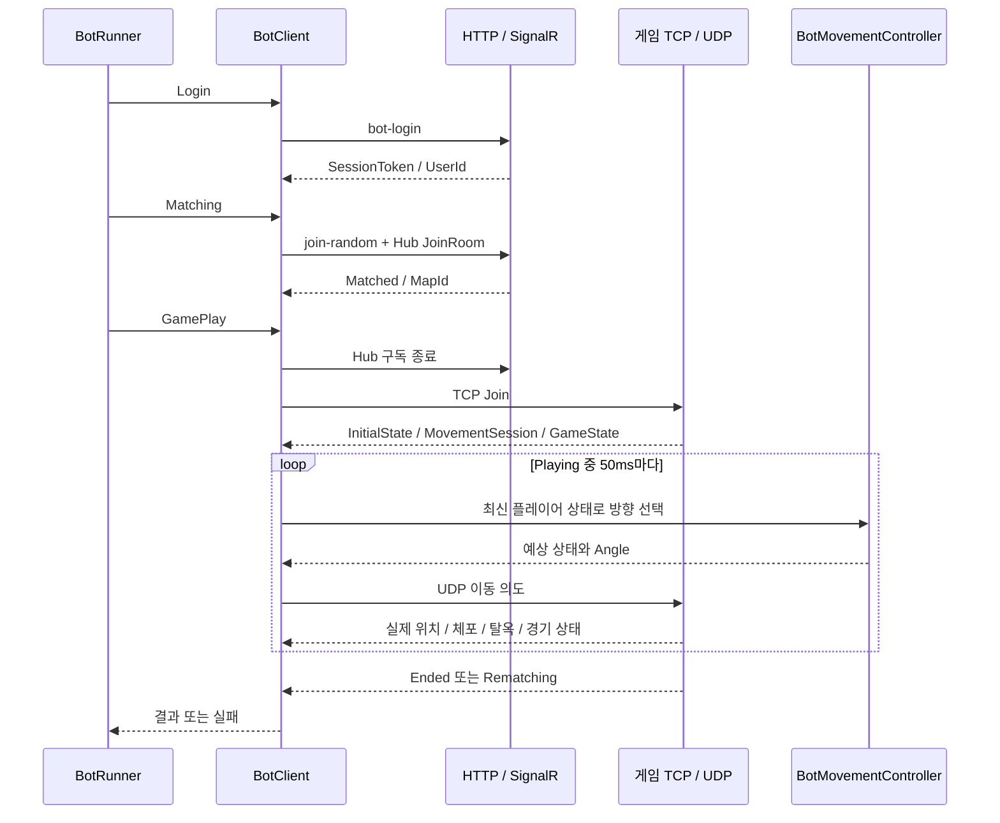

# 06. 테스트, 자동 플레이 봇과 개발 도구

[전체 가이드](../code-guide.md)로 돌아가기 · [공유 모델과 물리](02-shared-world.md) · [실시간 서버](03-server-network.md)

이 장은 `polrob.Test`, `polrob.Server.Tests`, `tools`의 소스와 저장소 루트 실행 스크립트를 설명한다. **`polrob.Test`는 실제 서버에 접속하는 콘솔 봇이고, `polrob.Server.Tests`는 NUnit 테스트 프로젝트**다. 두 프로젝트의 이름이 비슷하지만 실행 방식과 관찰하는 범위가 다르다.

아래 설명은 테스트 소스가 어떤 동작을 검증하도록 작성되어 있는지 분석한 것이다. 이 문서를 작성하기 위해 테스트·부하 실험·이미지 생성 명령을 실행했다는 뜻이 아니다. 명령 예시는 코드의 진입점을 이해하기 위한 것이며, 실제 통과 여부와 성능 수치는 실행 결과로 별도 확인해야 한다.

## 목차

1. [봇과 테스트의 역할 분담](#1-봇과-테스트의-역할-분담)
2. [자동 플레이 봇 전체 코드](#2-자동-플레이-봇-전체-코드)
3. [서버 테스트 전체 21개 파일](#3-서버-테스트-전체-21개-파일)
4. [부하 측정 스크립트](#4-부하-측정-스크립트)
5. [맵·에셋 개발 도구 전체](#5-맵에셋-개발-도구-전체)
6. [모바일 앱 실행 스크립트](#6-모바일-앱-실행-스크립트)
7. [과거 설명용 코드와 분석 제외 범위](#7-과거-설명용-코드와-분석-제외-범위)
8. [문제를 찾을 때의 읽기 순서](#8-문제를-찾을-때의-읽기-순서)

## 1. 봇과 테스트의 역할 분담

| 도구 | 대상 | 실제 외부 연결/파일 | 답할 수 있는 질문 |
|---|---|---|---|
| `polrob.Test` | 실행 중인 PolRob 서버 | HTTP, SignalR, TCP, UDP | 여러 사용자가 로그인·매칭·이동·종료를 진행하는가? |
| 서버 단위/서비스 테스트 | 메모리 상태와 규칙 | 다수는 네트워크·DB 없이 실행 | 특정 입력과 상태에서 규칙이 맞는가? |
| `GameNetworkSocketTests` | 실제 게임 소켓 서버 | 로컬 TCP/UDP 서버를 시작하고 TCP 클라이언트 연결 | 연결 교체·프레임 오류·종료를 실제 소켓에서 처리하는가? |
| `OperationsEndpointTests` | 작은 ASP.NET Core 테스트 앱 | 실제 로컬 HTTP 포트와 임시 outbox 디렉터리 | health·drain·rate limit이 HTTP 응답에 반영되는가? |
| `GameRecordOutboxTests` | 기록 파일과 Writer | 임시 파일, 저장소는 FakeStore | 실패·재시작·취소에도 기록이 보존되는가? |
| 맵 테스트 | 공유 기하·패키징된 PNG/manifest | 일부는 저장소 이미지/JSON 읽기 | 통로·충돌·spawn·에셋과 물리 데이터가 일치하는가? |
| `run_load_metrics.sh` | 서버와 봇 프로세스 | 프로세스 실행/종료, 로그, CSV/Markdown | 특정 인원 조건에서 서버가 보고한 부하는 어느 정도인가? |

특히 FakeStore를 쓰는 outbox 테스트가 있다는 사실만으로 실제 Cosmos DB 색인이나 LiveKit 네트워크 접속까지 검증된 것은 아니다. 반대로 실제 소켓 테스트가 있다고 해서 MAUI 화면, 모바일 OS 중단/복귀, 모든 네트워크 단절 시나리오까지 재현하는 것도 아니다. 각 테스트의 입력과 assert를 보면 그 경계를 알 수 있다.

## 2. 자동 플레이 봇 전체 코드

### 2.1 파일 지도와 진입점

| 소스 | 책임 |
|---|---|
| [Program.cs](../../polrob.Test/Program.cs#L1) | `BotRunner`를 만들고 로그인→랜덤 매칭→플레이를 순서대로 await |
| [BotRunner.cs](../../polrob.Test/BotRunner.cs#L6) | 봇 수, 역할 배분, 전체 매칭 검증, 플레이 동시 실행·집계 |
| [BotClient.cs](../../polrob.Test/BotClient.cs#L8) | 봇 한 명의 HTTP/SignalR/게임 상태와 생애 관리 |
| [BotGameNetworkClient.cs](../../polrob.Test/BotGameNetworkClient.cs#L8) | 실제 TCP/UDP 연결, 프레임 송수신과 이벤트 변환 |
| [BotMovementController.cs](../../polrob.Test/BotMovementController.cs#L6) | 배회·정지·구조 목표·충돌 회피 방향 결정 |
| [BotState.cs](../../polrob.Test/BotState.cs#L1) | LoggedOut 등 상태 enum 선언. 현재 봇 코드에서 사용하지 않음 |
| [BotService.cs](../../polrob.Test/BotService.cs) | 현재 빈 파일. 등록되거나 실행되는 서비스 구현 없음 |

Program에는 명령행 옵션 파서가 없다. `--bots 60` 같은 인자를 해석하지 않고 환경 변수로 조절한다. 보통 저장소 루트에서 다음처럼 실행할 수 있는 구조다.

```bash
POLROB_BOT_COUNT=60 dotnet run --project polrob.Test/polrob.Test.csproj
```

서버가 먼저 실행 중이어야 하며, 서버의 봇 로그인 허용 조건을 만족해야 한다. 이 프로그램이 서버를 함께 켜 주지는 않는다. 서버 실행과 봇 실행을 묶는 것은 뒤에서 설명할 부하 측정 스크립트다.

| 환경 변수 | 기본값 | 적용 위치와 의미 |
|---|---|---|
| `POLROB_BOT_COUNT` | 600 | Runner가 생성할 봇 수. 음수·파싱 실패는 기본값 |
| `POLROB_BOT_GAMEPLAY_CONNECT_STAGGER_MS` | 10 | n번째 봇의 게임 연결 전 대기 `n × 간격` |
| `POLROB_BOT_INITIAL_STATE_TIMEOUT_SECONDS` | 60 | 최초 플레이어 상태 수신 제한 시간. 양수만 허용 |
| `POLROB_SERVER_URL` | `http://localhost:5174` | 봇 HTTP·SignalR API 주소 |
| `POLROB_BOT_KEY` | 코드의 로컬 개발용 키 | `X-Polrob-Bot-Key` 헤더 값 |
| `POLROB_GAME_SERVER_HOST` | API 주소의 Host, 없으면 localhost | 게임 TCP/UDP 호스트. 포트는 봇 코드의 7777/7778 사용 |

HTTP 주소에 포트를 바꾸더라도 게임 포트가 자동으로 바뀌지는 않는다. BotGameNetworkClient가 7777과 7778을 직접 사용하기 때문이다.

### 2.2 `BotRunner`: 여러 봇을 한 번의 실험으로 묶기

[TestLogin](../../polrob.Test/BotRunner.cs#L21)은 봇을 순차적으로 생성한다. 이름은 `Bot_0000`처럼 붙이고 `i % 3 < 2`이면 도둑, 나머지는 경찰로 지정한다. 6명 단위로 보면 도둑 4·경찰 2다. 각 봇의 HTTP 로그인 완료를 기다린 뒤 목록에 넣으므로 이 단계의 요청은 한꺼번에 600개가 나가는 구조가 아니다.

[TestRandomMatching](../../polrob.Test/BotRunner.cs#L35)도 각 봇의 Matching을 순서대로 호출한다. 호출 후에는 모든 `_matchCompleted`를 최대 30초 기다린다. 이후 방 ID로 그룹화해 **각 방이 6명이며 경찰 2명·도둑 4명인지** 확인한다. 비정상 방을 최대 10개 출력하고 하나라도 있으면 예외를 던진다. 봇 수를 6의 배수로 설정해야 이 시나리오의 완료 조건과 맞는다. 남는 대기 인원이 있으면 매칭 대기에서 시간 초과가 발생할 수 있다.

[TestGamePlay](../../polrob.Test/BotRunner.cs#L83)는 `Task.WhenAll`로 봇 플레이를 동시에 수행한다. 실제 연결 시각은 봇 index와 stagger로 분산한다. 예를 들어 600개 봇에 기본 10ms면 마지막 봇은 첫 봇보다 약 5.99초 뒤에 연결을 시도한다. 이것은 과도한 순간 연결 집중을 줄이면서 대규모 동시 플레이 상태를 만드는 장치다.

각 봇의 실패는 `ConcurrentBag<string>`에 모은다. 플레이 작업이 모두 끝나면 finally에서 전부 DisposeAsync하고, 실패가 있으면 최대 20개 세부 정보를 출력한 뒤 전체 실험도 실패시킨다. 성공하면 방마다 한 봇의 결과를 골라 승리 역할과 경과 시간을 출력한다. 전체 결과를 DB에서 재조회해 검증하는 작업은 여기 없다.

처리 범위도 구분해야 한다. 전체 봇을 정리하는 finally는 `TestGamePlay` 안에 있다. 로그인이나 매칭 단계에서 먼저 예외가 발생하면 Program은 다음 단계로 가지 않으므로 동일한 finally가 실행되는 구조는 아니다. `RunBotGamePlayAsync`의 실패 수집은 플레이 호출 중 발생한 예외에 적용된다.

### 2.3 `BotClient`: HTTP 로그인에서 게임 입장까지

[생성자와 Login](../../polrob.Test/BotClient.cs#L45)은 HttpClient의 BaseAddress와 봇 키 헤더를 설정한 뒤 `POST auth/bot-login`으로 `(Name,Role)`을 보낸다. HTTP 성공 여부를 확인하고 응답의 UserId·SessionToken을 보관한다. 이후 모든 HTTP 요청에 `Authorization: Bearer <SessionToken>`을 사용한다. 테스트 사용자도 정상 로그인 세션을 얻어 서버 권한 검사를 거친다.

[Matching](../../polrob.Test/BotClient.cs#L76)은 `POST game/join-random`에 Role을 보낸다. 응답에서 RoomId를 얻고 방 상태를 갱신한다. 이어 `hubs/game-room` SignalR 연결을 만들고 AccessTokenProvider로 로그인 토큰을 제공한다. `RoomStatusUpdated`, `GameStarted` 두 이벤트를 같은 `UpdateRoomStatus`로 처리한다. 연결 시작 후 `JoinRoom(RoomId)`를 호출한다.

`UpdateRoomStatus`는 성공 응답에서 현재 인원·맵·Matched를 갱신한다. 맵 ID는 Registry.Get으로 확인하므로 모르는 맵 ID가 조용히 통과하지 않는다. Matched가 true이면 `_matchCompleted` TaskCompletionSource를 완료한다. HTTP 응답에서 이미 매칭이 끝났든 이후 Hub 이벤트에서 완료됐든 같은 기다림이 풀린다.

`TaskCompletionSource`는 네트워크 이벤트를 `await` 가능한 작업으로 바꾸는 연결점이다. `RunContinuationsAsynchronously` 옵션은 완료 이벤트를 호출한 실행 흐름에서 기다리던 작업의 나머지가 즉시 길게 실행되는 것을 줄여 준다.

### 2.4 `GamePlay`: 상태 수신과 행동 루프

[GamePlay](../../polrob.Test/BotClient.cs#L131)는 Matched와 RoomId를 확인한 뒤 매칭 Hub를 정리한다. `DisconnectMatchingHubAsync`는 연결 상태에서 `LeaveRoom`을 시도하고 실패하더라도 Hub를 Dispose한다. 이 LeaveRoom은 SignalR 방 구독 정리 경로이며, 게임 TCP에 입장하는 전체 과정과 함께 이해해야 한다.

그다음 초기 상태/종료용 TaskCompletionSource를 새로 만들고, 확정된 MapId로 이동 컨트롤러를 만든다. BotGameNetworkClient 이벤트를 등록하고 TCP/UDP에 연결한다. TCP Join에는 로그인 토큰·방 ID·맵 ID만 보낸다. 이름과 역할을 서버에 그대로 신뢰하라고 보내는 구조가 아니다.

InitialState를 받을 때는 받은 플레이어 목록에서 자기 ID가 반드시 있어야 한다. 없으면 초기화 작업을 예외로 완료한다. 제한 시간 안에 메시지를 못 받으면 봇 이름·방·역할을 넣은 TimeoutException을 던진다. 이 확인 후에야 `게임 접속 완료` 로그가 나온다.



행동 루프는 50ms마다 깨어난다. Playing 단계가 아니거나 자기 Player가 없으면 행동을 건너뛴다. 이동 컨트롤러가 상태를 바꾸는 동안 `_playerStateLock`을 잡아 수신 이벤트와 같은 Player를 동시에 수정하지 못하게 한다. 전송할 때는 상태 복사본을 만든 뒤 lock 밖에서 UDP await를 수행한다.

이동 중에는 50ms, 정지 중에는 500ms 간격으로 보낸다. 이동/정지 상태가 바뀌는 순간에는 간격이 아직 안 됐어도 즉시 보낸다. 정지하는 순간 `0,0`을 바로 전달해 서버의 이전 방향 입력을 빨리 끊고, 이후에는 불필요한 UDP 양을 줄이는 구조다.

### 2.5 BotClient가 받는 모든 게임 이벤트

[RegisterGameNetworkEvents](../../polrob.Test/BotClient.cs#L259)는 다음처럼 상태를 갱신한다.

| 이벤트 | 처리 |
|---|---|
| `InitialStateReceived` | 사전을 비우고 목록을 복원, 자기 Player를 찾아 초기화 완료 |
| `PlayerJoined` | ID를 키로 플레이어를 추가/교체 |
| `PlayerLeft` | 해당 ID를 목록에서 제거 |
| `PlayerStateReceived` | 기존 객체에 전체 상태를 복사하거나 새 객체 추가; 자기 객체 참조도 갱신 |
| `PlayerMovementReceived` | 이미 알려진 ID에만 `ApplyTo`로 좌표·각도·이동 여부 반영 |
| `PlayerArrested` | 자기 자신이 경찰 또는 도둑이면 로컬 움직임을 2.2초 잠금 |
| `JailBreakReceived` | 해당 도둑 위치 갱신, IsMoving=false, IsJailed=false |
| `GameStateReceived` | 단계 갱신; Ended이면 승자·시간 보관 후 종료, Rematching이면 승자 없음으로 종료 |

`_visibleTeamPlayers`라는 이름의 Dictionary를 전체 방의 완전한 참가자 목록으로 가정하면 안 된다. 서버가 보내 준 초기/가시 상태를 보관하는 것이며, 봇이 보지 못한 적의 위치를 임의로 알고 있는 것은 아니다. 이동 컨트롤러는 이 중 같은 역할 도둑을 구조 대상으로 사용한다.

`CopyPlayer`, `CopyPlayerState`는 참조를 공유한 채 네트워크 전송 중 상태가 변하는 것을 피하고, 이미 다른 곳에서 참조한 Player 객체는 유지하면서 속성을 갱신하기 위한 함수다. `GameOver`는 Hub와 게임 네트워크를 정리하고 최종 `DisposeAsync`는 HttpClient까지 해제한다.

### 2.6 `BotGameNetworkClient`: 실제 프로토콜 구현

[ConnectAsync](../../polrob.Test/BotGameNetworkClient.cs#L29)는 호출자의 취소 토큰에 연결된 CancellationTokenSource를 만들고 TCP 7777에 접속한다. TCP 스트림에 BinaryReader/Writer를 붙이고 UDP는 7778로 Connect한다. UDP의 Connect는 TCP 같은 연결 협상이 아니라 송수신 상대 endpoint를 정하는 의미다. TCP 수신은 별도 Task.Run에서 동기 Read를 반복하고, UDP 수신은 ReceiveAsync를 반복한다.

[SendMoveAsync](../../polrob.Test/BotGameNetworkClient.cs#L63)는 예측 위치 X/Y 자체를 보내지 않는다. `Angle+90`을 라디안으로 바꿔 cos/sin 방향 벡터를 만들고, 정지면 0,0을 넣는다. Sequence를 하나 증가시키고 현재 MovementSessionToken을 붙여 UTF-8 JSON datagram을 보낸다. 즉 봇 이동 컨트롤러의 좌표 계산은 다음 행동과 방향을 결정하는 데 쓰이고 최종 위치 권한은 서버에 있다.

[SendTcp](../../polrob.Test/BotGameNetworkClient.cs#L83)는 BinaryWriter를 lock하고 다음 형식을 쓴다.

```text
Int32 bodyLength
Byte TcpMessageType
BinaryWriter 문자열: 7-bit encoded UTF-8 byte length + UTF-8 bytes

bodyLength = 1 + 문자열 길이 prefix 바이트 수 + UTF-8 payload 바이트 수
```

문자 수와 UTF-8 바이트 수는 다를 수 있으므로 GetByteCount를 사용한다. 문자열 길이 prefix도 payload가 128바이트 이상이면 2바이트 이상으로 늘 수 있다. 이 부분이 서버 프레임 테스트에서 한글 문자열과 기존 형식을 함께 검사하는 이유다.

수신 TCP 루프는 앞 Int32를 읽어 버리고 메시지 종류와 ReadString을 읽는다. 서버 쪽의 엄격한 프레임 검증과 달리 봇 수신기에는 선언 길이 대조나 최대 프레임 검증 로직이 없다. Dispatch는 InitialState, Joined, Left, Arrested, GameState, JailBreak, PlayerState, MovementSession을 처리한다. Arrested는 `policeId,robberId` 문자열을 나누고 MovementSession은 토큰 필드에 보관한다.

UDP 수신은 먼저 `PlayerMovementSync`로 역직렬화해 Id가 있으면 이동 이벤트를 발생시킨다. 그렇지 않으면 Player 전체 상태로 역직렬화하는 호환 경로를 시도한다. 보통 현재 경로는 작은 이동 DTO다. 데이터마다 JSON 객체를 만들기 때문에 봇 프로세스 자체의 할당량과 CPU도 별도 부하가 된다.

Dispose는 취소 → UDP/TCP/Reader/Writer 해제 → 수신 작업 종료 기다림 → CancellationTokenSource 해제 순서다. 소켓 해제는 대기 중인 Read를 끊는 역할도 한다. 종료 중의 읽기 예외는 수신 루프 또는 Dispose에서 예상 종료로 처리한다.

### 2.7 `BotMovementController`: 배회와 구조

[Update](../../polrob.Test/BotMovementController.cs#L27)의 우선순위는 수감 정지 → 구조 목표 → 일시 정지 → 일반 배회다. 봇 ID의 hash로 Random을 만들지만 .NET 문자열 hash를 프로세스 간 영구 고정 seed로 간주해서는 안 된다. 여기서는 봇별로 서로 다른 움직임을 주는 용도다.

구조 목표는 도둑만 고른다. 현재 알려진 도둑 중 수감자 수를 세고 자유 도둑 ID를 정렬한다. 자신의 순위가 수감자 수보다 작을 때만 구조자로 움직인다. 수감자 한 명에 모든 자유 도둑이 몰리는 것을 줄이려는 단순 분담이다. 특정 수감자 ID와 구조자를 영구적으로 매칭하는 예약 시스템은 아니다.

현재 맵에 JailRescueArea가 있으면 목표는 그 영역의 중심이다. 기존 맵이면 감옥 충돌 경계의 좌우·아래 두 곳·위쪽에서 반지름+15만큼 떨어진 후보를 만들고, 구조자 index부터 순환 검사해 걸을 수 있는 첫 점을 택한다. 목표에서 20 단위 이내면 멈추고 서버의 구조 완료 판정을 기다린다.

일반 배회 중에는 1.2~3.2초 간격으로 정지 여부를 확인한다. 도둑의 정지 확률은 22%, 경찰은 8%다. 정지 시간은 도둑 약 0.8~2.4초, 경찰 약 0.4~1.2초다. 방향은 약 0.9~2.8초마다 새로 고른다. 이동에 실패하면 방향을 다시 고르고 더 짧은 다음 변경 시각을 설정한다.

[Move](../../polrob.Test/BotMovementController.cs#L165)는 선호 방향에 `0, +25, -25, +50, -50, +90, -90, +135, -135, 180도`를 차례로 더해 피할 방향을 찾는다. 이동량은 `Speed × 60 × clamp(elapsedSeconds,0,0.1)`이다. 월드 경계를 clamp하고 X축/Y축을 나누어 Shared 충돌 검사를 수행한다. 가능한 방향을 찾으면 Angle·IsMoving·다음 배회 방향을 바꾼다.

이 코드는 A* 같은 전체 경로 탐색을 하지 않는다. 근처 한 걸음이 가능한 방향으로 꺾는 방식이므로 복잡한 오목 공간이나 먼 우회 경로에서 최적 구조 행동을 보장하지 않는다. 경찰도 상대를 추적하는 전술 AI보다 무작위 배회에 가깝다. 목적은 실제 이동·정지·체포·구조 트래픽을 만드는 것이다.

세부 차이도 있다. 봇 Move는 축 충돌 검사를 통과하면 `moved=true`를 설정하며 실제 좌표 차이가 0인지 따로 확인하지 않는다. 서버 이동은 실제 좌표 변화량도 비교한다. 따라서 월드 끝이나 일부 막힌 상황에서 봇의 IsMoving 의도와 서버의 실제 이동 결과가 잠시 다를 수 있다.

### 2.8 현재 봇의 재접속·재매칭 구현 범위

[BotState](../../polrob.Test/BotState.cs#L1)에는 `LoggedOut`, `LoggingIn`, `Matching`, `WaitingForGame`, `Playing`, `GameOver`, `Requeueing`, `Stopped`, `Failed`가 선언되어 있다. 그러나 이 enum을 읽거나 바꾸는 상태 머신은 현재 코드에 없다. `BotService.cs`도 비어 있다.

BotClient의 SignalR에는 `WithAutomaticReconnect`가 없고, BotGameNetworkClient에도 TCP 재접속이나 로그인 갱신 루프가 없다. Heartbeat를 보내거나 HeartbeatAcknowledged를 처리하지 않으며 JailBreakProgress와 OpponentProximity도 소비하지 않는다. 서버/실제 모바일 클라이언트의 모든 기능을 그대로 구현한 축소판으로 생각하면 안 된다.

Rematching 메시지를 받으면 현재 봇 플레이를 완료할 뿐 새 랜덤 매칭을 시작하지 않는다. 또한 InitialState 이후 TCP가 조용히 끊기면 수신 루프의 IOException은 처리되지만 `_gameEnded`를 예외로 완료하는 연결이 없다. 종료 메시지가 오지 않는 상황에서 플레이 루프가 계속 기다릴 여지가 있다. 전체 게임 시간에 대한 별도 watchdog도 이 클래스에 없다. 따라서 정상 완료를 관찰하는 실험과 단절 복구 능력을 검증하는 실험은 구분해야 한다.

## 3. 서버 테스트 전체 21개 파일

### 3.1 테스트를 읽는 공통 규칙

[테스트 프로젝트](../../polrob.Server.Tests/polrob.Server.Tests.csproj#L1)는 net10.0, NUnit, NUnit3TestAdapter를 사용한다. `[Test]`는 일반 케이스, `[TestCase]`는 인자별 케이스다. `[SetUp]`과 `[TearDown]`은 케이스 전후 자원을 준비·해제한다. `Assert.Multiple`은 한 결과의 여러 속성을 한 번에 확인한다.

여러 파일은 Reflection으로 서버의 private 함수나 필드를 다룬다. `RuntimeHelpers.GetUninitializedObject`는 생성자를 실행하지 않은 객체를 만들고 검사에 필요한 필드만 채우는 방식이다. 소켓이나 DB 없이 특정 방 규칙을 직접 호출하려는 목적이다. 이 경로로 성공한 테스트는 정상 앱 시작·DI 연결 자체까지 검증한 것은 아니다.

반면 소켓·HTTP 테스트는 실제 로컬 리스너를 켠다. `GameNetworkSocketTests`는 TCP/UDP 포트 0을 지정해 OS가 빈 포트를 고르게 하고, 운영 drain 시간을 0으로 두며, 기록 저장은 가짜 큐를 사용한다. 아래 설명에서는 각 파일의 검증 내용을 모두 포함하되 테스트 전용 객체 생성·대기·Reflection helper의 반복 구현은 공통 패턴으로 묶었다.

### 3.2 `ActiveGameParticipantRegistryTests.cs`

[소스](../../polrob.Server.Tests/ActiveGameParticipantRegistryTests.cs#L6). 방+사용자에 대해 현재 활성 TCP 연결만 유효하다는 계약을 검증한다.

- 기존 연결을 새 연결로 교체한 뒤 이전 ConnectionId로 Unregister해도 새 등록은 유지된다.
- 현재 ConnectionId로 Unregister하면 실제로 제거된다.
- `ManualTimeProvider`로 시계를 46초 진행시켜 45초 lease가 만료되는지 확인하고, 현재 연결의 Refresh가 다시 활성화하는지 검사한다.
- 이전 연결의 heartbeat는 새 연결 lease를 연장할 수 없다.

단순히 사전에서 사용자 ID를 삭제하는 대신 연결 ID까지 비교해야 하는 이유를 보여 준다. 연결이 교체되는 순간과 이전 소켓의 종료 콜백이 도착하는 순간은 같지 않다.

### 3.3 `GameRoomHostAssignmentTests.cs`

[소스](../../polrob.Server.Tests/GameRoomHostAssignmentTests.cs#L8). 방장과 경기 종료 후 방 보존 정책을 확인한다. 일반 참가자가 나가면 방장이 유지되고, 방장이 나가면 목록의 첫 남은 참가자에게 이전된다. 커스텀 방 완료는 참가자와 방장을 유지하고 `IsOnGame=false`로 돌려 재경기를 준비한다. 공개 랜덤 방은 완료 후 상태 조회에서 사라져야 한다.

테스트는 Reflection으로 서비스의 Games 목록에 직접 방을 넣는다. 사용자 DB 조회나 실제 HTTP 입장을 검사하는 것이 아니라 해당 방에 대한 RemovePlayer·CompleteGame 동작을 집중적으로 확인한다.

### 3.4 `GameRoomLifecycleTests.cs`

[소스](../../polrob.Server.Tests/GameRoomLifecycleTests.cs#L9). BotIdentityService로 메모리 사용자를 만들고 실제 GameRoomService 메서드로 방을 생성·시작한다.

- 한 방의 완료·퇴장이 다른 방의 참가자·진행 상태·VoiceSessionId에 영향을 주지 않는다. 다른 방 사용자에게 잘못된 방 인증도 허용하지 않는다.
- 같은 사용자를 32개 작업에서 중복 입장시켜도 참가자는 한 번만 존재한다. 다시 요청한 역할이 다르더라도 기존 역할을 바꾸지 않는다.
- 교체된 연결의 늦은 종료가 현재 연결이나 같은 사용자의 다른 방 등록을 제거하지 않는다.
- 경기 진행 중 마지막 참가자가 나가면 방은 완료 처리까지 남아 있다가, 완료 후 빈 커스텀 방은 제거된다.
- 200회 반복하며 퇴장→완료, 완료→퇴장, 둘의 동시 실행 순서를 번갈아 적용하고 매번 방이 남지 않는지 확인한다.

이 파일의 반복 검사는 정해진 200회 메모리 상태 스트레스다. 실제 TCP 트래픽 성능 측정과는 다르다.

### 3.5 `GameRoomSoakTests.cs`

[소스](../../polrob.Server.Tests/GameRoomSoakTests.cs#L8). `[Category("Soak")]`가 붙은 선택 실행 장기 반복 테스트다. `POLROB_SOAK_SECONDS`가 양수가 아니면 `Assert.Ignore`한다. 같은 경찰·도둑 사용자로 방 생성→입장→시작→종료/퇴장을 시간 동안 반복하고, 종료/퇴장 순서를 바꿔도 방이 남지 않는지 확인한다. 100회마다 Task.Yield로 제어권을 넘긴다.

검사 대상은 서비스가 유지하는 방 수와 생애 정리다. 메모리 측정기로 모든 객체의 누수를 증명하거나 네트워크까지 포함하는 것은 아니다. 마지막 `TotalRooms=0`과 매 반복의 방 상태 조회가 직접적인 assert다.

### 3.6 `GameRoomVoiceAccessTests.cs`

[소스](../../polrob.Server.Tests/GameRoomVoiceAccessTests.cs#L8). 게임 시작 전에는 음성 접근을 거부하고, 진행 중이면 서버의 역할과 VoiceSessionId를 반환하며, 완료 후에는 다시 거부하는지 확인한다. 같은 경기를 중복 Start해도 VoiceSessionId는 유지되어야 하고 완료 후 재경기를 시작하면 새 ID로 바뀌어야 한다.

또한 `(PlayerRole)999`를 넘기면 사용자 조회보다 먼저 거절해야 한다. 테스트는 사용자 DB·봇 서비스 없이 호출하므로 잘못된 enum이 하위 조회로 흘러가는 경우를 잡는다.

### 3.7 `MovementAuthenticationTests.cs`

[소스](../../polrob.Server.Tests/MovementAuthenticationTests.cs#L10). UDP 이동 권한이 여러 조건의 결합임을 검사한다. 유효 로그인 세션, 사용자 ID, 현재 ConnectionId, 이동 토큰, 등록된 UDP endpoint가 맞으면 허용한다. 이 중 ID·토큰·endpoint·등록 ConnectionId를 각각 바꿔 거절되는지 검사한다. 로그인 토큰을 Logout한 뒤에는 이전에 유효하던 입력도 거절되어야 한다.

로컬 login session을 private CreateSession으로 만들고 마지막에 제거한다. 검사는 `IsAuthorizedMovement`를 직접 호출하므로 datagram 직렬화나 실제 UDP 수신까지는 포함하지 않는다.

### 3.8 `GameMovementValidationTests.cs`

[소스](../../polrob.Server.Tests/GameMovementValidationTests.cs#L11). HandleRoomMove에 정상 순번 1의 입력을 넣고 마지막 승인 상태를 확인한다. 이어 NaN, 양의 무한대, 재사용 순번, 다른 UDP endpoint의 입력을 넣어도 X/Y와 마지막 순번이 바뀌지 않아야 한다.

마지막으로 순번 2의 정상 입력이 승인되는지 검사한다. **거절된 패킷이 순번을 소비하지 않는다**는 부분이 중요하다. 잘못된 입력에 큰 순번이 붙었다고 이후 정상 입력을 전부 오래된 것으로 간주하면 사용자가 움직일 수 없게 된다.

### 3.9 `GameNetworkProtocolTests.cs`

[소스](../../polrob.Server.Tests/GameNetworkProtocolTests.cs#L11). MemoryStream과 BinaryReader로 실제 서버 프레임 파서를 검사한다.

| 검사 | 보호하는 규칙 |
|---|---|
| 현재/legacy 길이 형식과 한글 payload | UTF-8 바이트 수와 문자 수 차이, 기존 클라이언트 프레임 수용 |
| 너무 큰 선언 길이 | 본문을 읽거나 큰 배열을 만들기 전에 거절 |
| 문자열 prefix가 4097바이트 선언 | 4096바이트 inbound payload 한도 적용 |
| 선언 길이와 실제 구조 불일치 | 메시지 경계가 틀린 프레임 거절 |
| 끝나지 않는 7-bit 길이 prefix | 비정상 길이 인코딩 거절 |
| Int32 범위를 넘는 prefix | overflow 형태 거절 |
| 잘못된 UTF-8, 잘린 본문 | InvalidDataException 또는 EndOfStreamException |
| 2048바이트 UDP와 2049바이트 UDP | 정확한 한도는 허용, 초과는 거절 |
| 빈 UDP, 깨진 JSON, JSON null | 빈 데이터/문법 오류와 null 반환을 구분 |

Reflection helper는 TargetInvocationException의 내부 예외를 다시 던져 assert가 실제 파서 예외 형식을 확인할 수 있게 한다. 따라서 테스트의 Throws 대상은 Reflection 래퍼가 아니라 프로토콜 오류다.

### 3.10 `GameNetworkLifecycleTests.cs`

[소스](../../polrob.Server.Tests/GameNetworkLifecycleTests.cs#L11). 실제 소켓 없이 방 명령 루프가 언제 사라져야 하는지 검사한다.

- 한 번도 성공적으로 Join하지 않은 빈 GameSession도 만료된다.
- 이전 ConnectionId의 Leave 명령으로 새 PlayerSession을 제거하지 않는다.
- 빈 방이라도 grace period가 아직 지나지 않았거나 대기 명령이 있으면 종료하지 않는다. 대기 명령이 있으면 빈 시각을 초기화한다.
- 조건을 만족해 종료하면 세션 사전에서 제거하고 IsStopping을 켜며 명령 writer를 닫아 새 명령을 받지 않는다.
- Playing 중 전원이 사라지고 유예 기간이 끝나면 로비 방도 포기 처리한다. 가짜 승자나 기록을 만들어 내지 않는다.
- 이미 완료된 커스텀 방은 실시간 루프가 사라져도 재경기용 로비 참가자 목록을 보존한다. 반복 abandonment 호출도 완료 방을 지우지 않는다.

이 테스트를 읽으면 'TCP 참가자가 없는 실시간 방'과 '재경기를 기다리는 로비 방'의 생애가 같지 않음을 알 수 있다.

### 3.11 `GameNetworkSocketTests.cs`

[소스](../../polrob.Server.Tests/GameNetworkSocketTests.cs#L18). 실제 서버 StartAsync와 로컬 TCP를 사용한다.

| 테스트 시나리오 | 구체적인 관찰 |
|---|---|
| 같은 사용자 재접속 | ConnectionId와 이동 토큰이 모두 교체됨. 이전 소켓 heartbeat로 발생한 늦은 Leave에도 새 세션 유지. 현재 소켓 heartbeat는 ack를 받음 |
| 초과 크기·비인증 Join·Join 전 heartbeat | 연결을 닫고 게임 방/활성 참가자를 생성하지 않음 |
| 진행 중 전원 TCP 단절 | 카운트다운 이후 Playing을 확인하고 전원 연결을 닫으면 유예 뒤 게임 세션과 로비 방이 제거됨 |
| TCP 연결 수 상한 1 | 두 번째 소켓을 거절하고 첫 연결 종료 후 슬롯을 다시 사용할 수 있음 |
| 절반만 보낸 프레임 길이 | Join timeout 1초로 미인증 연결이 영원히 남지 않음 |
| 유휴 read 중 서버 종료 | 3초 취소 deadline 전에 StopAsync가 끝나고 클라이언트가 원격 종료를 관찰, 연결 수 0 |
| 미완료 경기의 서버 종료 | 기록 큐 호출 수 0, 게임 세션/진행 상태/연결을 정리 |

WriteFrame/ReadFrame helper는 실제 wire bytes를 만들고 읽는다. ReadUntilType은 초기 여러 메시지 중 관심 있는 MovementSession·HeartbeatAcknowledged 등을 찾는다. WaitUntil은 비동기 서버 처리를 기다리되 제한 시간을 둔다. Fake/Noop 기록 큐를 사용하므로 이 파일의 게임 종료 테스트가 Cosmos 저장 성공을 요구하지 않는다.

### 3.12 `NetworkBackpressureTests.cs`

[소스](../../polrob.Server.Tests/NetworkBackpressureTests.cs#L13). 입력/출력/결과 저장이 밀리는 상황을 검사한다.

- Join 명령이 방 큐에서 처리되기 전에 소켓이 닫혔다면 유령 플레이어를 만들지 않는다.
- TcpPeer의 송신 대기열은 메시지 수와 바이트 수 두 기준으로 제한된다. 작은 메시지 2개 허용 후 세 번째 거절, 별도 작은 byte limit 초과 메시지도 거절한다.
- 기록 큐가 첫 번째 결과를 거절하면 PendingGameRecord를 유지하고 미보관 상태를 표시한다. 재시도에서 **동일 객체 snapshot**을 넘기고 수락 뒤에만 완료 표시와 pending 제거를 수행한다.
- 이동 명령 순번 5 다음 3이 도착해도 coalescing 결과는 5다. 마지막 도착값을 무조건 쓰면 순번이 역행하므로 이를 방지한다.
- 이미 모든 TCP 참가자가 없어도 경기 결과의 durable acceptance 전에는 로비 경기를 완료하지 않는다. 다음 수락에서 비로소 완료한다.

여기서 durable acceptance는 파일 outbox 같은 보존 계층이 결과를 맡았다는 뜻이다. 곧바로 DB 색인까지 끝났다는 뜻은 아니다.

### 3.13 `GameRuleTransitionTests.cs`

[소스](../../polrob.Server.Tests/GameRuleTransitionTests.cs#L11). 서버 규칙과 Shared 맵을 함께 사용하지만 소켓은 열지 않는다. 테스트 플레이어는 반지름 25, 속도 4로 만든다.

1. 입력 `(1000,1000)`을 길이 1 이하로 정규화한다. 50ms 틱에는 최대 약 12단위, 지연된 5초 틱도 0.1초 제한으로 최대 약 24단위만 이동한다.
2. 마지막 이동 입력이 오래됐으면 좌표를 유지하고 IsMoving=false, InputX/Y=0으로 바뀐다.
3. 실제 활성 맵의 장애물 앞 자유 지점을 찾고 다음 12단위 걸음이 벽을 통과하지 않는지 확인한다.
4. 경찰과 도둑을 실제로 서로 보이는 위치에 놓고 체포를 시작한다. 시작 직후에는 수감하지 않고 양쪽 이동을 잠근다. 완료 시각 전에는 대기, 시각 이후에는 수감·감옥 진입 시각·holding 위치를 설정한다. 수감 도둑은 이후 입력에도 움직이지 않는다.
5. 구조 영역에서 진행을 시작했다가 밖으로 나가면 시작 시각과 진행률을 모두 지운다. 다시 들어왔을 때 이전 1초 진행을 이어받지 않는다.
6. 3.1초 경과를 만든 후에는 수감자가 해제되고 holding 밖의 충돌 없는 석방 위치로 나온다. 수감 시각과 구조 진행 상태도 정리된다.

시간을 실제로 3초씩 기다리는 대신 내부 시각을 조절하므로 특정 경계 조건을 빠르게 확인할 수 있다. 맵에서 실제 자유 지점을 탐색하는 helper도 있어, 빈 가상 평면만으로 이동 규칙을 검사하지 않는다.

### 3.14 `GameRecordOutboxTests.cs`

[소스](../../polrob.Server.Tests/GameRecordOutboxTests.cs#L10). 케이스마다 임시 디렉터리를 만들고 끝에 지운다. IGameRecordStore의 FakeStore를 통해 성공·일시 실패·영구 실패·취소를 발생시킨다.

| 시나리오 | 검사하는 결과 |
|---|---|
| 저장소 오프라인 후 outbox 재생성 | 파일이 남아 있고 재시작 후 같은 경기·참가자를 저장, 성공 후 pending/bytes 0 |
| 저장은 됐으나 응답을 잃음 | 같은 경기 ID로 두 번 시도되고 논리 ID는 하나 |
| 깨진 JSON과 영구 오류 | 둘은 `.failed`로 격리되고 정상 기록 처리는 계속됨 |
| 수량 soft threshold와 hard limit | 새 게임 수용은 일찍 막고 진행 중 게임 결과를 위한 여유는 사용, hard limit 초과는 거절 |
| 같은 ID 중복/상충 snapshot | 완전히 같은 결과 재요청은 성공, 승자가 다른 결과는 거절 |
| byte quota | 건수와 별개로 총 byte 한도를 적용 |
| 파일 쓰기 실패 | 수용을 닫고 실패 상태 표시, 장애 제거 후 ProbeWritable로 회복 |
| 동일 spool 동시 소유 | 두 번째 outbox 소유 시도에 IOException |
| 중단된 `.tmp` 파일 | 시작 시 복구해서 재전송, 임시 파일 정리 |
| 저장 취소 | TaskCanceledException을 전파하고 원본 파일 보존 |
| 재시작 marker | 중단된 종료와 정상 StopAsync 종료를 구분, boot ID 갱신 |

쓰기 실패는 hash로 계산한 결과 `.tmp` 경로에 파일 대신 디렉터리를 만들어 재현한다. 실제 디스크를 가득 채우지 않아도 파일을 열 수 없는 실패 경로를 통제해서 검사할 수 있다. 저장 응답 유실 테스트는 HashSet으로 ID의 중복을 관찰하며 DB 구현 자체의 멱등성을 직접 실행하는 것은 아니다.

### 3.15 `GameRecordStatsCalculatorTests.cs`

[소스](../../polrob.Server.Tests/GameRecordStatsCalculatorTests.cs#L6). 기록이 없으면 전체/경찰/도둑 통계가 모두 0이다. 역할과 승리 역할을 섞은 다섯 경기를 넣으면 전체 5전 3승 2패 60%, 경찰 2전 1승 50%, 도둑 3전 2승 약 66.67%가 되어야 한다. 부동소수점 승률은 허용 오차를 두고 비교한다. 정의되지 않은 참가 역할은 ArgumentOutOfRangeException으로 거부한다.

이 파일은 순수 합산 규칙을 확인한다. DB에서 특정 사용자의 모든 참가 기록을 빠짐없이 읽었는지는 다른 계층의 책임이다.

### 3.16 `OperationsEndpointTests.cs`

[소스](../../polrob.Server.Tests/OperationsEndpointTests.cs#L13). 실제 WebApplication을 `127.0.0.1:0`에 열고 production의 요청 제한과 운영 endpoint 등록 함수를 사용한다. FakeStore, 임시 outbox, 낮은 rate limit을 주입해 빠르게 한도에 도달시킨다.

- 시작 전 ready는 503, MarkStarted 뒤 200. 키 없는 drain은 403, 키 있는 drain 뒤 ready는 다시 503. live는 계속 200.
- metrics는 운영 키가 필요하다. outbox pending을 포함하지만 게임/방/플레이어 식별 문자열은 노출하지 않는다. outbox가 수용 threshold에 이르면 ready도 503.
- 일반 HTTP는 분당 2, 로그인은 별도 분당 1의 테스트 제한을 넘으면 429와 Retry-After를 반환한다. health는 그 제한에 묶이지 않는다.
- 방 상한과 drain은 Controller 앞단만이 아니라 GameRoomService 내부에서도 강제된다. 방 수가 상한을 넘지 않는다.

테스트 앱에는 `/api/ping`, `/auth/login`의 간단한 handler를 추가한다. 실제 로그인 DB 검사를 포함하려는 케이스가 아니라 middleware의 제한 응답을 집중적으로 검증하려는 구성이다.

### 3.17 `LiveKitTokenServiceTests.cs`

[소스](../../polrob.Server.Tests/LiveKitTokenServiceTests.cs#L9). 발급된 JWT의 Base64Url payload를 직접 읽어 다음 정책을 확인한다.

- 같은 경기에서도 경찰/도둑의 RoomName이 다르고 VoiceSessionId를 포함한다.
- iss는 API key, name은 표시 이름, metadata.gameUserId는 게임 사용자다. sub는 원래 사용자 ID를 그대로 사용하지 않는 참가자 식별자다.
- roomJoin, subscribe, publish 권한은 허용하되 data publish는 false, publish source는 microphone 하나다.
- 같은 사용자라도 게임 ConnectionId가 다르면 sub가 달라진다.
- 설정 TTL 0, 2, 15분은 각각 1, 2, 5분으로 clamp된다. exp-iat와 응답 ExpiresAtUtc를 함께 확인한다.
- 빈/비정상 URL, https 또는 ws URL, 비어 있는 key/secret, 없는 VoiceSessionId, 없는 ConnectionId, 정의되지 않은 Role을 거부한다.

이 테스트는 실제 LiveKit 서버에 로그인하지 않는다. 토큰 payload의 구조와 정책을 검사하며 음성 전송 품질이나 원격 서버가 서명을 받아들이는지까지의 통합 실험은 아니다.

### 3.18 `VoiceControllerTests.cs`

[소스](../../polrob.Server.Tests/VoiceControllerTests.cs#L13). DefaultHttpContext에 인증 헤더를 붙이고 Controller를 직접 호출한다. 인증 없음은 401, 방 ID 공백은 400, 게임 비활성 또는 활성 참가자 등록 없음은 403이어야 한다.

403은 `ForbidResult`가 아닌 일반 StatusCodeResult인지도 확인한다. 이 Controller의 인증 구성에서 불필요한 별도 인증 handler 실행으로 흐르지 않고 의도한 HTTP 상태 코드를 돌려주는 동작을 보호한다. 정상 케이스에는 게임 시작·활성 TCP 등록·로그인 세션을 모두 준비해 팀 역할·RoomName·만료가 담긴 VoiceConnectionInfo를 확인한다.

### 3.19 `CanvaMapCollisionProfileTests.cs`

[소스](../../polrob.Server.Tests/CanvaMapCollisionProfileTests.cs#L7). 선택 가능한 기존 마을의 원본 PNG 기반 충돌을 검사한다.

- 8종 사각형 프로필을 원본 왼쪽 아래 원점, 이미지 투명 여백, 배치 scale에서 직접 기대값으로 계산한다. 충돌 bounds의 네 변과 몸체 위/안/아래 위치를 비교한다.
- 나무·가로등·바위·수풀의 원형 프로필에 X/Y 배율을 각각 적용하고 양쪽 반지름과 bounds를 확인한다.
- 나무 수관과 가로등 머리가 밑동 충돌 영역에 포함되지 않는다.
- 상자 묶음의 비어 있는 홈은 통행 가능하고 실체 부분은 막힌다. 큰 다각형이 공간 인덱스의 모서리 셀에서도 후보로 검색된다.
- 연못의 물·돌 테두리는 막고 원본 이미지 사각형 모서리는 막지 않는다.
- 납작한 타원 경계의 여러 각도에서 바깥 법선 방향으로 플레이어 반지름 전후 지점을 검사한다. 10만큼 떨어진 점의 거리 제곱은 100이어야 한다.

특히 마지막 검사는 '모서리가 대충 맞아 보인다' 수준이 아니라 타원 거리 계산 함수의 기하를 직접 확인한다.

### 3.20 `ChaseTownAssetCatalogTests.cs`

[소스](../../polrob.Server.Tests/ChaseTownAssetCatalogTests.cs#L9). 현재 맵 에셋의 논리 좌표·영역·고해상도 이미지 패키징을 함께 보호한다.

| 검사 묶음 | 내용 |
|---|---|
| 데이터 유효성 | 에셋 ID와 영역 이름 중복 없음, 양의 크기, 유한 좌표, 3점 이상·0 아닌 면적, 원 반지름과 bounds |
| 의도한 모양 | L자 벽의 빈 홈 통행, 나무 줄기만 차단, 수관은 비고체 영역, 수풀은 들어갈 수 있는 hiding trigger |
| 감옥 | 내부 자유 공간, 닫힌 문 차단, gateOpen/jail-open에서 출구 연속 통행, 옆 철창 유지, 외부 구조 영역 접촉 |
| 건물 앞 모서리 | 출입구 옆 비어 있는 공간을 사각형 벽으로 만들지 않음 |
| 배치 변환 | 평행 이동·2.5배·90도 회전 뒤에도 실체와 빈 홈이 함께 이동 |
| 건물 뒤쪽 inset | 7종 건물의 뒤 경계만 8픽셀 들어가고 앞·좌우 모양 보존, 실제 GameMap도 그 프로필 사용 |
| 잘못된 배율 | 0, 음수, NaN, Infinity 거부 |
| 고해상도 | 저장된 physics-before JSON과 논리 크기/Regions가 동일, 소품 texture scale 6 |
| 실제 파일 | PNG signature·IHDR width/height·RGBA color type, manifest와 카탈로그 Regions 일치 |

실제 파일 테스트는 출력 폴더에서 부모 디렉터리를 올라가 `polrob.slnx`를 찾아 저장소 루트를 결정한다. 그 아래 Raw 에셋과 JSON을 읽는다. 따라서 코드만 복사하고 에셋을 빼먹은 환경에서는 동일한 테스트 의미를 유지할 수 없다.

### 3.21 `TownMapPhysicsTests.cs`

[소스](../../polrob.Server.Tests/TownMapPhysicsTests.cs#L7). 현재 기본 GameMap 전체를 통행 가능한 게임 공간으로 검증한다.

- 월드 2560×3840, Props 89개, ChaseTownV7 경로, 건물·body·감옥·20개 초과 hiding 영역 정책을 확인한다.
- 반지름 25와 50에서 실제 고체 중심과 월드 네 경계가 막힌다.
- 원형 장애물의 대각선 모서리를 보이지 않는 사각형으로 막지 않는다.
- 각 역할의 spawn 16개가 서로 다르고, 걸을 수 있고, 같은 인자로 반복하면 같은 좌표다.
- 경찰 spawn, 도둑 spawn, 감옥 석방 전면이 연결된다.
- 수감 인원 1~4명의 슬롯이 그림 중앙에 정렬되고 holding bounds 안에 들어가며 서로 겹치지 않는다.
- 지면이 세 종류이고 모든 도로 타일이 4방향 flood fill로 연결된다.
- 모든 hiding area에 도달할 수 있고 그 중심에서 실제 은신 영역을 찾을 수 있다.
- 구조 trigger가 철창 밖 자유 공간이며 도달 가능하다.
- 모든 ChaseWaypoints가 반지름 25/50에서 자유롭고 spawn과 연결된다.

통행 연결 검사는 16단위 격자에서 BFS를 사용한다. 이웃 격자점뿐 아니라 연결 선분의 중간점도 검사해 얇은 벽을 뛰어넘는 단순 점 샘플 오류를 줄인다. 임의 목표점은 주변 격자점까지 여러 보간 지점이 자유로운지 확인해 연결한다. 다만 이것은 정해진 해상도에서의 경로 검증이며 연속 평면의 모든 가능한 경로를 수학적으로 증명하는 알고리즘은 아니다.

### 3.22 `MapManagementTests.cs`

[소스](../../polrob.Server.Tests/MapManagementTests.cs#L14). 맵 선택이 방·물리·재경기까지 일관되게 전파되는지 확인한다.

- 기본 Game/Session은 Chase이고 Classic은 독립된 Props·에셋 경로를 사용한다. 다른 GameMap의 장애물 인스턴스도 공유하지 않는다.
- 모르는 mapId는 방 생성·GameMap·GameSession에서 거절한다. `{}`로 역직렬화한 Join의 빈 MapId도 유효한 기본 맵으로 간주하지 않는다.
- 방 상태 API는 인증 없음 401, 비멤버 403, 멤버에게 권위 있는 MapId, 없는 방 404를 준다.
- 두 맵 모두 생성→입장→시작→완료→재경기→JSON 왕복에서 같은 MapId를 유지한다. Classic 방 생성이 다음 방의 기본 맵을 바꾸지 않는다.
- 선택한 맵으로 역할 spawn, 경찰서 충돌, 감옥 접촉, 석방·수감 위치를 계산한다.
- 승인된 지면 색 영역과 삭제된 소품 위치를 다시 되살리지 않는다.
- 경찰서 뒤·앞 통로와 창고 상자 사이·긴 벽 옆 통로가 연속적으로 열려 있다. 후자는 반지름 25/50 모두 확인한다.

### 3.23 테스트 실행 진입점

저장소 루트에서 사용하는 대표 명령 형태는 다음과 같다.

```bash
dotnet test polrob.Server.Tests/polrob.Server.Tests.csproj
dotnet test polrob.Server.Tests/polrob.Server.Tests.csproj --filter FullyQualifiedName~GameRuleTransitionTests
POLROB_SOAK_SECONDS=60 dotnet test polrob.Server.Tests/polrob.Server.Tests.csproj --filter TestCategory=Soak
```

전체 솔루션은 모바일 앱도 포함하므로 서버 테스트를 읽고 실행할 목적이라면 테스트 csproj를 직접 지정하는 편이 범위가 명확하다. 서버 테스트는 Server를 참조하고 Server는 Shared를 참조한다. 별도 MAUI 화면 실행 없이 공유 물리와 서버 코드를 테스트할 수 있는 구성이다.

## 4. 부하 측정 스크립트

[run_load_metrics.sh](../../run_load_metrics.sh#L1)는 서버와 봇을 빌드하고 봇 수를 바꾸어 실행한 뒤 서버의 `[LoadMetrics]` 로그를 CSV와 Markdown으로 집계한다. 기본 봇 수는 `60 300 600 900`이며 예상 방 수는 봇 수/6이다.

### 4.1 실행 단계

1. 출력 디렉터리와 CSV header를 만든다. 기본은 `/tmp/polrob-load-날짜-시간`이다.
2. 로컬 5174/TCP, 7777/TCP, 7778/UDP를 점유한 프로세스를 찾아 종료한다. 종료 함수는 TERM 후 잠깐 기다리고 계속 살아 있으면 KILL한다.
3. 서버와 봇을 각각 빌드한다. ThreadPoolMinThreads를 기본 서버 1200, 봇 1600으로 지정한다.
4. 각 봇 수마다 Development 서버를 실행하고 HTTP listener가 열릴 때까지 기다린다. 봇·HTTP 제한을 실험용으로 높이고 별도 outbox 경로를 사용한다.
5. 봇을 해당 수로 실행하고 eligible 로그 샘플 수, 봇 종료, 최대 대기 시간 중 하나를 만족할 때까지 관찰한다.
6. 조건을 만족한 샘플에서 가장 트래픽이 높은 구간을 선택해 평균을 CSV에 추가한다.
7. 봇과 서버를 종료하고 다음 인원 실험으로 이동한다.
8. Markdown 표를 만들고 `/tmp/polrob-load-latest` 심볼릭 링크를 최신 로그 디렉터리로 갱신한다.

포트 점유 프로세스 종료와 빌드·파일 생성은 이 스크립트의 실제 부작용이다. 단순히 현재 돌아가는 서버의 metrics를 읽기만 하는 명령으로 해석하면 안 된다. EXIT trap에도 포트 정리가 등록되어 있다.

### 4.2 eligible sample과 선택 구간

eligible sample은 로그에서 플레이어 수가 목표 봇 수와 같고, 게임 TCP 방 수·Playing 방 수·random_in_game 방 수가 모두 예상 방 수와 같은 샘플이다. 연결 중이거나 일부 방이 이미 끝난 데이터가 완전한 동시 플레이 부하와 섞이지 않도록 한 조건이다.

기본 45개의 eligible sample을 모으고, 그중 기본 20개 연속 샘플에 대해 `udp_recv/s + udp_send/s + tcp_send/s` 합이 가장 큰 구간을 고른다. 로그가 초당 한 번이므로 변수 이름은 seconds지만, 구현은 필터를 통과한 **샘플 배열**의 길이를 세는 방식이다. 중간에 부적격 로그가 빠졌다면 이 배열의 20개가 실제 벽시계 20초에 연속한다고 단정할 수 없다.

출력은 전체 실행 평균도, 모든 지표의 최고값도 아니다. **전체 방이 Playing인 샘플 중 네트워크 메시지 수 기준으로 고른 구간의 각 지표 평균**이다. CPU 최댓값과 같은 의미로 읽으면 안 된다. 봇 실패 수는 로그의 `[봇 실패]` 줄 개수이고 연결 수는 `게임 접속 완료` 줄 개수이므로, 프로세스가 갑자기 종료된 모든 원인을 이 두 숫자만으로 설명할 수는 없다.

### 4.3 입력과 출력

| 주요 환경 변수 | 기본값/기능 |
|---|---|
| `POLROB_LOAD_LOGDIR` | 결과 저장 경로 |
| `POLROB_LOAD_BOT_COUNTS` | `60 300 600 900` |
| `POLROB_LOAD_ELIGIBLE_SAMPLES` | 45개 |
| `POLROB_LOAD_WINDOW_SECONDS` | 선택 구간 길이 20개 샘플 |
| `POLROB_LOAD_MAX_WAIT_SECONDS` | 단계별 최대 360초 |
| `POLROB_BOT_INITIAL_STATE_TIMEOUT_SECONDS` | 이 스크립트에서는 기본 240초로 늘림 |
| `POLROB_SERVER_THREAD_POOL_MIN_THREADS` | 1200 |
| `POLROB_BOT_THREAD_POOL_MIN_THREADS` | 1600 |
| `POLROB_LOAD_AUTH_REQUESTS_PER_MINUTE`, `POLROB_LOAD_HTTP_REQUESTS_PER_MINUTE` | 각각 기본 100000 |
| `POLROB_LOAD_GLOBAL_UDP_PPS` | 기본 60000 |

`server-N.log`, `bot-N.log`, `outbox-N`과 `results.csv`, `results.md`를 만든다. 표에는 UDP 패킷·바이트, TCP 송신, JSON 직렬화, 연결/게임/로비 인원·방 수, 예외, GC, lock contention, CPU 시간/초, working set, thread pool queue/threads가 포함된다. 일부 동작은 높은 thread pool 설정과 실험용 제한값을 전제로 하므로 그 결과를 기본 운영 설정의 값으로 옮겨 해석하면 안 된다.

## 5. 맵·에셋 개발 도구 전체

이 도구들은 대부분 UI 에셋 제작·검사에 해당한다. 사용자 화면의 픽셀 디자인을 모두 해설하는 대신 **입력 → 처리 → 출력 → 실제 앱과 연결되는 지점**을 설명한다. 이미지 파일이 있다고 해서 도구가 앱 실행 때마다 호출되는 것은 아니다. 아래에서 자동 빌드 단계인 AssetBounds와 수동 제작 도구를 구분한다.

### 5.1 `PolRob.AssetBounds/Program.cs`: 빌드 시 이미지 경계 계산

[소스](../../tools/PolRob.AssetBounds/Program.cs#L1). 두 인자 `<raw-assets-directory> <generated-csharp-file>`를 받는다. Raw/MapAssets의 PNG는 alpha≥16, Raw 바로 아래 char_*.png는 alpha≥32 기준으로 보이는 영역의 최소 사각형을 계산한다.

`FindAssets`는 파일을 정렬해 Analyze를 호출한다. `Analyze`는 SkiaSharp로 PNG를 읽고 `bitmap.Pixels` 배열을 한 번 얻어 모든 픽셀을 순회한다. 오른쪽/아래 경계에는 `x+1`, `y+1`을 기록하므로 넓이 계산에 맞는 반열린 범위다. 완전히 빈 그림이면 전체 사각형으로 대체한다.

`GenerateSource`와 `WriteDictionary`는 파일 경로별 `(원본 Width,Height,SKRect Bounds)`를 가진 `GeneratedAssetBounds` C# 소스를 생성한다. `GetMap`/`GetCharacter`는 없는 경로나 PNG 크기가 이전 메타데이터와 다른 경우 예외를 던진다. 파일명 문자열의 따옴표·역슬래시도 C# 코드에 맞게 escape한다.

[클라이언트 csproj의 GenerateAssetBounds](../../polrob.Client/polrob.Client.csproj#L117)가 CoreCompile 전에 실행한다. 입력 이미지와 생성기 변경 시 다시 계산한 파일을 Compile Include로 넣는다. 실행 중 UI 스레드에서 수백만 픽셀의 alpha 경계를 매번 찾는 일을 빌드 시점으로 옮긴 것이다. 현재 Chase 고해상도 소품 전체를 이 crop 규칙으로 임의 축소하는 도구는 아니다. Chase는 카탈로그의 논리 사각형을 보존하는 별도 렌더링 정책을 갖는다.

### 5.2 `PolRob.ChaseTownAssets/Program.cs`: 에셋 팩 제작 명령

[소스](../../tools/PolRob.ChaseTownAssets/Program.cs#L1). 현재 디렉터리에서 상위로 올라가 `polrob.slnx`를 찾고 저장소 루트를 결정한다. 명령은 `references` 또는 `build`다. 인자가 없으면 references다.

references는 `docs/chase-town-assets/source-map.png`가 없을 때 이전 승인 지도 경로에서 복사하고, 미리 정한 경찰서·상점·집·감옥·벽 등의 사각형을 잘라 최대 변 640 크기의 참고 PNG를 만든다. 원본 지도상의 크롭 위치와 카탈로그 SourceX/SourceY가 같은 계열의 데이터다. 결과는 `docs/chase-town-assets/references`에 둔다.

build는 버전 관리하는 HD source를 사용해 `AssetPackBuilder.Build`를 실행한다. build 뒤에 임의 source 경로를 추가하는 방식은 허용하지 않는다.

### 5.3 `AssetPackBuilder.cs`: 현재 팩과 manifest 생성

[소스](../../tools/PolRob.ChaseTownAssets/AssetPackBuilder.cs#L5). `ChaseTownAssetCatalog.Assets`를 순회해 타일은 승인된 Grass/Road/Paving 색의 64×64 이미지를 만들고, 소품은 HighResolutionAssets.Load로 읽는다.

비타일은 실제 투명 픽셀과 충분히 불투명한 픽셀이 있어야 하고 첫·마지막 모서리 픽셀도 투명해야 한다. 모든 에셋을 먼저 읽고 검증한 뒤 파일을 저장하기 시작하므로 입력 HD 소스 하나가 누락됐을 때 절반만 다른 해상도의 팩으로 덮어쓰는 일을 줄인다. 다만 전체 출력 디렉터리를 한 번에 rename하는 트랜잭션은 아니다.

출력은 Raw/ChaseTownV7의 props·tiles PNG와 `manifest.json`이다. manifest에는 버전, 논리 좌표 규칙, world scale, 원본 지도 크기, 카탈로그 Assets가 들어간다. 문서 폴더에는 alpha 픽셀 수·논리 크기·texture scale·movement/trigger 수의 audit와 이미지/물리 카탈로그, 나무·수풀·모서리 벽·감옥 상세 시트를 만든다.

DrawRegions는 Kind별 색으로 원과 다각형을 그려 artwork와 영역이 같은 위치인지 볼 수 있게 한다. 그림에서의 투명 부분과 게임의 이동/은신 영역을 비교하는 개발용 시각화다. 실제 서버 물리는 이 출력 그림을 분석하지 않고 Shared 카탈로그를 직접 읽는다.

### 5.4 `HighResolutionAssets.cs`: 화질을 바꾸면서 물리 크기 보존

[소스](../../tools/PolRob.ChaseTownAssets/HighResolutionAssets.cs#L5). `hd/original-props/<id>.png`를 정렬 기준으로, `hd/sources/<id>.png`를 고해상도 원본으로 읽는다. 원본이나 HD 파일이 없으면 실패하며 낮은 화질의 지도 크롭으로 자동 대체하지 않는다.

HD source에 완전 투명·불투명 픽셀이 모두 있는지 확인하고 양 이미지의 alpha≥16 bounds를 구한다. 새 TextureWidth/Height 캔버스를 투명하게 만든 뒤 HD의 visible bounds를 **기존 visible bounds × TextureScale** 위치로 맞춰 그린다. 투명 padding과 화소 밀도만 정규화하고 논리 collision 좌표는 바꾸지 않는다. 감옥은 중앙 픽셀이 투명한지도 확인한다.

Bounds는 빈 실루엣이면 예외를 던진다. AssetBounds의 빈 그림 전체 사각형 fallback과는 달리 이 단계에서는 비어 있는 HD 소품을 유효한 결과로 취급하지 않는 정책이다.

### 5.5 `PolRob.TownMapPreview/Program.cs`: 실제 렌더러로 맵 확인

[소스](../../tools/PolRob.TownMapPreview/Program.cs#L1). 이 프로젝트는 MAUI 앱 전체를 실행하지 않고 [csproj](../../tools/PolRob.TownMapPreview/PolRob.TownMapPreview.csproj#L10)에서 클라이언트의 `TownMapRenderer`, `IMapRenderer`, `ClassicTownMapRenderer` 소스를 연결해 사용한다. 따라서 미리보기를 위한 완전히 다른 맵 그림이 아니라 실제 렌더러 코드 경로를 사용한다.

주요 처리와 출력은 다음과 같다.

- 현재 카탈로그·지면 에셋을 읽고 세 타일이 기대하는 64×64 색인지 확인한다.
- 1024×1536 전체 지도와 충돌 overlay를 만든다.
- 시장·창고·감옥 부분을 실제 카메라 배율로 그린다. viewport culling을 켠 그림과 전체 world를 대상으로 그린 그림의 픽셀이 같아야 한다.
- 캐릭터를 먼저 그리고 props를 나중에 그려 그림에 가려지는 모습을 보여 준다.
- 이전 저해상도 소품과 현재 HD 소품을 같은 좌표·카메라에서 비교한다.
- 경찰서·카페·집의 뒤쪽 여유를 플레이어 실제 반지름과 충돌 bounds로 확인한 그림을 만든다.
- Ground를 R/P/G 문자 행과 placements로 기록한 layout.json을 저장한다.
- Classic 맵도 그 원본 alpha crop 규칙으로 별도 렌더링하며 culling 전후 일치 검사를 한다.

출력은 `docs/chase-town-map`의 지도·상세·충돌 PNG와 layout JSON이다. 여기서 생성된 자료는 현재 Shared 데이터와 renderer 관계를 눈으로 이해하는 데 유용하다. 이 프로그램은 네트워크 경기나 서버 체포 판정을 실행하지는 않는다.

### 5.6 TownMapPreview의 보조 소스 세 개

| 소스 | 역할과 현재 호출 상태 |
|---|---|
| [PreviewAssetAnalysis.cs](../../tools/PolRob.TownMapPreview/PreviewAssetAnalysis.cs#L3) | alpha≥16 경계를 픽셀 배열로 계산. 현재 Program에서 Classic crop과 캐릭터 visible bounds에 사용. 완전히 투명하면 전체 bounds |
| [CollisionProfilePreview.cs](../../tools/PolRob.TownMapPreview/CollisionProfilePreview.cs#L4) | Canva 원본 이미지마다 사각형/원/다각형과 왼쪽 아래 원점을 겹쳐 `collision-original-assets.png` 생성하는 Export helper. 현재 Program에서 호출하지 않음 |
| [ArchivedTownMapPreview.cs](../../tools/PolRob.TownMapPreview/ArchivedTownMapPreview.cs#L8) | `docs/town-map/layout.json`의 도로·배치와 예전 에셋으로 과거 미리보기를 내보내는 Export. 현재 Program에서 호출하지 않음 |

Archived 파일 첫 주석에는 active Canva 등의 과거 설명이 남아 있지만 현재 Program은 기본 Chase 맵과 별도 Classic을 내보낸다. 호출 상태는 주석보다 실제 Program 흐름을 기준으로 판단해야 한다.

### 5.7 `PolRob.MapAssetBuilder/Program.cs`: 과거 대형 지도 타일 생성

[소스](../../tools/PolRob.MapAssetBuilder/Program.cs#L1). 인자로 새 맵을 선택하는 일반 변환기가 아니라 `docs/concepts/polrob_map_upscale.png`와 같은 경로의 LabelMe JSON을 읽는 과거 파이프라인이다. 입력 이미지는 5120×7680이어야 하고 512 타일로 10열×15행을 만든다.

각 타일에 원본 이미지의 exact base를 저장하고, LabelMe의 map/jail을 제외한 모양과 고정 외곽 장식을 전경 마스크로 만든다. 감옥은 두꺼운 테두리와 원본 픽셀의 상세 마스크를 별도로 합친다. `DstIn` 합성으로 base에서 전경 부분만 남긴 PNG를 만든다. 저장된 base를 다시 읽어 원본과 픽셀 차이가 0인지 확인하고, 전체/가림/마스크/충돌 미리보기도 생성한다.

출력 경로는 Raw/exact_map/base·foreground와 tmp_map_preview다. 파일 끝의 `LabelMeDocument`, `LabelMeShape`는 JSON의 shapes/label/points를 읽는 내부 타입이다. Shared의 하드코딩된 LabelMeCollisionData와 같은 기능을 런타임에 활성화하는 객체는 아니다.

중요한 현재 상태는 [ValidatePhysicsGeometry](../../tools/PolRob.MapAssetBuilder/Program.cs#L392)에 있다. 이 함수는 `new GameMap()`을 만든 후 **5120×7680, 건물 9개, LabelMe 다각형 장애물 20개**를 기대한다. 현재 GameMap 기본값은 2560×3840 Chase 맵이므로 이 기대와 맞지 않는다. 따라서 현재 기본 맵의 정상 재생성 명령으로 설명할 수 없다. 오래된 자산과 코드를 보존한 도구이며, 현행 맵 제작은 ChaseTownAssets와 TownMapPreview 경로를 읽어야 한다.

이 검증은 타일 파일 생성 루프 이후에 호출되므로 실패하더라도 그전에 일부 산출물이 만들어질 수 있다. 단순한 dry-run 검사 명령은 아니다.

### 5.8 `PolRob.CharacterAnimation/Program.cs`: 원본 캐릭터 기반 프레임 구성

[소스](../../tools/PolRob.CharacterAnimation/Program.cs#L1). `<character-animation-docs> <output-directory>` 두 인자를 받는다. 원본·생성 layer·reference 폴더를 출력 대상으로 덮어쓰는 것을 거부한다. 660×660 reference에서 몸체·팔 등을 분리하고 1088×1088 캔버스, pivot `(544,544)`, 몸체 너비 512로 정규화한다.

전체 목적은 원본 캐릭터의 머리/몸체 식별 픽셀을 보존하면서 움직이는 팔과 체포·항복·탈옥 자세를 합성하는 것이다. 기본·달리기 8프레임은 phase에 따라 팔을 작은 각도로 회전/늘린다. 중립 phase에서는 조각을 다시 합치는 대신 정렬된 원본 자체를 그려 접합 자국을 피한다. 경찰은 arrest, 도둑은 surrend와 prison_break 자세를 별도로 합성한다.

큰 파일의 helper는 다음 역할별로 읽으면 된다.

| 함수 계열 | 작업 |
|---|---|
| `ReferenceBodyPath`, `ReferenceHeadPath`, `ReferenceFacePath`, `ReferenceHeadbandPath`, `ReferenceArm` | 원본 몸체·보호 얼굴·모자·팔의 분리 범위 정의 |
| `ExtendBodySides`, `SmoothBoundary`, `EnforceRoundBoundary` | 팔을 움직일 때 드러날 몸체 옆면을 이어 주고 둥근 윤곽 정리 |
| `FindSideMaterialColor`, `SmoothColorProfile`, `CompleteSide`, `CompleteSideWarp` | 원본 재질 색/픽셀을 이용해 옆면 보완 |
| `SampleHorizontalPremultiplied`, `SourceOver`, `MixRgb`, `SmoothStep` | alpha가 있는 색의 보간·합성에서 테두리 변색을 줄이는 계산 |
| `ClipByGuide`, `RemoveSmallComponents`, `Clip`, `Smooth` | 마스크로 필요한 자세 영역 분리, 작은 분리 조각 제거·경계 처리 |
| `TrimArmWaistHook`, `FeatherArmRoot` | 움직이는 팔의 허리 접합부와 뿌리 경계 정리 |
| `IdentitySilhouette`, `ExcludeReconstructedPixels`, `MergeIdentityMask`, `PreserveIdentity`, `Protected` | 보존해야 할 원본 픽셀 영역을 정하고 합성 뒤 복원 |
| `ComposeSpecial`, `Union`, `SaveMask` | 특수 자세의 팔/소품과 보호 범위 합성 |
| `SaveAndValidate`, `CountComponents` | 보호 픽셀 불변, 캔버스 여유, alpha 연결 요소 검사와 audit 기록 |
| `Load`, `Bounds`, `NewBitmap`, `Draw`, `DrawRegion`, `Save`, `RenderSheet`, `Neighbors` | 이미지 입출력·좌표 처리·비교 시트·픽셀 탐색 보조 |

`SaveAndValidate`는 identity mask 안에서 보호 대상 픽셀이 원본과 같은지, 그림이 가장자리에 너무 가까워 잘리지 않았는지, alpha≥32의 연결 요소가 하나인지 확인한다. 경찰 체포처럼 팔이 몸체 앞에 올 수 있는 자세는 보호 범위를 머리/얼굴 중심으로 달리 적용한다. 원본 SHA-256과 정렬 정보는 registration.json, 검증 결과는 audit.json에 남긴다. `POLROB_INSPECTION=1`이면 추가 검사 이미지를 만든다.

출력 프레임은 앱이 소비할 수 있는 파일명 형식을 사용하지만 이 도구는 지정된 output에 저장한다. 정상 게임 루프에서 프레임을 실시간 생성하는 코드가 아니다.

### 5.9 `make-preview.swift`: 애니메이션 GIF 미리보기

[소스](../../tools/PolRob.CharacterAnimation/make-preview.swift#L1). 선택 인자 `[input-directory] [output.gif]`를 받으며 기본 입력은 `docs/character-animation/result`, 출력은 문서 폴더의 animation.gif다. Foundation, CoreGraphics, CoreText, ImageIO, UniformTypeIdentifiers를 사용하므로 macOS 도구다.

기본 자세 1초, 달리기 프레임당 0.1초, 체포/항복·탈옥 1.1초 등의 순서로 경찰과 도둑을 900×600 비교 캔버스에 그린다. 몸체 크기와 pivot은 C# 생성기의 1088/512/544 기준을 사용한다. 이 Swift 파일은 네이티브 앱 게임 로직이나 iOS 음성 브리지가 아니라 제작 결과 검사용 GIF 작성기다.

입력 PNG가 1088×1088인지 확인하고, GIF를 저장한 뒤 다시 읽어 프레임 수와 각 프레임 지연 시간이 의도한 값과 맞는지도 검사한다. 무한 반복 GIF를 만들며 시간 비교에는 약 0.011초의 오차를 허용한다.

### 5.10 `PolRob.SpriteEdges/Program.cs`: 이전 프레임 외곽 alpha 정리

[소스](../../tools/PolRob.SpriteEdges/Program.cs#L1). `<sprite-directory> <mask-directory> <output-directory>`를 받으며 source와 output이 같으면 거부한다. 경찰·도둑 달리기 각 8프레임, 총 16개의 **627×627** 원본을 전제로 한다. 현재 CharacterAnimation의 1088 정규화 캔버스와 같은 입력 포맷이 아니다.

guide mask를 원본 크기에 맞추고 mask로부터의 거리·원본 alpha를 이용해 후보 실루엣을 잡는다. 가장 큰 연결 요소만 남기고 구멍을 채우고 blur/contour를 거쳐 부드러운 coverage를 만든다. 경찰의 버클 아래 과한 경계는 자세별 BuckleCoverage로 보정한다. 원래 RGB를 유지한 채 원본 alpha에 coverage만 곱한다.

SmoothContour는 픽셀 경계의 가장 긴 loop를 찾아 길이 방향으로 smoothing하고 곡선 path로 만든 뒤 4배 해상도에서 내려 샘플링한다. 따라서 색을 새로 칠하는 작업보다 실루엣 alpha 경계를 정리하는 작업이다. Validate는 alpha가 원래보다 커지지 않았고 남은 픽셀 RGB가 바뀌지 않았는지 검사한다. 반복 자세 프레임 쌍은 파일 bytes가 같아야 한다. 결과 시트와 전후 비교도 출력한다.

DistanceFrom, Neighbors, LargestComponent, FillHoles, Blur는 픽셀 영역의 거리·연결·평활 처리를 돕는 helper다. 이 코드는 게임 충돌 다각형이나 플레이어 hitbox를 변경하지 않는다.

### 5.11 `rebuild_robber_run_sprites.py`: 도둑 프레임의 색·눈 alpha 보정

[소스](../../tools/rebuild_robber_run_sprites.py#L1). Pillow로 Raw의 `char_robber_run_1.png`부터 8까지 직접 읽고 저장한다. 출력 디렉터리를 따로 받지 않고 원본 경로를 갱신한다.

`is_eye_fill`은 일정 alpha, 낮은 채도, 밝기 조건의 픽셀을 후보로 고른다. `find_eye_components`는 고정 얼굴 범위 안에서 4방향 BFS로 연결 요소를 찾고 크기·너비·높이가 눈에 맞는 두 덩어리를 고른다. 눈 후보가 없으면 이미 투명 눈으로 처리한 프레임으로 보고 건너뛴다. 하나만 찾았으면 예외다.

`match_idle_neutral_palette`는 무채색 중간 밝기 영역만 압축해 달리기 프레임의 회색 톤을 기본 자세에 맞춘다. 눈 후보의 alpha는 0으로 바꾼다. 따뜻한 피부색과 검정 외곽을 조건에서 제외하려는 처리다. 좌표 범위와 눈 크기가 특정 이전 artwork에 맞춰져 있으므로 임의 크기의 새 캐릭터를 위한 범용 보정기로 해석하지 않는다.

## 6. 모바일 앱 실행 스크립트

루트의 아래 7개 스크립트는 앱을 빌드·설치·실행하는 개발 편의 코드다. 부하 측정 스크립트를 포함하면 `run_*.sh`는 총 8개다. 저장소를 현재 디렉터리로 두고 실행하는 상대 경로가 많으며, 저장된 시뮬레이터 UDID와 실제 기기 ID는 작성자의 개발 환경을 가리킨다. 서버를 함께 기동하는 코드와는 구분해야 한다.

| 소스 | 실행 대상과 순서 |
|---|---|
| [run_both.sh](../../run_both.sh#L1) | Client restore 후 Android arm64와 실제 iOS arm64의 `dotnet build -t:Run`을 백그라운드 병렬 실행, wait |
| [run_ios_both.sh](../../run_ios_both.sh#L1) | 지정 시뮬레이터 boot→Simulator 열기→iossimulator-arm64 빌드·simctl install/launch, 이어 실제 iPhone 실행 |
| [run_2_sims.sh](../../run_2_sims.sh#L1) | Xcode_26.6 디렉터리 확인·DEVELOPER_DIR 지정, 시뮬레이터 앱 한 번 빌드 후 두 기기 boot·bootstatus·install·launch |
| [run_3_sims.sh](../../run_3_sims.sh#L1) | 같은 빌드 결과를 세 시뮬레이터에 설치·실행 |
| [run_4_sims.sh](../../run_4_sims.sh#L1) | 같은 빌드 결과를 네 시뮬레이터에 설치·실행 |
| [run_8_sims.sh](../../run_8_sims.sh#L1) | 같은 빌드 결과를 여덟 시뮬레이터에 설치·실행 |
| [run_all.sh](../../run_all.sh#L1) | 시뮬레이터 네 개 + 실제 iOS + Android 총 여섯 대상. 시뮬레이터 한 번 빌드, 실제 기기 대상 build 순차 수행 후 Run 병렬 |

공통 앱 번들 ID는 `com.companyname.polrob`, 시뮬레이터 앱 경로는 `polrob.Client/bin/Debug/net10.0-ios/iossimulator-arm64/polrob.Client.app`다. 여러 시뮬레이터에서 같은 `.app`을 재사용하는 이유는 아키텍처가 같아 기기마다 프로젝트를 다시 빌드할 필요가 없기 때문이다.

`simctl boot ... || true`는 이미 부팅된 경우에도 다음 단계로 계속 가게 한다. 여러 sim 스크립트는 bootstatus로 부팅을 기다린 뒤 install한다. launch 명령을 `&`로 실행하고 마지막 wait로 기다린다. 이 wait는 설치/실행 명령 완료를 기다리는 것이지 모든 사용자의 한 경기가 끝날 때까지 기다리는 로직은 아니다.

`run_all.sh`에는 다른 target build가 같은 obj를 동시에 만지는 문제를 줄이려 실제 기기 build를 순차로 한 뒤 실행 단계를 병렬로 둔 의도가 주석으로 남아 있다. 반면 `run_both.sh`는 build-and-run 자체를 병렬로 부른다. 대부분의 모바일 실행 스크립트에는 `set -e`나 결과 검증이 없으므로 마지막 성공 문구만으로 앞선 모든 설치·실행이 성공했다고 보장하지 않는다. 실제 명령 반환과 앱 상태를 함께 읽어야 한다.

## 7. 과거 설명용 코드와 분석 제외 범위

[docs/NetworkCodeReview.cs](../NetworkCodeReview.cs#L1)는 `.cs` 확장자지만 현재 애플리케이션의 실행 코드로 포함되어 있지 않다. 실제 서버 partial class를 과거 시점에 복사하고 거의 매 줄 한국어 주석을 붙인 설명용 자료다. 현재 솔루션은 각 프로젝트 csproj를 참조하고, 어느 csproj도 이 docs 파일을 Compile Include로 가져오지 않는다.

내용도 현재 소스와 같지 않다. 예를 들어 사본의 플레이어→방 사전 형식, 하나의 `_map`, 속도·반지름 상수, 생성자 의존성이 현재 서버 구현과 다르다. 지금 네트워크 동작을 이해하거나 수정할 때는 `polrob.Server/Network`의 실제 파일과 [03장](03-server-network.md)을 기준으로 삼아야 한다.

`tmp`, `output` 및 유사 임시 산출물 폴더에 있는 일회성 아트워크·미리보기·문서 제작 코드는 이 장의 실행 코드 분석에서 제외했다. 이미지·폰트 binary, 생성된 obj/bin, 외부 패키지 소스도 대상이 아니다. 반면 `tools`에 이름을 갖고 보존된 C#/Python/Swift 도구는 위에서 모두 설명했으며, 현재 비활성 경로는 그 상태를 명시했다.

## 8. 문제를 찾을 때의 읽기 순서

| 현상 | 먼저 읽을 곳 | 이후 연결해서 볼 곳 |
|---|---|---|
| 봇이 매칭에서 끝나지 않음 | BotRunner.TestRandomMatching, BotClient.UpdateRoomStatus | GameRoomService의 인원/역할 제한, Hub 구독 |
| InitialState 시간 초과 | BotClient.GamePlay, BotGameNetworkClient.ConnectAsync | TCP Join 인증/MapId/연결 상한, SocketTests |
| 이동이 벽을 통과하거나 끊김 | MovementController.Move, Shared.IsMovementPositionBlocked | GameMovementValidationTests, GameRuleTransitionTests |
| 이전 연결이 새 연결을 끊음 | ActiveGameParticipantRegistryTests | SocketTests의 reconnect, 서버 ConnectionId 비교 |
| 게임이 끝나도 방이 남음 | GameRoomLifecycleTests, GameNetworkLifecycleTests | 미저장 결과 대기인지, 완료 커스텀 방 보존인지 |
| 결과가 DB 장애 때 사라짐 | GameRecordOutboxTests, NetworkBackpressureTests | Outbox.TryAppend, Writer, 서버 종료/완료 순서 |
| 구조할 수 없는 감옥/막힌 통로 | TownMapPhysicsTests, MapManagementTests | ChaseTownAssetCatalog의 holding/interaction과 배치 |
| 고해상도 교체 후 크기 변경 | ChaseTownAssetCatalogTests | HighResolutionAssets, 렌더러의 논리 크기 사용 |
| 캐릭터 테두리/자세 문제 | CharacterAnimation audit, SpriteEdges | 현재 PNG가 어느 세대/캔버스 크기의 출력인지 |
| 부하 수치가 예상과 다름 | run_load_metrics의 eligible 조건·선택 구간 | 서버 LoadMetrics, 봇 초기화/종료 로그, 실험 설정 |

테스트는 동작을 고정한 구체적인 예제이기도 하다. 구현 파일을 읽다가 조건의 이유가 궁금하면 관련 테스트의 준비 상태와 assert를 함께 보면 '어떤 실패를 막으려는 코드인가'를 훨씬 빨리 이해할 수 있다.
