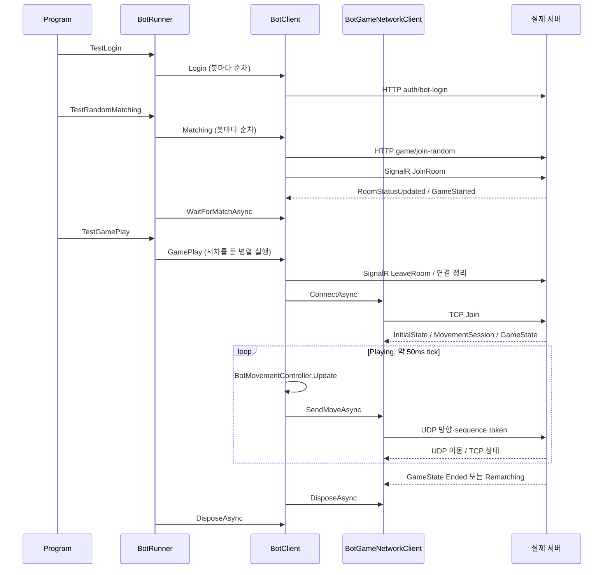

# Bot 프로젝트 파일별·메서드별 코드 참고서

이 문서는 `polrob.Test/*.cs` 7개를 소스 옆에 놓고 읽는 참고서다. 이름의 Test는 `polrob.Server.Tests`의 NUnit 테스트와 달리 실제 서버에 로그인·매칭·TCP/UDP 접속을 수행하는 콘솔 봇 실행 프로그램을 뜻한다. 테스트 프로젝트와 도구 전체 개요는 [6장](06-tests-and-tools.md)을 참고한다. 아래 설명은 소스 분석이며 봇을 실제로 실행한 결과를 뜻하지 않는다.

## 파일 찾아보기

| 파일 | 책임 |
|---|---|
| [Program.cs](#programcs) | 세 단계의 진입점 |
| [BotRunner.cs](#botrunnercs) | 여러 봇 생성, 방 구성 검증, 동시 실행과 결과 집계 |
| [BotClient.cs](#botclientcs) | 한 봇의 HTTP/SignalR/게임 세션과 상태 조율 |
| [BotGameNetworkClient.cs](#botgamenetworkclientcs) | 실제 TCP 프레임/UDP 입력 송수신 |
| [BotMovementController.cs](#botmovementcontrollercs) | 로컬 방향 선택, 충돌 회피, 감옥 구조 접근 |
| [BotState.cs](#botstatecs) | 선언만 남아 있는 미사용 enum |
| [BotService.cs](#botservicecs) | 내용이 없는 파일 |

## Program.cs

[전체 소스](../../polrob.Test/Program.cs#L1). top-level statements 6줄로, 명시적 Main class 대신 컴파일러가 진입점을 만든다.

### 진입점의 처리 순서

1. `new BotRunner()`로 봇 목록을 소유할 실행자를 만든다.
2. `await TestLogin()`으로 모든 봇의 로그인 완료를 기다린다.
3. `await TestRandomMatching()`으로 매칭과 방 구성 검증을 마친다.
4. `await TestGamePlay()`으로 각 봇이 게임 종료 상태를 받을 때까지 실행한다.

명령행 args를 파싱하지 않는다. 봇 수/주소 등의 입력은 각 class가 환경변수에서 읽는다. 이 파일에는 catch, 재시도, 반복 실행, 종료 신호 처리 코드가 없으므로 앞 단계에서 예외가 나면 뒤 단계로 가지 않는다. 특히 로그인/매칭 실패는 게임 실행 단계의 finally 정리에 도달하지 않는다.

## BotRunner.cs

[전체 소스](../../polrob.Test/BotRunner.cs#L6). 여러 BotClient의 생명주기를 실행하는 class다. 게임의 이동/네트워크 내용은 BotClient에 맡기고, 로그인 순서·역할 비율·동시 실행·콘솔 집계만 담당한다.

### 필드와 입력

| 필드 | 값과 용도 |
|---|---|
| `_botClients` | 로그인에 성공한 BotClient 목록. 이후 모든 단계가 이 목록 사용 |
| `BotCount` | `POLROB_BOT_COUNT`의 0 이상 정수, 기본600 |
| `GamePlayConnectStagger` | `POLROB_BOT_GAMEPLAY_CONNECT_STAGGER_MS`의 0 이상 정수 밀리초, 기본10 |
| `InitialStateTimeout` | `POLROB_BOT_INITIAL_STATE_TIMEOUT_SECONDS`의 양수 초, 기본60. 이 class에서는 출력용이며 실제 대기는 BotClient가 같은 설정을 따로 읽어 적용 |

세 설정은 static readonly여서 타입 초기화 때 읽는다. 실행 중 환경변수를 바꿔도 이미 저장된 값은 갱신되지 않는다. 생성자 [BotRunner()](../../polrob.Test/BotRunner.cs#L16)는 본문이 비어 있고 필드 초기화 외 부작용이 없다.

### `TestLogin()` — 봇 생성과 순차 로그인

[선언](../../polrob.Test/BotRunner.cs#L21). 인자 없이 Task를 반환한다. i=0..BotCount−1마다 BotClient를 만들고 Name=`Bot_{i:D4}`, Role=`i % 3 < 2 ? Robber : Police`로 지정한다. 예를 들어 0/1은 도둑, 2는 경찰이며 같은 패턴을 반복한다.

각 bot.Login을 await한 뒤에만 목록에 추가하므로 로그인은 병렬이 아니다. 실패하면 현재 봇은 목록에 추가되지 않고 예외가 호출자까지 올라간다. 이전에 로그인한 봇을 이 메서드에서 정리하지 않는다. BotCount=0이면 빈 목록으로 정상 완료한다. 메서드를 다시 호출하면 기존 목록을 Clear하지 않아 추가 봇이 누적된다.

### `TestRandomMatching()` — 매칭 시작 후 6인 방 검증

[선언](../../polrob.Test/BotRunner.cs#L35). 각 BotClient.Matching을 먼저 **순서대로** await한다. 모두 가입 요청을 마친 뒤 각 봇의 WaitForMatchAsync(30초)를 Task.WhenAll로 기다린다. 따라서 30초는 첫 HTTP 매칭 요청 시각부터의 전역 제한이 아니라 대기 Task들이 만들어진 뒤의 제한이다.

대기가 끝나면 RoomId로 봇을 묶어 전체 인원/경찰 수/도둑 수를 센다. 정상 기준은 6명, 경찰2, 도둑4다. 총 방 수와 기준 충족 방 수를 콘솔에 쓰고, 이상 방의 상세를 최대10개 출력한다. 하나라도 이상이면 InvalidOperationException이다.

검증 대상은 이 Runner가 만든 봇 목록이다. 같은 서버에서 외부 플레이어가 방에 섞이면 서버 방 자체가 정상이더라도 Runner의 집계는 6명에 못 미칠 수 있다. BotCount가 6의 배수가 아니거나 필요한 역할 비율을 못 채우면 일부 봇이 매칭 대기에서 timeout될 수 있다. 이 메서드는 매칭을 강제로 완료시키거나 부족한 봇을 보충하지 않는다.

### `TestGamePlay()` — 병렬 게임 실행, 정리, 방별 결과

[선언](../../polrob.Test/BotRunner.cs#L83). 인원과 접속 간격/초기 상태 제한을 출력한 뒤 ConcurrentBag<string> 실패 목록을 만든다. 각 봇에 RunBotGamePlayAsync(bot,index,failures)를 만들어 Task.WhenAll로 기다린다.

이 실행 대기를 try/finally로 감싸 finally에서 모든 bot.DisposeAsync를 다시 Task.WhenAll로 호출한다. 정상 종료와 게임 실행 실패 모두 정리 단계에 들어간다. 다만 정리 자체의 예외는 별도로 삼키지 않으므로 아래 결과 출력까지 도달하지 못할 수 있다.

실패 목록이 있으면 개수와 최대20개의 내용을 출력하고 InvalidOperationException을 던진다. 실패가 없으면 RoomId별 **첫 봇 한 명**의 WinnerRole/ElapsedGameTime을 대표 결과로 사용하고 RoomId의 Ordinal 순서로 출력한다. 모든 봇의 승자 값 일치 여부를 교차 검증하지는 않는다. 경과 시간 표시는 TimeSpan.Minutes/Seconds이므로 hour 성분을 별도로 출력하지 않는다.

### `RunBotGamePlayAsync(bot,index,failures)` — 접속 시차와 예외 수집

[선언](../../polrob.Test/BotRunner.cs#L136). 접속 간격이 양수이면 `간격 × index`만큼 Task.Delay한 뒤 bot.GamePlay를 실행한다. 예를 들어 기본값에서 첫 봇은 즉시, 100번째 인덱스 봇은 약1초 뒤 시작한다. 각 Task가 자체 지연하므로 순차 GamePlay를 의미하지 않는다.

GamePlay에서 발생한 모든 Exception을 잡아 이름/ID/방/역할/예외 타입/메시지를 실패 목록에 넣고 자신의 Task는 완료시킨다. 그러므로 하나의 게임 실패만으로 다른 봇 Task를 취소하지 않는다. Task.Delay는 try 밖에 있어 그 단계의 예외는 이 문자열 목록으로 바뀌지 않는다. 별도 CancellationToken도 받지 않는다.

### 환경변수 helper 두 개

- [GetNonNegativeIntEnvironmentVariable(name,fallback)](../../polrob.Test/BotRunner.cs#L159): 환경변수를 int.TryParse하고 결과≥0이면 반환한다. 누락/잘못된 문자열/음수/int 범위 초과면 fallback이다. 0봇과 0ms 접속 간격을 허용한다.
- [GetPositiveIntEnvironmentVariable(name,fallback)](../../polrob.Test/BotRunner.cs#L167): 같은 구조지만 결과>0이어야 한다. 초기 상태 timeout을 0초로 끄는 기능은 없다.

두 함수 모두 설정 오류를 출력하거나 예외로 알리지 않는다. 외부 요청이나 파일 변경도 하지 않는다.

## BotClient.cs

[전체 소스](../../polrob.Test/BotClient.cs#L8). 한 봇의 단계별 프로토콜과 메모리 상태를 조율하며 IAsyncDisposable을 구현한다. BotRunner만으로는 '이 봇은 언제부터 움직여도 되는가'를 알 수 없으므로 이 class가 매칭 완료, 초기 상태, 게임 phase를 각각 관리한다.

### 핵심 상태와 소유권

| 필드/속성 | 의미와 갱신 위치 |
|---|---|
| Name, Role | Runner가 로그인 전에 설정하는 봇 신원/희망 역할 |
| Id, SessionToken | Login HTTP 응답에서 받는 서버 사용자 ID/세션 토큰 |
| RoomId | Matching HTTP 응답에서 저장 |
| MapId, CurrentRoomCount, IsMatched | 성공한 HTTP/SignalR 방 상태로 갱신 |
| WinnerRole, ElapsedGameTime | TCP GameState의 Ended/Rematching으로 갱신 |
| `_httpClient` | 생성자에서 만든 인증/매칭용 HTTP 연결 자원 |
| `_hubConnection` | 매칭 대기 이벤트용 SignalR 연결. 게임 시작 시 정리 |
| `_gameNetworkClient` | 한 번의 GamePlay용 TCP/UDP transport |
| `_movementController` | 선택 맵에 대한 로컬 방향/충돌 결정 |
| `_visibleTeamPlayers` | 서버에서 수신한 Player를 ID로 저장. 이름은 TeamPlayers지만 삽입 시 여기서 역할을 필터링하지 않음 |
| `_localPlayer` | 사전 속 자기 ID의 Player 참조. 초기 상태 또는 자기 PlayerState로 설정 |
| `_playerStateLock` | 수신 이벤트와 이동 루프가 공유하는 Player/사전/phase 보호 |
| `_gamePhase` | 처음 Waiting, GameState 수신 때 변경 |
| `_movementLockedUntilUtc` | 체포 이벤트에 자신이 관련됐을 때 현재 시각+2.2초 |
| `_matchCompleted` | 매칭 성공을 알리는 TCS. 생성 시 한 번 만들어 다시 초기화하지 않음 |
| `_initialStateReceived`, `_gameEnded` | GamePlay 진입마다 새 TCS로 교체 |

세 TCS는 RunContinuationsAsynchronously를 사용하므로 이벤트를 처리하는 스레드 안에서 대기자의 후속 코드를 즉시 길게 실행시키지 않는다. 이것이 수신 함수 자체를 멀티스레드 안전하게 만드는 것은 아니며 Player 상태는 별도 lock으로 보호한다.

### `BotClient()` — HTTP 기본 주소와 봇 키 설정

[선언](../../polrob.Test/BotClient.cs#L45). POLROB_SERVER_URL이 없으면 `http://localhost:5174`, POLROB_BOT_KEY가 없으면 `polrob-local-bot-key`다. 서버 URL로 HttpClient.BaseAddress를 만들고 X-Polrob-Bot-Key 헤더를 추가한다. 아직 네트워크 요청은 하지 않는다.

여기의 `??`는 null만 대체하므로 빈 문자열 환경변수는 기본값으로 돌아가지 않는다. 잘못된 URI나 허용되지 않는 헤더 값 등은 생성 중 예외가 될 수 있다. 키가 실제 서버 설정과 맞는지 확인하는 일은 로그인 요청 때 서버가 한다.

### `Login()` — 세션 토큰 얻기

[선언](../../polrob.Test/BotClient.cs#L59). 현재 Name/Role을 BotLoginRequest로 만들어 `POST auth/bot-login`한다. EnsureSuccessStatusCode가 HTTP 비성공을 예외로 바꾸고, JSON을 LoginResponse로 역직렬화한다. JSON 결과가 null이면 InvalidOperationException이다.

응답 UserId와 SessionToken을 저장하고 이후 HttpClient 요청의 Authorization을 `Bearer 토큰`으로 설정한다. 응답 Name은 DTO에 있지만 이 메서드에서 자신의 Name을 덮어쓰지 않는다. 반환 Task 완료는 토큰 확보를 의미하며 매칭 완료를 의미하지 않는다. 재시도/토큰 갱신/필드별 공백 검증은 없다. HTTP·JSON 예외는 그대로 Runner로 올라간다.

### `Matching()` — 방 가입과 SignalR 구독

[선언](../../polrob.Test/BotClient.cs#L76). Id가 공백이면 로그인 안 된 상태로 판단하여 InvalidOperationException이다. 그 외에는 Role만 담은 BotMatchingRequest로 `POST game/join-random`한다. HTTP 성공 여부 확인 후 ServerResponse를 읽고 null이면 예외다. 응답 RoomId가 null이면 예외이고, 값이 있으면 RoomId를 저장한 뒤 UpdateRoomStatus를 호출한다.

이후 BaseAddress 기준 `hubs/game-room`에 HubConnection을 만든다. AccessTokenProvider는 현재 SessionToken을 반환한다. RoomStatusUpdated와 GameStarted 둘 모두 UpdateRoomStatus에 연결하고, StartAsync 완료 후 JoinRoom(RoomId)을 invoke한다.

HTTP 응답의 Success=false는 UpdateRoomStatus가 무시하지만 Matching 자체가 그 flag만으로 즉시 예외를 던지지는 않는다. 또한 RoomId의 null 검사와 공백 검사는 다르다. 자동 SignalR 재접속 설정, 이미 있는 hub를 교체하기 전 정리, 매칭 재시도는 구현되어 있지 않다.

### `WaitForMatchAsync(timeout)` — 완료 이벤트 대기

[선언](../../polrob.Test/BotClient.cs#L109). `_matchCompleted.Task.WaitAsync(timeout)`를 반환한다. 입력은 TimeSpan이며 별도 네트워크 호출이나 polling은 없다. 시간 안에 TCS가 완료되지 않으면 대기 Task가 TimeoutException으로 끝난다. 이 timeout이 hub 연결을 닫거나 서버 매칭을 취소하는 것은 아니다.

### `UpdateRoomStatus(response)` — 매칭 상태를 반영하는 공통 callback

[선언](../../polrob.Test/BotClient.cs#L114). Success=false이면 아무 상태도 바꾸지 않고 반환한다. 성공이면 CurrentCount, Registry가 검증한 MapId, Matched를 속성에 대입한다. Matched=true이면 `_matchCompleted.TrySetResult()`를 호출한다. 모르는 MapId이면 MapRegistry.Get의 예외가 전파된다.

RoomId와 Role은 이 callback에서 바뀌지 않는다. 한 번 완료된 TCS는 나중에 Matched=false가 와도 미완료로 돌아가지 않는다. 따라서 이 객체는 여러 차례 매칭 재시도를 관리하는 완성된 상태 머신으로 구현되어 있지 않다.

### `GamePlay()` — 준비 단계

[선언](../../polrob.Test/BotClient.cs#L131). IsMatched=false이거나 RoomId가 공백이면 InvalidOperationException이다. 그 다음 DisconnectMatchingHubAsync로 로비 연결을 닫고 초기 상태/게임 종료 TCS를 새로 만든다. BotMovementController(Id,MapId), BotGameNetworkClient를 새로 만들고 모든 수신 이벤트를 등록한다.

게임 호스트는 POLROB_GAME_SERVER_HOST가 있으면 그것을, 없으면 HTTP BaseAddress.Host, 그것도 없으면 localhost를 사용한다. HTTP URL의 포트5174를 게임 포트로 사용하지 않는다. 실제 transport는 TCP7777/UDP7778에 연결한다. joiningPlayer에는 Id/RoomId/Name/Role을 넣지만 TCP Join DTO에서 사용되는 Player 필드는 RoomId다.

지역 CancellationTokenSource를 만들고 ConnectAsync를 await한 뒤 `_initialStateReceived`를 기본60초 기다린다. timeout이면 봇 이름·방·역할·제한 시간을 포함한 새 TimeoutException으로 감싸 던진다. 이 제한은 ConnectAsync 완료 **후** 초기 상태 대기에 적용되며 전체 GamePlay 또는 TCP 접속 시간을 제한하는 전역 timeout이 아니다. 초기 목록에 자기 ID가 없을 때는 이벤트 쪽의 InvalidOperationException이 대기를 실패시킨다.

### `GamePlay()` — 50ms 이동 tick과 전송 빈도

준비가 끝나면 `_gameEnded.Task.IsCompleted`가 될 때까지 50ms Delay를 반복한다. 실제 지연 시간을 DateTime.UtcNow 차이로 계산하여 MovementController에 전달한다.

lock 안에서 phase가 Playing이 아니거나 자기 Player/컨트롤러가 없으면 그 tick을 건너뛴다. 체포 잠금 시간 안이면 IsMoving=false로 두고, 아니면 Update에 자기 Player·현재 사전 값의 복사 목록·elapsed를 전달한다. 업데이트 뒤 CopyPlayer로 전송 판단에 사용할 snapshot을 만들고 lock을 빠져나온다.

이동 중이면 최소50ms, 정지 중이면 최소500ms 간격으로 SendMoveAsync를 호출한다. IsMoving이 직전 전송과 달라지면 그 간격을 기다리지 않고 보낸다. 따라서 서버에는 방향/정지 입력을 보내며 로컬에서 계산한 X/Y는 패킷의 목적지 좌표로 전송하지 않는다. 수신된 서버 상태는 Player를 계속 보정한다.

Ended 또는 Rematching 이벤트가 `_gameEnded`를 완료하면 루프에서 빠져나와 그 Task를 await한다. finally에서는 수신 취소를 요청하고 transport를 Dispose한 뒤 필드를 null로 한다. 초기 상태 이후 TCP 연결이 끊어졌다는 이유만으로 `_gameEnded`가 자동 실패하는 연결은 없으며 전체 플레이 제한 시간도 없다. 또한 50ms Task.Delay에는 지역 취소 토큰을 넘기지 않는다.

### `RegisterGameNetworkEvents(networkClient)` — 8개 수신 이벤트 연결

[선언](../../polrob.Test/BotClient.cs#L259). 반환값은 없고 transport의 event에 아래 lambda를 더한다. 별도 구독 해제는 없으며 GamePlay마다 새 transport를 만들고 함께 폐기한다.

| 이벤트 | 입력 → 정확한 상태 변화 |
|---|---|
| InitialStateReceived | lock 안에서 사전을 비우고 받은 Player를 ID별 저장. 자기 ID를 찾아 `_localPlayer`로 참조. 없으면 초기 상태 TCS를 예외로 완료하고 반환. 있으면 lock 뒤 TCS 성공 완료 |
| PlayerJoined | lock 안에서 해당 ID 값을 새 Player로 저장/덮어씀. 여기서는 자기 ID인지 확인하여 `_localPlayer`를 다시 연결하지 않음 |
| PlayerLeft | lock 안에서 해당 ID만 Remove. 자기 ID라도 `_localPlayer` 필드를 null로 바꾸는 분기는 없음 |
| PlayerStateReceived | 있던 객체에는 CopyPlayerState로 필드를 복사하고, 없던 ID이면 객체 추가. 자기 ID이면 사전 객체를 `_localPlayer`로 지정 |
| PlayerMovementReceived | 알 수 없는 ID는 무시. 아는 ID에는 movement.ApplyTo 호출. 자기 ID이면 `_localPlayer` 참조 연결 |
| PlayerArrested | 자신의 ID가 policeId/robberId 중 어느 것도 아니면 무시. 자신이 체포자 또는 수감자이면 2.2초 이동 잠금, 자기 Player가 있으면 IsMoving=false. IsJailed 자체는 여기서 바꾸지 않음 |
| JailBreakReceived | RobberId가 사전에 없으면 무시. 있으면 X/Y를 release 좌표로, IsMoving=false, IsJailed=false로 설정 |
| GameStateReceived | lock 안에서 phase 갱신. Ended이면 winner/elapsed 저장 후 게임 종료 TCS 완료. Rematching이면 winner=null/elapsed=0으로 두고 동일 TCS 완료. 다른 phase는 종료시키지 않음 |

`_visibleTeamPlayers`의 플레이어 객체를 그대로 공유하므로 lock 없이 이동 루프와 callback이 동시에 필드를 수정하지 않도록 만든 구조다. 그러나 매칭 속성과 WinnerRole/ElapsedGameTime까지 모든 속성을 같은 lock으로 보호하는 형태는 아니다.

### `DisconnectMatchingHubAsync()` — 로비 연결 정리

[선언](../../polrob.Test/BotClient.cs#L390). hub가 null이면 바로 끝난다. 아니면 지역 변수로 옮기고 `_hubConnection=null`을 먼저 설정한다. 연결 상태가 Connected이고 RoomId가 공백이 아니면 LeaveRoom(RoomId)을 invoke한다. 이 try 안의 예외는 모두 무시하여 로비 이탈 요청 실패만으로 게임 진행을 막지 않는다.

finally에서 connection.DisposeAsync는 항상 호출한다. 이 Dispose의 예외까지 catch가 감싸지는 않으므로 정리 예외는 전파될 수 있다. 자동으로 로비에 재연결하거나 server room membership을 직접 다시 쓰지 않는다. 호출자는 GamePlay와 GameOver다.

### `GameOver()`와 `DisposeAsync()` — 서로 다른 범위의 정리

[GameOver](../../polrob.Test/BotClient.cs#L241)는 로비를 정리하고, transport가 있으면 DisposeAsync 후 null로 바꾼다. 서버에 '내가 게임을 끝낸다'라는 종료 명령을 보내는 함수가 아니다. HTTP client는 그대로 둔다.

[DisposeAsync](../../polrob.Test/BotClient.cs#L450)는 GameOver를 await한 다음 HttpClient.Dispose를 호출한다. Task 대신 ValueTask를 반환하는 IAsyncDisposable 계약이다. GameOver에서 예외가 나면 HTTP Dispose까지 보장하는 별도 finally는 없다. Runner의 게임 실행 finally가 이 메서드를 호출한다.

### `CopyPlayer(source)`와 `CopyPlayerState(source,destination)`

[CopyPlayer](../../polrob.Test/BotClient.cs#L418)는 새 Player를 만들고 Id/RoomId/Name/X/Y/Speed/Radius/Angle/IsMoving/IsJailed/Role의 11필드를 복사해 반환한다. 이동 루프가 lock 밖에서 snapshot을 사용하기 위한 얕은 값 복사이며 여기 필드들은 문자열/값 타입이다.

[CopyPlayerState](../../polrob.Test/BotClient.cs#L436)는 destination의 같은 필드를 갱신하되 **Id는 복사하지 않는다.** 사전에서 source.Id로 찾은 객체의 정체성은 유지하고 나머지 상태만 덮어쓴다. 기존 `_localPlayer` 참조를 유지할 수 있는 이유다. null guard나 role/좌표 검증은 없다.

### 설정 helper와 HTTP record

[GetPositiveIntEnvironmentVariable](../../polrob.Test/BotClient.cs#L251)은 Runner의 양수 설정 helper와 같은 규칙으로 int 파싱 실패/0/음수이면 fallback을 반환한다. 이 파일의 static InitialStateTimeout 설정에서 사용한다.

[파일 끝의 private records](../../polrob.Test/BotClient.cs#L456)는 BotLoginRequest(Name,Role), LoginResponse(SessionToken,UserId,Name), BotMatchingRequest(Role)다. 별도 직접 작성한 메서드는 없고 HTTP JSON 직렬화/역직렬화의 모양을 정한다. Shared의 DTO로 옮겨져 있는 형식은 아니다.

## BotGameNetworkClient.cs

[전체 소스](../../polrob.Test/BotGameNetworkClient.cs#L8). BotClient가 게임 세션에서 사용하는 transport다. 화면이나 로비 HTTP/SignalR 책임이 없고 Shared DTO를 실제 소켓 데이터로 바꾼다.

### 자원과 이벤트

TcpClient/UdpClient, TCP stream의 BinaryReader/BinaryWriter, 수신 취소용 linked CancellationTokenSource, TCP/UDP 수신 Task 두 개를 소유한다. `_movementInputSequence`는 ulong이며 처음0, `_movementSessionToken`은 처음 빈 문자열이다. 명시적 생성자는 없다.

외부로 InitialStateReceived, PlayerJoined, PlayerLeft, PlayerStateReceived, PlayerMovementReceived, PlayerArrested, JailBreakReceived, GameStateReceived의 8개 event를 공개한다. handler 호출은 현재 수신 Task에서 동기적으로 일어난다. 별도의 이벤트 큐나 UI dispatcher는 없다. BotClient가 lock으로 상태 접근을 정리하는 이유다.

### `ConnectAsync(serverHost,localPlayer,sessionToken,cancellationToken,mapId)`

[선언](../../polrob.Test/BotGameNetworkClient.cs#L29). mapId는 생략 시 Registry.DefaultId다. 전달된 cancellationToken으로 linked CTS를 만들고 TCP host:7777에 연결한다. 같은 TCP stream에 BinaryReader/Writer를 붙이고 UdpClient는 host:7778에 Connect한다. UDP의 Connect는 TCP와 같은 handshake를 하는 절차가 아니라 기본 송신 대상과 수신 상대를 지정하는 동작이다.

그 다음 TCP/UDP 수신 루프를 각각 Task.Run으로 시작한다. Task.Run 자체에는 CancellationToken.None을 주지만 내부 수신 함수에 linked token을 전달한다. 마지막으로 Join 타입 TCP 메시지를 보내며 payload는 SessionToken/RoomId/MapId를 담은 GameJoinRequest JSON이다. localPlayer의 Id/Name/Role/좌표를 Join의 별도 필드로 보내지 않는다.

반환 Task 완료는 접속과 Join 송신까지를 뜻한다. InitialState나 MovementSession을 받았다는 보장은 없으며 BotClient가 초기 상태 이벤트를 따로 기다린다. 연결 실패·이름 해석·소켓 예외는 전파된다. 메서드 내부에 부분 생성 자원의 정리 try/finally는 없고 호출자가 Dispose한다. 동일 인스턴스 재사용을 위한 sequence/token 초기화나 기존 연결 정리도 없다.

### `SendMoveAsync(player)` — 좌표가 아닌 입력을 보내기

[선언](../../polrob.Test/BotGameNetworkClient.cs#L63). UDP client가 아직 없으면 성공처럼 바로 반환한다. 있으면 Player.Angle에 90도를 더해 라디안으로 바꾸고 IsMoving=true일 때 X=cos,Y=sin, false일 때 X=Y=0으로 PlayerMovementInput을 만든다.

Id는 player.Id, Sequence는 `++_movementInputSequence`, Token은 TCP에서 받은 `_movementSessionToken`이다. JSON을 UTF-8 bytes로 바꿔 UdpClient.SendAsync한다. 로컬 player.X/Y/Speed/Radius는 이 메시지에 담지 않는다. 방향과 시간 적용의 최종 권한은 서버에 있다.

첫 sequence는1이다. token이 아직 비어 있어도 전송을 막는 조건은 없으며 서버가 검증한다. sequence 증가와 송신에 별도 lock이 없으므로 현재처럼 단일 게임 루프가 호출한다는 전제를 가진다. 소켓이 이미 폐기되었거나 송신 실패이면 예외가 호출자 GamePlay로 전파된다.

### `SendTcp(type,payload)` — TCP 프레임 쓰기

[선언](../../polrob.Test/BotGameNetworkClient.cs#L83). writer가 없으면 바로 반환한다. writer를 lock하고 payload의 UTF-8 **바이트 수**를 계산한다. 문자열 길이 prefix가 몇 바이트인지 7비트 단위로 센 뒤 아래 순서로 BinaryWriter.Write한다.

| 순서 | 표현 | 담기는 값 |
|---|---|---|
| 1 | Int32, little endian | `1 + 문자열 길이 prefix 바이트 수 + UTF-8 payload 바이트 수` |
| 2 | byte | TcpMessageType |
| 3 | .NET BinaryWriter 문자열 | 7bit encoded 길이 prefix + UTF-8 bytes |

맨 앞 4바이트 길이는 자기 자신을 포함하지 않는다. checked 덧셈은 int overflow를 예외로 만든다. 한 메시지의 조각이 다른 송신과 섞이지 않게 lock하지만 별도 writer queue는 없다. 현재 호출자는 ConnectAsync의 Join 송신이고, 봇이 Heartbeat를 주기적으로 보낼 때 사용하는 코드가 존재하는 것은 아니다.

### `ReceiveTcpLoop(cancellationToken)` — 봇의 TCP 읽기 방식

[선언](../../polrob.Test/BotGameNetworkClient.cs#L105). reader가 없으면 반환한다. 취소되지 않은 동안 ReadInt32→ReadByte→ReadString→DispatchTcpMessage를 반복한다. **읽은 Int32 길이는 버린다.** 따라서 서버 프레임 경계를 그 길이로 잘라 검증하지 않고 BinaryReader의 문자열 prefix를 믿고 다음 메시지로 진행한다. 서버 쪽의 길이 검증 수신기와 같은 구현이라고 해석하면 안 된다.

ReadInt32/ReadString은 동기 blocking 읽기다. token이 취소됐는지 루프 조건은 확인하지만 토큰만으로 진행 중인 blocking read가 즉시 취소되는 것은 아니다. DisposeAsync가 실제 소켓을 닫아 대기를 중단한다.

취소 상태일 때의 모든 Exception, 그 외 IOException/ObjectDisposedException은 삼키고 수신 루프를 끝낸다. JSON 파싱 예외나 event handler 예외는 취소 중이 아니면 이 catch에 해당하지 않아 수신 Task가 fault될 수 있다. 연결 종료를 BotClient의 gameEnded TCS에 직접 전달하는 event는 없다.

### `DispatchTcpMessage(type,payload)` — 메시지별 이벤트와 상태

[선언](../../polrob.Test/BotGameNetworkClient.cs#L133). 반환값은 없다. 아래 타입만 switch로 처리하며 나머지는 그대로 무시한다.

| Type | 처리와 외부 영향 |
|---|---|
| InitialState | List<Player> JSON으로 읽어 null이 아니면 InitialStateReceived |
| Joined | Player JSON으로 읽어 null이 아니면 PlayerJoined |
| Left | payload 문자열을 그대로 PlayerLeft의 playerId로 전달 |
| Arrested | 쉼표로 Split하여 정확히2부분일 때만 policeId,robberId 이벤트. trim이나 빈 ID 검증은 없음 |
| GameState | GameStateSync JSON→GameStateReceived |
| JailBreak | JailBreakSync JSON→JailBreakReceived |
| PlayerState | Player JSON→PlayerStateReceived |
| MovementSession | payload를 `_movementSessionToken`으로 저장. 외부 event 없음 |

JSON `null`이면 관련 event를 호출하지 않는다. 잘못된 JSON은 예외를 던진다. OpponentProximity/JailBreakProgress/Heartbeat 등 Shared에 선언된 타입이 있다고 해서 이 봇이 모두 처리하는 것은 아니다. 화면용 근접 표시나 구조 진행 UI가 필요하지 않아 여기서 구독하지 않는 항목도 있다.

### `ReceiveUdpLoopAsync(cancellationToken)` — 이동 상태 우선 역직렬화

[선언](../../polrob.Test/BotGameNetworkClient.cs#L195). UDP client가 없으면 반환한다. ReceiveAsync(token)으로 datagram 하나를 받고 PlayerMovementSync로 먼저 JSON 역직렬화한다. 결과가 null이 아니고 Id가 공백이 아니면 PlayerMovementReceived를 호출하고 다음 datagram으로 넘어간다.

그 조건을 만족하지 않을 때만 같은 bytes를 Player로 다시 역직렬화하여 null이 아니면 PlayerStateReceived를 호출한다. 첫 JSON 파싱 자체가 실패한 경우까지 Player로 재시도하는 catch 구조는 아니다. 또한 'JSON 모양을 완전 검증한 후 타입을 판별'하는 방식이 아니라 compact DTO의 Id 유무를 기준으로 구분한다.

취소 예외/ObjectDisposedException은 삼킨다. SocketException은 취소 중일 때만 삼킨다. 일반 소켓 오류·JSON 오류·handler 오류는 Task fault로 남을 수 있다. 자체 datagram 길이 제한이나 수신 sequence 비교는 없으며, 접속된 UDP 소켓을 사용하는 것 외에 별도 송신자 비교를 하지 않는다.

### `DisposeAsync()` — 수신 취소와 소켓 폐기

[선언](../../polrob.Test/BotGameNetworkClient.cs#L232). CTS가 있으면 CancelAsync하고 UDP→TCP→reader→writer 순서로 Dispose한다. 존재하는 두 수신 Task를 WhenAll로 기다리며 그 대기의 예외는 모두 삼킨다. 끝에 CTS도 Dispose한다.

송수신 자원을 닫아 TCP blocking read를 중단시키는 과정이 중요하다. 일부 필드가 null인 연결 실패 경로도 null 조건 호출로 처리한다. 그러나 필드를 모두 null로 되돌리거나 disposed flag를 두는 구현은 아니므로 같은 객체의 무제한 반복 Dispose/Connect 사용을 보장하는 형태는 아니다. BotClient는 한 GamePlay에 새 인스턴스를 쓰고 정리 후 참조를 null로 만든다.

## BotMovementController.cs

[전체 소스](../../polrob.Test/BotMovementController.cs#L6). 네트워크와 분리된 로컬 이동 의사결정 class다. 입력 Player의 X/Y/Angle/IsMoving을 직접 갱신하고 움직이기로 결정했는지를 bool로 반환한다. 봇의 로컬 좌표 예측은 길 찾기와 전송 방향 선택에 쓰이고 실제 서버 권위 좌표는 수신 상태로 다시 반영된다.

### 보관하는 상태와 상수

| 상태 | 의미 |
|---|---|
| `_map` | 선택 맵의 GameMap 인스턴스 |
| `_nearbyCollisionObstacles` | GameMap 충돌 검사에 반복 전달하는 임시 List |
| `_random` | 봇 ID의 Ordinal hash로 seed를 준 Random |
| `_wanderDirection` | 현재 배회 방향 |
| `_nextDirectionChangeUtc` | 다음 배회 방향 변경 가능 시각 |
| `_pausedUntilUtc` | 무작위 일시 정지 종료 시각 |
| `_nextPauseCheckUtc` | 다음 무작위 정지 결정 시각 |
| MovementUnitsPerSecondMultiplier | 60. Player.Speed를 초당 거리로 환산 |
| RescueArrivalDistance | 20. 목표점까지 이 거리 이내면 정지 |
| SteeringAngles | 0,+25,−25,+50,−50,+90,−90,+135,−135,180도 순서 |

경찰의 도둑 추격/시야 분석, A* 경로 탐색, 재접속은 구현하지 않는다. 배회와 감옥 구조 접근을 통해 실제 서버의 이동/체포/구조 흐름을 발생시키는 목적이다.

### `BotMovementController(botId,mapId)` — 맵과 난수 초기화

[선언](../../polrob.Test/BotMovementController.cs#L20). GameMap(mapId)을 만들고 StringComparer.Ordinal.GetHashCode(botId)를 Random seed로 사용한다. CreateRandomDirection으로 초기 배회 단위 벡터를 만든다. 알 수 없는 맵은 GameMap 생성 중 예외다.

같은 실행 프로세스에서 같은 botId의 seed를 재사용하는 구조지만 문자열 hash의 프로세스 간 고정성까지 보장하는 replay 시스템은 아니다. 또한 판단 시각은 실제 UTC 시각을 사용하므로 elapsed만 같게 주어 전체 행동을 재현하도록 설계되어 있지 않다.

### `Update(localPlayer,visibleTeamPlayers,elapsed)` — 우선순위별 행동 선택

[선언](../../polrob.Test/BotMovementController.cs#L27). BotClient가 Playing인 tick마다 lock 안에서 호출한다. 결과 bool은 현재 호출에서 Move 성공 여부지만 BotClient는 이 반환값을 사용하지 않고 Player.IsMoving을 전송 판단에 사용한다.

처리 순서는 다음과 같다.

1. 도둑이고 IsInJail=true면 IsMoving=false, false 반환이다.
2. TryGetRescueTarget이 성공하면 그 목표점까지 벡터를 구한다. 거리 제곱≤400이면 정지/false다. 그 외에는 `_pausedUntilUtc`를 초기화하고 목표 방향으로 Move한 결과를 바로 반환한다. 구조 이동 실패 뒤 같은 호출에서 무작위 배회로 전환하지 않는다.
3. 구조 대상이 없고 아직 정지 시간 안이면 정지/false다.
4. 정지 판단 시각이 됐고 ShouldPause=true이면 역할별 기간 동안 멈춘다. 다음 판단 시각은 정지 종료 후 추가1200..3199ms 뒤다.
5. 판단 시각이 됐지만 멈추지 않으면 다음 판단만 현재+1200..3199ms로 미룬다.
6. 방향 변경 시각이 됐으면 새 무작위 방향을 고르고 다음 변경은 현재+900..2799ms다.
7. 현재 배회 방향으로 Move가 성공하면 true다. 모두 막혔으면 방향을 다시 무작위로 고르고 다음 변경을 현재+500..1399ms로 정한 뒤 Move를 한 번 더 호출한다.

정지/방향 시각은 DateTime.UtcNow, 이동 거리만 입력 elapsed로 계산한다. 별도 null/NaN 검증은 없고 서버에서 정상 Player 상태가 전달된다는 전제를 둔다.

### `ShouldPause(role)`와 `GetPauseDuration(role)`

[ShouldPause](../../polrob.Test/BotMovementController.cs#L89)는 Random.NextDouble이 도둑이면0.22, 그 외에는0.08보다 작은지 bool을 반환한다. 매 tick 확률을 적용하는 것이 아니라 Update의 `_nextPauseCheckUtc`가 됐을 때만 호출한다.

[GetPauseDuration](../../polrob.Test/BotMovementController.cs#L95)은 도둑에게 800..2399ms, 그 외에게 400..1199ms 중 정수를 선택해 TimeSpan으로 반환한다. Random.Next의 상한은 제외된다. 경찰/도둑 외 enum 값은 이 두 helper에서 경찰 쪽 분기를 탄다.

### `TryGetRescueTarget(localPlayer,visibleTeamPlayers,out target)`

[선언](../../polrob.Test/BotMovementController.cs#L103). 먼저 target=default다. 자신이 도둑이 아니면 false, 전달된 목록에 수감 도둑이 하나도 없으면 false다. 자유 도둑의 ID만 추려 Ordinal로 정렬하고 자기 ID의 인덱스를 찾는다.

자기 ID가 목록에 없거나 인덱스가 수감 도둑 수 이상이면 false다. 그 외는 GetRescueContactPoint(localPlayer.Radius,index)를 target에 넣고 true다. 예를 들어 수감자1명/자유도둑3명이면 ID순 첫 도둑만 구조를 시도한다. 가까운 도둑을 고르는 거리 기준은 없다.

이 함수는 목록의 중복 ID를 제거하지 않고 Player.IsJailed를 그대로 믿는다. 현재 호출자가 dictionary.Values 목록을 주어 ID 중복을 피한다. 서버의 구조 시간 누적/성공 판정을 직접 호출하거나 변경하지 않는다.

### `GetRescueContactPoint(radius,rescuerIndex)` — 감옥 접근점

[선언](../../polrob.Test/BotMovementController.cs#L137). 맵에 JailRescueArea가 있으면 그 Center를 Vector2로 즉시 반환한다. 이 분기에서는 구조자 인덱스로 위치를 분산하지 않으며 별도 충돌 검사도 하지 않는다.

영역이 없는 맵은 Jail의 충돌 bounds를 구하고 간격=radius+15로 다음 5후보를 만든다: 왼쪽 중앙, 오른쪽 중앙, 아래쪽 너비20% 지점, 아래쪽80%, 위쪽 중앙. rescuerIndex부터 배열을 순환하여 IsColliding=false인 첫 점을 반환한다.

다섯 점이 전부 막혀도 예외/false를 반환하지 않고 왼쪽 중앙 후보를 반환한다. 따라서 목표가 존재한다는 것과 도달 가능한 경로가 보장된다는 것은 다르다. 아래쪽 X 계산은 bounds.Left+Jail.EffectiveCollisionWidth×비율이라 임의 회전/다각형 bounds 전체 너비를 다시 계산해 비율로 나누는 방식은 아니다.

### `Move(player,preferredDirection,elapsed)` — 축 분리 충돌 회피

[선언](../../polrob.Test/BotMovementController.cs#L165). 선호 방향 길이 제곱<0.001이면 IsMoving=false, false다. 이동 거리=`Speed×60×clamp(elapsed초,0,0.1)`이므로 큰 tick 지연도 최대0.1초 이동까지만 예측한다. 음수 elapsed는 0이다.

각 SteeringAngles에 대해 선호 방향을 Rotate로 회전·정규화한다. 다음 X/Y를 계산하고 플레이어 반지름이 맵 안에 남도록 clamp한다. 먼저 `(nextX,현재Y)`가 충돌하지 않으면 X를 갱신한다. 이어서 **갱신된 X**와 nextY를 검사하여 Y를 갱신한다. 한 축이라도 허용되면 성공으로 본다. 벽을 따라 다른 축으로 미끄러지는 동작이 이 순서에서 나온다.

성공하면 Angle=`atan2(directionY,directionX)의 도수−90`, IsMoving=true, `_wanderDirection=direction`으로 설정하고 즉시 true를 반환한다. 두 축 모두 막혔으면 다음 회전 후보로 간다. 모든 후보 실패면 IsMoving=false, false다.

'moved=true'는 실제 좌표 차이가 0보다 큰지를 비교한 값이 아니다. 0 이동 거리나 clamp 때문에 동일 좌표여도 그 축의 충돌 검사가 통과하면 true가 될 수 있다. Angle은 실제 축별 변위로 다시 계산하지 않고 선택한 방향을 사용한다. UDP 전송도 그 방향을 복원하므로 로컬 예측과 서버의 충돌 결과가 항상 한 좌표로 고정된다고 볼 수 없다.

### `IsColliding(x,y,radius)` — Shared 충돌 규칙 사용

[선언](../../polrob.Test/BotMovementController.cs#L217). `_map.IsMovementPositionBlocked`에 좌표/반지름과 재사용 목록을 전달하고 bool을 그대로 반환한다. 봇만의 별도 도형 근사나 Player 간 충돌은 없다. 임시 목록은 GameMap helper가 Clear/채우며, 이 컨트롤러를 동시 스레드에서 Update하도록 만든 잠금은 없으므로 BotClient의 직렬 호출 방식에 의존한다.

### `IsInJail(player)` — 수감 여부

[선언](../../polrob.Test/BotMovementController.cs#L222). `Role == Robber && IsJailed`를 반환한다. Player의 X/Y가 감옥 그림 안에 있는지 검사하지 않는다. Update에서 자기 이동 금지, TryGetRescueTarget에서 수감/자유 도둑 분류에 사용한다.

### `CreateRandomDirection()` — 배회 단위 벡터

[선언](../../polrob.Test/BotMovementController.cs#L227). Random.NextDouble×2π 각도를 뽑고 `(cos,sin)` Vector2를 반환한다. 상태 변화는 Random의 난수 상태 진행이며 Player를 직접 바꾸지 않는다. 생성자와 Update의 방향 변경 경로가 호출한다.

### `Rotate(direction,degrees)` — 조향 후보 만들기

[선언](../../polrob.Test/BotMovementController.cs#L233). degrees를 라디안으로 바꾸고 2차원 회전 행렬을 적용한 후 Vector2.Normalize 결과를 반환한다. Move가 SteeringAngles마다 호출하며 정규화로 대각선 이동 속도가 방향 벡터 크기 때문에 커지는 것을 막는다. 영벡터에 대한 별도 검사는 이 helper에 없고 상위 Move가 작은 방향을 걸러낸다.

## BotState.cs

[전체 소스](../../polrob.Test/BotState.cs#L1). namespace 선언 없이 전역에 public enum BotState를 정의한다. 명시 숫자 지정이 없어 LoggedOut=0, LoggingIn=1, Matching=2, WaitingForGame=3, Playing=4, GameOver=5, Requeueing=6, Stopped=7, Failed=8이다. 메서드와 상태 전환 코드는 없다.

현재 BotClient/BotRunner/Program은 이 enum을 참조하지 않는다. 실제 상태는 IsMatched, GamePhase, 세 TCS, 소켓 참조에 분산되어 있다. 따라서 Requeueing이라는 enum 멤버만 보고 자동 재매칭이나 재접속을 수행한다고 설명하면 틀린다.

## BotService.cs

[소스 파일](../../polrob.Test/BotService.cs). 0바이트 빈 파일이다. class/namespace/메서드/필드/진입점이 없고 호출되는 동작도 없다. 파일 이름이 존재하지만 별도 서비스 계층을 구현한 것은 아니다.

## 이 7파일에서 실제로 구현한 경계

이 봇 실행기의 정상 흐름은 로그인1회→매칭1회→게임1회→정리다. Rematching 상태는 현재 GamePlay를 끝내지만 Program이 다시 Matching을 부르지 않는다. BotState.Requeueing도 연결되어 있지 않다. TCP/UDP 수신 실패를 자동 재접속이나 게임 종료 예외로 전환하는 공통 supervisor도 없다.

반면 서버와 같은 Shared GameMap/DTO를 사용하고, 실제 인증 토큰·이동 세션 토큰·UDP sequence를 실어 보낸다. 따라서 네트워크를 생략한 시뮬레이션이 아니라 실제 서버 동작을 일으키는 실행 프로그램이다. 구현을 바꿀 때는 한 봇의 정확성(BotClient/Movement/Network)과 여러 봇의 실행·집계(BotRunner)를 함께 확인해야 한다.
