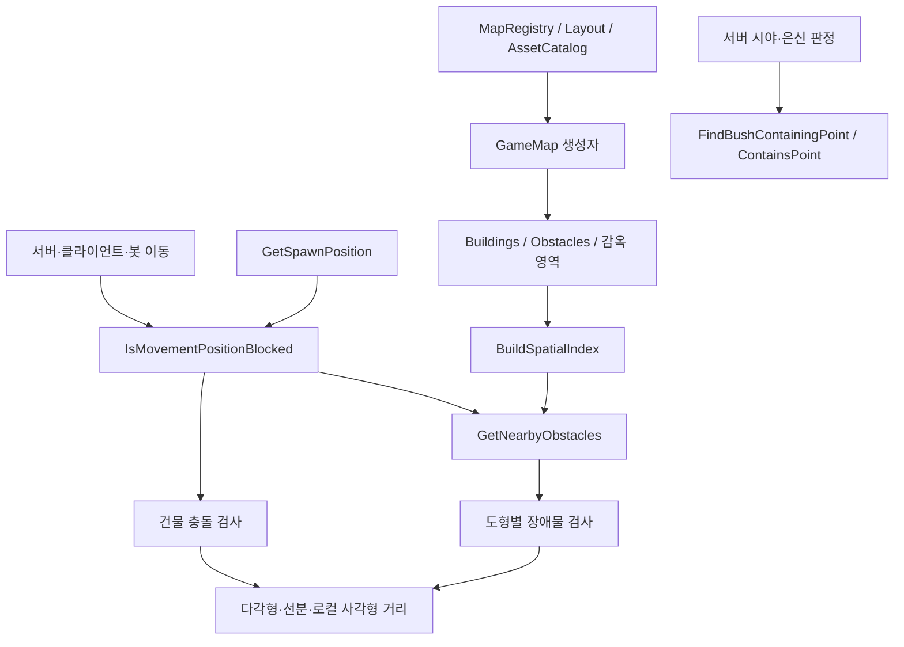

# Shared 파일별·메서드별 코드 참고서

이 문서는 `polrob.Shared/Models`의 **22개 C# 파일을 각각 독립적으로 설명**한다. 소스를 펼쳐 놓고 특정 속성이나 함수를 찾아 읽는 용도다. 전체 흐름은 [02장](02-shared-world.md), 서버가 이 값을 언제 갱신하는지는 [03장](03-server-network.md)을 함께 참고할 수 있다.

설명에서 ‘검증 없음’은 해당 DTO/helper 자체가 검증하지 않는다는 뜻이다. 호출하는 서버 계층까지 검증이 없다는 뜻은 아니다. 메서드가 없는 모델 파일에는 실제로 존재하지 않는 동작을 만들어 설명하지 않고, 필드의 계약과 생산자·소비자를 구체적으로 적었다. 소스의 좌표 기본값과 서버가 경기 시작 시 덮어쓰는 값을 구분한다.

| 파일 | 바로 확인할 내용 |
|---|---|
| `Game.cs` | 방 상태와 두 생성자 |
| `Player.cs` | 플레이어 속성과 역할 enum |
| `GamePhase.cs` | 경기 단계 숫자 계약 |
| `GameJoinRequest.cs` | TCP Join의 인증·방·맵 입력 |
| `GameStateSync.cs` | 경기 상태 알림 필드 |
| `PlayerMovementInput.cs` | 입력 방향·순번·이동 토큰 |
| `PlayerMovementSync.cs` | `FromPlayer`, `ApplyTo` |
| `JailBreakProgressSync.cs` | 구조자별 진행률 사전 |
| `JailBreakSync.cs` | 구조 완료와 석방 좌표 |
| `OpponentProximitySync.cs` | 거리의 단계 변환·수신값 정규화 |
| `ServerResponse.cs` | 방 API/Hub 응답 계약 |
| `TcpMessageType.cs` | 메시지 번호와 payload 형태 |
| `PlayerGameStats.cs` | 전체·역할별 전적 데이터 |
| `VoiceChat.cs` | 음성 토큰 요청·응답 record |
| `MapRegistry.cs` | `Contains`, `Get`, MapDefinition |
| `ChaseTownAssetCatalog.cs` | 에셋 조회·영역 생성·배치·뒤쪽 절단 |
| `ChaseTownLayout.cs` | 지면과 소품 생성 함수 |
| `CanvaMapLayout.cs` | 기존 마을의 배치와 Sprite helper |
| `CanvaMapCollisions.cs` | 이미지 좌표를 월드 충돌 영역으로 변환 |
| `TownMapLayout.cs` | 과거 레이아웃 생성·소품 helper |
| `LabelMeCollisionData.cs` | 과거 label별 다각형 조회·2배 변환 |
| `Map.cs` | 모든 맵 생성·spawn·거리·충돌·공간 인덱스 메서드 |

## Game.cs

[소스](../../polrob.Shared/Models/Game.cs#L3). `Game`은 GameRoomService가 소유하는 **로비 방 데이터**다. 실시간 경기의 세부 상태인 GameSession이나 완료 기록과 다른 객체다.

### 속성

| 속성 | 기본값과 의미 |
|---|---|
| `Id` | 새 GUID 문자열. 서버 내부의 방 ID |
| `RoomCode` | 빈 문자열. 사용자가 입력하는 입장 코드 |
| `Type` | `custom`. 서비스가 `random`도 사용 |
| `MapId` | `MapRegistry.DefaultId`. `init`이므로 생성 시 확정 |
| `IsPrivate` | false. 비공개 방 여부 |
| `HostUserId` | 빈 문자열. 방장 ID |
| `Players` | 새 List. 현재 로비 참가자 |
| `IsOnGame` | false. 로비 관점의 경기 진행 여부 |
| `EmptyRoomExpiresAtUtc` | null. 빈 방을 언제 만료시킬지 |
| `VoiceSessionId` | 빈 문자열. 재경기마다 음성 채널을 분리하는 내부 ID. JsonIgnore |

### `Game()`

[선언](../../polrob.Shared/Models/Game.cs#L20). 인자가 없는 생성자는 본문이 비어 있다. 속성 초기화에서 새 ID와 새 Players 목록을 얻고 나머지 기본값을 유지한다. Object initializer나 역직렬화가 속성을 채우기 위한 기본 경로다. 방 코드 생성이나 서버 목록 등록은 수행하지 않는다.

### `Game(string type, bool isPrivate = false)`

[선언](../../polrob.Shared/Models/Game.cs#L24). 전달된 type과 공개 여부를 저장하고 새 GUID·새 Players 목록으로 초기화한다. type이 custom/random인지 검사하지 않으며 사용자 정보나 DB를 조회하지 않는다. 실제 방 생성 정책은 호출자인 GameRoomService에 있다.

**변경 효과와 경계:** 클래스는 가변이므로 참가자 목록·방장·진행 상태를 변경하면 같은 객체를 참조하는 코드에서 즉시 보인다. 재경기 때 같은 Id를 보존할 수 있으므로 Id를 경기별 결과 ID로 사용하면 안 된다. VoiceSessionId는 일반 JSON 응답에서 빠져도 객체 내부에는 남는다.

## Player.cs

[소스](../../polrob.Shared/Models/Player.cs#L3). 이 파일에는 `PlayerRole`과 `Player`가 있다. 명시적 생성자나 메서드는 없다.

`PlayerRole.Police=0`, `Robber=1`이다. enum 형식만으로 `(PlayerRole)999`를 만들 수 없게 막지는 않으므로 서버 입장·역할 변경 경로가 유효성을 검사한다.

| 속성 | 데이터 계약 |
|---|---|
| `Id`, `RoomId`, `Name` | 기본 빈 문자열. 사용자·방·표시 이름 |
| `X`, `Y` | 기본 0. 원형 캐릭터의 월드 중심 좌표 |
| `Speed` | 기본 0. 서버는 실제 플레이어 생성 시 정해진 속도를 지정 |
| `Radius` | 기본 50. 서버가 지정하는 경기 반지름과 별개인 DTO 기본값 |
| `Angle` | 기본 0도. 이동 벡터의 atan2 각도에서 90도를 뺀 스프라이트 회전 |
| `IsMoving` | 기본 false. 이동/애니메이션 상태 |
| `IsJailed` | 기본 false. 서버가 정하는 수감 상태 |
| `Role` | enum 기본값 Police. 필드를 생략했다고 역할 검증이 끝난 것은 아님 |

**호출 관계:** GameRoomService의 로비 목록, 서버 PlayerSession.PlayerState, 클라이언트/봇의 수신 상태가 이 형식을 사용한다. TCP PlayerState에는 전체 속성을 담고, 자주 보내는 UDP에는 PlayerMovementSync로 필요한 부분만 복사한다.

**실패·경계:** 속성 setter는 NaN 좌표, 음수 반지름, 잘못된 enum을 자체 거부하지 않는다. `IsJailed`도 자동 위치 판정이 아니다. 감옥 그림 안 좌표라는 이유로 getter가 true가 되는 것이 아니라 서버 규칙이 bool을 갱신한다.

## GamePhase.cs

[소스](../../polrob.Shared/Models/GamePhase.cs#L3). 메서드가 없는 단계 enum이다.

| 값 | 이름 | 소비 코드에서의 의미 |
|---:|---|---|
| 0 | `Waiting` | 플레이 준비 대기 |
| 1 | `Countdown` | 시작 카운트다운 |
| 2 | `Playing` | 서버가 정상 이동·체포·구조·시간을 처리하는 단계 |
| 3 | `Ended` | 승리 역할과 경과 시간이 확정된 종료 상태 |
| 4 | `Rematching` | 재매칭 전환 알림 |

서버 방 루프가 값을 바꾸고 GameStateSync에 담는다. 클라이언트와 봇은 값을 보고 입력 허용·종료 전환을 결정한다. enum은 전이 규칙을 강제하지 않으므로 `Waiting→Ended`를 대입할 수 있는지와 정상 서버 흐름이 그것을 사용하는지는 별개다. 숫자 변경은 직렬화 계약에 영향을 준다.

## GameJoinRequest.cs

[소스](../../polrob.Shared/Models/GameJoinRequest.cs#L5). 메서드가 없는 TCP 입장 DTO다. `SessionToken`, `RoomId`, `MapId` 모두 기본 빈 문자열이다.

- `SessionToken`: HTTP 로그인으로 발급받은 인증 세션. UDP 이동용 토큰과 다른 값이다.
- `RoomId`: 들어가려는 로비 방. 서버가 멤버십과 진행 상태를 확인한다.
- `MapId`: 클라이언트가 로드한 맵. 방의 맵과 같은지 검사하는 기대값이다.

GameNetworkClient와 BotGameNetworkClient가 생성·직렬화하고 서버 TCP Join handler가 읽는다. 사용자 ID·이름·역할을 요청에 넣지 않아 서버가 인증 세션과 방 상태에서 가져오게 한다. MapId 기본값이 빈 문자열이므로 `{}` 또는 맵 필드가 없는 요청을 ‘기본 맵에 동의’로 해석하지 않는다. 필수 여부를 검증하는 코드는 DTO 자체가 아니라 Join 수신 경로다.

## GameStateSync.cs

[소스](../../polrob.Shared/Models/GameStateSync.cs#L3). 서버가 작성하고 모바일 앱/봇이 읽는 경기 단위 snapshot이다. 명시적 메서드는 없다.

| 속성 | 정확한 용도 |
|---|---|
| `RoomId`, `MapId` | 방과 맵 식별. MapId만 Registry 기본값으로 초기화 |
| `HostUserId` | nullable 방장 ID |
| `Phase` | GamePhase |
| `CountdownTime` | 시작 전 남은 카운트다운 수치 |
| `GameTime` | 경기의 남은 시간 |
| `WinnerRole` | nullable 승리 역할. null은 아직/현재 승자가 없음 |
| `ElapsedGameTime` | 결과 표시·기록에 쓰는 경과 초 |
| `TotalRobbers`, `JailedRobbers` | 서버 전체 참가 상태 기준 도둑 수·수감 수 |

**상호작용:** 실시간 서버의 Join/Leave 및 주기 상태 동기화에서 만든다. 봇은 Phase를 잠금 안에서 저장하고 Ended/Rematching에서 대기 작업을 완료한다. 이 객체를 수신하는 것 자체가 서버 상태를 바꾸지는 않는다.

**경계:** 클라이언트의 가시 플레이어 목록이 일부만 있어도 TotalRobbers는 그 목록의 Count가 아니다. 숫자 사이의 일관성이나 GameTime의 음수 여부를 이 class가 검증하지 않는다. Phase와 의미가 맞는 값을 생산할 책임은 서버에 있다.

## PlayerMovementInput.cs

[소스](../../polrob.Shared/Models/PlayerMovementInput.cs#L6). 클라이언트/봇이 UDP로 보내는 입력이며 메서드는 없다.

| 속성/JSON 키 | 의미 |
|---|---|
| `Id` / `i` | 사용자 ID, 기본 빈 문자열 |
| `X` / `x`, `Y` / `y` | 이동 방향·세기. 월드 위치가 아님 |
| `Sequence` / `s` | ulong 입력 순번. 0이 기본값 |
| `Token` / `t` | 현재 게임 연결에서 받은 MovementSession 토큰 |

입력 생산자는 움직이면 방향 벡터, 멈추면 0,0을 만든다. 서버는 로그인·현재 연결·토큰·endpoint를 확인하고 유한값과 순번을 검사한 뒤 입력을 세션에 저장한다. 길이 1 초과의 벡터를 서버가 정규화한다. 속도·반지름·최종 좌표는 이 메시지에 없어 사용자가 그것들을 직접 주장할 수 없게 한다.

DTO setter에는 제한이 없고 X/Y의 NaN도 객체 자체에는 들어갈 수 있다. Sequence를 올리는 행위도 DTO 기능이 아니라 네트워크 클라이언트의 책임이다.

## PlayerMovementSync.cs

[소스](../../polrob.Shared/Models/PlayerMovementSync.cs#L5). 서버가 보낸 이동 결과. Id/i, X/x, Y/y, Angle/a, IsMoving/m의 5개 속성이다. 입력 DTO와 동일한 x/y 키라도 여기서는 월드 좌표다.

### `static FromPlayer(Player player)`

[선언](../../polrob.Shared/Models/PlayerMovementSync.cs#L22). Player에서 ID·X·Y·Angle·IsMoving만 복사해 **새 PlayerMovementSync**를 반환한다. Player를 변경하지 않는다. 서버 이동 broadcast의 작은 payload 생성에 쓰인다. Role, Radius, Speed, IsJailed, Name, RoomId는 복사하지 않는다. null 인자를 검사하는 별도 guard는 없어 null이면 속성 접근에서 실패한다.

### `ApplyTo(Player player)`

[선언](../../polrob.Shared/Models/PlayerMovementSync.cs#L34). 현재 DTO의 X/Y/Angle/IsMoving을 전달된 Player에 대입하고 반환값은 없다. ID도 대입하지 않는다. **호출자가 이미 올바른 ID의 Player를 찾았다는 전제**다. 봇은 수신 ID로 사전에서 찾은 객체에 적용한다. 이 메서드는 기존 참조를 유지한 채 이동 필드만 갱신하므로 다른 코드가 참조하던 동일 Player에도 변화가 보인다. 역할/수감 전체 상태는 PlayerState 경로로 별도 갱신해야 한다.

## JailBreakProgressSync.cs

[소스](../../polrob.Shared/Models/JailBreakProgressSync.cs#L3). `RoomId`와 `ProgressByRescuer`를 가진 알림 DTO다. 사전은 인스턴스마다 새로 만들고 키는 구조자 ID, 값은 float 진행률이다. 별도 메서드는 없다.

서버가 감옥 구조 접촉을 유지한 시간을 계산해 dictionary를 만든다. 모바일 앱은 자기 구조 진행 표시 등에 사용한다. 키가 수감자 ID가 아니라 구조자 ID라는 점이 중요하다. 이 DTO는 elapsed time을 계산하거나 사전에서 사라진 ID를 자동 취소하지 않는다. 받은 snapshot을 어떻게 반영할지는 소비자 책임이고, 범위 0~1 검사도 타입에 내장되어 있지 않다.

## JailBreakSync.cs

[소스](../../polrob.Shared/Models/JailBreakSync.cs#L3). 탈옥 완료 이벤트로 `RoomId`, `RescuerId`, `RobberId`, `X`, `Y`를 담는다. 문자열은 빈 문자열, 숫자는 0이 기본값이며 명시적 메서드는 없다.

서버는 구조가 완료되면 석방 대상과 자유 위치를 확정해 보낸다. 소비자는 RobberId로 도둑을 찾아 좌표를 X/Y로 옮기고 수감 상태를 해제한다. X/Y는 구조자의 좌표가 아니며 서버가 지정한 석방자의 좌표다. 이 객체만 만들었다고 서버 감옥 목록에서 제거되는 것은 아니다. 실제 상태 변경 후 알림으로 사용한다.

## OpponentProximitySync.cs

[소스](../../polrob.Shared/Models/OpponentProximitySync.cs#L8). 외부에는 `PulseMilliseconds`를 JSON `p`로 하나만 전달한다. 상수는 최대 표면 거리 500, 단계 100ms, 최대 단계 500ms다.

### `FromSurfaceDistance(float surfaceDistance)`

[선언](../../polrob.Shared/Models/OpponentProximitySync.cs#L17). 인자가 유한하지 않거나 500보다 크면 0을 즉시 반환한다. 그 외에는 음수를 0으로 만든 후 100으로 나누어 올림하고 다시 100을 곱한다. 마지막에 100~500으로 clamp한다.

반환 예: `-5→100`, `0→100`, `100→100`, `100.1→200`, `500→500`, `500.1→0`, `NaN→0`. 전역 상태를 변경하지 않는 순수 계산이다. 서버가 가장 가까운 상대의 표면 거리를 구한 뒤 호출한다. 상대 위치나 방향은 반환에 포함되지 않는다.

### `NormalizePulseMilliseconds(int pulseMilliseconds)`

[선언](../../polrob.Shared/Models/OpponentProximitySync.cs#L30). 입력이 100 이상 500 이하이고 100의 배수이면 그대로 반환한다. 그 외에는 0. 250을 300으로 반올림하는 함수가 아니다. 클라이언트가 수신값을 유효한 단계로 정리할 때 사용한다. setter는 임의 int를 허용하므로 수신 시 이 함수 호출이 별도로 필요하다.

## ServerResponse.cs

[소스](../../polrob.Shared/Models/ServerResponse.cs#L3). 방 생성·참가·조회·역할 변경·시작 등 HTTP와 Hub가 공유하는 응답 DTO이며 메서드는 없다.

| 속성 | 용도와 기본값 |
|---|---|
| `Success` | 성공 여부, 기본 false |
| `Message` | 사용자에게 보일 이유/결과, nullable |
| `RoomId`, `RoomCode`, `HostUserId` | 각 식별자, nullable |
| `MapId` | Registry 기본 ID로 초기화 |
| `Role` | 이 요청 사용자에게 적용된 역할, nullable |
| `CurrentCount`, `MaxCount` | 현재/허용 인원, 기본 0 |
| `CreatedRoom` | 이 요청이 새 방을 만든 경우 표시 |
| `Matched` | 해당 흐름에서 매칭/시작 조건 충족 여부 |
| `IsPrivate` | 비공개 여부 |
| `Players` | 새 List로 시작하는 참가자 snapshot |

GameRoomService가 값을 만들고 Controller/Hub가 전달한다. BotClient.UpdateRoomStatus는 Success 확인 후 CurrentCount/MapId/Matched만 반영한다. 모든 endpoint가 모든 필드를 반드시 채우는 구조는 아니므로 nullable과 기본값을 응답 맥락에 맞춰 읽어야 한다. 응답 객체 자체가 방 목록을 변경하거나 Matched를 자동 계산하지는 않는다.

## TcpMessageType.cs

[소스](../../polrob.Shared/Models/TcpMessageType.cs#L3). 명시적 메서드가 없는 byte enum이다. 네트워크 프레임의 타입 바이트와 바로 연결된다.

| 값 | 이름 | producer→consumer / payload |
|---:|---|---|
| 1 | Join | 클라이언트→서버, GameJoinRequest JSON |
| 2 | Joined | 서버→클라이언트, 추가 Player JSON |
| 3 | Left | 서버→클라이언트, 제거할 ID 문자열 |
| 4 | InitialState | 서버→클라이언트, List<Player> JSON |
| 5 | Arrested | 서버→클라이언트, 경찰ID와 도둑ID를 쉼표로 연결 |
| 6 | GameState | 서버→클라이언트, GameStateSync JSON |
| 7 | JailBreak | 서버→클라이언트, JailBreakSync JSON |
| 8 | PlayerState | 서버→클라이언트, 전체 Player JSON |
| 9 | JailBreakProgress | 서버→클라이언트, 진행률 JSON |
| 10 | MovementSession | 서버→클라이언트, 이동 토큰 문자열 |
| 11 | OpponentProximity | 서버→클라이언트, 근접 단계 JSON |
| 12 | Heartbeat | 클라이언트→서버, 연결 확인 payload |
| 13 | HeartbeatAcknowledged | 서버→클라이언트, 확인한 payload |

enum만으로 방향이나 payload 형식을 강제하지는 않는다. 송수신 switch가 맞는 타입에 맞는 payload를 처리해야 한다. 봇은 일부 메시지 번호만 처리하므로 이 목록이 곧 모든 consumer의 기능 목록은 아니다. 값의 순서를 바꾸거나 기존 숫자를 재사용하면 wire protocol이 바뀐다.

## PlayerGameStats.cs

[소스](../../polrob.Shared/Models/PlayerGameStats.cs#L3). 두 sealed class이며 명시적 메서드는 없다.

`PlayerGameStats`의 Overall/Police/Robber는 각각 새 `GameStatsBreakdown`으로 초기화된다. `GameStatsBreakdown`은 int TotalGames/Wins/Losses와 double WinRate를 가진다. 모두 init 속성이므로 응답 작성 시 채우도록 만들었다.

실제 계산은 서버 GameRecordStatsCalculator가 하고 DB 서비스가 결과를 반환한다. Profile 화면이 읽는다. WinRate는 0~100 단위 백분율이다. class는 Wins+Losses=TotalGames나 비율 일관성을 자동 계산/강제하지 않는다. 전적이 없는 경우는 기본 0 객체를 응답할 수 있다.

## VoiceChat.cs

[소스](../../polrob.Shared/Models/VoiceChat.cs#L4). 두 positional record와 컴파일러가 생성하는 생성자/값 비교가 있으며 수동으로 구현한 메서드는 없다.

`VoiceTokenRequest(string RoomId)`의 생성자는 방 ID만 저장한다. 요청에 Role/UserId를 받지 않으므로 서버가 로그인과 방 참가 정보를 이용해 팀 권한을 판단한다. 공백 RoomId 검사도 이 record가 아니라 VoiceController가 수행한다.

`VoiceConnectionInfo(string ServerUrl, string ParticipantToken, string RoomName, PlayerRole Role, DateTime ExpiresAtUtc)`는 LiveKitTokenService가 생성한 접속 정보다. 실제 음성 서버 주소·제한된 참가자 토큰·팀 채널 이름·역할·만료 시각을 소비자에게 전달한다. API secret은 형식에 포함되지 않는다. 인자 검증이나 토큰 생성은 record 생성자가 하지 않는다. 클래스명에 Connection이 있어도 socket을 열지 않는다.

## MapRegistry.cs

[소스](../../polrob.Shared/Models/MapRegistry.cs#L4). 현재 지원하는 맵을 선언하는 static registry다. ClassicTown=`canva-town-v1`, ChaseTown=`chase-town-v1`, DefaultId=ChaseTown. All은 Chase 먼저, Classic 다음의 read-only 목록이다.

### `Contains(string? id)`

[선언](../../polrob.Shared/Models/MapRegistry.cs#L18). All에서 Id가 정확히 같은 항목이 있는지 Any로 검사한다. null이나 빈 값은 등록 항목에 없으므로 false. 대소문자 보정·별칭 변환·파일 존재 확인을 하지 않는다. 방 생성/Join 입력 검증에서 사용한다. 상태를 변경하지 않는다.

### `Get(string id)`

[선언](../../polrob.Shared/Models/MapRegistry.cs#L20). 첫 일치 MapDefinition을 반환하고 없으면 `ArgumentException("Unknown map...")`을 던진다. 새 definition을 만들지 않고 All 안의 객체를 반환한다. GameMap 생성, 클라이언트 맵 확인, 봇 방 상태 갱신이 호출한다. 이 함수에는 unknown을 기본 맵으로 대체하는 fallback이 없다.

### `MapDefinition`

[선언](../../polrob.Shared/Models/MapRegistry.cs#L24). Id/DisplayName/MapPropLayout[] Props/string[] TileAssets를 담는다. All의 외부 목록은 read-only지만 안의 배열까지 깊은 불변 구조로 바뀌는 것은 아니다. GameMap.PropLayouts는 이 Props 배열을 그대로 반환한다. 현재는 정적 데이터로 사용한다.

## ChaseTownAssetCatalog.cs

[소스](../../polrob.Shared/Models/ChaseTownAssetCatalog.cs#L11). 에셋의 **설계 크기와 충돌/상호작용 영역**을 정의한다. PNG를 읽어 자동 충돌을 찾는 코드가 아니다. DefaultWorldScale=2.5, BuildingRearInsetPixels=8, PropTextureScale=6, AssetRoot=ChaseTownV7이며 Assets는 Create 결과다.

### `Get(string id)`

[선언](../../polrob.Shared/Models/ChaseTownAssetCatalog.cs#L21). Assets.Single로 정확히 하나의 Id를 찾는다. 없거나 중복이면 InvalidOperationException이다. 카탈로그 조회는 새 객체를 복제하지 않는다. ChaseTownPlacement.Asset, Place, 에셋 제작/검사 도구가 호출한다.

### `Place(string id, PointF center, float scale=2.5, float rotationDegrees=0, bool gateOpen=false)`

[선언](../../polrob.Shared/Models/ChaseTownAssetCatalog.cs#L24). 입력은 에셋 ID, 월드 중심, 균일 배율, 회전각, 문 개방 여부다. scale이 유한한 양수가 아니거나 중심/각도가 유한하지 않으면 ArgumentOutOfRangeException을 던진다. 중심/각도 오류여도 예외 parameter 이름은 구현상 scale이다.

1. Get으로 에셋을 얻고 각도를 라디안으로 바꾼다.
2. 로컬 `Transform(AssetPoint p)`는 에셋 중심을 빼고 scale을 곱한 뒤 회전하고 center를 더한다.
3. gateOpen이면 Kind=gate 영역을 제외한다.
4. 각 영역의 꼭짓점/중심/반지름을 월드로 바꾼다. 원은 중심±반지름, 다각형은 꼭짓점 min/max로 bounds를 만든다.
5. 영역마다 새 Obstacle을 생성한다. shape가 소문자 circle이면 Type=Circle, 그 밖은 Polygon. BlocksMovement/Vision을 복사하고 IsVisible=false다.
6. 이름·종류·Obstacle을 묶은 새 ChaseTownRegion 배열을 반환한다.

기존 Assets/Regions를 변경하지 않고 배치별 새 물리 객체를 만든다. Place는 hiding을 Obstacle.IsHidingArea에 직접 설정하지 않는다. 이 해석은 GameMap.AddChaseTownColliders가 맡는다. 회전된 원도 균일 scale이므로 원이며 타원 변환은 이 경로에 없다.

### `Create()`와 내부 `Building(...)`

[선언](../../polrob.Shared/Models/ChaseTownAssetCatalog.cs#L60). 입력 없이 정해진 카탈로그 19종을 만든다. Building 로컬 함수는 원본 크롭 위치(x,y), 논리 크기(w,h), 꼭짓점 배열을 받아 solid/body Polygon을 만들고 ClipRear로 뒤쪽만 잘라 ChaseTownAsset을 추가한다. 경찰서·카페·도넛·버거·집·큰/작은 창고가 이 경로다.

감옥은 body 하나를 만들지 않고 back/left/right/front 철창, gate, holding, interaction을 따로 넣는다. jail-open은 그 record를 복사하되 gate를 제외한 Regions로 만든다. 나무는 trunk solid와 canopy occlusion, 수풀은 hiding, 상자와 벽은 solid, 타일은 Regions 없는 IsTile=true다. 영역 생성은 메모리 데이터 구성뿐이며 파일 저장 부작용은 없다.

### `ClipRear(AssetPoint[] points, float inset)`

[선언](../../polrob.Shared/Models/ChaseTownAssetCatalog.cs#L121). 가장 작은 Y+inset을 절단 경계로 정하고 `Y>=경계` 반평면에 다각형을 남긴다. 마지막 점을 previous로 시작해 닫힌 모든 변을 검사한다. 이전/현재 점이 경계 양쪽에 있으면 교차 비율로 새 점을 삽입하고, current가 내부면 그대로 추가한다. 새 배열을 반환하며 입력 점을 이동시키지 않는다.

이미지 전체를 아래로 미는 것이 아니므로 앞과 좌우의 형태를 보존한다. 배열이 비어 있으면 Min/마지막 원소 접근이 실패한다. 유효한 카탈로그 다각형을 입력한다는 내부 helper 전제이며 임의 데이터 검증기는 아니다.

### 영역 생성 helper 세 개

| 메서드 | 인자 → 처리 → 반환 |
|---|---|
| [Polygon](../../polrob.Shared/Models/ChaseTownAssetCatalog.cs#L141) | name/kind/movement/vision와 `x0,y0,x1,y1...`를 두 개씩 묶어 Points 배열 생성. Shape=polygon, Center=(0,0), Radius=0인 AssetRegion. 홀수 배열의 마지막 숫자는 `Length/2` 때문에 사용되지 않음 |
| [Rect](../../polrob.Shared/Models/ChaseTownAssetCatalog.cs#L144) | left/top/right/bottom → 네 모서리를 시계 순서로 Polygon에 전달. 별도 Rect shape가 아니라 Polygon을 반환 |
| [Circle](../../polrob.Shared/Models/ChaseTownAssetCatalog.cs#L146) | x/y/radius → 빈 Points, Center와 Radius를 가진 Shape=circle AssetRegion 반환 |

각 helper는 크기·면적 검증 없이 데이터만 만든다. 카탈로그 테스트가 이런 작성 오류를 잡도록 구성되어 있다.

### 같은 파일의 record와 계산 속성

- `AssetPoint(X,Y)`: 설계 이미지의 왼쪽 위 원점 좌표. readonly record struct다.
- `AssetRegion(Name,Kind,Shape,BlocksMovement,BlocksVision,Points,Center,Radius)`: 원본 논리 좌표 영역이다.
- `ChaseTownRegion(Name,Kind,Obstacle)`: Place가 변환을 끝낸 월드 객체다.
- [ChaseTownAsset](../../polrob.Shared/Models/ChaseTownAssetCatalog.cs#L150): Id, SourceX/Y, Width/Height, Regions, IsTile, RearInsetPixels. `AssetPath`는 tiles/props를 나눠 경로를 만든다. `TextureScale`은 타일 1, 소품 6이며 TextureWidth/Height는 논리 크기에 이것을 곱한다. `Pivot`은 논리 중심, `WorldWidth/Height`는 논리 크기×**기본** 2.5다. Place에 다른 scale을 주었다면 WorldWidth 속성 자체가 그 배율을 기억하는 것은 아니다.

## ChaseTownLayout.cs

[소스](../../polrob.Shared/Models/ChaseTownLayout.cs#L6). 활성 Chase 맵의 배치 데이터다. Columns=32, Rows=48, TileSize=80으로 월드와 같은 2560×3840이다. 색 상수 세 개, Ground 배열, Placements 배열, Placements에서 투영한 Props, 기준 통행 지점 ChaseWaypoints를 소유한다.

### `CreateGround()`와 `Fill(...)`

[선언](../../polrob.Shared/Models/ChaseTownLayout.cs#L22). 입력 없이 GroundTile[32,48]을 만든다. 기본 enum 0이 Grass라 최초 전체가 풀밭이다. 내부 Fill은 포함 범위 left..right, top..bottom을 해당 tile로 대입한다. 포장 구역과 일부 풀 구역을 칠한 후 도로 사각형을 마지막에 덮어쓴다. 반환은 새 2차원 배열이다.

Fill은 인덱스 범위 보정이나 clipping을 하지 않으므로 작성된 상수가 배열 밖이면 실패한다. 지면 타입은 렌더링용이며 GameMap 이동 차단 함수가 Road만 걷게 제한하는 데 사용하지 않는다.

### `CreatePlacements()`와 `Add(...)`

[선언](../../polrob.Shared/Models/ChaseTownLayout.cs#L52). 경찰서·감옥·상점·집·창고, 벽·상자·나무·수풀 위치를 정해진 순서로 추가하고 배열로 반환한다. 총 89개다. Add의 x/y는 설계 좌표이며 **항상 2.5를 곱해 Center를 만든다.** 선택적인 scale 인자는 에셋 크기 배율이다. 따라서 scale을 다르게 줘도 중심의 x/y 변환 배율까지 바뀌지는 않는다.

ID는 `에셋id-추가직전목록길이`이며 BuildingType은 건물에만 들어간다. 중간에 항목을 삽입하면 뒤의 번호도 달라진다. 함수는 파일을 읽지 않으며 현재 맵의 정적 목록을 생성한다.

### `Props`와 `ChaseTownPlacement` getter

Props는 각 placement의 이미지 경로, Center, `Asset.Width/Height×Scale`, BuildingType, 어느 영역이든 이동을 막는지의 bool을 MapPropLayout으로 만든다. 정밀 충돌 polygon을 Props에 복사하는 것이 아니라 rendering/registry에 쓸 배치 요약이다.

[ChaseTownPlacement](../../polrob.Shared/Models/ChaseTownLayout.cs#L96)의 `Asset`은 매번 Catalog.Get을 호출한다. `Regions`는 매번 Catalog.Place를 호출하므로 getter 접근마다 새 월드 장애물 배열을 만든다. 캐시된 배열을 반환하는 속성이 아니다. GameMap 생성자는 한 placement를 처리할 때 Regions를 지역 변수에 저장해 사용한다. `GroundTile`은 Grass/Paving/Road enum이다.

## CanvaMapLayout.cs

[소스](../../polrob.Shared/Models/CanvaMapLayout.cs#L6). 선택 가능한 Classic 맵의 static 배열을 정의한다. AssetRoot=MapAssets, GroundAssetRoot=TownMap/tiles, TileSize=256, PavingRepeatSize=240, RoadWidth=204다. Roads는 SVG path·폭·차선 표시, Crosswalks는 횡단보도, ChaseWaypoints는 기준점, Props는 소품 목록이다.

### `Sprite(string name, float x, float y, float width, float height, string? buildingType=null)`

[선언](../../polrob.Shared/Models/CanvaMapLayout.cs#L106). `MapAssets/name.png`, 중심과 이미지 크기, BuildingType으로 MapPropLayout을 만든 뒤 즉시 CanvaMapCollisions.Apply에 넘긴다. 반환은 **충돌 프로필이 적용된** 새 값이다. Props static 초기화가 모든 Sprite 호출을 실행한다.

이 helper가 이미지 파일을 읽지는 않는다. width/height는 보이는 실루엣 기준 배치 크기이고 Apply가 원본 PNG 기준 충돌을 월드로 옮긴다. 카탈로그에 없는 name이면 Apply의 사전 조회에서 실패한다. `MapCrosswalk(X,Y,VerticalRoad)`는 표시 위치와 도로 방향의 readonly record struct이며 메서드는 없다.

## CanvaMapCollisions.cs

[소스](../../polrob.Shared/Models/CanvaMapCollisions.cs#L6). Profiles는 정확한 파일명을 key로 하는 ordinal 사전이다. 8종 Rect, 4종 Circle, boxes/pond Polygon 프로필이 있다. 원본 PNG의 크기, 보이는 alpha crop, 원본 왼쪽 아래 좌표 기준의 충돌 데이터를 미리 적어 둔다.

### `Apply(MapPropLayout placement)`

[선언](../../polrob.Shared/Models/CanvaMapCollisions.cs#L53). Path.GetFileName으로 프로필을 찾고 `sx=placement.Width/visibleWidth`, `sy=placement.Height/visibleHeight`를 계산한다.

- Rect: 원본의 `(image.Width/2, RectangleHeight/2)`를 ToWorld로 옮긴 중심, `image.Width×sx`, `RectangleHeight×sy`를 사용한다.
- Circle: 지정 CircleCenter를 ToWorld로 옮기고 반지름은 `Radius×sx`, `Radius×sy`로 따로 계산한다. 둘이 다르면 실제 이동 영역은 타원이다.
- 그 밖: Outline의 점 모두를 ToWorld로 옮기고 min/max에서 중심과 너비/높이를 구한다.

반환은 placement의 with 복사본이며 BlocksMovement=true, CollisionShape, 크기, 이미지 중심 대비 collision offset, 반지름 두 개, 다각형을 갱신한다. 입력 record struct를 직접 변경하지 않는다. 렌더링 위치는 그대로 두고 물리 영역만 보정한다.

**실패·전제:** 프로필이 없으면 KeyNotFoundException, polygon의 Outline이 null/비어 있으면 변환·Min에서 실패할 수 있다. visible 너비/높이 0을 별도 검사하지 않는다. 현재 작성된 프로필이 올바르다는 내부 데이터 전제다. shape 오타도 else polygon 경로로 들어가므로 enum처럼 자동 검증되지 않는다.

### `SourceCollisionProfile`과 `SourceImageGeometry.ToWorld(...)`

[SourceCollisionProfile](../../polrob.Shared/Models/CanvaMapCollisions.cs#L97)은 Image·Shape·RectangleHeight·CircleCenter·Radius·Outline을 담는 record다. 도형별로 필요한 필드만 채운다.

[ToWorld](../../polrob.Shared/Models/CanvaMapCollisions.cs#L105)의 인자는 placement와 원본 **왼쪽 아래 원점**의 PointF다. 다음 좌표를 반환하고 상태는 변경하지 않는다.

```text
wx = centerX - width/2 + (sourceX-visibleLeft) × width/visibleWidth
wy = centerY - height/2 + (sourceImageHeight-sourceY-visibleTop) × height/visibleHeight
```

Y를 뒤집어 월드의 +Y 아래 방향으로 옮긴다. crop 경계는 왼쪽 위 이미지 좌표라는 점 때문에 SourceImageGeometry에 source height가 필요하다. outline이 원본 왼쪽 위 원점인데 이 함수에 그대로 넣으면 상하가 뒤집힌 결과를 얻는다.

## TownMapLayout.cs

[소스](../../polrob.Shared/Models/TownMapLayout.cs#L6). AssetRoot=TownMapV2의 이전 레이아웃이다. 현재 Registry에는 등록되지 않으며 GameMap 생성자가 이 Props를 읽지 않는다. 하지만 같은 파일의 MapRoad 형식은 현재 Canva 레이아웃에서도 사용된다.

### `CreateProps()`

[선언](../../polrob.Shared/Models/TownMapLayout.cs#L42). 먼저 건물·분수·상자·가로등·수풀·나무·바위를 고정 목록으로 만든다. 그다음 Groves마다 seed가 지정된 Random을 만든다. 무작위 각도와 sqrt(random) 반지름으로 타원 군락 안 좌표를 뽑고 특정 출입 구역을 제외한다. 이미 받아들인 군락 나무와 거리가 85보다 가까우면 건너뛴다.

시도는 최대 500회이며 accepted.Count가 지정 Count에 도달하면 끝난다. 나무 크기 155~249, 세 번 중 한 번 정도 slender, 네 번째 accepted 나무마다 오프셋 수풀을 추가한다. 결과를 새 배열로 반환한다. 500회 안에 목표 인원을 못 채우면 적은 수로 끝나며 예외를 던지지 않는다. 주변 모든 고정 건물과의 충돌을 이 random 배치 단계가 검사하는 것은 아니다.

### 개별 생성 helper

| 함수 | 인자 → 반환되는 MapPropLayout |
|---|---|
| [P(name)](../../polrob.Shared/Models/TownMapLayout.cs#L114) | `TownMapV2/props/name.png` 문자열 |
| [Building(file,type,x,y,width,height)](../../polrob.Shared/Models/TownMapLayout.cs#L115) | 이미지 배치와 BuildingType. 기본 Rect 충돌 필드 사용 |
| [Tree(x,y,size,slender)](../../polrob.Shared/Models/TownMapLayout.cs#L117) | slender면 birch, 아니면 oak. 너비는 0.78 또는 1배, 높이는 1.151 또는 0.946배, Circle 반지름은 0.34 또는 0.43배, Y오프셋 0.03배 |
| [Bush(x,y,size)](../../polrob.Shared/Models/TownMapLayout.cs#L120) | 너비 size, 높이 0.533배, Circle 반지름 0.32배 |
| [Crates(x,y,size)](../../polrob.Shared/Models/TownMapLayout.cs#L122) | 높이 1.134배, 충돌 너비 0.90배·높이 0.96배·Y오프셋 0.035배 |
| [Lamp(x,y)](../../polrob.Shared/Models/TownMapLayout.cs#L124) | 이미지48×75, Circle 반지름17, Y오프셋22 |
| [Rocks(x,y,size)](../../polrob.Shared/Models/TownMapLayout.cs#L126) | 높이0.712배, Circle 반지름0.38배 |

모두 값 생성 helper로 Map 인스턴스의 목록에 직접 등록하지 않는다. 파일 안 `MapRoad(Path,Width,Marked=false)`는 도로 SVG와 렌더링 속성, `MapGrove(X,Y,RadiusX,RadiusY,Count,Seed)`는 군락 생성 조건이다.

## LabelMeCollisionData.cs

[소스](../../polrob.Shared/Models/LabelMeCollisionData.cs#L10). internal static class이며 SourcePolygons에 label별 PointF 배열을 보관한다. `obastacle1`처럼 철자가 특이한 key도 데이터의 실제 이름이다. 현재 활성 GameMap 생성에서는 호출하지 않는 과거 다각형 데이터다.

### `GetWorldPolygon(string label)`

[선언](../../polrob.Shared/Models/LabelMeCollisionData.cs#L251). 사전에서 label을 찾는다. 없으면 ArgumentOutOfRangeException을 던진다. 있으면 같은 길이의 새 PointF 배열을 만들고 각 X/Y에 WorldScale=2를 곱해 반환한다. 원본 배열을 직접 반환하지 않아 호출자가 바꾸더라도 원본 데이터가 그대로 남는다.

입력 데이터는 1280×1920 기준이며 출력은 2560×3840 기준이다. JSON 파일을 매번 읽는 로더가 아니다. 호출자는 Map.cs의 AddLabelMeBuilding/AddLabelMeObstacle이고, 그 생성 계열이 현재 비활성이라는 점을 함께 읽어야 한다.

## Map.cs

[소스](../../polrob.Shared/Models/Map.cs#L5). 파일 이름과 달리 주요 class 이름은 `GameMap`이다. 아래에서는 **실제 생성 경로 → 위치 검사 → 기하 helper → 과거 생성 helper → 같은 파일의 데이터 형식** 순서로 모든 메서드를 설명한다.

### 보관하는 상태와 전제

| 멤버 | 의미 |
|---|---|
| Definition, MapId, PropLayouts | 선택한 Registry definition과 그 ID/Props. Props는 정적 배열 참조 |
| WorldWidth/WorldHeight | 2560/3840 상수 |
| Width/Height | 위 값으로 초기화되는 public 가변 필드 |
| BuildingSize | 512로 남아 있는 필드. 현재 활성 배치 크기는 레이아웃 데이터에서 읽음 |
| Buildings, Obstacles | 인스턴스별 새 List. 건물과 일반/trigger 영역 |
| PoliceStation, Jail | 특정 역할 건물 참조. 생성 종료 때 없으면 예외 |
| JailHoldingArea, JailRescueArea | Chase 감옥의 수감/구조 영역. Classic에서는 null |
| `_obstaclesByCell` | (cellX,cellY)→장애물 목록. 셀 크기250 |
| `_bushes` | 생성 시 찾은 은신 장애물 목록 |
| 과거 배율/외곽 데이터 | CanonicalCoordinateScale=2560/5000, LegacyMapScale=0.5, LayoutScale=5 및 PlayableBoundary |

공개 List를 임의 변경해도 공간 인덱스가 자동 갱신되지는 않는다. 이 class는 생성 후 정적인 맵을 사용하는 방식으로 연결되어 있다. 일반 이동 검사에는 Player 목록이 없으므로 플레이어 간 충돌은 검사하지 않는다.

### `GameMap(bool)`와 `GameMap(string)` — 맵 한 개의 충돌 세계 만들기

[생성자](../../polrob.Shared/Models/Map.cs#L189). bool 오버로드의 true는 ClassicTown, false는 ChaseTown이며 string 생성자로 위임한다. string 생성자는 기본 ID를 받을 수 있지만 잘못된 ID를 정상화하지 않고 MapRegistry.Get의 예외를 그대로 전파한다.

1. Definition을 Registry에서 받는다.
2. ID가 ClassicTown이면 AddMapPropColliders, 그 외 등록된 맵이면 AddChaseTownColliders를 호출한다.
3. PoliceStation 또는 Jail이 없으면 InvalidOperationException을 던진다.
4. BuildSpatialIndex로 장애물 셀과 은신 목록을 만든다.

서버 GameRoom, 클라이언트 맵/이동 코드, BotMovementController가 이 생성자를 사용한다. 생성자가 과거 AddWalls/AddTrees/AddLabelMeCentralColliders를 호출하는 것은 아니다.

### `AddChaseTownColliders()` — 역할이 붙은 영역을 런타임 객체로 분배

[선언](../../polrob.Shared/Models/Map.cs#L204). 인자와 반환값은 없고 Buildings/Obstacles/특수 영역 참조를 채운다. ChaseTownLayout.Placements를 돌며 Asset과 Regions를 얻는다. Regions getter는 변환된 새 영역을 만들기 때문에 지역 변수에 한 번 받아 재사용한다.

BuildingType이 있으면 이미지 중심·논리 크기·배율로 MapBuilding의 시각 사각형을 만든다. `body` 영역이 있으면 그 다각형 및 이동/시야 차단 값을 건물에 전달한다. 없으면 충돌 다각형은 빈 배열이고 차단 플래그는 false다. PoliceStation/Jail 타입이면 전용 참조도 설정한다.

각 영역은 다음처럼 처리한다.

- 건물의 body는 이미 Buildings가 소유하므로 Obstacles에 중복 추가하지 않는다.
- kind=holding은 JailHoldingArea, kind=interaction은 JailRescueArea로 저장한다. 둘 모두 일반 장애물 목록에 넣지 않는다.
- kind=occlusion은 일반 물리 장애물로 넣지 않는다.
- 그 외는 Obstacles에 넣고 kind=hiding일 때 IsHidingArea=true를 설정한다.

감옥의 막대·문 영역과 수감·구조 trigger가 서로 다른 객체인 이유가 이 분기다. 어떤 영역을 어느 위치에 둘지는 AssetCatalog와 Layout이 결정한다.

### `AddMapPropColliders()` — Classic 배치를 충돌 객체로 변환

[선언](../../polrob.Shared/Models/Map.cs#L242). CanvaMapLayout.Props 각 항목을 처리한다. 충돌 너비/높이가 양수면 그 값을, 아니면 시각 너비/높이를 사용한다. 충돌 중심은 시각 중심+CollisionOffset이다.

BuildingType이 있으면 MapBuilding을 만들고 시각 사각형, 충돌 크기/오프셋/다각형을 각각 저장한다. IsVisible=false, BlocksVision=false이며 BlocksMovement는 레이아웃에서 가져온다. 특수 건물 참조를 설정한 뒤 다음 항목으로 이동한다.

일반 prop은 BlocksMovement=false면 아예 물리 목록에서 제외한다. 나머지는 CollisionShape에 맞는 Obstacle을 만들며 사각형 좌표·중심·다각형·반지름을 채운다. CollisionRadius가 양수가 아니면 충돌 너비/높이 중 작은 값의 절반이다. RenderOffset에는 충돌 오프셋의 음수를 넣어 렌더링 중심을 시각 중심으로 되돌린다. IsTriangular이면 shape를 Polygon으로 바꾸고 위 중앙→오른쪽 아래→왼쪽 아래 세 꼭짓점으로 덮어쓴다. 결과는 Obstacles에 추가한다.

### `GetSpawnPosition(role, slot, radius)` — 충돌하지 않는 n번째 시작점

[선언](../../polrob.Shared/Models/Map.cs#L323). 입력은 Police/Robber, 0부터 시작하는 역할별 슬롯, 플레이어 반지름이다. 다른 role, 음수 slot, 유한하지 않거나 0 이하인 반지름, 맵 짧은 변보다 큰 지름은 ArgumentOutOfRangeException이다.

경찰의 탐색 기준점은 경찰서 CollisionCenter.X와 충돌 경계 아래쪽+max(100,radius+20)이다. 도둑은 맵 정중앙이다. 탐색 격자 간격은 max(150,2×radius+20)이다. EnumerateSpawnRing의 순서대로 점을 만들고 IsMovementPositionBlocked가 false인 후보만 센다. 그중 slot번째를 PointF로 반환한다. 정해진 최대 ring까지 찾지 못하면 InvalidOperationException이다.

같은 맵/역할/슬롯/반지름은 같은 결과를 내며, 기존 Player 위치를 보면서 빈자리를 선택하는 함수는 아니다. 슬롯을 서로 다르게 주는 책임은 호출자에게 있다. 임시 nearby 목록을 한 번 만들고 후보 검사마다 재사용한다.

### `EnumerateSpawnRing(ring)` — 시작점 후보 순서

[선언](../../polrob.Shared/Models/Map.cs#L395). private iterator이며 `(int X,int Y)`를 yield한다. ring=0이면 (0,0) 하나다. 이후에는 좌우 중앙, 좌우 변의 나머지 점, 아래/위 변 순으로 정사각형 둘레를 열거한다. 경찰서 정면과 같은 높이의 좌우 공간을 먼저 찾는 순서를 만든다. 외부 입력 검증은 없고 GetSpawnPosition이 0 이상의 ring만 전달한다.

### `GetJailHoldingPosition(slot, playerCount, radius)` — 수감자 배치

[선언](../../polrob.Shared/Models/Map.cs#L359). playerCount≤0, slot이 범위를 벗어남, 반지름이 유한한 양수가 아님은 ArgumentOutOfRangeException이다. 반환값은 수감 그림 안에 놓을 중심점이며 여기서 Player를 직접 움직이지 않는다.

JailHoldingArea가 있으면 GetObstacleBounds로 영역의 사각 경계를 얻고 간격 `step=2r+10`으로 열 수와 필요한 행 수를 계산한다. 열이 없거나 모든 행의 높이가 영역보다 크면 InvalidOperationException이다. 각 행의 실제 인원수로 X를 중앙 정렬하고 전체 행 수로 Y를 중앙 정렬한다. Polygon인 holding 영역도 이 함수에서는 경계 사각형으로 배치하므로 임의의 오목한 영역 내부까지 검사하는 알고리즘은 아니다.

holding 영역이 없으면 Jail 시각 너비의 60%를 허용 폭으로 삼는다. 필요한 폭 `2r+(2r+10)×(인원−1)`이 이를 0.001보다 크게 넘으면 예외다. 통과하면 Jail.Center.Y의 가로 한 줄에 10만큼 간격을 두고 배치한다. 서버가 체포 후 수감 위치를 정할 때 사용한다.

### `BuildSpatialIndex()` — 일반 장애물을 셀에 등록

[선언](../../polrob.Shared/Models/Map.cs#L1465). 생성자의 마지막 단계다. 이전 인덱스와 은신 목록을 비우고 Obstacles를 순회한다. IsBushObstacle이면 `_bushes`에 넣고, GetObstacleBounds가 차지하는 모든 셀에 같은 Obstacle 참조를 등록한다. 큰 장애물은 여러 셀에 중복 등록된다. Buildings는 이 인덱스에 들어가지 않는다.

이 함수는 private이고 생성 후 자동 호출되지 않는다. 장애물 좌표나 목록을 나중에 바꾸면 현재 인덱스와 실제 좌표가 어긋날 수 있다. 별도 동기화 잠금 없이 생성 후 읽는 구조다.

### `GetCellCoordinate(position)` — 셀 번호

[선언](../../polrob.Shared/Models/Map.cs#L1523). `floor(position / 250)`을 int로 반환한다. 249는 0, 250은 1, −1은 −1이다. 단순 int 나눗셈과 달리 음수도 왼쪽 셀로 내려간다. 내부 인덱스 생성/조회에서만 사용한다.

### `GetNearbyObstacles(x,y,radius,results)` — 검사 후보 수집

[선언](../../polrob.Shared/Models/Map.cs#L451). 반환값은 없으며 호출자가 건넨 List를 **먼저 Clear**하고 채운다. 중심±radius의 사각 범위가 걸치는 셀을 돌며 그 셀의 장애물을 추가한다. 같은 참조가 이미 results에 있으면 추가하지 않는다.

이 함수의 결과는 실제 원과 충돌한 장애물이 아니라 넓게 고른 후보들이다. 검사 반지름과 유한성은 검증하지 않으며 results=null도 따로 처리하지 않는다. 서버/클라이언트/봇이 자기 목록을 재사용할 수 있게 해 공용 임시 목록으로 생길 동시 접근 문제를 피한다.

### `IsMovementPositionBlocked(x,y,radius,nearbyObstacles)` — 이동 가능 여부

[선언](../../polrob.Shared/Models/Map.cs#L480). 원형 플레이어를 그 좌표에 둘 수 없으면 true다. 순서는 맵 직사각형 밖으로 나가는지 → 모든 Buildings의 이동 충돌 → 셀로 추린 Obstacles의 이동 충돌이다. 각 목록에서 BlocksMovement=true인 객체만 검사하며 발견 즉시 반환한다.

호출자는 서버 이동 처리, 클라이언트 예측, 봇 이동, 시작 위치 탐색이다. 자체적으로 deltaTime이나 입력 방향을 받지 않으며 충돌에 따른 미끄러짐도 처리하지 않는다. 목적지 하나만 검사하므로 이동 축 분리나 큰 이동 방지는 상위 이동 코드의 책임이다. 반지름·좌표의 NaN/Infinity 검사, 다른 Player 충돌, 옛 PlayableBoundary 검사는 이 함수에 없다. 건물에서 먼저 막히면 nearbyObstacles를 새로 채우기 전에 반환하므로 그 목록을 언제나 최신 결과라고 사용할 수도 없다.

### `IsCircleCollidingWithObstacle(x,y,radius,obstacle)` — 도형별 좁은 충돌 검사

[선언](../../polrob.Shared/Models/Map.cs#L581). 다음의 기하 판정 결과를 bool로 반환한다. BlocksMovement/BlocksVision은 이 helper 안에서 확인하지 않는다.

| Type | 정확한 검사 |
|---|---|
| Polygon | 점에서 다각형까지 거리 제곱 ≤ 플레이어 반지름 제곱 |
| Rect | 중심을 LeftTop..RightBottom에 clamp한 최근접점과의 거리 제곱 < 반지름 제곱 |
| Circle, X/Y반지름 같음 | 중심 간 거리 제곱 < 두 반지름 합의 제곱 |
| Circle, X/Y반지름 다름 | GetDistanceSquaredToEllipse 결과 < 플레이어 반지름 제곱 |
| 그 외 | false |

따라서 정확히 접하는 경우 Polygon은 충돌이고 Rect/Circle은 충돌이 아니다. 잘못된 Rect 경계처럼 clamp의 최소/최대가 뒤집히면 표준 라이브러리 예외가 날 수 있다. 서버의 trigger 거리 계산에도 같은 기하 helper를 쓸 수 있으므로 함수 이름을 이동 전용 정책으로 해석하면 안 된다.

### `GetDistanceSquaredToEllipse(x,y,center,radiusX,radiusY)` — 타원까지 거리

[선언](../../polrob.Shared/Models/Map.cs#L612). X/Y 반지름 중 하나라도 0 이하면 +Infinity다. 점을 타원 중심 기준 절댓값 좌표로 옮기고 정규화 방정식 값이 1 이하이면 내부이므로 0을 반환한다.

외부 점은 double로 계산한다. 가장 가까운 타원 위 점을 나타내는 라그랑주 승수 lambda의 단조 방정식을 40회 이분 탐색한다. 찾은 lambda로 최근접점 `(a²px/(lambda+a²), b²py/(lambda+b²))`를 구해 입력 점과의 거리 제곱을 float로 반환한다. 이미지의 X/Y 축 배율 차이로 원이 타원이 되어도 원형 플레이어와 정확한 거리를 계산하려는 목적이다. 타원은 축에 평행하며 회전 인자는 없다.

### `FindBushContainingPoint(x,y)`와 `IsBushObstacle(obstacle)` — 은신 영역

[FindBushContainingPoint](../../polrob.Shared/Models/Map.cs#L632)는 `_bushes`를 순서대로 검사해 ContainsPoint가 true인 첫 객체를 반환하고 없으면 null이다. 중심점 기준이며 플레이어 원 전체가 덤불 안에 있어야 하는 조건은 없다. 서버 시야 정책이 이 결과를 사용한다.

[IsBushObstacle](../../polrob.Shared/Models/Map.cs#L645)는 `IsHidingArea || ImageFileName == "bush.png"`다. 파일 이름 비교는 경로를 제거하지 않으므로 `MapAssets/bush.png`는 이름 조건과 다르다. 현재 Chase 은신 영역은 IsHidingArea로 명시된다. 이 함수는 BuildSpatialIndex가 은신 목록을 만들 때 호출한다.

### `ContainsPoint(obstacle,x,y)` — 영역 내부 여부

[선언](../../polrob.Shared/Models/Map.cs#L648). Polygon이면 IsPointInPolygon, Rect이면 좌우상하 경계 포함 비교, Circle이면 X/Y 반지름으로 나눈 타원 방정식≤1이다. 모르는 Type은 false다. 반환 bool 외 부작용은 없다. 은신 영역 등의 점 포함 판정이며 원 충돌과 의미가 다르다. 잘못된 0 반지름에 대한 별도 예외/보정은 없다.

### `GetDistanceSquaredToSegment(x,y,start,end)` — 선분 거리의 공통 기반

[선언](../../polrob.Shared/Models/Map.cs#L558). 선분 길이 제곱이 float.Epsilon 이하면 start 한 점까지의 거리 제곱을 반환한다. 그 외에는 점을 선분 방향에 투영한 비율을 0..1로 clamp하고 최근접점까지 거리 제곱을 계산한다. 제곱근을 생략하여 경계 비교에 바로 쓴다. 다각형 내부/거리 판정과 과거 경계 helper가 호출하며 외부 상태를 바꾸지 않는다.

### `IsPointInPolygon(x,y,polygon)` — 오목 다각형도 가능한 내부 검사

[선언](../../polrob.Shared/Models/Map.cs#L1158). 꼭짓점이 3개 미만이면 false다. 이전 꼭짓점과 현재 꼭짓점이 잇는 닫힌 모든 변을 검사한다. 점과 변의 거리 제곱≤0.0001이면 경계에 있다고 보고 즉시 true다.

나머지는 오른쪽으로 수평 광선을 쐈을 때 변과 교차하는 횟수의 홀짝을 계산한다. y를 가로지르는 변만 골라 교차 X를 계산하고 입력 x가 그보다 작으면 inside를 뒤집는다. 마지막 inside가 결과다. 꼭짓점 순서에 따라 볼록 도형만 허용하는 구현이 아니며 오목 도형에도 쓸 수 있다. 자기 교차 등 잘못 작성된 다각형을 사전 검증하거나 고치지는 않는다.

### `GetDistanceSquaredToPolygon(x,y,polygon)` — 다각형까지 최소 거리

[선언](../../polrob.Shared/Models/Map.cs#L1193). 3점 미만은 +Infinity, 내부/경계면 0이다. 외부면 마지막→첫 점을 포함한 모든 선분에 GetDistanceSquaredToSegment를 호출하고 최솟값을 반환한다. 점의 내부 검사를 먼저 하므로 다각형 한가운데는 가장 가까운 변까지의 거리가 아닌 0이다. 이것이 원 충돌과 영역 근접 계산에서 필요한 '채워진 영역까지 거리'다.

### `IsPointInBuilding(x,y,building)` — 건물 안의 점

[선언](../../polrob.Shared/Models/Map.cs#L1123). CollisionPolygon이 3점 이상이면 세계 좌표 다각형에 바로 IsPointInPolygon을 적용한다. 아니면 ToBuildingCollisionLocalPoint로 점을 건물 충돌 좌표계에 옮긴 뒤 유효 충돌 너비/높이의 ±절반 안인지 경계 포함 비교한다. 그림 사각형과 충돌 사각형이 다를 수 있음을 반영한다. 차단 플래그는 확인하지 않는다.

### `IsCircleCollidingWithBuilding(...)`와 `GetDistanceSquaredToBuilding(...)`

[원 충돌](../../polrob.Shared/Models/Map.cs#L1137)은 아래 거리 제곱이 radius²보다 작은지 반환하는 한 줄 wrapper다. [거리 함수](../../polrob.Shared/Models/Map.cs#L1140)는 CollisionPolygon이 있으면 다각형 거리를 반환한다. 없으면 점을 충돌 로컬 좌표로 옮긴 뒤 ±유효 반너비/반높이로 clamp하여 직사각형까지 거리 제곱을 구한다. 회전된 건물도 역회전으로 축에 평행한 사각형 문제로 바뀐다.

내부 점은 0이다. 건물 다각형도 이 wrapper에서는 `<`이므로 일반 Polygon Obstacle의 `<=`와 정확한 접촉 경계가 다르다. null/음수 크기 등의 검증은 추가하지 않는다.

### `ToBuildingLocalPoint(...)`와 `ToBuildingCollisionLocalPoint(...)`

[ToBuildingLocalPoint](../../polrob.Shared/Models/Map.cs#L1218)는 입력 세계 점에서 building.Center를 뺀 뒤 **−RotationDegrees**만큼 회전한 새 PointF를 반환한다. 건물 그림 중심이 원점인 로컬 좌표다.

[ToBuildingCollisionLocalPoint](../../polrob.Shared/Models/Map.cs#L1231)는 위 결과에서 CollisionOffsetX/Y를 뺀다. 오프셋은 세계 좌표에서 먼저 빼는 값이 아니라 건물 로컬 축의 값이다. 두 함수 모두 객체나 입력점을 변경하지 않는다. 충돌 검사들이 사용하며 CollisionPolygon은 이미 세계 좌표이므로 이 변환을 거치지 않는다.

### `RotateBuildingOffset(building,offsetX,offsetY)` — 역방향 변환

[선언](../../polrob.Shared/Models/Map.cs#L1291). 로컬 오프셋을 +RotationDegrees로 회전한 뒤 building.Center를 더해 세계 좌표 PointF를 반환한다. GetBuildingCorners/GetBuildingCollisionCorners가 사용한다. ToBuildingLocalPoint의 반대 방향이다.

### `GetBuildingCorners(building)`와 `GetBuildingCollisionCorners(building)`

[시각 꼭짓점](../../polrob.Shared/Models/Map.cs#L1239)은 시각 너비/높이의 절반으로 좌상·우상·우하·좌하 로컬 점 네 개를 만들고 RotateBuildingOffset을 적용해 새 배열로 반환한다.

[충돌 꼭짓점](../../polrob.Shared/Models/Map.cs#L1253)은 CollisionPolygon이 3점 이상이면 그 배열의 Clone을 반환한다. 없으면 유효 충돌 너비/높이와 충돌 오프셋으로 로컬 점 네 개를 만든 뒤 회전한다. 이름에 Corners가 있어도 다각형일 때 반환 배열은 네 점으로 제한되지 않는다. 클라이언트 표시/시야와 충돌 범위 계산에서 서로 맞는 종류를 선택해야 한다.

### `GetBuildingBounds(building)`와 `GetBuildingCollisionBounds(building)`

[시각 bounds](../../polrob.Shared/Models/Map.cs#L1274)는 시각 꼭짓점 네 개의 각 축 최솟값/최댓값을 `(Left,Top,Right,Bottom)`으로 반환한다. [충돌 bounds](../../polrob.Shared/Models/Map.cs#L1285)는 충돌 꼭짓점을 GetPolygonBounds에 넘긴다. 두 결과 모두 세계 축에 평행한 외접 사각형이다. 회전 사각형 자체를 반환하는 함수가 아니다. 경찰 시작점과 봇 구조 접근 위치가 충돌 bounds를 이용한다.

### `GetPolygonBounds(polygon)` — 임의 점 목록의 외접 사각형

[선언](../../polrob.Shared/Models/Map.cs#L1346). 점이 없으면 ArgumentException이다. 첫 점으로 min/max를 초기화하고 나머지를 순회하여 축별 최솟값/최댓값을 반환한다. 세 점 이상인지 검사하지 않으므로 한 점/두 점도 bounds를 만들 수 있다. Polygon 충돌 거리 함수의 최소 세 점 조건과 구분해야 한다.

### `GetObstacleBounds(obstacle)` — 셀 등록과 영역 배치의 범위

[선언](../../polrob.Shared/Models/Map.cs#L1500). Polygon은 GetPolygonBounds, Circle은 중심±X/Y 유효 반지름, 나머지는 LeftTop/RightBottom 좌표를 반환한다. 회전 인자는 없다. Type이 알려지지 않아도 여기서는 사각 좌표로 범위를 만들지만 실제 충돌 함수는 false를 반환한다. BuildSpatialIndex, 감옥 배치, 클라이언트 등에서 사용한다.

### 과거 맵 생성 함수: 현재 생성자와 연결되지 않은 코드

이하 private 생성 함수들은 현재 두 MapRegistry 맵의 생성 경로에서 호출되지 않는다. **코드가 존재한다는 사실과 현재 게임에서 그 장애물을 만든다는 사실은 다르다.** 아래 표는 삭제 후보 판정이 아니라 현재 호출 관계 설명이다. 내부에서는 서로 호출하며 과거 배치와 좌표 변환 방식을 보존한다.

| 메서드·소스 | 입력 → 처리 → 반환/부작용 |
|---|---|
| [ScaleLegacyBoundary(sourcePoints)](../../polrob.Shared/Models/Map.cs#L160) | 새 배열을 만들고 각 좌표×0.5. 이 함수만은 PlayableBoundary 정적 필드 초기화 때 호출된다. 반환 데이터가 현재 이동 제한에는 쓰이지 않음 |
| [IsPointInsidePlayableBoundary(x,y)](../../polrob.Shared/Models/Map.cs#L535) | PlayableBoundary에 수평 ray crossing을 적용해 bool 반환. 활성 IsPointInPolygon과 달리 선분 거리로 경계를 먼저 포함시키는 분기가 없음 |
| [IsCircleInsidePlayableBoundary(x,y,radius)](../../polrob.Shared/Models/Map.cs#L514) | 중심이 옛 경계 내부이고 모든 변과의 거리 제곱이 radius² 이상이어야 true. 현재 IsMovementPositionBlocked는 이 함수를 호출하지 않음 |
| [AddLabelMeCentralColliders()](../../polrob.Shared/Models/Map.cs#L420) | 과거 LabelMe label로 경찰서/감옥 등 9건물과 20장애물을 추가. PoliceStation/Jail 참조도 지정. 장애물마다 시야 차단 여부를 다르게 전달 |
| [AddLabelMeBuilding(type,label)](../../polrob.Shared/Models/Map.cs#L1302) | LabelMeCollisionData.GetWorldPolygon→bounds→MapBuilding. 시각 비표시, 이동/시야 차단=true, 이미지 이름 빈 값. Buildings에 추가하고 객체 반환. 알 수 없는 label 예외 전파 |
| [AddLabelMeObstacle(label,blocksVision=false)](../../polrob.Shared/Models/Map.cs#L1324) | LabelMe 다각형/bounds를 Polygon Obstacle에 저장. ImageFileName에는 label, 이동=true, 시야는 인자. 목록 추가 후 객체 반환 |
| [AddCanonicalBuildingColliders()](../../polrob.Shared/Models/Map.cs#L674) | Donut/Helipad/Burger/Coffee/Pawn/Bank/파랑집/주황집 8개를 고정 중심·크기·회전 값으로 AddBuilding. 현재 경찰서/감옥 구성과 별개 |
| [AddCanonicalObstacleColliders()](../../polrob.Shared/Models/Map.cs#L774) | 고정 좌표 경찰차·연못·콘·벤치·가로등·신호등·파라솔·테이블·우체통·폐품장 등의 helper 호출. 물리 크기와 그림 크기를 따로 전달 |
| [AddTrafficCone(centerX,centerY)](../../polrob.Shared/Models/Map.cs#L895) | CircleWorld helper로 반지름34, 렌더90×130, 렌더Y오프셋−40, 시야 차단=false인 콘 추가. 좌표/크기는 world helper에서 다시 canonical 배율 적용 |
| [AddStreetLamp(centerX,centerY)](../../polrob.Shared/Models/Map.cs#L908) | 반지름34, 렌더95×360, 렌더Y−150, 시야 차단=false인 가로등 추가 |
| [AddMailbox(centerX,centerY)](../../polrob.Shared/Models/Map.cs#L921) | 반지름38, 렌더105×175, 렌더Y−58, 시야 차단=false인 우체통 추가 |
| [AddJunkyardObstacles(root)](../../polrob.Shared/Models/Map.cs#L934) | root 경로를 이미지 파일 이름에 붙여 울타리·벽·안전펜스·상자·타이어·콘을 고정 좌표에 추가. helper 자체에서 파일을 읽지는 않음 |
| [AddWoodenBox(centerX,centerY,renderSize)](../../polrob.Shared/Models/Map.cs#L1024) | 충돌92×92, 렌더renderSize 정사각형, 렌더Y=−(renderSize−92)/2, 시야 차단=true. RectWorld로 추가 |
| [AddWalls()](../../polrob.Shared/Models/Map.cs#L1038) | 고정된 가로/세로 벽 구간을 AddWallRow/AddWallColumn에 전달 |
| [AddStructures()](../../polrob.Shared/Models/Map.cs#L1059) | 2개 큰 건물과 4개 집을 Rect helper로 추가. 이들은 MapBuilding이 아닌 일반 Obstacle 생성 |
| [AddBushes()](../../polrob.Shared/Models/Map.cs#L1084) | 고정된 21위치에 bush.png Rect 호출. AddRectObstacle이 해당 이름의 이동 차단을 false로 지정 |
| [AddTrees()](../../polrob.Shared/Models/Map.cs#L1102) | 9위치에 TreeRadius=125인 Circle helper 호출 |
| [AddPonds()](../../polrob.Shared/Models/Map.cs#L1117) | 두 위치에 PondRadius=180인 Circle helper 호출 |
| [CreateMapReference(...)](../../polrob.Shared/Models/Map.cs#L1370) | type, 이미지 이름, 중심·크기, 회전, 선택 충돌 크기/오프셋, 표시/차단 플래그를 받음. 중심·치수·오프셋에 CanonicalCoordinateScale=0.512를 적용해 MapBuilding 반환. **이미지 인자는 받지만 ImageFileName은 빈 문자열로 설정**. 목록에 직접 추가하지 않음 |
| [AddBuilding(...)](../../polrob.Shared/Models/Map.cs#L1416) | CreateMapReference에 동일 인자 전달 후 Buildings에 추가하고 반환. 기본은 비표시/이동차단/시야차단 |
| [AddOuterLandmarkColliders()](../../polrob.Shared/Models/Map.cs#L1452) | 과거 storage 바닥 영역을 중심(300,850),크기520×500의 RectWorld로 추가 |
| [AddWallRow(startCenterX,centerY,count)](../../polrob.Shared/Models/Map.cs#L1526) | count회 돌며 X를 15씩 증가, WallSize=75인 Rect helper 호출. count≤0이면 추가 없음 |
| [AddWallColumn(centerX,startCenterY,count)](../../polrob.Shared/Models/Map.cs#L1534) | 위와 같고 Y를 15씩 증가 |
| [AddRectObstacle(imageFileName,layoutCenterX,layoutCenterY,size)](../../polrob.Shared/Models/Map.cs#L1542) | 중심에 LayoutScale=5를 곱해 RectWorld 호출, 너비/높이는 전달된 size. 이름이 bush.png일 때만 이동 차단=false |
| [AddRectObstacleWorld(...)](../../polrob.Shared/Models/Map.cs#L1555) | 중심·충돌 치수·선택 렌더 치수·렌더 오프셋을 0.512배, 사각형 좌표를 만든 Obstacle을 추가/반환. 선택 렌더 크기가 없으면 충돌 크기 사용. ImageFileName은 빈 문자열로 설정하며 Type=Rect |
| [AddCircleObstacle(imageFileName,layoutCenterX,layoutCenterY,radius)](../../polrob.Shared/Models/Map.cs#L1602) | 중심에 LayoutScale=5를 곱하고 반지름은 그대로 CircleWorld로 전달 |
| [AddCircleObstacleWorld(...)](../../polrob.Shared/Models/Map.cs#L1611) | 중심·반지름·렌더 크기/오프셋을 0.512배. 원의 bounds/CenterX를 채우고 기본 렌더 크기는 지름. Type=Circle, 이미지 이름 빈 값으로 Obstacles에 추가/반환 |

이 과거 helper들은 일반적으로 음수 크기·NaN 등을 검사하지 않는다. 특히 이름으로 bush를 판별한 뒤 하위 world helper가 이미지 이름을 지우는 코드가 남아 있으므로, 과거 함수들을 생성자에 다시 연결해도 현재의 은신 정책까지 자동으로 복구되는 것은 아니다.

### 같은 파일의 `MapPropLayout` — 배치 입력 record

[선언](../../polrob.Shared/Models/Map.cs#L1652). readonly record struct이며 직접 작성한 메서드는 없다. AssetPath/CenterX/Y/Width/Height가 필수 위치 인자다. 나머지는 IsTriangular=false, CollisionShape="Rect", 충돌 크기/오프셋/반지름=0, BuildingType=null, BlocksMovement=true, CollisionRadiusY=0, CollisionPolygon=null이다.

0 충돌 크기는 '너비가 0인 물체'라는 확정 값이 아니라 AddMapPropColliders에서 시각 크기로 대체할 수 있는 값이다. CollisionPolygon 배열은 record 자체가 readonly여도 참조 내부까지 불변이 되지는 않는다. Canva/Town 배치 제작 코드가 만들고 GameMap/클라이언트가 읽는다.

### 같은 파일의 `MapBuilding` — 그림 사각형과 충돌 도형을 분리

[선언](../../polrob.Shared/Models/Map.cs#L1670). 가변 class이고 기본 문자열은 빈 값, CollisionPolygon은 빈 배열, IsVisible/BlocksMovement/BlocksVision은 true다. LeftTop/RightBottom은 회전 전 그림 사각형의 기준이다. Width/Height는 두 점의 차이, Center는 중점이다. EffectiveCollisionWidth/Height는 설정 값이 양수일 때 그것을 쓰고 아니면 시각 크기를 쓴다.

`CollisionCenter` getter는 다각형이 3점 이상이면 **꼭짓점 좌표의 산술평균**을 반환한다. 면적을 고려한 다각형 무게중심 계산이 아니다. 다각형이 없으면 그림 중심에 회전한 CollisionOffset을 더한다. getter마다 계산하며 저장된 캐시는 없다. 형식 안의 명시적 메서드는 없고 실제 기하 연산은 GameMap static helper들이 담당한다.

### 같은 파일의 `Obstacle` — 일반 도형과 trigger

[선언](../../polrob.Shared/Models/Map.cs#L1717). Type 문자열이 Rect/Polygon/Circle 중 어떤 데이터 표현을 사용할지 정한다. PolygonPoints는 세계 꼭짓점, LeftTop/RightBottom은 사각 경계, **CenterX는 float가 아니라 PointF이며 원/타원 중심의 X와 Y를 함께 담는다.** CenterY라는 PointF도 선언되어 있지만 현재 주요 도형 계산에서 쓰는 원 중심은 CenterX다.

Radius는 X 반지름이고 EffectiveRadiusY는 RadiusY>0이면 RadiusY, 아니면 Radius다. Width/Height는 사각 경계 차이이며, Center는 Circle이면 CenterX, 나머지는 사각 경계의 중점이다. Polygon의 꼭짓점 평균을 따로 구하지 않는다. RenderCenter는 Center+RenderOffset이다. 기본 표시/차단 플래그는 true이므로 제작 코드가 trigger 등에서 false를 명시해야 한다. 명시적 메서드는 없고 IsHidingArea는 은신 목록 등록에 쓰인다.

### Map.cs를 수정할 때 확인할 호출 관계



이 파일에서 이동 결과를 Player에 적용하거나 TCP/UDP를 보내는 일은 없다. 이 파일이 반환한 bool/좌표/거리를 상위 서비스가 실제 게임 상태 변화에 사용하는 구조다. 문서에 소개한 모든 함수가 동일한 활성 경로에 있는 것은 아니며 위의 과거 helper 표를 함께 보아야 한다.
