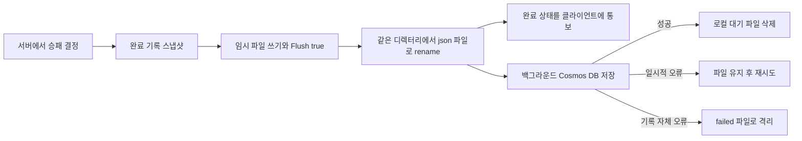

# 서버 운영 안정성 개선 및 운영 방법

작성일: 2026-10-01. 적용 범위는 단일 게임 서버의 기록 보존, 과부하 제한, CI·관측성, 재시작 정책이다.

## 적용 결과와 경계

| 영역 | 구현한 동작 | 운영 환경에서 필요한 것 |
|---|---|---|
| 완료 기록 | 디스크 outbox에 확정한 뒤 Cosmos DB로 전송; 재시작 시 재처리 | 재배포 후에도 유지되는 디스크/볼륨 |
| 과부하 | 방·연결·송신 큐·요청 빈도·수신 시간의 상한 | 실제 트래픽에 맞는 제한값 조정 |
| 관측성 | health, readiness, 보호된 Prometheus 지표와 상태 API, 알림 규칙 예시 | 수집기·알림 수신처 연결 |
| CI | Release 빌드, 서버 테스트, 선택적 soak, TRX·배포 파일 보관 | 변경을 원격 저장소에 반영한 뒤 Actions 실행 |
| 재시작 | 새 경기 차단, 종료 유예, 미완료 경기 중단, 완료 기록 재처리, 재로그인 안내 | 종료 유예보다 긴 프로세스 종료 제한 |

진행 중 경기의 위치·체포·타이머를 복원하는 기능이나 다중 서버 방 분산은 이번 범위에 포함하지 않았다. 기존 로그인 세션도 프로세스 메모리에 남는다. 재시작 후에는 다시 로그인해 새 방에 참가한다.

## 1. 완료 기록을 잃지 않도록 저장 순서 변경

기존 `GameRecordWriter`는 unbounded 메모리 채널에 기록을 넣었다. DB 응답이 늦으면 RAM 대기열이 늘고, 프로세스가 종료되면 아직 DB에 도착하지 않은 기록이 사라질 수 있었다.

현재는 `GameRecordOutbox`가 디스크 대기열을 담당하고 `GameRecordWriter`가 전송을 담당한다. `IGameRecordStore`로 DB 전송 경계를 분리했다.



- 기록 ID를 SHA-256 파일명으로 변환하므로 ID가 파일 경로로 해석되지 않는다.
- `.tmp` 파일을 쓰고 `Flush(true)`를 수행한 뒤 `.json`으로 이름을 바꾼다. `TryEnqueue`의 `true`는 이 과정이 성공했다는 뜻이다.
- 같은 ID의 동일 스냅샷을 다시 넣으면 성공으로 취급하고, 내용이 다른 스냅샷은 거부한다.
- 게임 종료 시각과 참가자 목록을 한 번 만든 스냅샷에 고정한다. 재시도마다 종료 시각을 바꾸지 않는다.
- 디스크 수락 실패 때 `GameRecordEnqueueAttempted`를 성공으로 표시하지 않는다. 방 안의 `PendingGameRecord`를 유지하고 다음 상태 tick에서 다시 시도한다. 이 상태에서는 완료 통보를 보내지 않고 새 경기 유입도 막는다.
- 모든 참가자가 연결을 끊어도 미확정 결과가 있는 방은 바로 지우지 않는다.
- 소비자는 한 번에 최대 64개 파일을 순차 처리한다. 기존처럼 완료 기록 객체를 제한 없이 RAM에 쌓는 채널이 없다.
- DB 저장이 확인된 파일만 삭제한다. 저장 후 응답만 유실되면 같은 ID로 다시 보낼 수 있다. 기존 `GameRecordDbService`의 중복 ID 처리와 플레이어 기록 인덱스 보정이 중복 저장을 방지한다. 전송 자체는 **at-least-once**이며, 네트워크 전송의 exactly-once를 주장하지 않는다.
- DB 접속·인증·타임아웃 등은 파일을 남긴다. 실패 후 기본 5초 기다리고 다시 시도하며 한 번의 DB 호출에는 15초 취소 제한을 적용한다. 실패한 의존성을 향해 모든 파일을 연속 재시도하지 않는다.
- JSON 손상, 필수 필드 누락, 잘못된 기록 인자, DB의 잘못된 요청/크기 오류는 `.failed`로 격리한다. 로그와 지표를 남기며 파일을 자동 삭제하지 않는다.
- 프로세스가 `.tmp`를 남긴 채 끝났다면 다음 시작에서 복구 대상으로 옮긴다. 완전한 JSON은 재처리하고, 불완전한 JSON은 격리한다.
- 같은 디렉터리를 둘 이상의 서버가 동시에 소비하지 못하도록 `.owner.lock`을 독점으로 연다.

### 저장량 제한

| 설정 (`GameRecords`) | 기본값 | 의미 |
|---|---:|---|
| `Directory` | `data/game-record-outbox` | 서버 content root 기준 경로 |
| `MaxRecords` | 10,000 | pending과 격리 파일을 합한 상한 |
| `MaxBytes` | 268,435,456 | pending과 격리 파일의 합계 256 MiB |
| `MaxRecordBytes` | 65,536 | 한 기록의 최대 JSON 크기 |
| `AdmissionThreshold` | 0.8 | 건수 또는 바이트 사용량이 80%에 도달하면 새 경기 차단 |
| `RetrySeconds` | 5 | 한 처리 주기가 끝나거나 실패한 후 대기 시간 |
| `WriteTimeoutSeconds` | 15 | DB 호출 취소 제한 |

80%에서 신규 유입을 차단하고 나머지 공간은 이미 진행 중인 경기 결과가 사용할 수 있게 한다. 이는 경기별 공간 예약은 아니다. 제한값을 작게 설정하거나 디스크에 다른 프로그램이 쓰는 경우 기존 경기의 결과도 일시적으로 거부될 수 있다. 그때는 RAM의 고정된 방 집합에 결과를 유지하고 재시도한다.

저장 디렉터리 쓰기에 실패하면 readiness가 내려간다. 소비자가 주기적으로 작은 파일을 쓰고 flush하는 검사로 쓰기 가능 여부를 확인하므로, 디스크 문제가 해결되면 복구를 감지한다. 디렉터리 용량 제한은 애플리케이션이 관리하는 기록 파일 기준이며 파일시스템 전체의 빈 공간 예약은 아니다.

### 보장하지 않는 경우

이 설계는 **디스크에 수락된 기록을 동일한 디스크를 사용하는 프로세스 재시작 후 재처리**한다. 물리 디스크 파손, 볼륨 삭제, 임시 컨테이너 파일시스템 폐기, OS·전원 장애에서 파일시스템 메타데이터까지 무조건 보존하는 보장은 아니다. 특히 디스크에 쓰기조차 실패한 결과가 RAM에만 남아 있을 때 강제 종료하면 그 결과를 복구할 수 없다. 그때는 완료 통보를 보류하고 신규 유입을 차단하며 critical 로그를 남긴다.

호스트 전체 장애까지 보존해야 한다면 복제된 영구 볼륨 또는 외부의 내구성 있는 메시지 저장소가 다음 단계다. 매 경기 종료에서 로컬 디스크 flush를 한 번 기다리므로 디스크 지연이 종료 처리에 반영된다.

## 2. 과부하가 무한한 작업·대기열로 번지지 않게 제한

### TCP

기존 동기 `BinaryReader` 수신을 비동기 읽기로 바꾸고, 프레임 전체가 도착할 때까지의 시간에 제한을 뒀다. 바이트를 조금씩 보내며 연결을 계속 붙잡는 경우도 동일한 프레임 제한을 적용한다. 기존 프레임 형식과 legacy 길이 호환은 유지한다.

`TcpPeer`는 연결별 bounded 송신 큐를 갖는다. 방 tick은 이 큐에 넣고 바로 돌아간다. 느린 사용자의 네트워크 쓰기가 방 전체의 시뮬레이션을 멈추지 않는다. 큐 건수나 바이트 상한을 넘기거나 송신이 제한 시간 안에 끝나지 않으면 해당 연결을 닫는다.

| 설정 (`GameNetwork`) | 기본값 |
|---|---:|
| `MaxTcpConnections` | 2,048 |
| `TcpJoinTimeoutSeconds` | 프레임당 10초, 입장 전 |
| `TcpIdleTimeoutSeconds` | 프레임당 45초, 입장 후 |
| `TcpSendTimeoutSeconds` | 송신 프레임당 5초 |
| `TcpSendQueueCapacity` | 연결당 64개 |
| `TcpSendQueueBytes` | 연결당 262,144바이트 |
| TCP 프레임 빈도 | 연결당 초당 5개, burst 10개 |
| 수신 TCP payload | 최대 4,096바이트 |

연결 상한에는 인증 전 연결도 포함한다. 첫 프레임은 인증된 Join이어야 하며, 입장 전 heartbeat로 시간 제한을 계속 갱신하는 연결은 거부한다. 종료 시 토큰 취소로 읽기를 중단하고 소켓을 닫으며, 수신·송신 작업의 종료를 기다린다. 프레임 크기 제한은 종전 구현을 유지한다.

### 방 명령과 UDP

- 로비 방은 기본 최대 500개다. 할당 경로인 커스텀 생성과 랜덤 방 생성 모두 같은 방 lock 안에서 검사한다.
- 방 명령 큐는 종전의 4,096개 상한을 유지한다.
- 한 tick에서 최대 512개 명령만 처리한다. 명령이 계속 들어와도 시뮬레이션과 종료 처리가 기아 상태가 되지 않게 한다.
- 포화 때문에 `Leave`를 큐에 넣지 못하면 별도의 연결 세대별 정리 항목을 남긴다. 방 루프가 이를 처리하며, 오래된 연결의 정리가 새 연결을 지우지 않도록 기존 connection ID 검사를 유지한다.
- 큐에 대기 중이던 Join의 TCP 연결이 이미 닫혔다면 유령 참가자를 만들지 않는다. 한 명도 성공적으로 입장하지 못한 빈 게임 루프도 정리한다.
- 이동 입력 병합은 마지막 도착 패킷이 아니라 가장 큰 sequence를 고른다. 순서가 뒤집혀 도착한 UDP 입력이 최신 입력을 덮어쓰는 경우를 막는다.
- 기존 인증된 사용자별 UDP 제한인 초당 30개·burst 20개에 더해, JSON 해석 전 프로세스 전체 UDP 제한을 기본 초당 20,000개로 적용한다.
- 동시에 완료를 기다리는 UDP 송신 작업은 기본 1,024개까지다. 초과 이동 상태는 버리고 다음 갱신을 기다린다. 비동기 송신 실패도 관찰해 지표로 남긴다.

전체 UDP 제한과 HTTP의 IP별 제한은 애플리케이션 내부 보호다. 대규모 DDoS와 회선 포화는 네트워크 앞단에서 다뤄야 한다. 기본 제한값은 현재 코드를 보호하기 위한 출발점이며 실측 최대 처리량을 의미하지 않는다.

### HTTP·SignalR

| 설정 | 기본값 | 초과 동작 |
|---|---:|---|
| `Limits:HttpConcurrentRequests` | 128 | 대기열 없이 HTTP 429 |
| `Limits:HttpRequestsPerMinute` | IP당 600/분 | HTTP 429 + Retry-After |
| `Limits:AuthRequestsPerMinute` | IP당 30/분 | `/auth` 요청에 별도 적용 |
| HTTP 요청 본문 | 64 KiB | Kestrel에서 거부 |
| `Limits:MaxHubConnections` | 2,048 | 새 SignalR 연결 거부 |
| Hub 호출 | 연결당 10/초, burst 20 | HubException |
| Hub 수신 메시지 | 16 KiB | SignalR 제한 |

WebSocket 연결은 수명이 길기 때문에 일반 HTTP 동시 처리 슬롯에서 제외하고 별도의 Hub 연결 수 상한을 적용한다. 이미 열린 WebSocket 위의 메서드 호출은 HTTP 미들웨어를 통과하지 않으므로 `IHubFilter`에서 빈도를 제한한다.

IP는 실제 TCP 연결의 `RemoteIpAddress`를 사용한다. 임의의 전달 헤더를 신뢰하지 않는다. 역방향 프록시를 쓴다면 신뢰할 프록시를 지정한 forwarded headers 설정 또는 프록시 자체의 제한이 추가로 필요하다. 그렇지 않으면 여러 사용자가 프록시 한 IP의 제한을 공유한다.

기존 `run_load_metrics.sh`는 한 IP에서 수백 개 봇이 동시에 접속한다. 이 개발용 스크립트의 서버 프로세스에만 HTTP·인증 제한을 기본 100,000/분, 전체 UDP 제한을 60,000/초로 높이는 설정을 넣었다. 운영 기본값은 바뀌지 않는다. `POLROB_LOAD_AUTH_REQUESTS_PER_MINUTE`, `POLROB_LOAD_HTTP_REQUESTS_PER_MINUTE`, `POLROB_LOAD_GLOBAL_UDP_PPS`로 이 테스트값도 바꿀 수 있다. 기록 경로는 해당 부하 테스트의 로그 디렉터리 아래로 분리한다.

## 3. 재시작·종료 정책

### 정상 종료

1. `ApplicationStopping` 또는 보호된 `POST /ops/drain`이 새 경기 유입을 막고 readiness를 false로 만든다.
2. 기존 경기의 이동·규칙 처리는 계속된다. 대기·카운트다운 방이 새 경기로 시작하는 것은 막는다.
3. 프로세스 종료 시 `GameNetworkServer.StopAsync`는 Playing 경기와 미확정 결과를 기본 최대 20초 기다린다. `Operations:DrainSeconds`로 0~300초를 설정할 수 있다.
4. 유예 시간 이후 남은 진행 중 경기는 중단한다. 승자나 패자를 임의로 만들지 않는다.
5. TCP 읽기·쓰기와 방 루프를 종료한다. 완료 기록은 디스크에 있으므로 DB 장애가 끝날 때까지 종료를 무한정 미루지 않는다.
6. 기록 작업 이후 종료 마커를 기록한다. 미확정 기록이 남거나 네트워크 작업 종료가 확인되지 않았다면 정상 종료로 표시하지 않는다.

`.NET Host`의 전체 종료 제한은 `DrainSeconds + 15초`다. 서비스 관리자·컨테이너의 강제 종료 제한은 이보다 길게 잡아야 한다. `/ops/drain` 자체는 프로세스를 끄지 않고 일방향으로 신규 유입을 막는다. 준비가 끝나면 서비스 관리자를 통해 정상 종료한다. 재시작 전까지 drain을 해제하는 API는 제공하지 않는다.

### 재시작과 강제 종료

시작마다 새로운 `BootId`를 만든다. 디스크의 `.runtime-state`로 이전 종료가 정상인지 확인하고, 비정상 종료였으면 로그·지표를 남긴다. 파일 소유권 lock이 해제된 뒤 같은 outbox 경로를 열어 남은 완료 기록을 전송한다.

진행 중 경기 스냅샷과 로그인 토큰은 복원하지 않는다. 기존 계정과 이미 Cosmos DB에 저장된 전적은 유지된다. DB 연결과 저장소 초기화가 성공해야 애플리케이션이 정상 기동한다. DB가 내려가 있는 동안 재시작해도 로컬 대기 파일을 버리지는 않는다.

게임 클라이언트는 TCP 종료와 heartbeat 응답 실패를 감지한다. heartbeat는 기존의 일방향 송신에서 응답 확인으로 바꿨다. 일반 플레이 중 연결이 사라지면 이동·보이스를 정리하고 재로그인·재참가 안내를 표시한다. 정상적으로 이미 종료된 경기 화면 전환은 이 안내로 덮어쓰지 않는다. 모든 연결 장애가 재시작 때문인 것은 아니므로 안내도 그 점을 구분한다.

## 4. 관측성 및 운영 API

| 경로 | 접근 | 의미 |
|---|---|---|
| `GET /health/live` | 공개 | HTTP 서버가 응답하는지 확인 |
| `GET /health/ready` | 공개 | 새 경기 수락 가능: 200, 준비 안 됨: 503 |
| `GET /ops/status` | 운영 키 필요 | BootId, 이전 종료 상태, drain, outbox 요약 |
| `GET /ops/metrics` | 운영 키 필요 | Prometheus text exposition 형식 |
| `POST /ops/drain` | 운영 키 필요 | 신규 유입 차단, 기존 경기 진행 유지 |

운영 키는 `Operations:ApiKey` 또는 환경 변수 `Operations__ApiKey`다. `X-Operations-Key` 헤더로 보낸다. 기본값은 비어 있으므로 설정 전에는 `/ops/*`가 403을 반환한다. 키는 코드·로그·Git에 넣지 않는다. 원격 호출은 HTTPS 또는 신뢰할 수 있는 사설망에서 한다.

readiness는 시작 완료, drain 여부, 미확정 경기 결과, outbox 쓰기 실패·사용량을 반영한다. 매 요청마다 Cosmos DB에 질의하지 않는다. DB 단기 장애 중에는 로컬 저장 공간이 남아 있으면 경기를 계속 받고, backlog/지연 지표로 상태를 확인한다. 방 개수나 TCP 상한은 각 입장 지점에서 별도로 거부한다.

주요 지표는 다음과 같다.

- 기록: `polrob_outbox_pending`, `polrob_outbox_bytes`, `polrob_outbox_oldest_age_seconds`, `polrob_outbox_quarantined`, `polrob_record_retry_total`, `polrob_game_result_acceptance_failures_total`
- 방: `polrob_rooms`, `polrob_playing_rooms`, `polrob_players`, `polrob_room_command_queue`, `polrob_room_commands_dropped_total`, `polrob_room_loop_failures_total`
- tick: `polrob_room_ticks_total`, `polrob_room_tick_duration_seconds_total`, `polrob_room_tick_overruns_total`
- 연결: `polrob_tcp_connections`, `polrob_tcp_connections_rejected_total`, `polrob_tcp_read_timeouts_total`, `polrob_tcp_slow_or_failed_total`
- 제한: `polrob_http_rate_limited_total`, `polrob_hub_rate_limited_total`, `polrob_udp_global_rate_limited_total`, `polrob_udp_send_dropped_total`
- 프로세스: `polrob_uptime_seconds`, `polrob_process_working_set_bytes`, `polrob_managed_heap_bytes`, `polrob_process_cpu_seconds_total`, `polrob_threadpool_pending`

ID·IP·토큰을 메트릭 label로 만들지 않는다. 방 ID는 장애 로그에서 추적한다. 메트릭 샘플러의 중복 실행을 막고, 샘플링 예외가 타이머 밖으로 전파되지 않도록 처리했다. 종전 `[LoadMetrics]` 출력은 부하 테스트 스크립트와 함께 사용할 수 있다.

`ops/prometheus.example.yml`에 수집 설정 예시, `ops/alerts.yml`에 접속 불가·readiness·5분 이상 backlog·격리 파일·방 루프 오류·과부하 알림 규칙을 넣었다. Prometheus 서버나 실제 알림 수신처가 자동 배포된 것은 아니다. 규칙을 기존 수집기에 연결하고 알림 수신처를 지정해야 외부 알림이 작동한다.

## 5. CI 변경

`.github/workflows/server-tests.yml`은 기존 push/PR 테스트를 확장한다.

1. .NET 10 복원.
2. Release 빌드. 경고도 실패로 처리한다.
3. soak를 제외한 모든 서버 테스트 실행. 실제 localhost 소켓, HTTP, 임시 디스크 테스트도 포함한다.
4. 수동 실행에서 `run_soak=true`를 고르면 60초 방 수명 주기 반복 검증.
5. 서버 publish 산출물을 생성.
6. 성공·실패의 TRX 결과를 14일 보관하고, 성공한 서버 산출물을 7일 보관.

전체 작업은 15분으로 제한하고 같은 ref의 이전 실행은 취소한다. 런타임 기록 경로는 `.gitignore`와 서버 publish 대상에서 제외했다. CI가 운영 DB나 LiveKit에 실제 데이터를 만들지 않도록 이 테스트들은 대체 저장소와 독립된 로컬 소켓을 사용한다.

여기서 구현한 것은 CI와 배포 가능한 산출물 생성이다. 클라우드 자동 배포, 원격 GitHub Actions 실행, 외부 모니터링 가동은 로컬 코드 변경만으로 완료되었다고 볼 수 없다.

## 6. 운영 환경 적용

기존 Cosmos DB와 LiveKit 설정에 더해 다음 값을 배포 환경에서 설정한다.

```text
GameRecords__Directory=/var/lib/polrob/game-record-outbox
Operations__ApiKey=<비밀 저장소에서 주입할 운영 키>
Operations__DrainSeconds=20
```

- `GameRecords__Directory`는 프로세스 교체 후에도 남는 경로여야 한다. 컨테이너라면 영구 볼륨을 마운트한다. 각 서버 인스턴스에는 서로 다른 디렉터리를 준다.
- 해당 경로는 서비스 계정만 읽고 쓸 수 있게 파일시스템 권한을 설정한다. 완료 기록에는 사용자 ID가 들어 있다.
- HTTP 포트는 배포 환경의 `ASPNETCORE_URLS`를 사용한다. raw TCP 7777과 UDP 7778은 별도로 전달되어야 한다.
- `/health/ready`를 readiness 검사에 연결한다. 정상 drain 중의 503을 이유로 기존 TCP 연결을 즉시 끊는 로드밸런서 설정은 피한다.
- 수집기에 운영 키 파일을 제공하고 `ops/prometheus.example.yml`의 대상 주소와 키 파일 경로를 맞춘다.
- 배포 전에 drain → 진행 경기/대기 기록 관찰 → 정상 종료 → 같은 볼륨으로 기동 → readiness 및 backlog 감소 확인 순서로 진행한다.

운영 조회 예시(현재 셸에 `POLROB_OPS_KEY`를 비밀 방식으로 제공한 경우):

```bash
curl http://127.0.0.1:5174/health/ready
curl -H "X-Operations-Key: $POLROB_OPS_KEY" http://127.0.0.1:5174/ops/status
curl -H "X-Operations-Key: $POLROB_OPS_KEY" http://127.0.0.1:5174/ops/metrics
curl -X POST -H "X-Operations-Key: $POLROB_OPS_KEY" http://127.0.0.1:5174/ops/drain
```

### 격리 기록 복구

1. 로그에서 기록 ID와 원인을 확인한다. `.failed` 파일을 바로 삭제하지 않는다.
2. 해당 서버를 drain 후 정상 종료하고 outbox 디렉터리를 백업한다. 실행 중 수동 파일 조작은 카운터와 소비자 상태를 어긋나게 할 수 있다.
3. 유효한 기록인지 검토하고 원인을 수정한다. 결과 내용을 임의로 다른 승패로 바꾸지 않는다. 손상으로 결과를 확인할 수 없으면 별도 사고 처리로 남긴다.
4. 재처리 가능한 파일의 확장자를 `.failed`에서 `.json`으로 바꾸고 시작한다. startup에서 건수·용량을 다시 계산한다.
5. DB 저장 로그와 backlog 감소, 플레이어 기록 인덱스 상태를 확인한다.

## 7. 검증

2026-10-01 로컬 환경에서 다음을 확인했다.

- Release 서버 테스트 170개 통과, 실패·건너뜀 0개. `-warnaserror` 빌드 포함.
- 별도로 60초 방 수명 주기 soak 테스트 1개 통과. 로컬 반복 검증이며 실제 클라우드 부하 시험은 아니다.
- 기록 재시작 재처리, 저장 후 응답 유실 시 동일 ID 재전송, JSON 손상 격리, 건수/바이트 상한, 디스크 쓰기 실패와 복구, 독점 lock, 취소 시 기록 보존.
- HTTP 429 및 Retry-After, 운영 키 없는 요청 거부, 시작/drain/outbox 임계치에 따른 readiness 전환.
- TCP 연결 상한과 슬롯 회수, 불완전 프레임의 시간 초과, idle read 취소, 미완료 경기 종료 시 결과 미생성, 연결 교체와 재접속.
- 완료 기록의 수락 실패 후 동일 스냅샷 재시도, 모든 플레이어 이탈 뒤에도 완료 처리 순서 보장, UDP sequence 역전 시 최신 입력 선택.
- iOS 시뮬레이터용 클라이언트 빌드 성공. RuntimeIdentifier 덮어쓰기와 기존 GameCreate XAML의 Frame/nullable 경고 9개가 남아 있다.
- 서버 Release publish 성공. Git diff 공백 검사, workflow/Prometheus YAML 파싱 및 부하 테스트 스크립트 shell 문법 검사 통과.

실제 Cosmos 장애·클라우드 VM 강제 종료·전원 장애·실기기 재로그인 UI 시나리오를 이 검증으로 대체하지 않는다. 기록 재처리 테스트는 임시 디스크를 다시 열고 대체 DB 저장소에 전송하는 방식이다. 현재 변경으로 클라우드 처리량이나 무중단 경기 복구를 검증했다고 주장하지 않는다.

## 참고한 공식 문서

- [ASP.NET Core rate limiting](https://learn.microsoft.com/en-us/dotnet/api/microsoft.aspnetcore.ratelimiting.ratelimiteroptions.globallimiter?view=aspnetcore-10.0)
- [SignalR hub filters](https://learn.microsoft.com/en-us/aspnet/core/signalr/hub-filters?view=aspnetcore-10.0)
- [GitHub upload-artifact](https://github.com/actions/upload-artifact)
- [Prometheus HTTP headers 설정](https://prometheus.io/docs/prometheus/latest/configuration/configuration/#http_config)
